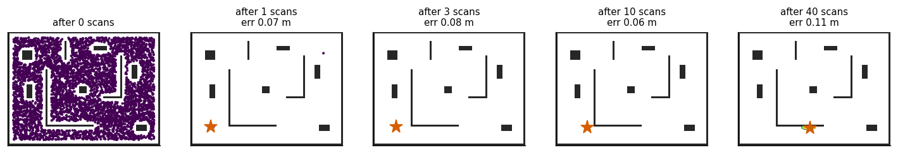
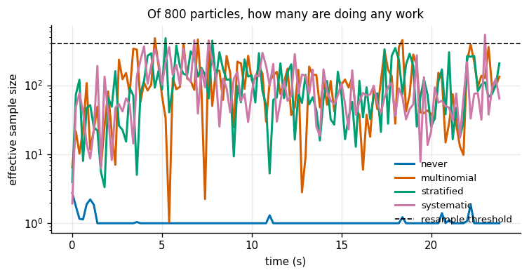
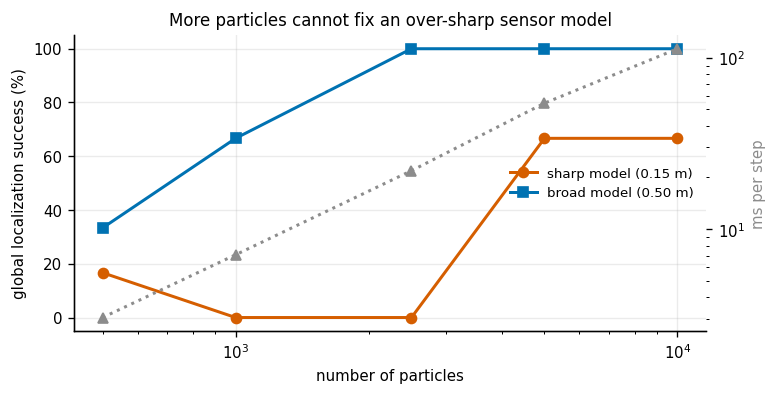
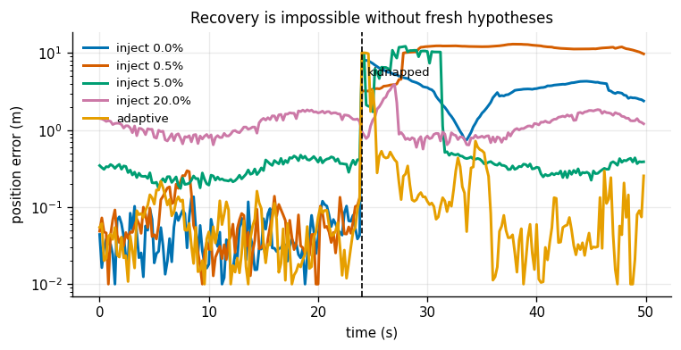
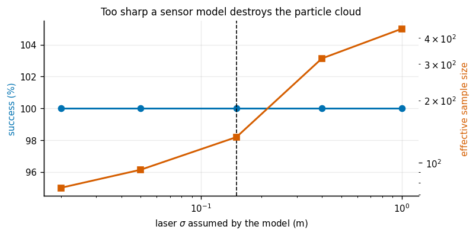
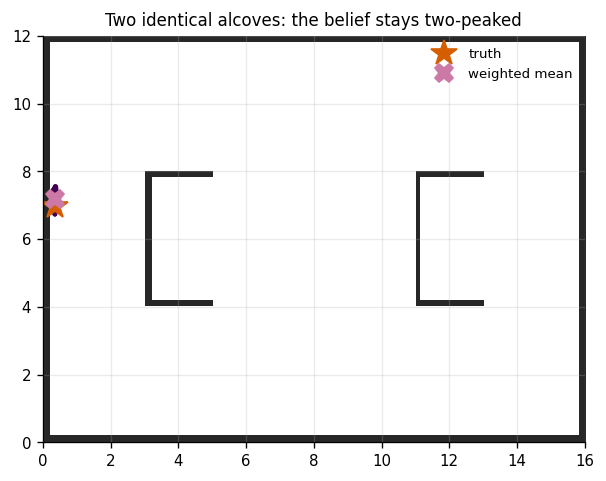

# Particle Filter

## Key Insight

When a robot is completely lost or faces ambiguous sensor readings, it cannot rely on single-hypothesis estimators like the [Kalman Filter](/shared/glossary/#kf). A [particle filter](/shared/glossary/#particle-filter) represents the robot's belief using a swarm of weighted samples, allowing it to track multiple candidate locations simultaneously across a known map. As the robot moves and senses the environment, the resampling step continuously duplicates particles in high-probability areas and discards those in impossible locations, eventually collapsing the multi-modal distribution down to the correct unique position.

**This is project 27.** It writes `gridmap.py` (an [occupancy grid](/shared/glossary/#occupancy-grid), a vectorized ray caster and a distance field) and `pf.py` (the filter, three resamplers, two sensor models). [Project 29](../29-2d-lidar-slam/README.md) reuses the map and the ray caster.

The single most useful thing measured here is not in the Key Insight, and contradicts the intuition it builds. **A sensor model that is sharper than the sensor makes global localization fail, and no amount of extra particles rescues it.** Experiment 3 measures that; experiment 5 measures the price of the fix.

---

## Files

| file | what it is |
|---|---|
| `gridmap.py` | occupancy grid, blocked-march ray caster, chamfer distance field. **Shared with project 29.** |
| `pf.py` | the particle filter, the two sensor models, three resamplers, augmented MCL |
| `run.py` | the seven experiments |
| `outputs/` | figures and `results.csv` |

```bash
python3 run.py       # about 7 minutes; NumPy and Matplotlib only
```

Imports the motion model from [project 26](../26-ekf-localization/README.md)'s `world.py` and `plot_style.py` from project 01.

---

## Why particles at all

An [EKF](/shared/glossary/#ekf) carries a mean and a [covariance](/shared/glossary/#covariance) — a [Gaussian](/shared/glossary/#gaussian-distribution), which has exactly one peak. A robot that does not know which of two identical corridors it is in has a belief with two peaks, and a Gaussian cannot represent that. Not approximately, not badly: it has no way to express it at all, and will report the point exactly between the two hypotheses, which is a place the robot definitely is not.

A [particle filter](/shared/glossary/#particle-filter) drops the assumption. The belief is a crowd of individual guesses, each one a complete concrete hypothesis — "the robot is *here*, facing *this* way" — with a weight saying how well that hypothesis explains the current scan. Nothing anywhere assumes a bell curve.

The name **[Monte Carlo Localization](/shared/glossary/#monte-carlo-localization-mcl)** comes from the casino: the method works by drawing random samples, the way you would work out the odds of a card game by playing it a thousand times rather than solving it.

The three steps per scan:

```
1. PREDICT   push every particle through the real motion model, each with its own noise
2. UPDATE    weight each particle by how well it explains the laser scan
3. RESAMPLE  draw a new set, favouring the heavy particles
```

Notice what is missing from step 1: no [Jacobian](/shared/glossary/#jacobian), no covariance, no linearization. That is the whole difference from the EKF of [project 26](../26-ekf-localization/README.md). A particle filter never needs a derivative, because it never has to push a *cloud* through a curved function — it pushes points, and points go anywhere.

### One implementation detail that decides whether it works at all

```python
logw = np.log(self.w + 1e-300) + ll
logw -= logw.max()          # <- this
w = np.exp(logw)
```

With 12 beams, the raw likelihood of even a perfect particle is around `1e-12`. With 30 beams it underflows to exactly zero, every weight becomes zero, and the normalization produces `NaN` — silently, on the first scan. Working in logs and subtracting the maximum before exponentiating is not an optimization; it is the difference between a filter and a crash.

---

## 1. Five thousand guesses, one answer



The robot starts with no idea where it is: 5 000 particles scattered uniformly over every free pose in a 16 × 12 m office.

| | |
|---|---|
| particles / beams / steps | 5 000 / 12 / 160 |
| cost | 57 ms per step |
| error after 1 scan | 0.067 m |
| error after 3 scans | 0.077 m |
| settled error (last 100 steps) | **0.051 m** |
| effective sample size | 1 → 1877 of 5000 |

**One scan.** From complete ignorance to 7 cm, from a single 12-beam laser reading. The five panels in the figure show why: a 12-beam scan of an irregular room is an extremely specific fingerprint, and out of 5 000 randomly scattered guesses only a handful can produce it.

Watch the [effective sample size](/shared/glossary/#effective-sample-size) column though. After that first scan it is **1** — one particle holds essentially all the weight, and the other 4 999 contribute nothing. That is the filter working exactly as designed and simultaneously being one bad step away from [particle depletion](/shared/glossary/#particle-depletion). It recovers to 1877 as the motion model spreads the survivors back out, and experiments 2 and 5 are about keeping it there.

---

## 2. Resampling: never, and three ways



Tracking a known start with 800 particles, 10 repeats:

| resampling | position error | final ESS | distinct particles |
|---|---|---|---|
| **never** | **0.4866 m** | **1.0** | 800 |
| multinomial | 0.0352 m | 216.1 | 562.9 |
| stratified | 0.0384 m | 133.2 | 298.3 |
| systematic | 0.0374 m | 140.0 | 286.1 |

**Not resampling is 14× worse**, and the ESS column says why: all the weight ends up on a single particle, and the other 99.9% are carried along contributing nothing at all. You are paying for 800 hypotheses and holding one. That is the *degeneracy* problem, and resampling exists solely to solve it.

But the three resamplers differ by only 9% in tracking error, which is an honest and slightly disappointing result. So here is the difference measured where it actually lives. Fix a weight vector, resample it 2 000 times, and look at how much the number of children per particle jumps around:

| scheme | variance of offspring count | particles left with no children |
|---|---|---|
| multinomial | **0.9857** | 55.2% |
| stratified | 0.2141 | 47.6% |
| **[systematic](/shared/glossary/#systematic-resampling)** | **0.1294** | 45.7% |

**Systematic resampling adds 7.6× less variance for identical cost.** Every scheme gives each particle the same *expected* number of children; they differ in the spread around that expectation, and that spread is pure noise injected into your belief in exchange for no information whatsoever.

The mechanism is easy to state. Systematic resampling draws **one** random number and steps through the cumulative weights in equal strides, so a particle holding exactly `1/N` of the weight is *guaranteed* one child. Multinomial rolls the dice `N` separate times, so that same particle survives only about 63% of the time (`1 - (1-1/N)^N → 1 - 1/e`). Same three lines of code, same cost, less damage. It is what every real implementation ships.

---

## 3. How many particles — and the counter-intuitive answer



Global localization from a uniform prior, 80 scans to converge. Two sensor models compared: one matching the laser's true 0.15 m noise, one deliberately three times broader.

| particles | sharp model (0.15 m) | | broad model (0.50 m) | | ms/step |
|---|---|---|---|---|---|
| | success | median err | success | median err | |
| 500 | 17% | 9.3328 m | 33% | 8.9960 m | 3.11 |
| 1 000 | 0% | 14.4087 m | 67% | 3.1934 m | 7.84 |
| 2 500 | 0% | 12.6926 m | **100%** | **0.0438 m** | 25.58 |
| 5 000 | 67% | 5.5137 m | **100%** | 0.0437 m | 54.11 |
| 10 000 | 67% | 4.8452 m | **100%** | 0.0416 m | 111.51 |

**This is the single most counter-intuitive thing in the project.** A sensor model *tighter* than the sensor makes localization fail, and twenty times the compute does not rescue it.

The reason is that the failure is not a sampling problem, so more samples do not address it. With 12 beams and an assumed noise of 0.15 m, a particle 40 cm from the truth is assigned a likelihood around `e^-50` relative to the best one. It vanishes on the very first scan. And **resampling can only copy what survived** — if nothing near the truth survived the first update, no amount of subsequent copying will invent it. Widening the model to 0.5 m is saying "a particle 30 cm out is still worth keeping for now", which is the only way to keep enough of the cloud alive long enough for the evidence to accumulate.

Note also the gap between the two problems hiding under one name. Experiment 2 held a *track* to 0.037 m with 800 particles. Global localization needs 2 500 to work at all — because it must fill a three-dimensional space `(x, y, heading)` densely enough that at least one particle survives the first scan, and **filling a space to a fixed resolution costs particles as the cube of that resolution.**

---

## 4. The kidnapped robot



At step 120 the robot is picked up and put down somewhere else, and nothing tells the filter. (Implementation note that mattered: the robot is spliced onto a *second real drive*, not teleported while continuing to execute route A's controls. Controls planned for one part of a building drive straight into a wall somewhere else, and scans taken from inside a wall are garbage that no particle can match — which would have made every method here fail for a reason that has nothing to do with kidnapping.)

| injection rate | recovered | error after the kidnap | error *before* the kidnap |
|---|---|---|---|
| 0.0% | 33% | 6.215 m | **0.0472 m** |
| 0.5% | 67% | 3.967 m | 0.0610 m |
| **5.0%** | **83%** | **0.390 m** | 0.3326 m |
| 20.0% | **0%** | 1.259 m | 1.2834 m |
| **adaptive** | **83%** | 3.080 m | **0.0910 m** |

Four results.

**With no injection, recovery happens only by luck** — 33%, and only because some straggler particle happened to be near the new location when the robot arrived. Resampling copies; it does not invent.

**A fixed injection rate works, at a price paid every single step.** 5% injection recovers 83% of the time and makes the filter **7× less accurate** the rest of the time — 0.047 m becomes 0.333 m, permanently, whether or not anything ever goes wrong.

**More is not better.** At 20% injection, recovery drops to 0%, because at that rate the cloud never converges in the first place (1.28 m before the kidnap). You cannot recover a track you never had.

**[Adaptive injection](/shared/glossary/#monte-carlo-localization-mcl) gets the same 83% recovery for 3.7× less cost** — 0.091 m instead of 0.333 m before the kidnap. This is augmented MCL, the algorithm ROS's `amcl` node ships. It keeps two running averages of the average measurement likelihood, one fast and one slow. While the filter is right they agree and nothing is injected; when the robot is moved the fast average collapses in a few steps while the slow one lags, and the gap between them *is* the injection rate. A self-tuning panic button: no premium when nothing is wrong, a big burst exactly when something is.

And one detail without which none of it works: the quantity being monitored is the **average, unnormalized** likelihood. Once weights are normalized they always sum to one no matter how badly every particle is doing, so the one number that says "I am lost" has to be read off *before* normalization. That is easy to miss, and a filter that misses it has an adaptive scheme that never fires.

---

## 5. An over-confident sensor model, from the other side



Now the same knob, but *tracking* rather than global localization. 1 000 particles starting near the truth. The laser's real noise is 0.15 m.

| model `σ` | success | error | ESS (of 1000) | distinct particles |
|---|---|---|---|---|
| 0.02 | 100% | 0.110 m | **75.7** | 170.4 |
| 0.05 | 100% | 0.053 m | 92.5 | 256.5 |
| **0.15** (the truth) | 100% | **0.033 m** | 133.0 | 282.4 |
| 0.40 | 100% | 0.040 m | 318.6 | 530.0 |
| 1.00 | 100% | 0.056 m | 442.9 | 605.8 |

**The best tracking accuracy is at the true noise level — the opposite of experiment 3's answer.** Both are right, and they are answering different questions. Once you already know roughly where you are, an honest sensor model extracts the most information; while you are still searching, an honest sensor model kills the search.

Too sharp (7× tighter than the sensor) costs 3.3× the tracking error, and the [effective sample size](/shared/glossary/#effective-sample-size) falls to 76 of 1 000 — the filter is carrying a thousand particles and holding about seventy-six distinct opinions. Push a little further and it holds one, at which point it has become a very expensive and considerably worse EKF. That is [particle depletion](/shared/glossary/#particle-depletion).

Too broad (7× wider) costs only 1.7× and leaves the cloud healthy at ESS 443. Same asymmetry as [projects 24](../24-1d-kf/README.md) and [25](../25-2d-constant-velocity-tracker/README.md): being too vague costs accuracy, being too confident costs the filter's ability to hold more than one idea — and only the first of those is recoverable by looking at more data.

The practical shape of this in deployed systems: run the broad model while localizing, tighten it once converged. `amcl` does exactly that.

---

## 6. The beam model against the likelihood field

Two ways to score a particle against a scan:

- **Beam model** — ray-cast the map from where the particle thinks it is, and compare the expected range with the measured one. Honest, and costs an 80-step ray march per beam per particle.
- **[Likelihood field](/shared/glossary/#occupancy-grid)** — project each measured range out from the particle and ask how far that endpoint lands from the nearest wall, using a precomputed distance field. One array lookup.

| model | success | error | ms/step |
|---|---|---|---|
| beam | 100% | **0.0316 m** | 7.79 |
| likelihood field | 100% | 0.0795 m | **1.14** |

**The field is 6.8× faster and 2.5× less accurate.** A clean, unglamorous engineering trade with no free lunch on either side.

Where the field's accuracy goes: it does not know about **occlusion**. It only knows "there is something near this endpoint", not "the beam would have been blocked long before reaching it". So a particle that places a wall *behind* another wall gets a good score it does not deserve. The beam model cannot make that mistake, because it walks the ray and stops at the first thing it hits.

The reason to know both is that the field's cost advantage grows with the number of beams — a modern lidar has 1 080 of them, and 1 080 ray marches per particle is not something you do at 20 Hz. Real systems subsample the beams *and* use the field.

---

## 7. A symmetric building, and an honest negative result



The set-up: a floor plan with two mirror-image alcoves, on the theory that a robot in one cannot tell which it is in — the multi-modal case the whole method exists for.

| | |
|---|---|
| surviving clusters | 1.2 |
| error of the weighted mean pose | 0.105 m |
| distance to the nearest particle | 0.002 m |
| weight within 0.5 m of the truth | **99.9%** |

**The filter resolved it.** The ambiguity I built was not an ambiguity, and understanding why is more useful than the result I was fishing for.

The two alcoves really are mirror images of one another. But a laser with 8 m of range **sees straight past them** to the outer walls, and the robot is not in the middle of the building — from the left alcove the far wall is 12 m away, from the right one it is 4 m. For two places to produce genuinely identical scans, *everything within sensor range* has to be symmetric, not just the furniture nearby.

Two consequences worth carrying:

- **Genuine scan ambiguity is rarer than it sounds.** The real cases are long identical corridors and repeated office bays — places where the symmetry extends past the sensor's horizon.
- **A shorter-range sensor makes ambiguity worse, not better**, because it sees less of whatever breaks the tie. That is a slightly startling inversion of the usual "better sensor, better estimate" instinct.

What the experiment *does* show cleanly is the cost of summarizing a particle cloud by its mean: **0.105 m for the weighted mean against 0.002 m for the nearest particle — a factor of 50**, even in a cloud this well converged. Whenever the cloud is not a single tight blob, the mean sits at a place no particle believes in. A Gaussian filter has no choice but to report that place. A particle filter does have a choice, and collapsing the distribution to one number at the last step throws away exactly the thing you paid for.

---

## What to take away

1. Work in log-weights and subtract the maximum. Without it the filter produces `NaN` on the first scan, silently.
2. Not resampling is 14× worse and leaves you with `N` particles and one opinion. **[Systematic resampling](/shared/glossary/#systematic-resampling) adds 7.6× less variance than multinomial for identical cost** — always use it.
3. **A sensor model sharper than the sensor makes global localization fail, and 20× the particles does not fix it.** Broaden the model while searching, tighten it once converged.
4. Tracking needs hundreds of particles; global localization needs thousands, because filling `(x, y, heading)` costs particles as the cube of the resolution.
5. **Adaptive injection recovers from a kidnap as well as a 5% fixed rate for 3.7× less cost** — and it works by watching the *unnormalized* average likelihood, the one number normalization destroys.
6. The likelihood field is 6.8× faster and 2.5× less accurate, and the accuracy it gives up is specifically occlusion reasoning.
7. **Apparent symmetry usually is not symmetry** — the sensor sees past it. But the mean-versus-cluster gap is real, and was 50× even here.

---

## Next

[Project 28](../28-vio-mvp/README.md) leaves the known map behind. A camera and an IMU, no landmarks, no floor plan — and the question of what a monocular camera fundamentally cannot measure.
