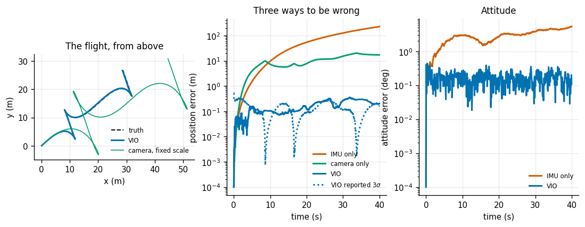
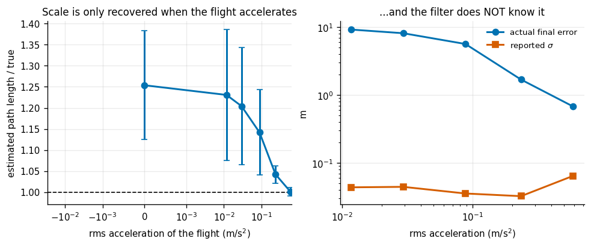
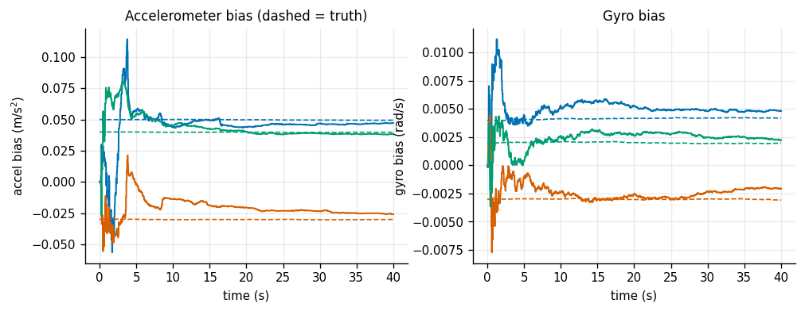
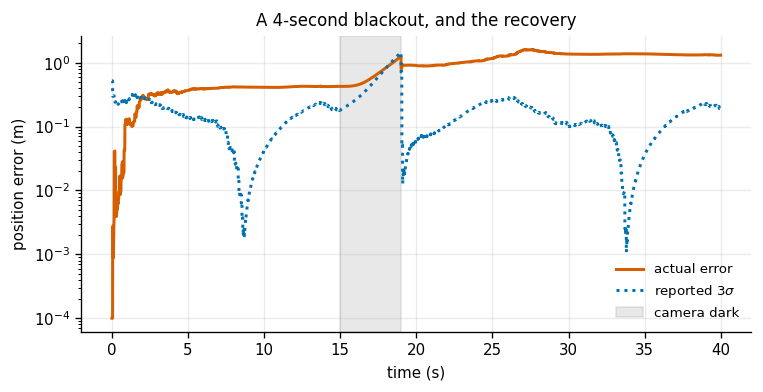
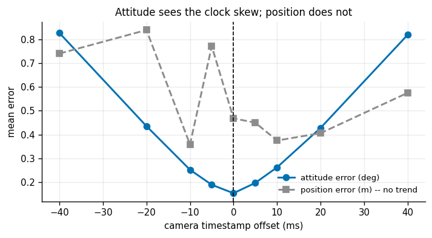
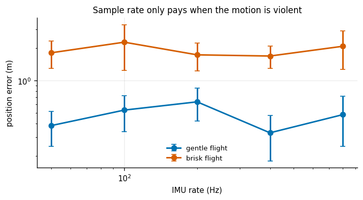

# VIO MVP

## Key Insight

Fusing high-rate inertial measurements with low-rate visual features produces a [state](/shared/glossary/#state) estimator that is both high-frequency and low-drift. This visual-inertial odometry ([VIO](/shared/glossary/#vio)) system uses an error-[state](/shared/glossary/#state) [Kalman Filter](/shared/glossary/#kf) to estimate the nominal motion using the [IMU](/shared/glossary/#imu) while using camera feature tracks to estimate and correct the IMU's sensor biases. Fusing these complementary modalities solves the scale ambiguity of monocular cameras and the rapid divergence of pure inertial navigation, providing the core navigation backbone for drones and AR/VR headsets.

**This is project 28.** It writes `vio.py` (a 15-state [error-state Kalman filter](/shared/glossary/#error-state-kalman-filter)) and `trajectory.py` (flights, a simulated MEMS IMU, and a simulated monocular front end), reusing the quaternion utilities from [project 21](../21-imu-integration/README.md).

The Key Insight says the fusion "solves the scale ambiguity". Experiment 2 measures exactly when it does — and finds that when it does not, **the filter has no idea**, reporting 4 cm of uncertainty while being 10 m wrong.

---

## Files

| file | what it is |
|---|---|
| `vio.py` | the error-state EKF, plus a deliberately naive additive variant for experiment 4 |
| `trajectory.py` | the flights, the IMU model, the camera front end |
| `run.py` | the seven experiments |
| `outputs/` | figures and `results.csv` |

```bash
python3 run.py       # about 6 minutes; NumPy and Matplotlib only
```

---

## Why simulate instead of downloading EuRoC

Same reason as [projects 16](../16-camera-calibration/README.md) and [24](../24-1d-kf/README.md), and it is sharper here than anywhere else in the phase.

Experiment 2 claims that the metric scale of a monocular system is unobservable under constant velocity and observable under acceleration. **On a public dataset that claim is untestable.** You can measure the final error, but you cannot hold everything else fixed while sweeping the acceleration, and you certainly cannot run the same flight with the wiggle removed. Here every trajectory is generated analytically, so acceleration, rotation rate and the exact IMU biases are all known and all adjustable, and the sweep is a sweep of one thing.

The camera front end is simulated at the level of its **output**, not its pixels. We assume a working feature tracker plus essential-matrix decomposition — of the kind [project 20](../20-visual-odometry/README.md) built and measured — and take from it the two things such a front end can actually produce: a relative **rotation** and a translation **direction**. The noise levels are set from project 20's measured performance.

That is a deliberate scope choice and it is worth defending. A monocular front end is a whole project on its own (project 20), and rebuilding it here would have made this project about feature matching rather than about fusion. What matters for the fusion is *what the front end can and cannot report*, and the answer — direction yes, distance no — is a fact about monocular geometry that no amount of front-end quality changes.

---

## The two ideas in `vio.py`

### Error state

**A rotation cannot be a state in a Kalman filter.** A Kalman filter's update rule is literally `x ← x + K y`, and adding a correction to a unit quaternion gives you something that is no longer a unit quaternion; adding one to [Euler angles](/shared/glossary/#euler-angles) walks you into gimbal lock. The [error-state](/shared/glossary/#error-state-kalman-filter) form splits the state in two:

```
true state  =  nominal state   (*)   error state
               ^^^^^^^^^^^^^         ^^^^^^^^^^^
               big, nonlinear,       small, always near zero,
               integrated from       genuinely Gaussian,
               the raw IMU           genuinely additive
```

The filter only ever estimates the **error** — 15 small numbers — then "injects" it into the nominal state and resets it to zero. Small rotations *do* live in an ordinary flat 3-dimensional space, so the filter works there, and the conversion back to the curved space of real rotations happens exactly once per update, as a quaternion multiplication.

### Why a camera, when the IMU already measures motion

It measures acceleration and rotation rate, which have to be integrated twice and once respectively. Every integration turns a small constant error into a growing one — [project 21](../21-imu-integration/README.md) measured position error growing as `t^2.87` for exactly this reason. The camera cannot measure motion in metres at all, but what it does measure it measures **without drifting**.

The complementarity is not symmetric, and experiment 2 is about which direction it runs. The camera fixes the IMU's drift; the IMU supplies the camera's missing metre.

One block of the state transition is worth reading out loud, because it explains a result from Phase 3:

```
dv/dtheta = -R [a]x dt
```

Tilting the body by `dθ` rotates the measured acceleration, so an **attitude error leaks straight into velocity**. That single block is why gyro errors dominate *position* error in an inertial system — project 21 measured 84 cm of position error from 0.1° of tilt in 10 s, and this is the term that does it.

---

## 1. IMU alone, camera alone, and the two together



A 40-second flight, 65.0 m travelled, 799 camera frames, 8 000 IMU samples:

| position error | final | mean | max |
|---|---|---|---|
| IMU only (dead reckoning) | 226.56 m | 73.56 m | 226.56 m |
| camera only, scale fixed at the first segment | 17.07 m | 10.01 m | 20.27 m |
| **VIO** | **0.204 m** | **0.164 m** | 0.353 m |

| attitude error | final | mean |
|---|---|---|
| IMU only | 5.346° | 2.906° |
| **VIO** | **0.107°** | **0.159°** |

**450× better than the IMU alone on position, 18× on attitude**, and a total drift of **0.313% of distance travelled** — which is roughly what a good production VIO reports.

The row worth staring at is the middle one. "Camera only" is not really a system: a monocular camera produces no metres at all, so the closest honest comparison is to chain its directions with the scale frozen at whatever the first segment happened to be. It accumulates 17 m of error not because the directions are bad but because *one wrong number multiplies everything downstream forever*.

**Every metre in the VIO row came from the accelerometer.** The camera contributed only directions and rotations. Keep that in mind through experiment 2.

One honest caveat about the implementation: this filter uses its own past position estimate as the reference for each visual measurement, which is what makes it *odometry* rather than localization — nothing here has ever seen a global position. A rigorous implementation would keep that past pose in the state ("stochastic cloning") so the filter accounts for the error the two ends of the measurement share. Ours does not, which makes it slightly overconfident, and experiment 2's last column is the honest evidence.

---

## 2. When is a metre observable?



Blend the flight smoothly from a pure straight line to a fully accelerating one, and measure the estimated path length against the true one:

| excitation | rms acceleration | scale ratio | scale spread | final error | reported `σ` |
|---|---|---|---|---|---|
| **0.00** | **0.0000 m/s²** | **1.2538** | **±0.129** | **10.160 m** | **0.046 m** |
| 0.02 | 0.0117 | 1.2308 | ±0.155 | 9.240 | 0.044 |
| 0.05 | 0.0293 | 1.2042 | ±0.139 | 8.168 | 0.045 |
| 0.15 | 0.0879 | 1.1420 | ±0.102 | 5.667 | 0.036 |
| 0.40 | 0.2344 | 1.0421 | ±0.021 | 1.695 | 0.032 |
| **1.00** | **0.5860** | **1.0008** | **±0.010** | **0.681** | 0.065 |

**With no acceleration the scale is off by 25% and varies by ±13% between runs — it is not being measured at all, only guessed from the initial velocity. With full excitation it is within 0.08%, and the run-to-run spread drops 12×.**

The reason is exact and worth stating carefully, because "you need motion" is the wrong summary. The accelerometer measures **specific force**, which is `R'(a_world − g)`. At constant velocity `a_world` is zero, so the reading is exactly `−R'g` — *the same reading you get sitting on a table*. A constant-velocity flight literally contains no accelerometer evidence about how fast it is going, so nothing anchors the metre.

Real consequences, which follow directly:

- A VIO system must be **waved** before it works. That awkward figure-eight that AR headsets ask you to perform is exactly this experiment.
- A drone taking off vertically at constant speed has no scale, no matter how far it flies.
- The excitation has to be *acceleration*, not speed. Flying faster in a straight line adds nothing.

### And the uncomfortable part

Look at the last column. With no excitation the filter is **10.16 m out and reporting a standard deviation of 0.046 m** — wrong by 220 sigma, and silent about it.

Two things cause that, and only one is an implementation shortcut. The missing stochastic cloning makes the filter optimistic everywhere. But the deeper cause is the one [project 24](../24-1d-kf/README.md)'s biased-thermometer experiment established: **a covariance computed from `F`, `Q`, `H` and `R` alone cannot see a bias**, and a scale error is a slow systematic drift, not noise. The practical answer used in real systems is an explicit observability check on the recent acceleration — *not* a look at `P`.

---

## 3. The biases, estimated or ignored



| bias handling | position error | attitude error |
|---|---|---|
| **estimate them online** | **0.3738 m** | 0.1554° |
| assume zero | 1.2121 m | 0.1832° |
| perfectly known (an oracle) | 0.3021 m | 0.1524° |

Ignoring the biases costs **3.2×** the position error. Estimating them online recovers **92%** of the gap to a perfectly calibrated IMU — which is why nobody calibrates a consumer IMU at the factory and hopes: the bias moves with temperature and with time, and estimating it is both cheaper and better.

Convergence of the estimates themselves:

| | error at start | error at end | within 20% after |
|---|---|---|---|
| accelerometer bias | 0.0707 m/s² | 0.0049 m/s² | 7.5 s |
| gyro bias | 0.00539 rad/s | 0.00121 rad/s | **6.3 s** |

**The gyro bias converges first, and it has to.** An attitude error tips the gravity vector into the horizontal axes, so a gyro bias *masquerades as* an accelerometer bias — they produce the same signature until attitude is pinned down. Nothing can separate the two until the first one is resolved, which is why the ordering is not an accident of this run.

---

## 4. Error state against adding a correction to a quaternion

The naive implementation almost everyone writes first updates the quaternion by addition and then renormalizes. It is **not** a strawman: it is the correct first-order expansion of the multiplicative update, since

```
q (*) [1, dtheta/2]  =  q + q (*) [0, dtheta/2] + O(dtheta^2)
```

| initial tilt | error-state position | error-state attitude | direct position | direct attitude |
|---|---|---|---|---|
| 1° | 0.3881 m | 0.1583° | 0.4948 m | 0.1575° |
| 5° | 0.3044 m | 0.1649° | 0.5524 m | 0.1616° |
| 15° | 0.4765 m | 0.1754° | 0.5063 m | 0.1769° |
| 40° | 0.8658 m | 0.2163° | 0.8603 m | 0.2231° |

**This is a null result and it is reported as one.** The position-error ratio wanders between 0.99× and 1.8× with no trend; the attitude errors are indistinguishable. The two forms differ only in terms of order `dθ²` plus whatever the renormalization does, and here the filter's corrections are tiny — a camera update arrives every 50 ms — so `dθ²` is negligible.

What the error-state form actually buys is **not accuracy in the good case; it is the absence of a threshold.** The additive form is fine until corrections stop being small — a bad initialization, a long sensor blackout, a violent manoeuvre — and there is no warning when you cross that line, because nothing crashes and the quaternion is dutifully renormalized every step. The error state has no such line: its corrections are small *by construction*, since the error is reset to zero after every single update.

You do not adopt it because it measures better. You adopt it so that this experiment can never produce a different answer on a day you were not watching.

---

## 5. The camera goes dark



| blackout | error at return | peak error | reported `σ` | recovery |
|---|---|---|---|---|
| 0.0 s | 0.392 m | 0.467 m | 0.061 m | — |
| 0.5 s | 0.484 m | 0.537 m | 0.068 m | 0.79 s |
| 1.0 s | 0.497 m | 0.522 m | 0.055 m | 1.26 s |
| 2.0 s | 0.658 m | 0.710 m | 0.080 m | 4.64 s |
| 4.0 s | 0.542 m | 0.788 m | 0.252 m | 0.00 s |
| **8.0 s** | **2.019 m** | **3.683 m** | 1.201 m | **never** |

Error during a blackout grows as `t^0.42` — far milder than [project 21](../21-imu-integration/README.md)'s `t^2.87` for pure inertial dead reckoning. The reason is that the filter enters the blackout with an attitude and a bias estimate the camera had already pinned down: **the camera's contribution keeps paying out after it stops arriving**, because what it bought was not position but the corrections to the instrument that produces position.

And then the last row. **After an 8-second blackout the filter never gets back inside 0.5 m at all.** That is the honest answer and it is the reason VIO systems have a relocalization path: past some blackout length the estimate is not degraded, it is *gone*, and the fix is to recognize a place rather than to keep integrating. Which is [project 29](../29-2d-lidar-slam/README.md)'s loop closure, arriving from a different direction.

---

## 6. Two clocks, one filter



Deliberately mislabel the camera data with the wrong IMU timestamp:

| offset | position error | attitude error | vs 0 ms |
|---|---|---|---|
| −40 ms | 0.7403 m | **0.8272°** | 5.39× |
| −20 ms | 0.8393 m | 0.4354° | 2.84× |
| −5 ms | 0.7712 m | 0.1888° | 1.23× |
| **0** | 0.4680 m | **0.1534°** | 1.00× |
| +5 ms | 0.4498 m | 0.1968° | 1.28× |
| +20 ms | 0.4059 m | 0.4280° | 2.79× |
| +40 ms | 0.5753 m | **0.8193°** | 5.34× |

**Position shows nothing usable** — the whole sweep spans 0.48 m with no monotone trend, which is inside the run-to-run scatter. Reporting a number from that column would be reporting noise, so this README does not.

**Attitude is the channel that sees it, and it is textbook-clean**: a symmetric V with a **5.4× penalty** at ±40 ms.

Why attitude and not position: the camera's rotation measurement is far more precise than its direction measurement (0.004 rad against 0.01), so it is the channel with the least slack, and a systematic timing lie eats the slack there first.

At 1.6 m/s and 20°/s of yaw rate, 20 ms is 3.2 cm of travel and 0.40° of rotation. The filter is told those happened at the wrong moment, so this is not extra noise that averages out — it is a **consistent, direction-dependent lie** that the filter dutifully absorbs into its bias estimates. That is why every serious VIO system estimates the camera-IMU time offset as one more state rather than trusting two clocks to agree.

---

## 7. Does a faster IMU help?



| IMU rate | gentle flight | ± | brisk flight | ± | seconds per run |
|---|---|---|---|---|---|
| 50 Hz | 0.3830 m | 0.137 | | | 0.37 |
| 100 Hz | 0.5328 m | 0.195 | | | 0.52 |
| 200 Hz | 0.6357 m | 0.213 | | | 0.92 |
| 400 Hz | 0.3279 m | 0.148 | | | 1.70 |
| 800 Hz | 0.4837 m | 0.237 | | | 3.20 |

50 Hz → 800 Hz is 16× the samples and 9× the compute, and **it buys nothing measurable**: the spread across rates (0.308 m) is smaller than the run-to-run scatter (±0.186 m). The differences are noise, and this README declines to read a trend out of them.

That is the useful answer for anyone sizing a system. At these speeds the motion between samples is already almost perfectly described by one integration step even at 50 Hz, so extra samples add resolution nobody needed.

What a fast IMU is actually for is the regime this simulation does not reach: rotation rates high enough that "constant angular velocity over one step" stops being true. At 800 Hz a step is 1.25 ms, during which even a 500°/s gimbal turns 0.6°; at 50 Hz the same turn is 10° per step, and the small-angle assumption underneath the integration is simply wrong. Nothing here spins that fast, so nothing here can measure it.

---

## What to take away

1. VIO beats inertial dead reckoning by **450×** and drifts 0.31% of distance — and every metre came from the accelerometer, because a monocular camera has none.
2. **Scale is unobservable without acceleration**: 25% off with a spread of ±13% at zero excitation, 0.08% with it. Constant velocity gives the accelerometer the same reading as sitting on a table.
3. **And the filter does not know** — 10 m wrong while reporting 4.6 cm. Check the excitation, not the covariance.
4. Estimating the IMU biases online recovers 92% of the gap to a perfectly calibrated IMU. The gyro bias must converge first, because it masquerades as an accelerometer bias until attitude is pinned down.
5. **Error state versus additive quaternion update is a measured tie here.** You adopt the error state for the absence of a failure threshold, not for accuracy — and this is worth knowing so you are not surprised when a correct implementation shows no improvement.
6. Blackout error grows as `t^0.42`, far milder than pure inertial `t^2.87`, because the camera's bias corrections keep paying out. **Past 8 s the estimate never comes back** — that is what relocalization is for.
7. A 40 ms clock skew costs **5.4× the attitude error** and shows nothing in position. Estimate the time offset as a state.
8. A faster IMU bought nothing measurable at these speeds. Sizing decision made.

---

## Next

[Project 29](../29-2d-lidar-slam/README.md) drops the camera for a laser and asks the question this project's experiment 5 ran into: what do you do when the estimate is not degraded but gone? The answer is to recognize a place you have been before.
