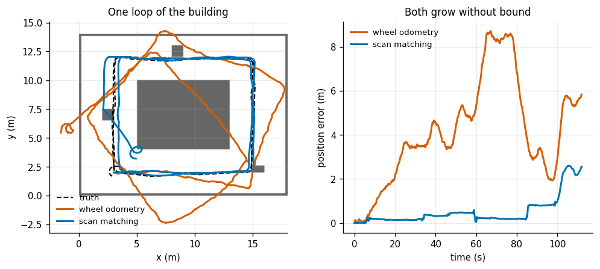
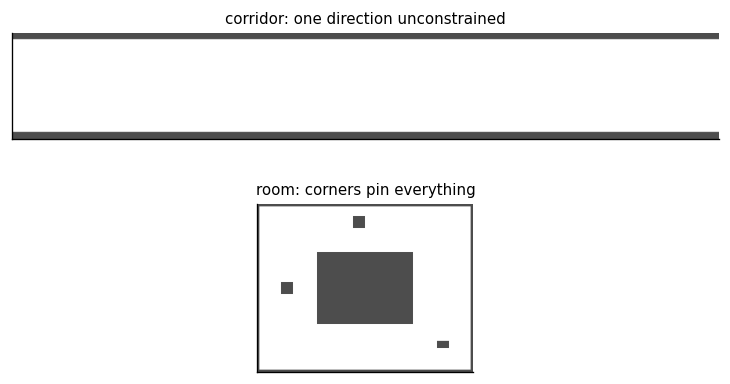
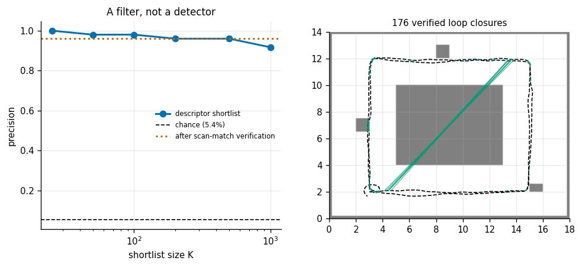
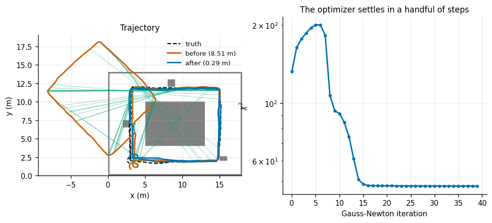
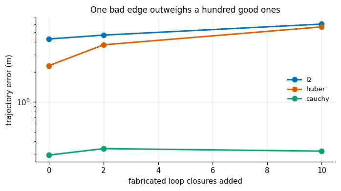
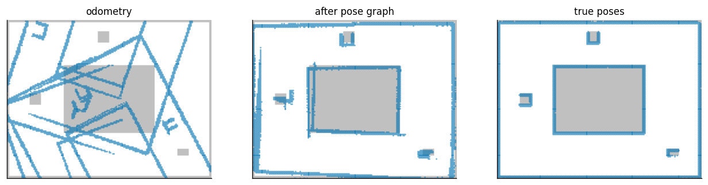

# 2D LiDAR SLAM

## Key Insight

Robots operating in unknown environments must construct a map while simultaneously tracking their position within it. This 2D [LiDAR](/shared/glossary/#lidar) [SLAM](/shared/glossary/#slam) system pairs a front-end that matches scan points using algorithms like [Iterative Closest Point (ICP)](/shared/glossary/#iterative-closest-point-icp) to estimate incremental motion with a back-end that maintains a [pose graph](/shared/glossary/#pose-graph). By detecting [loop closures](/shared/glossary/#loop-closure)—recognizing when the robot has returned to a previously visited location—the system injects spatial constraints that correct accumulated [drift](/shared/glossary/#drift), aligning the entire map and trajectory.

**This is project 29.** It writes `scanmatch.py` (three 2D [scan matchers](/shared/glossary/#scan-matching)) and `posegraph.py` (a Gauss-Newton pose-graph solver with [robust kernels](/shared/glossary/#robust-kernel)). [Project 30](../30-factor-graph-practice/README.md) imports the solver and builds the general factor-graph machinery on top of it. It reuses [project 27](../27-particle-filter/README.md)'s `gridmap.py` and [project 26](../26-ekf-localization/README.md)'s motion model.

---

## Files

| file | what it is |
|---|---|
| `scanmatch.py` | point-to-point ICP, point-to-line ICP, a correlative matcher, and the 2D pose algebra |
| `posegraph.py` | sparse Gauss-Newton with four robust kernels. **Shared with project 30.** |
| `run.py` | the seven experiments |
| `outputs/` | figures and `results.csv` |

```bash
python3 run.py       # about 3.5 minutes; NumPy and Matplotlib only
```

The robot drives **two laps** of a hall with a block in the middle: 89 m, 561 scans of 360 beams, a 2 cm lidar and deliberately poor wheel odometry. Two laps rather than one, because a single lap gives one revisit at the very end and almost no accumulated drift to correct — with two, the whole second lap is a revisit, which is both a harder detection problem and the situation a real SLAM run is actually in.

---

## The two halves, and why they are separate

```
        scans + wheel odometry
                 |
                 v
   +---------------------------+
   |  FRONT END                |   scan matching (exp 1-3)
   |  "how did I move?"        |   loop-closure detection (exp 4)
   |  local, fast, per-scan    |
   +---------------------------+
                 |  relative poses, with a covariance each
                 v
   +---------------------------+
   |  BACK END                 |   pose-graph optimization (exp 5)
   |  "given all of that, what |   robust kernels (exp 6)
   |   was the whole path?"    |
   |  global, slow, batch      |
   +---------------------------+
                 |
                 v
       trajectory  +  map (exp 7)
```

A beginner should ask why this split exists at all, since the front end already produces a trajectory — chain its relative poses and you have one. The answer is the whole subject: **the front end can only ever produce measurements, never corrections.** Every relative pose it reports is slightly wrong, and chaining them adds those errors up forever, with no mechanism to remove an error already committed to. The back end is the only place where a measurement taken *now* can change what you believe about where you were *a minute ago*.

---

## 1. Scan matching beats wheels, and still drifts



| | final error | mean error | % of path |
|---|---|---|---|
| wheel odometry | 5.832 m | 4.156 m | 6.55% |
| **scan matching** | **2.558 m** | **0.525 m** | **2.87%** |

Scan matching is **7.9× better on the mean**, at 18 ms per scan. It measures against the world instead of against a wheel that may be slipping, which is why it wins.

And it still drifts, without bound. Look at the right-hand panel: both curves climb, one just climbs more slowly. This is the sentence to take from the experiment: **nothing in an odometry system, however good, can remove an error it has already committed to.** Drive far enough and 2.87% of the distance is a building's width.

---

## 2. Three matchers

Medians over 60 consecutive pairs, each seeded by wheel odometry:

| matcher | translation error | rotation error | rotation p90 | iterations | ms/pair |
|---|---|---|---|---|---|
| ICP point-to-point | 15.71 mm | 0.1357° | 0.3181° | 16.8 | 8.95 |
| **ICP point-to-line** | **13.67 mm** | **0.0801°** | **0.1897°** | **13.4** | 18.10 |
| correlative, no seed | 12.71 mm | 0.3137° | 0.5564° | — | 285.89 |
| correlative + ICP | 13.87 mm | 0.1656° | 0.2076° | — | 302.50 |

**Point-to-line wins on everything**: 0.87× the translation error, 0.59× the rotation error, 0.60× the 90th-percentile rotation error, in 13.4 iterations instead of 16.8. [Project 19](../19-icp-registration/README.md) measured the 3D version of the same comparison and found an even larger gap (5 iterations against 58).

The reason is geometric and it is the same one dimension down. **A laser samples a *surface*, and two scans never hit the same points on it.** Point-to-point demands that a point land exactly on its neighbour's point, which is asking for something that is not true, so the fit spends its effort fighting the natural sliding of points along a wall. Point-to-line only asks the point to land on the same *wall*, which is true, and lets it slide freely — so the optimization moves straight down the one direction that is actually constrained.

The correlative matcher needs no initial guess at all and is 16× slower. **It is not for this job** — consecutive scans always have a good odometry seed. It is for loop closure, where the two scans are minutes apart and no seed exists, and experiment 4 uses a multi-start ICP for exactly that reason.

### A bug worth naming

Getting this to work required fixing something that produced a filter which *looked* fine:

> **The ICP increment must be applied on the LEFT.** The Jacobian is written for the already-transformed points, so `(dx, dy, dθ)` describes a small motion in the *target* frame — and left-composition is what that means. Composing it on the right instead looks almost identical for small `dθ` and quietly stops ICP correcting rotation at all. Rotation error stayed pinned at whatever the initial guess had, which made scan matching *worse* than the wheel odometry that seeded it.

And a second one, in the simulation rather than the algorithm:

> **A reading at max range means "nothing was there", not "a wall at exactly 8.00 m".** Adding sensor noise to it produces 7.98 m, which then survives the max-range filter and becomes a phantom point floating in open space. A handful of those per scan, in arbitrary directions, swung the rotation estimate by up to 3.5° per match — which over 280 chained matches is the difference between a map and a spiral.

---

## 3. A featureless corridor



Scan-match a 0.35 m step, in a bare 20 m corridor and in the hall:

| geometry | match error | of which is along-axis | smallest eigenvalue | eigenvalue ratio |
|---|---|---|---|---|
| **corridor** | **30.6 mm** | **100%** | 4.62 | **52.9** |
| hall | 13.9 mm | 93% | 95.31 | 1.5 |

The corridor is 2.2× worse and **all** of the error is sliding along the corridor's axis.

Two parallel walls constrain how far you are from each wall and which way you are pointing. They say nothing whatever about how far along you have travelled, because sliding a corridor along itself leaves an identical picture. (The corridor is 20 m long and the robot sits in the middle, so both ends are beyond the laser's 8 m range — that detail is what makes it degenerate. Put the robot near one end and the visible end wall fixes the position immediately.)

**The warning sign is the eigenvalue ratio of the fit's information matrix: 53 against 1.5.** One direction is fifty times better constrained than the other, and a matcher that reports a single "residual" number cannot tell you that — the residual over a bare corridor is *perfect*, because the scan really does line up. [Project 19](../19-icp-registration/README.md) measured this exact failure in 3D on a bare wall, where the residual stayed clean while the answer slid 206 mm.

This is the third time in Phase 4 that the same pattern has appeared ([26](../26-ekf-localization/README.md)'s collinear landmarks, [16](../16-camera-calibration/README.md)'s fronto-parallel boards), and it always announces itself in an eigenvalue and never in the objective value. Look at the eigenvalues.

---

## 4. Finding loop closures



115 921 candidate pairs at least 80 scans apart, of which 6 240 are genuinely within 1.5 m — a **base rate of 5.38%**. That number matters: blind guessing is right 5.38% of the time, so a detector has to beat that by a lot before it is worth running.

The descriptor is deliberately cheap: sort the scan's ranges and keep 32 of them. Sorting throws away *which direction* each reading came from, which is exactly what you want — a place looks the same however you entered it, and a descriptor that depended on heading would fail to recognize a corridor walked the other way.

| top K | true | precision | vs chance | recall |
|---|---|---|---|---|
| 25 | 25 | **1.000** | 18.6× | 0.004 |
| 50 | 49 | 0.980 | 18.2× | 0.008 |
| 100 | 98 | 0.980 | 18.2× | 0.016 |
| 200 | 192 | 0.960 | 17.8× | 0.031 |
| 1000 | 917 | 0.917 | 17.0× | 0.147 |

Verifying the top 200 by multi-start scan matching took 42 s and accepted 176, of which 7 were wrong.

**The descriptor is not a detector; it is a filter.** Its job is to turn 115 921 pairs into 200 worth 210 ms each — running the matcher on everything would take 405 minutes instead of 42 seconds. The matcher is the detector, and it is allowed to be expensive precisely because the descriptor already threw away 99.8% of the work.

The acceptance test is three conditions, and the first is the one that matters:

- **overlap > 0.80** — the fraction of source points that ended up within 15 cm of a target point.
- rms < 5 cm
- the information matrix's smallest eigenvalue above a floor (experiment 3's lesson).

The overlap is doing the heavy lifting and the residual alone is not enough, for a reason worth internalizing: **a matcher handed two unrelated scans will happily line up whichever few points it can and report a small residual over those few, while leaving most of the scan unexplained.** Residual measures how well the points it chose fit; overlap measures how much of the scan it managed to explain at all. Loosening this test from `overlap > 0.80` to `rms < 0.08` alone accepted 176 closures of which **130 were wrong**, and destroyed the map.

---

## 5. Closing the loop



561 poses, 560 odometry edges, 176 loop closures:

| | trajectory error |
|---|---|
| before optimizing (scan-match chain) | 8.5075 m |
| plain least squares | 4.2844 m (2.0× better) |
| **Cauchy [robust kernel](/shared/glossary/#robust-kernel)** | **0.2923 m (29.1× better)** |

Two things.

**The optimizer used no new sensor data.** Every number it was given was already available before optimizing. What changed is that the loop closures made the problem *over-determined* — more constraints than unknowns — and the least-squares solution spreads the accumulated error backwards over the whole trajectory instead of leaving it piled up at the end.

**The gap between the second and third rows is the price of the 7 false closures the front end let through** — 4% of them. Plain least squares is **14.7× worse** because of those seven; the kernel absorbs them. In practice you never run a SLAM back end without a robust kernel, because no front end is ever perfect, and [project 30](../30-factor-graph-practice/README.md) takes that trade apart properly.

---

## 6. One lie in the graph



Add fabricated loop closures on top of the 176 the front end found:

| fabricated | plain least squares | [Huber](/shared/glossary/#huber-kernel) | Cauchy |
|---|---|---|---|
| 0 | 4.2844 m | 2.3148 m | **0.2922 m** |
| 2 | 4.6860 m | 3.7421 m | **0.3391 m** |
| 10 | 6.0449 m | 5.6669 m | **0.3200 m** |

**Cauchy barely moves across the whole sweep** (0.292 → 0.320 m) while plain least squares degrades from an already-broken 4.28 m to 6.04 m.

The arithmetic is the reason and it is worth stating plainly: least squares minimizes the *sum of squares*, so an edge whose residual is twenty times too large contributes **four hundred times** the pull of a good one. It does not matter that it is outvoted a hundred to one — it is not a vote, it is a tug of war with weights.

Note that Huber, which only *quietens* an outlier rather than switching it off, is barely better than plain least squares here. That distinction — quieten versus switch off — is measured properly in [project 30](../30-factor-graph-practice/README.md).

---

## 7. The map, measured against the floor plan it came from



Paint every laser return into a grid and ask what fraction lands on a real wall:

| poses used | returns on a wall | cells drawn |
|---|---|---|
| scan-match odometry | 31.42% | 3 923 |
| **after the pose graph** | **67.29%** | 3 363 |
| with the true poses | 99.99% | 2 904 |

Optimizing more than doubles the fraction of returns that land on a real wall, and draws **14% fewer cells** — and fewer is better here.

That last point is the practical one, and it is why map quality is not the same as trajectory error. A drifted trajectory does not merely displace the map, it **blurs** it: the same wall is painted several times in slightly different places, so one wall becomes three faint ones. A planner reading that map sees a corridor narrower than it really is, and refuses to drive down it. **Sharpening that blur is the reason to close loops at all** — not to make a number smaller, but to make the map usable by the thing downstream.

We are still short of the 99.99% ceiling because the optimized trajectory carries 0.29 m of error against a 0.1 m grid, so returns land two or three cells off the wall. That is an honest floor set by the front end, not by the optimizer.

(The maps are rigidly aligned to the truth before scoring. A SLAM answer is only defined up to a global rigid transform — pinning node 0 picks *a* frame, but the optimizer is free to rotate everything about it, and a small residual rotation at the start becomes metres of displacement at the far end. Comparing raw coordinates would score the frame choice rather than the map, which is why every SLAM benchmark aligns first.)

---

## What to take away

1. Scan matching beats wheel odometry by 7.9× and **still drifts without bound**. A front end produces measurements; only a back end produces corrections.
2. Point-to-line beats point-to-point on every metric, because a laser samples a surface and no two scans hit the same points on it.
3. **Apply the ICP increment on the left.** Applying it on the right looks nearly identical and silently stops rotation being estimated at all.
4. **Never treat a max-range reading as a surface point.** Phantom points at 8 m cost 3.5° per match.
5. A degenerate corridor shows up in the **eigenvalue ratio (53 against 1.5)** and never in the residual. Third appearance of this pattern in the guide; look at eigenvalues.
6. A loop-closure descriptor is a filter, not a detector: 18× better than chance is enough, because the scan matcher decides. **Verify with overlap, not residual** — the loose test accepted 130 false closures out of 176.
7. **A robust kernel is not optional**: the same graph solves to 4.28 m with plain least squares and 0.29 m with Cauchy, because 7 of 176 closures were wrong.
8. Optimizing lifts on-wall returns from 31% to 67% and draws 14% fewer cells. **The product is a sharp map, not a small number.**

---

## Next

[Project 30](../30-factor-graph-practice/README.md) takes the back end apart: where each robust kernel breaks, what to do when the outlier rate is high enough to defeat all of them, and the exact sense in which a filter is a smoother that forgot.
