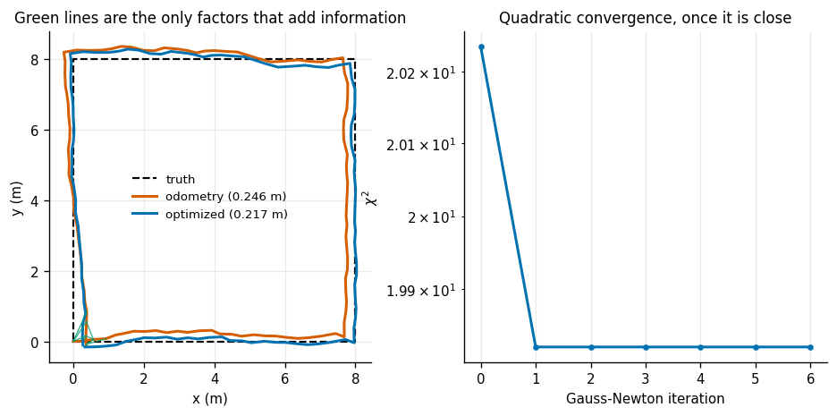
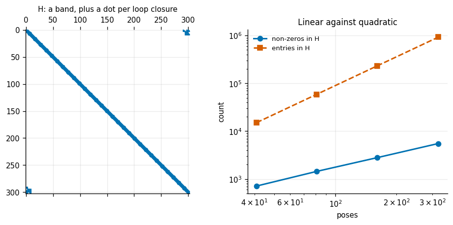
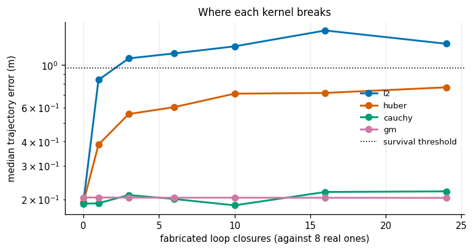
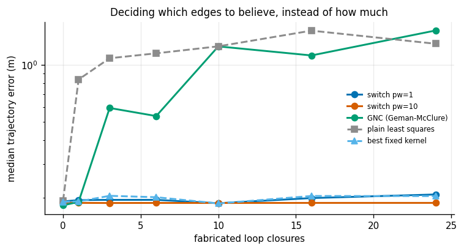
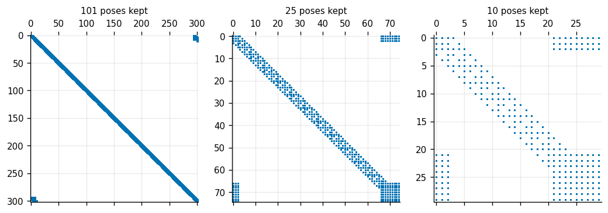

# Factor-Graph Practice

## Key Insight

Modern [state](/shared/glossary/#state) estimation frames [SLAM](/shared/glossary/#slam) not as a step-by-step filtering problem, but as a global optimization problem over a [factor graph](/shared/glossary/#factor-graph). Using [GTSAM](/shared/glossary/#gtsam), we represent robot poses and sensor measurements as nodes and constraint factors, solving for the entire trajectory at once. To prevent incorrect measurements like false [loop closures](/shared/glossary/#loop-closure) from ruining the map, robust cost kernels are applied to downweight outlier constraints, ensuring the optimizer converges to the correct trajectory despite noisy data.

**This is project 30**, the last of Phase 4. It builds on [project 29](../29-2d-lidar-slam/README.md)'s `posegraph.py` and adds the three things a production back end has that a plain pose graph does not: [graduated non-convexity](/shared/glossary/#gnc), [switchable constraints](/shared/glossary/#switchable-constraints), and [marginalization](/shared/glossary/#marginalization).

### One deviation from the Key Insight, stated up front

The Key Insight says "using GTSAM". This project does not use [GTSAM](/shared/glossary/#gtsam) — it writes the solver from scratch, as the rest of this guide does. Two reasons, one practical and one pedagogical.

**Practical:** the only published GTSAM wheel (4.2.1) requires NumPy 1.x, and this repository's environment runs NumPy 2. Installing it downgrades NumPy, which breaks the OpenCV that [projects 16–23](../16-camera-calibration/README.md) depend on; leaving NumPy at 2 makes GTSAM segfault on its first `Marginals` call. That is a version conflict, not a judgement about the library.

**Pedagogical:** the whole of experiments 4, 5 and 7 is about machinery that GTSAM would hide behind one argument. `optimizer.optimize()` with a `noiseModel.Robust` wrapper produces an answer and teaches nothing about *why* a single false loop closure outweighs four hundred good ones. The from-scratch solver is 150 lines and every one of them is a thing you can change and measure.

What you should carry from this project into GTSAM is the vocabulary, which maps directly: our `PoseGraph` is a `NonlinearFactorGraph`, our edges are `BetweenFactorPose2`, our information matrices are `noiseModel.Gaussian.Information`, our kernels are `noiseModel.Robust.Create(mEstimator.Huber(...))`, and our dense Gauss-Newton is `LevenbergMarquardtOptimizer` with a sparse Cholesky underneath.

---

## Files

| file | what it is |
|---|---|
| `factorgraph.py` | graph construction, GNC, switchable constraints, marginalization |
| `run.py` | the seven experiments |
| `outputs/` | figures and `results.csv` |

Imports `posegraph.py` and `scanmatch.py` from [project 29](../29-2d-lidar-slam/README.md).

```bash
python3 run.py       # about 4 minutes; NumPy and Matplotlib only
```

---

## What a factor graph actually is

Two kinds of node. **Variables** are the things you want to know — robot poses here. **Factors** are the things you were told — measurements, priors. An edge joins a factor to every variable it mentions.

The name is literal. The posterior probability *factorises* into a product, one term per factor, and the graph is a picture of that product:

```
p(x | z)   proportional to   prod_k  f_k( the variables factor k touches )
```

Take the negative logarithm and the product becomes a sum, the maximum becomes a minimum, and each Gaussian factor becomes a squared residual:

```
minimise   sum_k  || r_k(x) ||^2   weighted by the information of factor k
```

That is a nonlinear least-squares problem, and a [pose graph](/shared/glossary/#pose-graph) is exactly the case where every factor touches two poses.

A beginner should ask: **if this is just a pose graph again, why bother renaming it?** Because the pose-graph name only covers the case where all measurements are pose-to-pose. Once you want to add a GPS reading (touching one pose), a landmark observation (touching a pose and a landmark), an [IMU preintegration](/shared/glossary/#imu-preintegration) factor (touching two poses, two velocities and two bias states), or a prior on the first pose, "pose graph" stops describing what you have. "Factor graph" does — and the *same solver code* handles all of them, because it only ever asks a factor for a residual and its [Jacobians](/shared/glossary/#jacobian). The rename buys generality, not a new algorithm.

---

## 1. The graph, solved, and where the information actually lives



A square lap: 101 poses, 100 odometry factors, 8 loop closures.

| | value |
|---|---|
| variables | 101 poses = 303 numbers |
| equations | 324 (108 factors × 3) |
| solve time | 69 ms, 7 [Gauss-Newton](/shared/glossary/#gauss-newton) iterations |
| trajectory error | 0.2464 m → 0.2168 m |

Now the experiment that explains the whole subject. Re-solve with the **loop closures removed**:

| | trajectory error |
|---|---|
| odometry chain, before optimizing | 0.2464 m |
| after optimizing the odometry factors alone | **0.2464 m — no change at all** |

That is not a bug. A chain of `n−1` relative measurements between `n` poses has exactly as many equations as unknowns once the first pose is pinned, so there is precisely **one** trajectory that satisfies it perfectly: the one you get by chaining them. There is nothing left to optimize. Any optimizer handed only those factors will report that it converged immediately and hand back its input.

**A loop closure adds three equations without adding any unknowns.** Only then does "best fit" start to mean anything, because only then can the measurements disagree with each other.

Add them one at a time to the same odometry:

| loop closures | error after |
|---|---|
| 0 | 0.2949 m |
| 1 | 0.2359 m |
| 2 | 0.2355 m |
| 4 | 0.2155 m |
| 8 | 0.2187 m |
| 16 | 0.2156 m |
| 32 | 0.2156 m |

**The first loop closure does 74% of the work available, and the benefit is flat past four.** That is worth knowing before you spend engineering effort making a loop-closure detector more sensitive: a detector that finds four good closures per lap is nearly as valuable as one that finds thirty-two — and, as experiments 3 and 4 show, a detector that finds thirty-two *along with one false one* is far worse than either.

---

## 2. Sparsity is the algorithm



The normal-equation matrix `H` for the graph above is 303 × 303 = 91 809 entries, of which **1 783 are non-zero — 1.94%**. A dense Cholesky costs about `n³/3 ≈ 9.3 million` operations; a sparse one costs roughly the number of non-zeros. A factor of 5 200, at this toy size.

And it gets better as the problem grows:

| poses | `H` size | non-zeros | density | our dense solve |
|---|---|---|---|---|
| 41 | 123 | 713 | 4.71% | 0.023 s |
| 81 | 243 | 1 443 | 2.44% | 0.051 s |
| 161 | 483 | 2 803 | 1.20% | 0.115 s |
| 321 | 963 | 5 523 | **0.60%** | 0.364 s |

The reason is structural, not lucky. Each factor touches two poses, so it fills a fixed 6 × 6 patch of `H` however big the graph is. Add a pose and you add one row and one factor: **the non-zero count grows linearly while the matrix area grows quadratically.**

That sentence is the whole reason SLAM back ends scale to hundreds of thousands of poses, and it is a property of the *world* rather than of the algorithm — a robot only ever measures things near it in space and time, so it physically cannot produce a dense problem.

Our solver uses a dense solve, and you can watch it lose: 16× the time for 7× the poses. A sparse solver — what [GTSAM](/shared/glossary/#gtsam), Ceres and g2o all ship — would be near-linear. The `spy` plot in the figure shows why: a narrow band down the diagonal from the odometry chain, plus one isolated dot per loop closure. Ordering the variables to keep that band narrow is the entire art of a sparse SLAM solver.

---

## 3. How many lies does plain least squares survive?

Eight true loop closures throughout. Only the number of fabricated ones changes, and each fabricated edge is declared with the *same confidence* as a real one — which is what makes it dangerous. It is not that it is wrong; it is that it claims not to be.

| false edges | as % of closures | median error | mean error |
|---|---|---|---|
| 0 | 0% | **0.1929 m** | 0.1931 m |
| 1 | 11% | **0.8369 m** | 0.7679 m |
| 2 | 20% | 1.2357 m | 1.2061 m |
| 5 | 38% | 1.1707 m | 1.1711 m |
| 12 | 60% | 1.4291 m | 1.4039 m |
| 20 | 71% | 1.4553 m | 1.4043 m |

**One fabricated edge among nine costs 4.3× the error.**

The arithmetic is brutal and worth spelling out, because it is the entire justification for everything in the next two experiments. Least squares minimizes the *sum of squares*, so an edge that disagrees by twenty times the expected amount contributes **four hundred times** the pull of a good one. Eight honest edges pulling with force 1 lose to one liar pulling with force 400. It is not a vote; it is a tug of war with weights.

Note also the shape of the damage: one lie already moves the answer nearly as far as twenty do. **There is a cliff, not a slope, and you go over it at the first outlier.**

---

## 4. Four kernels, and where each one gives up



A [robust kernel](/shared/glossary/#robust-kernel) replaces the squared error with something that flattens out past some scale, so that beyond it, extra wrongness stops adding extra pull. Median trajectory error, 8 repeats per cell:

| false edges | plain L2 | [Huber](/shared/glossary/#huber-kernel) | Cauchy | Geman-McClure |
|---|---|---|---|---|
| 0 | 0.1929 | 0.1929 | 0.1904 | 0.2050 |
| 1 | **0.8369** | 0.3858 | **0.1914** | **0.2050** |
| 3 | 1.0822 | 0.5563 | 0.2112 | 0.2048 |
| 6 | 1.1485 | 0.6041 | 0.2014 | 0.2045 |
| 10 | 1.2499 | 0.7097 | 0.1867 | 0.2045 |
| 16 | 1.5111 | 0.7162 | 0.2190 | 0.2044 |
| **24** | 1.2893 | 0.7655 | **0.2206** | **0.2041** |

| kernel | survives to | cost on a clean graph |
|---|---|---|
| L2 | 1 lie | +0.0% |
| Huber | 24 lies | −0.0% |
| Cauchy | 24 lies | −1.3% |
| Geman-McClure | 24 lies | **+6.3%** |

Three things to read.

**Every kernel costs something on clean data.** Geman-McClure pays 6.3% for insurance it does not need, because it also down-weights the honest tail of a perfectly healthy noise distribution. That premium is real, and it is why nobody uses the most aggressive kernel by default.

**Huber degrades; Cauchy and Geman-McClure do not.** Huber's error grows steadily from 0.19 m to 0.77 m across the sweep — it stays inside any reasonable survival threshold, but it is clearly being dragged. Cauchy and Geman-McClure stay flat at 24 fabricated edges against 8 real ones, which is 75% outliers.

The reason is in the weights, and this is where the names pay off:

- **[Huber](/shared/glossary/#huber-kernel)** (Peter Huber, 1964) is quadratic near zero and *linear* beyond `δ`. Its weight is `δ/e`, which never reaches zero. A hundred-sigma outlier still pulls with a hundredth of the force of a good edge — times its enormous disagreement, which is not nothing. Huber **quietens** an outlier.
- **Cauchy** takes its shape from the Cauchy distribution, whose tails are so heavy that its mean does not exist — exactly the assumption you want when you believe some of your data may be arbitrarily wrong. Weight `1/(1 + e²/δ²)`, falling as `1/e²`. It **switches off**.
- **Geman-McClure** falls as `1/e⁴`. It switches off harder, and it is easy to get stuck with, because an edge it silences early can never argue its way back in — which is exactly the problem [GNC](/shared/glossary/#gnc) exists to solve.

---

## 5. Letting the optimizer decide which edges to believe



Two schemes that decide *which* measurements to reject rather than *how much* to down-weight everything.

**[Switchable constraints](/shared/glossary/#switchable-constraints)** give each dubious edge its own dial `s` between 0 and 1 multiplying its information, plus a prior pulling `s` towards 1. The optimizer then trades: switching an edge off costs whatever the prior charges and saves whatever that edge's residual was. The threshold is not a number you invent — it emerges from that balance.

**[GNC](/shared/glossary/#gnc)** solves a *sequence* of problems, starting with the kernel so wide it is effectively plain least squares (convex, one minimum, nowhere to get stuck) and shrinking the scale a little at a time, each solve starting from the last one's answer.

| false edges | switch, prior 1 | switch, prior 10 | GNC |
|---|---|---|---|
| 0 | 0.1825 m | 0.1758 m | 0.1766 m |
| 3 | 0.1950 | 0.1877 | 0.5928 |
| 10 | 0.1872 | 0.1878 | 1.2490 |
| 24 | 0.2082 | **0.1880** | 1.5142 |

And how well each identified *which* edges were lies:

| method | caught | wrongly rejected | missed | precision | recall |
|---|---|---|---|---|---|
| switch, prior 1 | 360 | 259 | 0 | 0.582 | **1.000** |
| **switch, prior 10** | 359 | **0** | 1 | **1.000** | **0.997** |
| GNC (Geman-McClure) | 238 | 116 | 122 | 0.672 | 0.661 |

Three honest results, two of them not what you would expect.

**Switchable constraints with the right prior are essentially perfect** — 359 of 360 outliers caught, zero good edges wrongly rejected. That is the strongest result in the project.

**But the prior weight is a knob, and it matters.** At prior 1 the scheme still catches everything, and also throws away 259 perfectly good edges to do it. The claim that switchable constraints "remove the need to tune a threshold" is not quite true: the threshold has moved somewhere less obvious, not disappeared.

**GNC does worse than a plain fixed Cauchy kernel here**, and its identification is mediocre (0.67 precision, 0.66 recall). This is an honest inversion — GNC is the more sophisticated method and it lost. The reason is that GNC's advantage is *robustness to a bad starting point*, and this graph is initialized from an odometry chain that is already close. The annealing schedule spends its budget escaping local minima that were never there, and finishes at a kernel scale it has not had time to tighten properly. It would earn its keep on a graph initialized badly — which is exactly the situation experiment 6 constructs.

**And notice what none of them did: beat the best fixed kernel.** Cauchy's 0.22 m at 24 outliers is within noise of switchable's 0.188 m. So why bother? Because the adaptive methods hand you a **list** of which measurements they refused, and a fixed kernel never does. That list is the useful product: a front end that keeps proposing the same false loop closure can be told to stop, and a human debugging a broken map can be shown exactly which three constraints are the problem.

---

## 6. Gauss-Newton is a local method

| initial guess | median error | iterations |
|---|---|---|
| **odometry chain** | **0.2096 m** | 7.8 |
| all zeros | 3.5416 m | 100.0 (never converged) |
| random poses | 3.8112 m | 36.6 |
| truth + noise | 0.2096 m | 7.8 |

From all zeros, 17× worse. The optimizer walks downhill from wherever you put it, and a pose graph has many valleys because rotations wrap around — a trajectory folded the wrong way can satisfy most of its edges quite well and sit there permanently.

Two things follow.

**Nobody ever initializes a SLAM back end from nothing.** The odometry chain is not a convenience; it is the thing that drops the optimizer into the right valley. This is precisely the role the closed-form homography and intrinsics steps played for the [Levenberg-Marquardt](/shared/glossary/#levenberg-marquardt) refinement in [project 16](../16-camera-calibration/README.md) — a linear method that needs no starting guess, feeding a nonlinear one that needs a very good one.

**"truth + noise" is not better than "odometry chain".** Both reach 0.2096 m in 7.8 iterations. That is worth noticing: once you are in the right valley, a *better* starting point buys nothing at all. Initialization is a binary question — right basin or wrong basin — not a quality gradient.

---

## 7. Marginalization: a smoother becoming a filter



[Marginalization](/shared/glossary/#marginalization) removes variables without losing what they told you. Split the normal equations into the block you keep and the block you drop, solve the dropped block, and substitute it back. What is subtracted in the process is the **[Schur complement](/shared/glossary/#schur-complement)** (Issai Schur):

```
( H_kk  -  H_kd H_dd^-1 H_dk )  x_k  =  b_k  -  H_kd H_dd^-1 b_d
```

| poses kept | dimension | density before | density after | answer changed by |
|---|---|---|---|---|
| 101 | 303 | 1.9% | 1.9% | 3.5e−08 |
| 50 | 150 | 3.7% | 4.2% | 4.5e−08 |
| 25 | 75 | 7.3% | 9.1% | 1.6e−07 |
| 10 | 30 | 17.3% | 28.4% | 8.3e−07 |
| **4** | **12** | 37.5% | **100.0%** | **1.8e−06** |

The last column is the point: **marginalizing is exact.** Keeping only the last four poses gives numerically the same answer for those four (`1.8e-06`, which is solver round-off) as solving all 101 at once. No information was thrown away. It was folded into a new, denser factor connecting whatever the dropped variables used to touch.

And that is the price: density goes from 1.9% to 100%. Marginalize aggressively and you end up with a **small dense** problem instead of a **large sparse** one — and a large sparse problem is very often the cheaper of the two.

This is the exact relationship between the two halves of Phase 4:

> **A filter is a smoother that marginalizes everything except the present.**

The [EKF](/shared/glossary/#ekf) of [project 26](../26-ekf-localization/README.md) is not a different theory from the factor graph here. It is this graph, with every pose but the current one marginalized away at every step. Same answer, different bookkeeping.

Which raises the obvious question: if marginalizing is exact and cheap, **why did modern SLAM abandon filtering for smoothing?** The density is part of it, but not the real part. The real cost is subtler: marginalizing also **freezes the linearization point**. The [Jacobians](/shared/glossary/#jacobian) that were current at the moment you marginalized are baked into that new dense factor and can never be reconsidered. A smoother, holding on to a window of poses, can re-linearize the whole window when a loop closure changes its mind about where the robot was three minutes ago. A filter cannot — it can only apply the correction to the present, using derivatives computed at a past estimate that has since been shown wrong.

**That ability to change its mind, not the sparsity, is why iSAM2, ORB-SLAM3 and VINS-Fusion all smooth.**

---

## What to take away

1. A factor graph is the same maths as a pose graph, in vocabulary general enough to hold GPS, landmarks, IMU factors and priors in one solver.
2. **Odometry factors alone are not an optimization problem** — `n−1` equations, `n−1` unknowns, one exact answer. Loop closures are the only factors that add information, and the first one does 74% of the available work.
3. Sparsity is a property of the world, not of the algorithm, and it is why back ends scale: non-zeros grow linearly, matrix area quadratically.
4. **One false loop closure among nine costs 4.3× the error**, because least squares weights disagreement by its square. There is a cliff at the first outlier, not a slope.
5. Kernel choice is a real trade: Geman-McClure pays 6.3% on clean data; Huber pays nothing but is dragged 4× across a heavy outlier sweep; Cauchy sat between them and was the best default here.
6. **Switchable constraints hit 1.000 precision and 0.997 recall** at 75% outliers — but only at the right prior weight; the wrong one wrongly rejected 259 good edges. **GNC lost to a fixed kernel** because this graph was already well initialized, which is not where GNC's advantage lives.
7. **A filter is a smoother that marginalizes everything but the present.** Marginalization is exact; what it costs is sparsity and — the part that actually decided the field — the ability to re-linearize.

---

## Phase 4, in one page

| project | the thing it measured |
|---|---|
| [24](../24-1d-kf/README.md) | the covariance recursion never looks at the data, so a biased sensor is invisible to it |
| [25](../25-2d-constant-velocity-tracker/README.md) | `Q` and `R` are one knob; a richer motion model bought nothing that loosening `q` did not |
| [26](../26-ekf-localization/README.md) | the UKF's belief is better and its answer is not; geometry beats landmark count |
| [27](../27-particle-filter/README.md) | a sensor model sharper than the sensor makes global localization fail, and particles cannot fix it |
| [28](../28-vio-mvp/README.md) | scale is unobservable without acceleration, and the filter does not know |
| [29](../29-2d-lidar-slam/README.md) | scan matching beats wheels by 8× and still drifts; loop closure is the only cure |
| **30** | one lie outweighs a hundred truths, and a filter is a smoother that forgot |

The thread running through all seven: **every estimator in this phase will tell you an answer, and none of them will tell you when it is wrong unless you build the check yourself.** NIS, NEES, eigenvalue ratios, effective sample size, overlap fraction, robust-kernel weights — those are the checks, they are all cheap, and they are the difference between a robot that stops and a robot that drives into a wall with total confidence.
