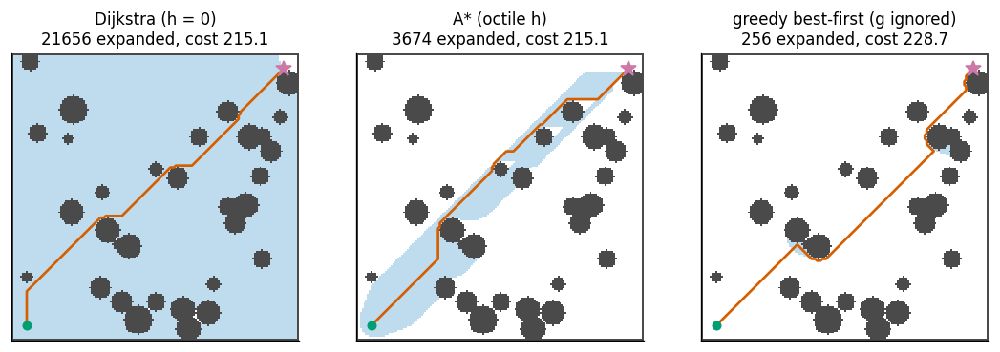
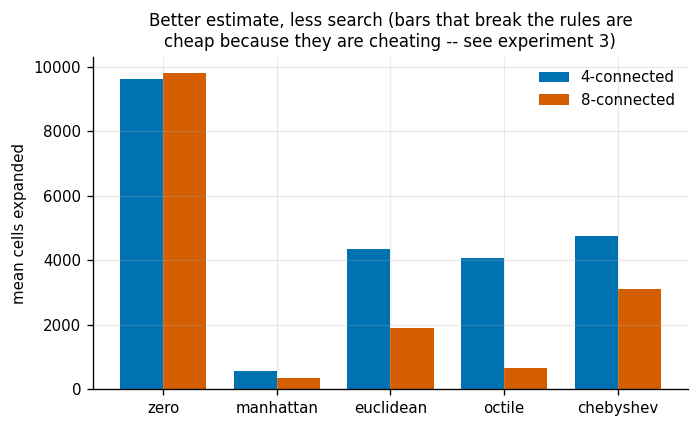
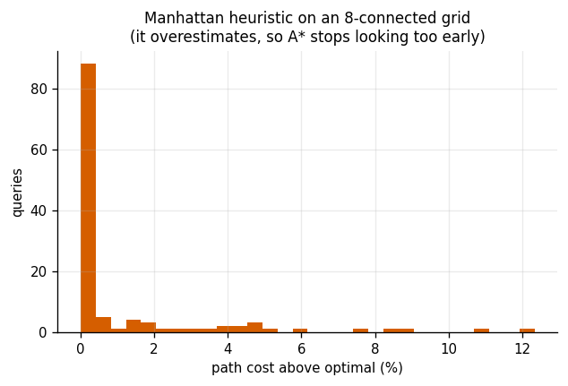
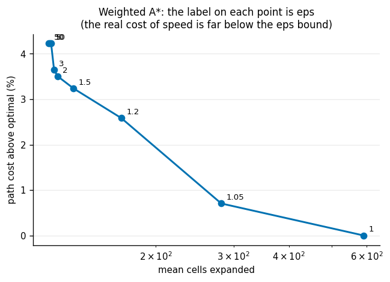
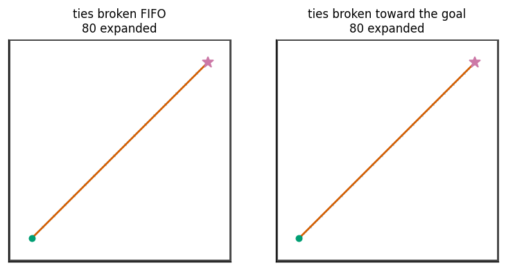
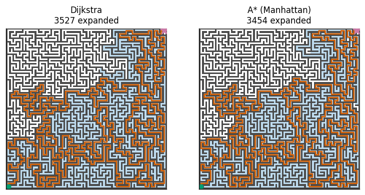
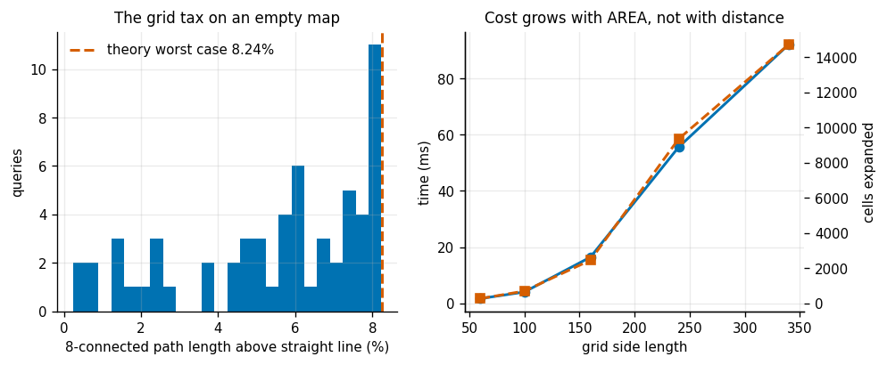

# A* on a Grid

## Key Insight

Finding the shortest path on a 2D grid using [Dijkstra's algorithm](/shared/glossary/#dijkstras-algorithm) is slow because it searches in every direction equally, wastefully visiting cells that lead away from the target. The [A* search](/shared/glossary/#a-star-search) algorithm solves this by guiding the search with a heuristic function, such as the Manhattan distance, which estimates the remaining distance to the goal. This project implements A* and compares it against Dijkstra's algorithm to show how an admissible heuristic dramatically cuts the number of visited [states](/shared/glossary/#state) while still guaranteeing an optimal, collision-free route.

**This is project 31**, the first of Phase 5. Its `grid.py` is reused by [project 32](../32-rrt-in-2d/README.md) (to compute a near-optimal reference cost) and [project 34](../34-shortcut-smoothing/README.md).

### One honest correction to the Key Insight, up front

The Key Insight names the [Manhattan distance](/shared/glossary/#manhattan-distance) as the heuristic. On the 4-connected grid that phrase usually assumes — where you may only step north, south, east or west — Manhattan distance is not merely a good heuristic, it is the *exact* answer on empty ground, and it is superb.

On an **8-connected** grid, where diagonal steps are allowed, Manhattan distance is **wrong**, and wrong in the direction that breaks A*'s optimality guarantee. Experiment 3 measures the damage: 26% of queries come back with a path that is not the shortest, by up to 12.3%. The heuristic that plays the same role on an 8-connected grid is the *octile* distance, and this project uses that as its default. We keep the Manhattan version around precisely so we can measure what goes wrong.

---

## Files

| file | what it is |
|---|---|
| `grid.py` | map generators, five heuristics, and one search function that covers Dijkstra, A*, weighted A* and greedy |
| `run.py` | the seven experiments |
| `outputs/` | figures and `results.csv` |

```bash
python3 run.py      # about 45 seconds; NumPy and Matplotlib only
```

---

## The one function behind four algorithms

Dijkstra, A*, [weighted A*](/shared/glossary/#weighted-a-star) and [greedy best-first search](/shared/glossary/#greedy-best-first-search) are not four algorithms. They are one algorithm with one line changed — how the priority `f` is built out of `g` (what this route has cost so far) and `h` (an estimate of what is left):

```
  Dijkstra        f = g                 h switched off
  A*              f = g + h
  weighted A*     f = g + eps * h       eps > 1
  greedy          f = h                 g switched off
```

A beginner should ask the obvious question here: **if `h` is only a guess, how can adding it to a real cost be safe?** Because of one condition. If `h` never *overestimates* the remaining distance, A* can never be talked out of examining a route that would have turned out best — it can only be persuaded to examine that route sooner. A heuristic with that property is called [admissible](/shared/glossary/#admissible-heuristic), and admissibility is the entire licence for the speed-up. Break it, and the algorithm still runs, still returns a path, and quietly stops being correct.

Five heuristics live in `grid.py`, and their names all encode their behaviour:

- **`zero`** — no estimate at all. Plugging this into A* gives you Dijkstra, which is why the two do not need separate code.
- **`manhattan`** — `|dy| + |dx|`. Named after the street grid of Manhattan, where you cannot cut across a block: you walk so far east, then so far north. Also called the **L1 norm**, because it is the `p = 1` case of the general Lp formula `(sum |v_i|^p)^(1/p)`.
- **`euclidean`** — ordinary straight-line distance. The **L2 norm**, i.e. `p = 2` in the same formula. The "2" in "L2 normalization" everywhere else in machine learning comes from exactly this `p`.
- **`chebyshev`** — `max(|dy|, |dx|)`. The **L-infinity norm**, the `p -> infinity` limit, in which the largest component swallows everything else. Named after Pafnuty Chebyshev. It is the distance if a diagonal step cost the same as a straight one — a king on a chessboard.
- **`octile`** — `(sqrt(2) - 1) * min(dy, dx) + max(dy, dx)`. "Octile" because there are eight directions to move in. Take as many diagonal steps as you can (each costs `sqrt(2)` and consumes one unit of *both* dy and dx), then walk the leftover straight. On an empty 8-connected grid this is not an estimate; it is the answer.

---

## 1. A* against Dijkstra: identical path, a fraction of the work



A 160 x 160 map with 21 743 free cells, one query from corner to corner. Grey is wall, pale blue is every cell the search settled, orange is the path it returned.

| | cells expanded | % of the free map | path cost | time |
|---|---|---|---|---|
| Dijkstra | 21 656 | **99.6%** | 215.120 | 84 ms |
| A* (octile) | 3 674 | 16.9% | 215.120 | 23 ms |
| greedy best-first | 256 | 1.2% | 228.718 | 1.7 ms |

**Dijkstra visited 99.6% of the map to answer a question about one route.** That is not a flaw in the implementation; it is what Dijkstra *is*. It settles cells in order of distance from the start, so before it can settle a cell 215 units away it must settle every cell closer than that — in every direction, including directly backwards.

A* returns the **identical** cost (the difference is 5.7e-14, which is floating-point noise) for 5.9x less work.

Greedy is 14x cheaper still, and its path is 6.3% too long. Over 48 random queries on other maps, greedy expanded 5.6x fewer cells than A* and came back **3.3% too long on average, 15.8% in the worst case**. Whether that is a good trade depends entirely on what the path is for: excellent for a game character, unacceptable for a robot whose path length is battery life.

---

## 2. The heuristic ladder



Twelve random maps, six queries each. Mean cells expanded, and how far above optimal the returned path was:

| connectivity | heuristic | mean expanded | mean excess | worst excess | admissible? |
|---|---|---|---|---|---|
| 4 | zero (= Dijkstra) | 9 626 | 0% | 0% | yes |
| 4 | **manhattan** | **562** | 0% | 0% | yes |
| 4 | euclidean | 4 342 | 0% | 0% | yes |
| 4 | octile | 4 069 | 0% | 0% | yes |
| 4 | chebyshev | 4 745 | 0% | 0% | yes |
| 8 | zero (= Dijkstra) | 9 816 | 0% | 0% | yes |
| 8 | manhattan | 348 | 0.998% | **11.73%** | **NO** |
| 8 | euclidean | 1 909 | 0% | 0% | yes |
| 8 | **octile** | **676** | 0% | 0% | yes |
| 8 | chebyshev | 3 123 | 0% | 0% | yes |

Three things to read off this table.

**The best heuristic is the one that is exactly right on empty ground.** Manhattan is exact on a 4-connected grid and wins there by 7x over Euclidean. Octile is exact on an 8-connected grid and wins there by 2.8x. Neither is "better"; each matches its own grid.

**A heuristic that underestimates too much is safe and slow.** Euclidean on a 4-connected grid is admissible — a straight line can never be longer than an axis-only route — so it never returns a wrong answer. But it is systematically low, so A* stays closer to Dijkstra's behaviour and expands 7.7x more cells than Manhattan does. Chebyshev is the extreme case: `max(dy, dx)` throws away the smaller component entirely, so it is the least informative admissible option on either grid.

**The one that looks best is cheating.** Manhattan on an 8-connected grid expands the fewest cells of anything in the table — 348, half of what the correct octile heuristic needs — and it is the only row marked NO.

---

## 3. The inadmissible heuristic, measured



119 queries on 8-connected maps, Manhattan against the correct octile answer:

| | |
|---|---|
| queries returning a suboptimal path | **31 of 119 = 26%** |
| mean excess length | 0.98% |
| worst excess length | **12.34%** |

Why it happens is worth spelling out slowly, because it is the single most common way A* is silently misused.

Consider a diagonal move of one cell. Its true cost is `sqrt(2) = 1.414`. Manhattan distance charges it as `1 + 1 = 2`. So Manhattan can overstate the remaining distance by up to a factor of `sqrt(2)`, i.e. 41%.

Now think about what an overstatement does to the priority queue. A cell whose remaining distance is exaggerated gets a large `f` and is pushed toward the back of the queue. If the true best path runs through that cell, A* reaches the goal by some other, worse route first — and because it settles the goal on arrival, it stops and reports that worse route. **The algorithm has not failed to search; it has been persuaded that it already finished.**

The histogram is the shape to remember: a big spike at exactly zero (three quarters of queries are unaffected) and a long tail. This is a bug that will pass every casual test you write.

---

## 4. Weighted A*: paying a bounded amount of optimality for speed



Multiply an admissible heuristic by `eps > 1` and the guarantee weakens in a very specific way: the returned path costs at most `eps` times the optimum. Ten maps:

| eps | mean expanded | speed-up | mean excess | worst excess | the bound promises |
|---|---|---|---|---|---|
| 1.0 | 591 | 1.00x | 0.00% | 0.00% | 0% |
| 1.05 | 281 | 2.10x | 0.71% | 1.96% | 5% |
| 1.2 | 167 | 3.54x | 2.58% | 6.60% | 20% |
| 1.5 | 130 | 4.53x | 3.24% | 7.20% | 50% |
| **2.0** | **120** | **4.92x** | **3.50%** | 7.73% | **100%** |
| 3.0 | 118 | 5.02x | 3.65% | 7.73% | 200% |
| 5.0 | 116 | 5.10x | 4.22% | 11.67% | 400% |
| 50.0 | 115 | 5.16x | 4.22% | 11.67% | 4900% |

**The guarantee is loose, and reality is far better than it.** At `eps = 2` the theory permits a path twice as long as optimal; the measured average is 3.5% over. That gap between the bound and the behaviour is why weighted A* is used constantly in practice despite sounding reckless on paper.

**The curve flattens hard.** Almost all of the speed is bought by `eps = 1.2`, and everything past `eps = 5` changes nothing at all — 115 expansions at `eps = 50` versus 116 at `eps = 5`. The search has already become as greedy as this map allows; multiplying the heuristic further cannot make it greedier. This is the same limit as [greedy best-first search](/shared/glossary/#greedy-best-first-search) in experiment 1, which is exactly the `eps -> infinity` case.

---

## 5. Tie-breaking: the free speed-up



On a grid, enormous numbers of cells share exactly the same `f = g + h`. When that happens, which one you pop first is undefined — and it turns out to matter a great deal.

| map | ties broken first-in-first-out | ties broken toward the goal | speed-up | same cost? |
|---|---|---|---|---|
| open field, no obstacles | 340 | **107** | **3.17x** | yes |
| blob map | 787 | 549 | 1.43x | yes |

The fix costs nothing: `h` has already been computed, so ordering equal-`f` nodes by smaller `h` is free. And because it only reorders cells that A* considers *equally good*, the returned cost is provably unchanged — which the experiment confirms on every query.

The picture explains the 3.17x. On an open field there is a large diamond-shaped region of cells that all lie on *some* shortest path, and A* with naive tie-breaking dutifully expands the whole diamond. Preferring low `h` makes it walk a narrow corridor straight to the goal instead. **A* is asked to find one shortest path, not to enumerate them all, and this is how you tell it so.**

---

## 6. The maze: where the heuristic stops helping



A 101 x 101 perfect maze (exactly one route between any two cells), against a 101 x 101 blob map, both 4-connected, Dijkstra versus A*:

| map | Dijkstra expanded | A* expanded | speed-up |
|---|---|---|---|
| maze | 3 527 | 3 454 | **1.02x** |
| open field with blobs | 8 074 | 334 | **24.17x** |

**On the maze, A* is worth 2%.** The heuristic has not broken — it is still perfectly admissible — it has simply stopped carrying information.

Here is the measurement that explains it. Take the true cost-to-go from every free cell (one Dijkstra sweep from the goal gives it) and compare it with what the straight-line estimate claims:

| map | fraction of the true remaining distance the heuristic captures |
|---|---|
| maze | **16.4%** |
| open field | **96.2%** |

In the maze, a cell 10 steps from the goal as the crow flies is typically 60 steps away along the corridors. The heuristic is telling A* almost nothing, so A* behaves almost exactly like Dijkstra.

The general rule, and it is the most useful thing in this project: **a heuristic is worth exactly as much as the gap between straight-line distance and true distance is small.** That is a property of the *world*, not of your code. Before optimising a search, measure how informative your heuristic actually is on your maps; if the answer is 16%, no amount of tuning will help, and you need a different idea — a coarse pre-computed distance map, a hierarchical decomposition, or a different algorithm entirely.

---

## 7. What the grid itself costs you



Everything above assumed the grid is the problem. It is not — it is a *model* of the problem, and the model has its own error.

**Digitisation bias.** On an empty 8-connected grid, the shortest grid path is longer than the straight line, because it is forced to be built out of steps at multiples of 45 degrees:

| | |
|---|---|
| mean excess over 60 random queries | **5.46%** |
| worst measured | 8.23% |
| theoretical worst case | **8.24%** |

The theory: heading at angle `theta` off an axis, the octile path length is `(sqrt(2) - 1) sin(theta) + cos(theta)`, which is largest at 22.5 degrees — exactly halfway between an axis and a diagonal, where the grid can offer no direction close to what you want. Its value is `sqrt((sqrt(2)-1)^2 + 1) - 1 = 8.24%`. The measurement lands on it to two decimal places.

**And it is recoverable.** Post-processing an 8-connected path by repeatedly replacing a slice with a straight line — line-of-sight [shortcut smoothing](/shared/glossary/#shortcut-smoothing), the subject of [project 34](../34-shortcut-smoothing/README.md) — removes 4.03% of the length on obstacle maps (7.01% in the worst case). Planners that build this in from the start are called *any-angle* planners; Theta* is the best known.

**Cost grows with area, not with distance.**

| grid side | free cells | cells expanded | time |
|---|---|---|---|
| 60 | 2 791 | 278 | 1.7 ms |
| 100 | 7 953 | 704 | 4.1 ms |
| 160 | 20 475 | 2 459 | 16.5 ms |
| 240 | 46 227 | 9 349 | 55.6 ms |
| 340 | 94 309 | 14 723 | 92.2 ms |

Halving the cell size to double the precision multiplies the number of cells by four in 2D — and by eight in 3D, and by `2^7 = 128` for a 7-joint arm. That last number is why [project 33](../33-rrt-connect-for-an-arm/README.md) does not put a grid on an arm at all, and why the rest of Phase 5 is about methods that never build one.

---

## What to take away

1. **A heuristic is a claim about a lower bound.** If the claim is honest ([admissible](/shared/glossary/#admissible-heuristic)), A* is exact and fast. If it is not, A* is faster still and quietly wrong — 26% wrong, in experiment 3.
2. **Match the heuristic to the connectivity.** Manhattan for 4-connected, octile for 8-connected. This one line is the most common A* bug in the wild.
3. **The value of a heuristic is a property of your maps.** Measure the fraction of the true cost-to-go it captures. At 96% you get a 24x speed-up; at 16% you get 2%.
4. **[Weighted A*](/shared/glossary/#weighted-a-star) is under-rated.** A promise of "at most twice optimal" delivered 3.5% over optimal for a 5x speed-up.
5. **Break ties toward the goal.** It costs nothing, changes no answer, and was worth 3.17x on open ground.
6. **The grid is a model, and it charges you about 5% in path length.** Straighten the result afterwards, or use an any-angle planner.

## Next

[Project 32](../32-rrt-in-2d/README.md) drops the grid entirely and samples the free space at random, which is the only thing that works once the [configuration space](/shared/glossary/#c-space) has more than three or four dimensions.
