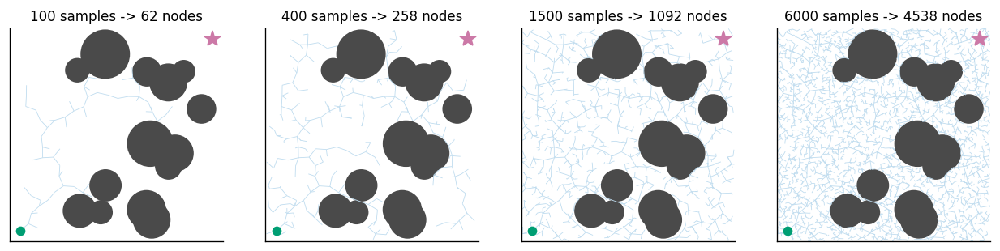
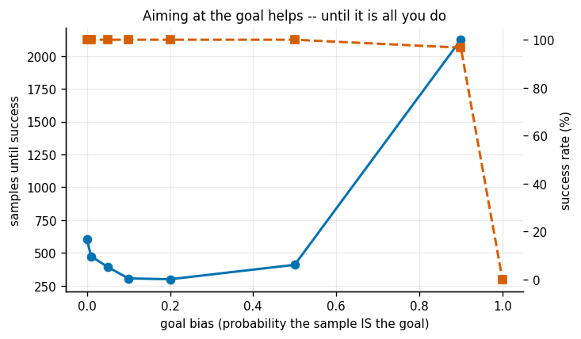
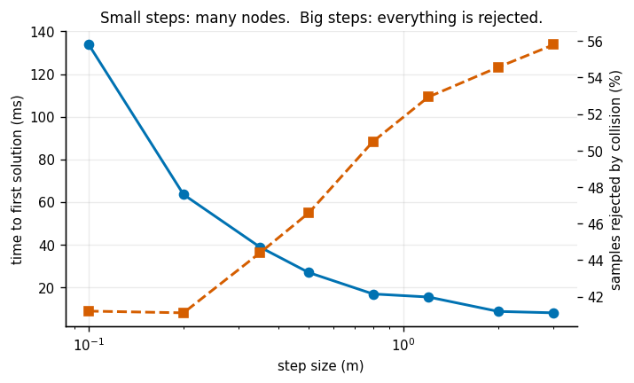
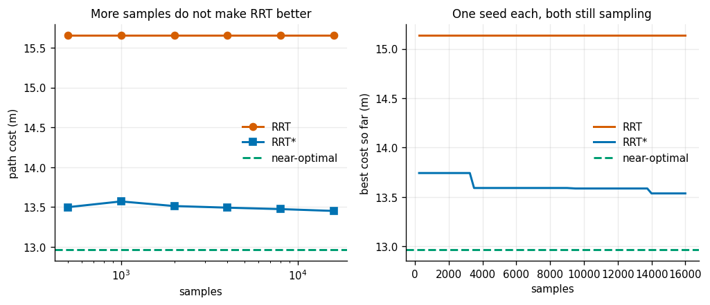
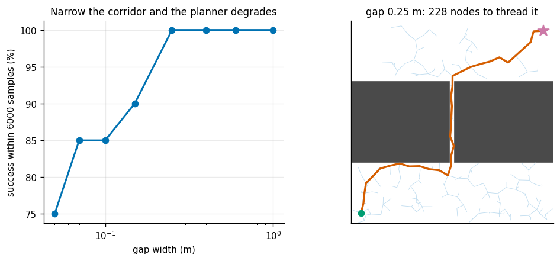
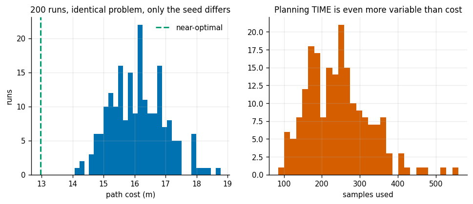
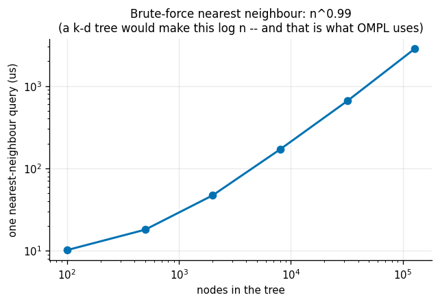

# RRT in 2D

## Key Insight

In environments with complex or continuous obstacles, grid-based path search becomes computationally intractable as dimensions rise. The [RRT (Rapidly-exploring Random Tree)](/shared/glossary/#rrt) algorithm overcomes this by building a search tree that grows rapidly toward randomly sampled configurations, avoiding the need to pre-discretize the entire space. This project grows a 2D tree around obstacles to demonstrate how sampling-based planning explores large spaces quickly, while highlighting its tendency to produce jerky, suboptimal paths that require post-processing.

**This is project 32.** It imports `grid.py` from [project 31](../31-a-star-on-a-grid/README.md) to compute a near-optimal reference cost, and its `rrt.py` is reused by [project 34](../34-shortcut-smoothing/README.md) and [project 35](../35-chomp-from-scratch/README.md).

---

## Files

| file | what it is |
|---|---|
| `rrt.py` | the 2D world, the collision oracle, RRT and [RRT-star](/shared/glossary/#rrt-star) |
| `run.py` | the seven experiments |
| `outputs/` | figures and `results.csv` |

```bash
python3 run.py      # about three and a half minutes; NumPy and Matplotlib only
```

The "robot" here is a single point in a 10 x 10 box. That sounds like a toy, and it is — but every line of `rrt.py` survives unchanged into the 7-joint arm of [project 33](../33-rrt-connect-for-an-arm/README.md). The only things that change are what "in collision" means and how many numbers are in a configuration. **That is the entire selling point of sampling-based planning: it never looks at the shape of the obstacles, only at a yes/no answer.**

---

## 1. Why "rapidly-exploring"?



The name is a claim, and it is worth understanding because nobody programmed the behaviour in.

Each iteration draws a uniformly random point, finds the *nearest existing node*, and steps a bounded distance from that node toward the sample. Now notice which node tends to be nearest to a random sample. It is almost always a node on the **frontier** of the tree, because the frontier nodes own the largest share of the surrounding space. (Formally: the tree partitions the plane into Voronoi cells, one per node, and the outermost nodes have by far the biggest cells. A uniform sample lands in a big cell more often than in a small one, so the outermost nodes get chosen more often.)

The tree therefore pulls itself outward into unexplored regions without any explicit instruction to do so. Measured on a 14-obstacle map:

| samples drawn | fraction of free space within one step of the tree |
|---|---|
| 100 | **41.5%** |
| 400 | **92.6%** |
| 1 500 | 100.0% |
| 6 000 | 100.0% |

**Four hundred samples cover 93% of the space.** Out of 6 000 samples, 4 538 became nodes — 75.6% produced a usable extension and the rest were rejected by collision.

---

## 2. Goal bias: 0% never aims, 100% is greedy, and both are bad



[Goal bias](/shared/glossary/#goal-bias) is the probability that the "random" sample is quietly replaced by the goal itself. Six maps, five seeds each:

| goal bias | success | mean samples to a solution | mean nodes | mean cost |
|---|---|---|---|---|
| 0% | 100% | 603 | 420 | 18.32 |
| 1% | 100% | 474 | 316 | 17.81 |
| 5% | 100% | 392 | 248 | 18.25 |
| 10% | 100% | 305 | 189 | 16.87 |
| **20%** | 100% | **299** | 161 | 16.81 |
| 50% | 100% | 409 | 144 | 16.22 |
| 90% | 97% | 2 124 | 151 | 16.04 |
| **100%** | **0%** | — | — | — |

**There is an interior optimum, and the collapse at the end is total rather than gradual.** At 100% bias every sample is the goal, so the tree only ever extends along the straight line toward it. The moment that line is blocked, the nearest node never changes, the same rejected extension is attempted forever, and the planner does nothing at all until it runs out of samples. This is not a slow degradation — it is 97% success at 0.9 and 0% at 1.0.

The mirror-image failure at 0% is milder but real: the tree explores the whole box beautifully and takes twice as many samples to bother arriving.

Notice also that path **cost** falls steadily as bias rises (18.3 down to 16.0). More bias means straighter paths, because more of the tree was grown pointing at the goal. So this one knob trades three things at once: samples used, nodes stored, and path quality.

---

## 3. Step size



The step is how far a single extension may travel. Six maps, four seeds:

| step (m) | nodes | samples rejected by collision | point-collision tests | cost | time |
|---|---|---|---|---|---|
| 0.10 | 868 | 41.2% | 5 807 | 17.05 | 134 ms |
| 0.20 | 452 | 41.1% | 4 403 | 17.09 | 64 ms |
| 0.50 | 171 | 46.6% | 3 686 | 17.94 | 27 ms |
| 1.20 | 76 | 52.9% | 4 044 | 17.45 | 15 ms |
| 3.00 | 36 | 55.8% | 3 992 | 17.56 | 8 ms |

Two competing effects, both visible:

- **Small steps** need many nodes to travel any distance, and every node costs a nearest-neighbour query over an ever-larger tree. Hence 134 ms at step 0.1.
- **Big steps** are rejected more often (41% rising to 56%), because a longer segment has more chances to clip something. Every rejection is wasted work.

On this map the second effect never becomes dominant, so bigger is simply better. **Do not generalise that.** The rejection rate is a function of how cluttered the world is; in a corridor of width comparable to the step, the trend reverses. The number to watch when tuning is the rejection rate, not the clock.

---

## 4. RRT never improves; RRT-star does



To compare fairly, both planners keep sampling to the same budget and we record the best goal connection either has found at each checkpoint. (Stopping RRT at its first solution would turn "RRT does not improve" into a restatement of "RRT stopped.") The reference optimum, 12.962, comes from A* on a fine grid followed by line-of-sight shortcutting — [project 31](../31-a-star-on-a-grid/README.md), experiment 7, established that this lands within a fraction of a percent of the truth.

| samples | RRT cost | over optimal | RRT-star cost | over optimal |
|---|---|---|---|---|
| 500 | 15.658 | 20.8% | 13.499 | 4.1% |
| 1 000 | 15.658 | 20.8% | 13.571 | 4.7% |
| 2 000 | 15.658 | 20.8% | 13.513 | 4.2% |
| 4 000 | 15.658 | 20.8% | 13.493 | 4.1% |
| 8 000 | 15.658 | 20.8% | 13.475 | 4.0% |
| 16 000 | **15.658** | **20.8%** | 13.452 | **3.8%** |

**Across 8 seeds and 16 000 samples, RRT improved by exactly 0.0%.** The number is not rounded — it is the same value at every checkpoint.

That is neither a bug nor bad luck. In a plain RRT every node's parent is fixed the instant the node is created, so the cost of reaching any node is frozen forever. New samples can only add new nodes; they can never make an existing route cheaper. Once some node lands close enough to the goal, the answer is decided.

[RRT-star](/shared/glossary/#rrt-star) fixes this with two extra moves per sample:

1. **choose the best parent** — attach the new node to whichever nearby node gives the cheapest total, not simply the nearest one;
2. **rewire** — check whether any nearby node would now be cheaper if it went *through* the new node, and re-parent it if so.

A beginner should ask why (2) is needed when (1) already picked the best parent. **They fix different things.** Step (1) makes the *new* node cheap given the tree as it stands. Step (2) lets an *old* node profit from information that did not exist when it was added. Without rewiring an early bad decision is permanent — which is precisely why plain RRT's line is flat.

The radius searched shrinks like `(log n / n)^(1/d)`. That is the rate that keeps the number of neighbours roughly constant as the samples get denser: wide enough to keep finding improvements, cheap enough to run forever. It is what earns RRT-star its [asymptotic optimality](/shared/glossary/#asymptotic-optimality).

**And the bill:** at 4 000 samples, RRT took 18 ms and RRT-star took 1 119 ms — **60.9x slower** for the same number of samples. That factor is why [project 34](../34-shortcut-smoothing/README.md) exists, and why its experiment 7 finds that under a tight time budget, plain RRT plus shortcutting beats RRT-star outright.

---

## 5. The narrow passage



A 4-metre-thick wall across a 10 x 10 box, with one corridor through it. Only the corridor's width changes. 20 seeds, 6 000 samples each:

| corridor width | corridor as % of free area | success | mean samples used |
|---|---|---|---|
| 1.00 m | 6.25% | 100% | 264 |
| 0.60 m | 3.85% | 100% | 511 |
| 0.40 m | 2.60% | 100% | 645 |
| 0.25 m | 1.64% | 100% | 1 317 |
| 0.15 m | 0.99% | 90% | 1 842 |
| 0.10 m | 0.66% | 85% | 2 138 |
| 0.05 m | **0.33%** | **75%** | 2 749 |

A 20x narrower corridor cost about 10x the samples and dropped success from 100% to 75%.

The wall is deliberately **thick**, and that matters. A thin wall is easy even when the gap is narrow, because the planner can step across it in one move from a node on either side. A thick wall forces several *consecutive* nodes to land inside the corridor, and the probability of that is the corridor's area fraction raised to the number of nodes needed. That is why the [narrow-passage](/shared/glossary/#narrow-passage) problem is described as exponentially hard rather than merely hard.

**Does more budget rescue it?**

| samples allowed (0.05 m corridor) | success |
|---|---|
| 6 000 | 75% |
| 20 000 | **75%** |
| 60 000 | 100% |

Tripling the budget from 6 000 to 20 000 changed nothing; another tripling to 60 000 finally cleared it. That shape — long flat stretches, then a jump — is characteristic. [Probabilistic completeness](/shared/glossary/#probabilistic-completeness) guarantees you will get there eventually; it says nothing whatsoever about when, and "eventually" here meant a 10x budget increase for a corridor a human can see at a glance.

**What actually fixes narrow passages is changing *where* you sample** — bridge sampling, obstacle-based sampling, Gaussian sampling near surfaces — or handing the problem to a [trajectory optimization](/shared/glossary/#trajectory-optimization) method, which is [project 35](../35-chomp-from-scratch/README.md).

---

## 6. Run-to-run variance: one run tells you almost nothing



The same map, the same start and goal, 200 runs differing only in the random seed:

| | cost | samples used |
|---|---|---|
| best | 14.06 (**8%** over optimal) | 85 |
| median | 16.12 (24% over) | 238 |
| worst | 18.78 (**45%** over) | 559 |

**The spread in planning time is 7x, and the spread in quality is 8% to 45% over optimal.** Reporting "my RRT found a path in 90 ms" is close to meaningless; report a distribution or report nothing.

The practical consequence is the cheapest quality improvement in this whole project:

| runs, keep the best | expected cost | over optimal |
|---|---|---|
| 1 | 16.138 | 24.5% |
| 2 | 15.620 | 20.5% |
| 5 | 15.159 | 17.0% |
| 10 | 14.866 | 14.7% |
| 20 | 14.678 | 13.2% |

**Five independent runs, keeping the best, buy 7.5 percentage points for 5x the time — and one RRT run costs 18 ms while one RRT-star run costs 1 119 ms.** The randomness that hurts you on any single run becomes an asset the moment you are allowed to run more than once.

---

## 7. Where the time goes



A 6 000-sample run takes 695 ms. Two things consume it, and neither of them is "the search".

**Collision checking: about 40%.** One segment check costs 46.4 microseconds, and the run performed 30 864 individual point-collision tests, 5.1 per sample drawn. Note what that means: the core loop is not really a graph search, it is a collision-check loop with some bookkeeping attached. [Project 33](../33-rrt-connect-for-an-arm/README.md) measures the same split on a real arm.

**Nearest-neighbour lookup: most of the rest, and it gets worse.**

| nodes in the tree | one nearest-neighbour query |
|---|---|
| 100 | 10.2 us |
| 2 000 | 46.9 us |
| 8 000 | 169.5 us |
| 32 000 | 658.2 us |
| 128 000 | **2 831.3 us** |

Fitted over `n >= 2000`, query time scales as **n^0.99** — linear, exactly as brute force over a NumPy array should. (Below 2 000 nodes the measurement is dominated by fixed NumPy call overhead, which is why the fit excludes it.)

Linear per query means **quadratic over a whole run**. A 128 000-node tree spends 2.8 ms deciding where to attach each new node, and the planner effectively stops. This is why [OMPL](/shared/glossary/#ompl) and every serious implementation ship a [k-d tree](/shared/glossary/#k-d-tree), which turns each query into roughly `log n`. It is also the single biggest difference between an RRT that feels fine in a demo and one that works in production.

---

## What to take away

1. **"Rapidly-exploring" is an emergent property, not a feature.** Nearest-neighbour extension toward uniform samples automatically favours the frontier; 400 samples covered 93% of the free space.
2. **[Goal bias](/shared/glossary/#goal-bias) has an interior optimum and a cliff at 100%.** 20% was best here; 100% solved nothing at all.
3. **RRT does not improve, ever.** Measured 0.0% improvement over 16 000 samples, because parents are never reconsidered. [RRT-star](/shared/glossary/#rrt-star) reaches 4% over optimal — at 61x the cost per sample.
4. **[Narrow passages](/shared/glossary/#narrow-passage) are the failure mode.** A corridor at 0.33% of the free area dropped success to 75%, and a 3x budget increase did not move it.
5. **A single run means nothing.** 8% to 45% over optimal on identical inputs. Best-of-5 is cheap and effective.
6. **The bottlenecks are collision checking and nearest-neighbour search**, in that order, and the second one is quadratic unless you use a [k-d tree](/shared/glossary/#k-d-tree).

## Next

[Project 33](../33-rrt-connect-for-an-arm/README.md) takes exactly this code into seven dimensions with a real collision checker, and adds the bidirectional trick that makes it practical.
