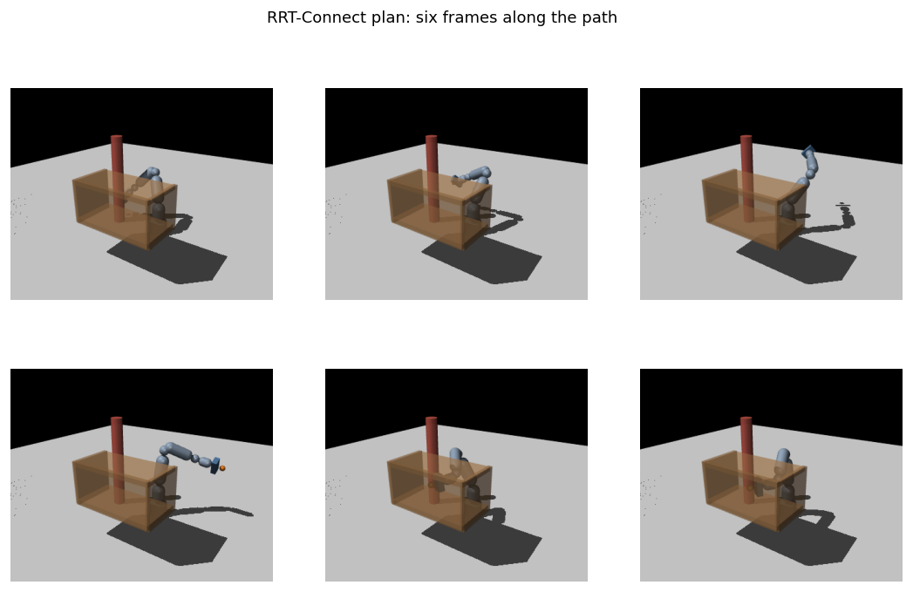
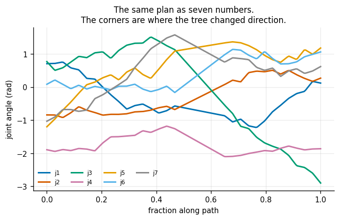
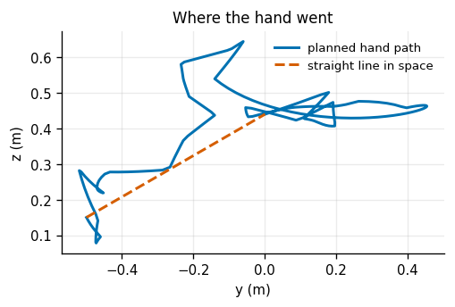
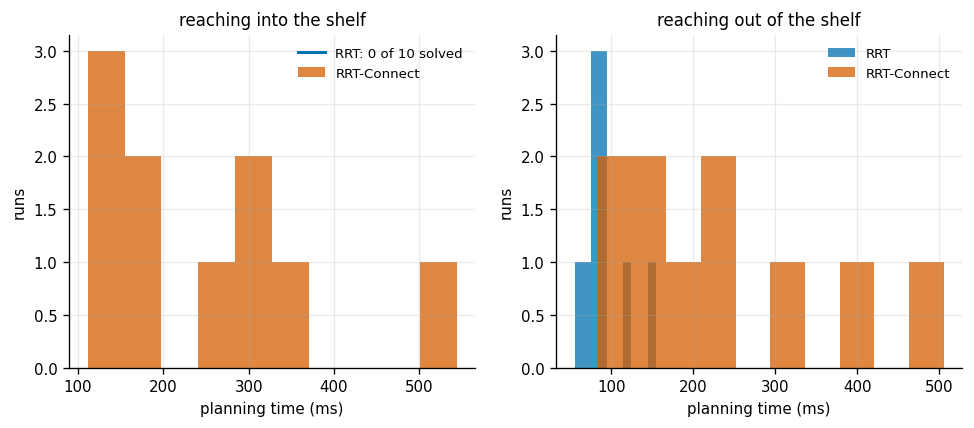
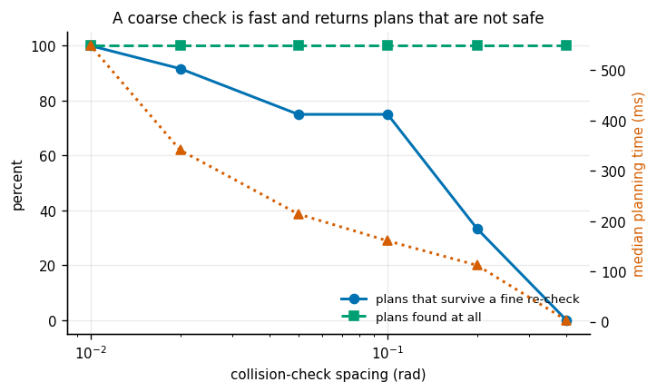
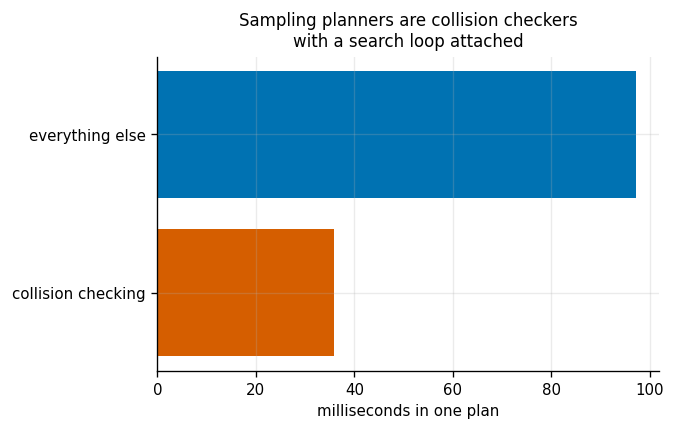
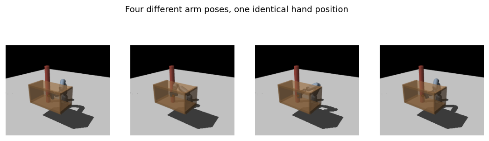
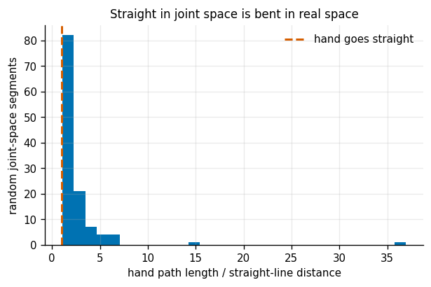
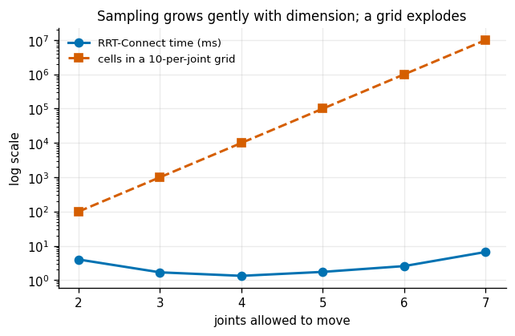

# RRT-Connect for an Arm

## Key Insight

Planning collision-free motions for high-dimensional manipulators is challenging because obstacles in the workspace form highly complex shapes in the joint [C-space](/shared/glossary/#c-space). The [RRT-Connect](/shared/glossary/#rrt-connect) algorithm solves this by growing two separate random trees—one from the start pose and one from the goal pose—and attempting to connect them in the middle at each step. This project plans a 7-[DoF (degrees of freedom)](/shared/glossary/#degrees-of-freedom) reach around a table obstacle in the [MuJoCo](/shared/glossary/#mujoco) simulator to show how bidirectional tree growth speeds up planning in cluttered, multi-joint spaces.

**This is project 33.** Its `arm.py` — the MuJoCo model, the collision oracle and both planners — is reused by [project 34](../34-shortcut-smoothing/README.md).

### Two deviations from the Key Insight, stated up front

**The obstacle is a shelf, not a bare table.** A bare table turns out to be a poor planning problem: the arm simply lifts over it, and RRT-Connect solves it on its *first sample*. A shelf — top, bottom, back and two sides, leaving only a front opening — forces the plan to reverse the hand out of a pocket before it can go anywhere. That is a genuine [narrow passage](/shared/glossary/#narrow-passage) in joint space, and it is what makes the problem worth planning at all.

**"Bidirectional tree growth speeds up planning" is only half true, and experiment 2 measures the other half.** On this scene RRT-Connect is not a constant-factor improvement over plain RRT. In one direction it is 2.5x *slower*. In the other direction plain RRT does not solve the problem at all, ever, and RRT-Connect solves it every time in 221 ms. Which of those you see depends on which end sits inside the pocket.

---

## Files

| file | what it is |
|---|---|
| `arm.py` | the 7-joint MuJoCo model, joint limits, collision oracle, IK, RRT and RRT-Connect |
| `run.py` | the seven experiments |
| `outputs/` | figures and `results.csv` |

```bash
python3 run.py      # about five minutes; needs mujoco, NumPy, Matplotlib
```

---

## What the planner actually needs from a robot

Exactly three things:

1. the **joint limits**, so it knows what to sample;
2. a **yes/no answer** to "is this configuration in collision?";
3. **forward kinematics**, so it can tell you where the hand ended up.

MuJoCo supplies all three, and we use it for nothing else — no physics, no integration, no contact forces. `mj_kinematics` places the links, `mj_collision` runs the broad and narrow phase, and `data.ncon > 0` means something overlaps.

A beginner may reasonably ask: **why drag a whole physics engine in just to answer a yes/no question?** Because the yes/no question is the expensive, fiddly part. It needs every link's pose (forward kinematics), a bounding-volume pass to skip the 90% of geometry pairs that are obviously far apart, and an exact test on the rest. MuJoCo has a tuned C implementation of all of it; writing our own would *be* the project, and would teach nothing about planning.

One detail from the model file matters. Neighbouring links share a joint, so their geometry touches by design — the model therefore excludes those pairs from collision checking. Every real robot description does this; without it the arm would report itself in collision while standing perfectly still. What is *not* excluded is link 1 against link 6, link 2 against the tool, and so on. Those are the self-collisions a planner genuinely has to avoid, and they stay switched on.

---

## 1. The scene, and a plan through it



Seven revolute joints, limits spanning 5.8 / 3.8 / 5.8 / 2.7 / 5.8 / 3.8 / 5.8 radians. The start pose puts the hand out at a drop-off point past a post; the goal pose puts it inside the shelf at (0.50, 0.00, 0.44) m. Both were found by damped least-squares IK — the same method as [project 05](../05-damped-least-squares-ik/README.md), re-implemented here on MuJoCo's [Jacobian](/shared/glossary/#jacobian).

| | |
|---|---|
| straight joint-space line from start to goal collision-free? | **False** — the whole reason a planner is needed |
| RRT-Connect | 801 iterations, 379 nodes, 4 755 collision queries, **136 ms** |
| the plan | 37 waypoints, cost 13.70 rad |



The joint plot is worth staring at. Seven curves, each piecewise linear, with corners wherever the tree changed direction. There is nothing smooth about it and nothing minimal — this is the raw output of a random process, and cleaning it up is entirely [project 34](../34-shortcut-smoothing/README.md)'s job.



---

## 2. RRT against RRT-Connect — in both directions



The same two configurations, 8 000 samples, 10 seeds, planned each way round.

**Reaching INTO the shelf** (start in open space, goal in the pocket):

| planner | success | median time | median nodes | median collision queries | median cost |
|---|---|---|---|---|---|
| RRT (5% goal bias) | **0%** | — | — | — | — |
| RRT-Connect | **100%** | 221 ms | 606 | 7 744 | 14.06 |

**Reaching OUT of the shelf** (the identical problem, reversed):

| planner | success | median time | median nodes | median collision queries | median cost |
|---|---|---|---|---|---|
| RRT (5% goal bias) | 100% | **84 ms** | 103 | 2 764 | **13.54** |
| RRT-Connect | 100% | 212 ms | 590 | 7 606 | 15.82 |

Read the two tables together, because neither is the whole story.

**Outward, plain RRT wins on every axis.** It is 2.5x faster, builds 5.7x fewer nodes, and its path is 14% shorter. RRT-Connect's greedy inner loop — keep stepping in the same direction as long as it is legal — burns 2.8x the collision queries, and on an easy problem that is pure overhead.

**Inward, plain RRT scores zero out of ten.** This is the result that matters, and the reason is geometric. A single tree rooted in open space has to *hit the goal configuration*, and a configuration is a point — points have no volume. [Goal biasing](/shared/glossary/#goal-bias) helps only while the straight line toward the goal is clear, and here it runs into the shelf's front lip. Meanwhile the tree explores the enormous open region and essentially never threads the pocket by luck.

RRT-Connect converts "hit this point" into "meet somewhere". The goal tree starts *inside* the pocket, so the difficult part of the space is explored from the inside out by a tree that has no choice but to be there. The two trees then only have to find each other's frontier, not a point.

**The transferable lesson:** bidirectional planning is not a constant-factor speed-up you sprinkle on for performance. It changes which problems are solvable at all, and the hard direction is the one whose *endpoint* sits in the confined region. If you ever meet a planner that works one way round and not the other, that asymmetry is the diagnosis.

---

## 3. Collision-check resolution: the setting that silently ships broken plans



A collision check on a *segment* is not continuous. We sample the segment every `res` radians and test those points, and everything in between is assumed safe. Twelve seeds per row, and each returned plan is then re-verified at a very fine 0.005 rad:

| check spacing | success | median time | median queries | **plans that survive the fine re-check** |
|---|---|---|---|---|
| 0.40 rad | 100% | **3 ms** | 99 | **0%** |
| 0.20 rad | 100% | 113 ms | 3 135 | 33% |
| 0.10 rad | 100% | 161 ms | 4 908 | 75% |
| 0.05 rad | 100% | 214 ms | 7 568 | 75% |
| 0.02 rad | 100% | 341 ms | 15 008 | 92% |
| 0.01 rad | 100% | 549 ms | 27 410 | **100%** |

**At 0.4 rad the planner is 70x faster and 100% of its plans are garbage.** It reports success, returns a well-formed path, and every one of those paths drives the arm through the shelf between two sample points.

This is the most dangerous line in the whole of Phase 5, because every symptom points the wrong way. The success rate is 100% at every resolution. The planner does not warn you. The paths look plausible when plotted. The only thing that reveals it is checking the answer with a different, finer instrument — which is exactly what the last column does.

Two practical rules follow. **Set the spacing from your geometry, not from your patience**: it must be smaller than the thinnest obstacle feature you care about, measured in the space where the check happens. And **verify plans with a finer checker than the one that produced them** — cheap, and the only defence against an error that is invisible from the inside.

---

## 4. Where the time actually goes



| | |
|---|---|
| one collision query (`mj_kinematics` + `mj_collision`) | 7.5 us |
| forward kinematics alone | 2.2 us |
| a full plan | 4 755 queries in 133 ms |
| **share of the run spent collision checking** | **27%** |
| nodes actually kept in the tree | 379 |
| **collision queries per node kept** | **13** |

Two things to notice.

**Thirteen collision queries produce one node.** Most of the work is checking segments that get rejected, or checking the intermediate points of segments that get accepted. The tree — the part that looks like an algorithm — is a small minority of the effort.

**Collision checking is 27% here rather than the 90% often quoted**, and the reason is that most of the rest is the same brute-force nearest-neighbour scan [project 32](../32-rrt-in-2d/README.md) measured at `n^0.99`. On a larger problem, with a [k-d tree](/shared/glossary/#k-d-tree) in place, the collision share rises toward that 90% figure. The general point survives either way: **a sampling-based planner is a collision checker with a search loop attached**, and if you want it faster, make the collision checker faster.

---

## 5. Planning to a goal SET instead of a goal POINT



The hand target is a point in space — three numbers. The arm has seven joints. That leaves a four-dimensional family of configurations that all put the hand in exactly the same place: the [null space](/shared/glossary/#null-space) that [project 06](../06-null-space-posture-control/README.md) exploited for posture control.

Running IK from random starting configurations found **8 distinct collision-free solutions in 21 attempts**. Then, planning to the first *k* of them and keeping the best result:

| goals offered | success | median total time | median path cost |
|---|---|---|---|
| 1 | 100% | 237 ms | 14.88 |
| 2 | 100% | 579 ms | 14.42 |
| 4 | 100% | 993 ms | 12.65 |
| **8** | 100% | 1 991 ms | **10.20** |

**Eight goals cut the path cost by 31%.** The reason is not subtle: some IK solutions are far easier to reach from the start than others, and picking one arbitrarily — which is exactly what "run IK, then plan" does — throws that choice away.

Note the honest accounting. This implementation charges the *full* cost of planning to every goal separately, so eight goals cost 8.4x the time. A real implementation seeds a single goal tree with all eight configurations at once, which costs barely more than one because the trees share all their exploration. The 31% is real; the 8.4x is an artefact of the simple version.

---

## 6. C-space is not workspace



Everything above planned in *joint* space, where a straight line is the simplest possible motion. Here is what a straight line in joint space does in the real world, over 120 random pairs of configurations:

| | |
|---|---|
| hand path length / straight-line distance, median | **1.85x** |
| ... worst case | 36.96x |
| how far the hand strays from the straight line, median | **38 cm** |
| ... worst | 104 cm |

**A "straight" joint-space move sweeps the hand along a curve nearly twice as long as it needs to be, bulging up to a metre off course.** Every joint rotates at a constant rate simultaneously; the hand's motion is the composition of seven rotations, and nothing about that composition is straight.

This is the concrete meaning of "C-space is not workspace", and it cuts both ways:

| | |
|---|---|
| a straight JOINT-space move between two random free poses is collision-free | 62% of the time |
| a straight TASK-space move (running IK at every step) succeeds | 67% of the time |

Roughly a tie. Which one you want depends on the task, not on which is "better": carrying a full glass of water needs the task-space version, dodging clutter needs whichever happens to be free. The reason nearly all arm planners work in joint space anyway is that a joint-space line is always *executable* — every point on it is a valid set of joint angles — whereas a task-space line can wander outside the arm's reach or through a singularity, where IK simply has no answer.

---

## 7. Dimensionality: why nobody puts a grid on a 7-joint arm



Lock the joints past `k` and plan between random free configurations of the remaining `k`:

| joints free | median time | median nodes | success | cells in a 10-steps-per-joint grid |
|---|---|---|---|---|
| 2 | 4.0 ms | 21 | 90% | 100 |
| 3 | 1.7 ms | 12 | 90% | 1 000 |
| 4 | 1.3 ms | 12 | 100% | 10 000 |
| 5 | 1.7 ms | 15 | 100% | 100 000 |
| 6 | 2.6 ms | 18 | 100% | 1 000 000 |
| 7 | 6.6 ms | 30 | 100% | **10 000 000** |

Each row plans between its *own* random pairs, so a row being slightly out of order is sampling noise rather than a trend. Comparing 3 joints with 7: the planner costs **3.9x** more time; a grid would cost **10 000x** more cells.

And 10 steps per joint is a laughably coarse grid — 36 degrees of resolution, enough to miss the shelf opening entirely. At 1 degree it would be `360^7 = 7.8e17` cells.

This is the whole argument for sampling. A grid's cost is set by the *dimension of the space*; a sampling planner's cost is set by how hard the *particular problem* is. The 7-joint arm above needed 30 nodes. It never had to represent the space, only the answer.

---

## What to take away

1. **A planner needs three things from a robot**: limits, a collision oracle, forward kinematics. Everything else is the planner's business.
2. **Bidirectional planning is not a speed-up, it is a different capability.** Same two poses: outward, plain RRT is 2.5x faster; inward, plain RRT scores 0/10 and RRT-Connect scores 10/10.
3. **Collision-check spacing is a correctness setting.** At 0.4 rad, 100% of "successful" plans failed a fine re-check. Always re-verify with a finer checker.
4. **The planner is a collision checker.** Thirteen queries per node kept; make the checker faster and the planner gets faster.
5. **Plan to a goal set, not a goal point.** Eight IK solutions instead of one cut path cost 31%.
6. **Straight in joint space is bent in real space** — 1.85x longer, straying 38 cm. Know which space your task's constraints live in.
7. **Sampling scales with problem difficulty, not with dimension.** Three to seven joints cost 3.9x more planning time, and would have cost a grid 10 000x more cells.

## Next

[Project 34](../34-shortcut-smoothing/README.md) takes the jagged plans produced here and cleans them up — and measures precisely what smoothing can and cannot fix.
