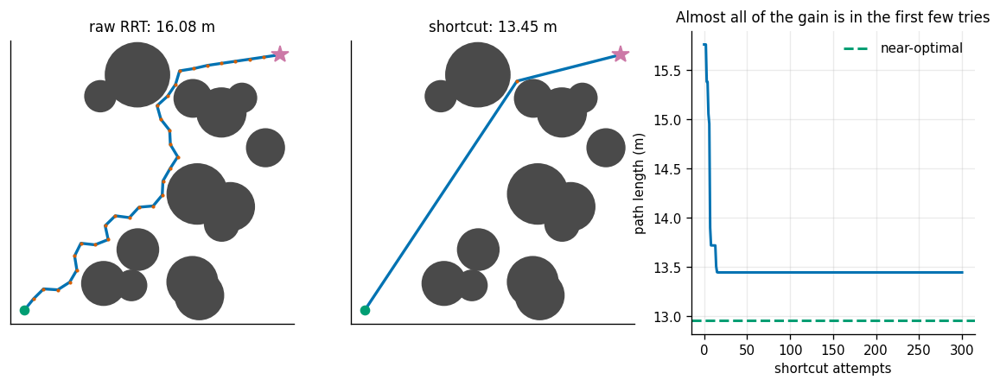
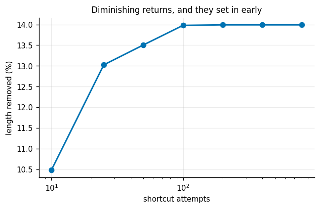
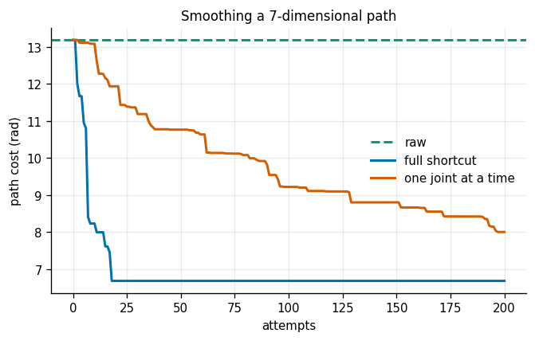
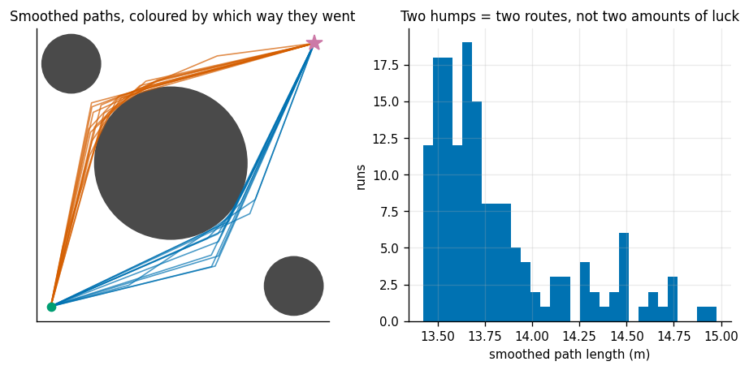
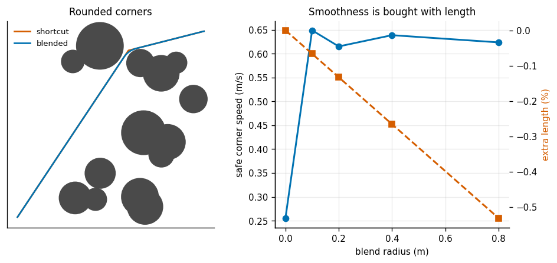
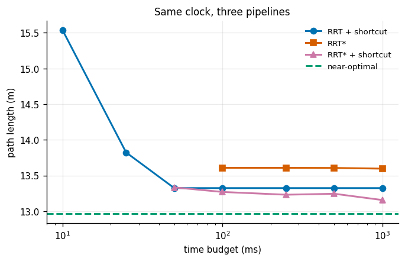

# Shortcut Smoothing

## Key Insight

Because sampling-based planners like [RRT](/shared/glossary/#rrt) select random directions, the raw paths they produce are jagged, jerky, and inefficient for real motors to execute. Shortcut smoothing is a simple post-processing technique that randomly picks two distant points along the planned path and attempts to connect them with a straight line in [C-space](/shared/glossary/#c-space). This project implements this shortcutting pass to show how iteratively replacing jagged segments with collision-free shortcuts reduces overall path length and removes unnecessary joint movements.

**This is project 34.** It imports `rrt.py` from [project 32](../32-rrt-in-2d/README.md), `grid.py` from [project 31](../31-a-star-on-a-grid/README.md) and `arm.py` from [project 33](../33-rrt-connect-for-an-arm/README.md); its own `smooth.py` is reused by [project 35](../35-chomp-from-scratch/README.md) and [project 36](../36-topp/README.md).

---

## Files

| file | what it is |
|---|---|
| `smooth.py` | resampling, full and partial shortcutting, corner blending, curvature and homotopy measures |
| `run.py` | the seven experiments |
| `outputs/` | figures and `results.csv` |

```bash
python3 run.py      # about five minutes; needs mujoco (experiment 3), NumPy, Matplotlib
```

---

## Why something this crude works

The algorithm is three lines: pick two points along the path at random; if the straight line between them is collision-free, throw away everything in between; repeat.

That looks far too simple to be the industry-standard answer, and the reason it works is an **asymmetry between the wins and the losses**. A successful shortcut is a permanent improvement that no later attempt can undo. A failed attempt costs one collision check and nothing else. You are buying lottery tickets whose losses are tiny and whose wins never expire.

One implementation detail is worth explaining, because it looks redundant. Before shortcutting we **re-space** the path so that consecutive points are a fixed distance apart. The path already describes exactly the same geometry, so why add points? Because a shortcut must be allowed to *start and end in the middle of a segment*. A raw RRT path stores only its corners, so an algorithm that can only pick existing waypoints can only cut corners — never slide along an edge to find a better anchor. Re-spacing turns "pick two waypoints" into "pick two points anywhere on the path" without writing any extra code.

---

## 1. Before and after



One RRT path on a 14-obstacle map, 300 shortcut attempts:

| | length | waypoints |
|---|---|---|
| raw RRT path | 16.081 m | 34 |
| after shortcutting | **13.447 m** | **3** |
| near-optimal (A* + line of sight) | 12.962 m | — |

**16.4% of the length removed, and 84% of the gap to optimal closed** — by an algorithm that knows nothing about the obstacles and never looks at a gradient.

And it happens almost immediately:

| shortcut attempts | share of the total improvement achieved |
|---|---|
| 5 | 30.4% |
| 10 | **88.1%** |
| 25 | **100.0%** |
| 300 | 100.0% |

The first ten attempts do nearly all the work, and after twenty-five nothing further is found at all. That is the shape to expect: early attempts span long stretches of a very inefficient path and almost always succeed; once the path is nearly straight there is nothing left to cut.

---

## 2. The two settings that matter



Eight maps, mean over all of them.

**How many attempts:**

| attempts | length removed | time |
|---|---|---|
| 10 | 10.48% | 1.3 ms |
| 25 | 13.02% | 3.6 ms |
| 100 | 13.98% | 19.1 ms |
| **200** | **13.99%** | 41.1 ms |
| 800 | 13.99% | 176.8 ms |

Everything after 100 attempts is wasted: four times the time for 0.00 percentage points. If you are tuning this, the number to set is "enough", and enough is startlingly small.

**How finely to re-space:**

| spacing | length removed | points on the path | time |
|---|---|---|---|
| raw waypoints (no re-spacing) | 13.21% | 36 | 41.3 ms |
| 2.00 m | 15.00% | 10 | 42.2 ms |
| 0.50 m | 14.11% | 35 | 43.9 ms |
| 0.25 m | 13.99% | 68 | 41.4 ms |
| 0.10 m | 15.70% | 167 | 41.4 ms |

**Spacing barely matters, and the small differences here are noise across eight maps rather than a trend.** Nor does it cost anything — the time is flat at about 41 ms, because the expense is in the collision checks and the number of attempts is fixed. This is a genuinely null result and worth knowing: people spend effort tuning this parameter, and on problems like these it does not pay.

---

## 3. A 7-joint arm: full shortcuts against one-joint shortcuts



Eight RRT-Connect plans from [project 33](../33-rrt-connect-for-an-arm/README.md), mean raw cost 14.373 rad. 200 attempts each:

| method | length remaining | removed | attempts accepted | time |
|---|---|---|---|---|
| **full shortcut** (all 7 joints) | 0.491 | **50.92%** | **6.4%** | 291 ms |
| one joint at a time | 0.565 | 43.46% | **38.7%** | 384 ms |
| both, 100 attempts each | **0.487** | 51.34% | — | — |

**Half the path length disappears.** That is far more than the 14% removed in 2D, and it tells you something about what RRT-Connect produces: its greedy inner loop chases random samples a long way before turning back, so its raw output is much more wasteful than a plain RRT's.

The partial-shortcut comparison is an honest inversion of the usual claim. Partial shortcutting straightens *one* joint at a time and leaves the other six on their existing safe motion. The textbook argument is that on a high-DoF arm a full shortcut is rejected as soon as *any* one joint's motion would clip something, so the partial version should win. **The acceptance rates confirm the mechanism exactly — 38.7% against 6.4%, six times as many attempts succeed — and the partial version still removes less total length.** Per successful attempt it simply achieves much less, and here that term dominates.

The right reading is not "partial shortcutting is worse". It is that the product `acceptance rate x size of each win` is what matters, and which term dominates is a property of the problem, not of the algorithm. Running both — 100 attempts of each — was best of all, and costs nothing extra to implement.

---

## 4. What shortcutting cannot fix: the route it was handed



One fat obstacle nudged slightly off the diagonal, so there are two sensible ways round and one of them is genuinely shorter. 160 RRT runs, each smoothed with 300 attempts:

| route taken | runs | share | smoothed cost |
|---|---|---|---|
| above-left | 146 | 91% | **13.731 ± 0.254 m** |
| below-right | 14 | **9%** | **14.613 ± 0.165 m** |

**The good route is 6.4% shorter, roughly one run in ten commits to the bad one, and no amount of shortcutting turns one into the other.** Checked directly: across 60 runs, the number of paths that changed route during smoothing was **0 out of 60**.

The reason is topological, not numerical. Two paths belong to the same [homotopy class](/shared/glossary/#homotopy-class) if you can bend one into the other without ever crossing an obstacle. Shortcutting only ever replaces a piece of path with a *collision-free* straight line, so every step it takes stays inside the class it started in. It cannot cross the obstacle, so it cannot switch sides.

The histogram shows the consequence: two humps, not one broad distribution. The spread within each hump is luck; the gap between them is a decision the planner made in its first few hundred samples and can never revisit.

**This is the argument for re-planning rather than polishing.** [Project 32](../32-rrt-in-2d/README.md), experiment 6, found that best-of-5 RRT runs beat a single run by 7.5 percentage points — and this is why. Different runs land in different classes; different smoothing seeds do not.

---

## 5. The bill

Eight maps. What planning cost, and what smoothing cost:

| | point-collision tests | time |
|---|---|---|
| RRT planning | 2 748 | 20.2 ms |
| shortcutting (200 attempts) | **73 247** | 38.3 ms |

**Smoothing performs 27x more collision tests than the planning did, and takes 1.9x the time.**

That surprises people, and the explanation is geometric. One RRT extension checks a segment of length `step` — half a metre. One shortcut attempt checks a segment spanning a large fraction of the whole path — several metres. Longer segment, more sample points, more tests.

The practical consequence is that "plan then smooth" is not free polish tacked onto the end. It is comfortably the larger half of the pipeline, and it is where you should look first when a planner is too slow. (This is also why experiment 2's finding that 100 attempts is enough matters so much: it is the difference between 19 ms and 177 ms.)

---

## 6. The corners it leaves behind



A shortcut path is straight lines meeting at sharp corners. Sharp corners have a problem no length metric can see: following one exactly requires changing direction instantly, which needs infinite acceleration, so in practice the robot has to stop dead at every corner.

Measuring the tightest bend anywhere on the path (the radius of the circle through three consecutive points), and the fastest a robot with 2 m/s² of sideways grip could take it:

| corner blend radius | length | tightest bend | safe speed through it |
|---|---|---|---|
| **0.00 m** (raw shortcut) | 13.447 m | **0.0326 m** | **0.26 m/s** |
| 0.10 m | 13.438 m | 0.2107 m | 0.65 m/s |
| 0.20 m | 13.429 m | 0.1893 m | 0.62 m/s |
| 0.40 m | 13.411 m | 0.2041 m | 0.64 m/s |
| 0.80 m | **13.375 m** | 0.1946 m | 0.62 m/s |

**Rounding the corners made the path 0.27% SHORTER, not longer, and took the safe corner speed from 0.26 m/s to 0.64 m/s** — 2.5x faster through the tightest bend.

The "shorter" is not a mistake. A quadratic Bézier that rounds a corner cuts *inside* it; you save more by cutting the apex than you pay by curving. Rounding corners is one of the rare free lunches in this phase.

The plateau past 0.1 m is a limit of the geometry, not of the method: `blend_corners` caps the arc radius at 45% of the shorter adjacent segment, and the tightest corner on this path has short segments on both sides, so asking for a bigger radius changes nothing there.

Note that "sharpest turn angle" — the obvious metric — is *the wrong one*, and the code says so. The angle between consecutive segments depends on how finely the path happens to be stored; the turning radius does not. Measuring the angle on this path gives 42 degrees before blending and 6 degrees after, which sounds impressive and is mostly an artefact of the blend adding points.

[Project 36](../36-topp/README.md) takes these corner speeds and turns them into actual traversal times.

---

## 7. RRT + shortcut, or RRT-star, for the same time?



The practical question. Given a fixed wall-clock budget, is it better to run a cheap planner and spend the rest smoothing, or to run an expensive planner that improves as it goes? Near-optimal is 12.962 m; six seeds per budget:

| budget | RRT + shortcut | RRT-star | RRT-star + shortcut |
|---|---|---|---|
| 10 ms | 15.539 | **no solution** | — |
| 25 ms | 13.823 | **no solution** | — |
| 50 ms | **13.324** | **no solution** | 13.334 |
| 100 ms | **13.324** | 13.608 | 13.270 |
| 250 ms | **13.324** | 13.608 | 13.231 |
| 1 000 ms | 13.324 | 13.596 | **13.157** |

Three findings, in order of usefulness.

**Under a tight budget, RRT + shortcut wins outright.** At 50 ms it is 2.8% above optimal while RRT-star has not returned anything at all. [Project 32](../32-rrt-in-2d/README.md) measured RRT-star at 61x the cost per sample; that factor has to be paid before its first answer exists.

**RRT + shortcut plateaus, and RRT-star does not.** The middle column is flat from 50 ms onward, because the smoothing has already extracted everything available inside its [homotopy class](/shared/glossary/#homotopy-class) (experiment 1: 25 attempts was enough) and the class is fixed. RRT-star keeps creeping down. Give it long enough and it wins.

**The best answer is both.** RRT-star's output is itself worth smoothing — the rewiring makes it near-optimal *within the tree*, and shortcutting removes the residue that the tree structure imposes. 13.157 m at one second, the best number in the table.

The general lesson of this table is the one the Phase 5 guide states as its Key Insight: sampling explores globally and optimises badly; optimisation refines locally and explores not at all. **Real systems chain them, and which order and how much of each is a budget question with a measurable answer.**

---

## What to take away

1. **Shortcutting is absurdly effective for how simple it is** — 16% of the length in 2D, 51% on a 7-joint arm, from three lines of code.
2. **Almost all of the gain arrives in the first 10-25 attempts.** Everything after 100 is waste.
3. **The re-spacing parameter did not matter.** A genuine null result; do not spend time on it.
4. **Partial (one-joint) shortcutting accepts 6x more attempts and still removes less length.** Acceptance rate times win size is what counts; run both.
5. **Smoothing costs more than planning** — 27x the collision tests, 1.9x the time.
6. **Shortcutting cannot change [homotopy class](/shared/glossary/#homotopy-class).** One run in ten was stuck 6.4% worse, and 0 of 60 escaped. Re-plan instead of polishing harder.
7. **Round the corners.** Free in length, 2.5x in corner speed.
8. **Under a tight budget, cheap planner plus smoothing beats an anytime-optimal planner.** Given a second, run both.

## Next

[Project 35](../35-chomp-from-scratch/README.md) replaces this random post-process with a gradient: a continuous optimizer that pushes the whole trajectory away from obstacles at once.
