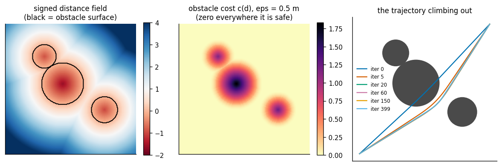
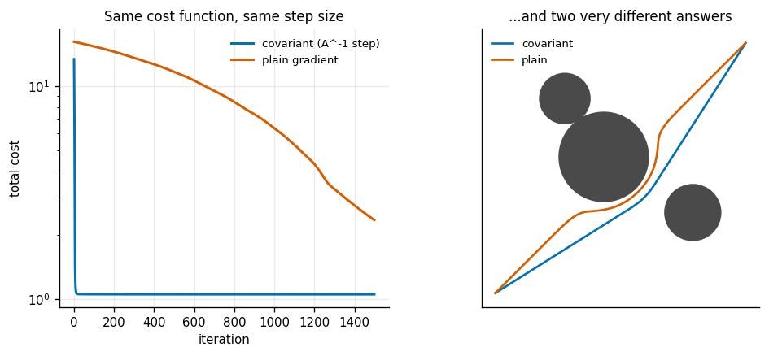
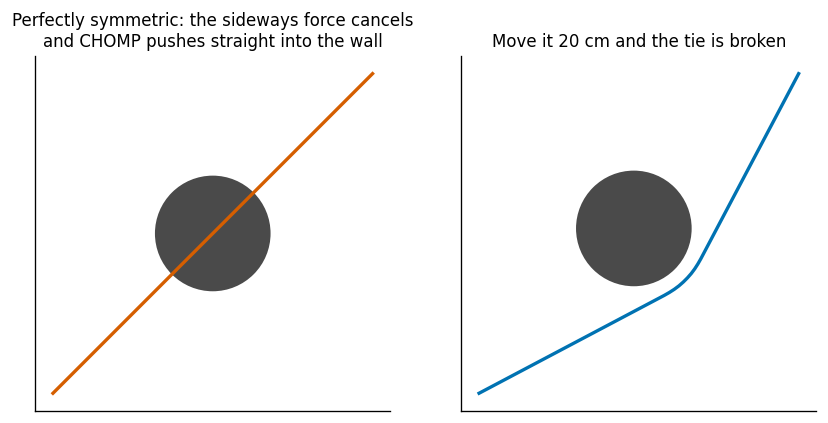
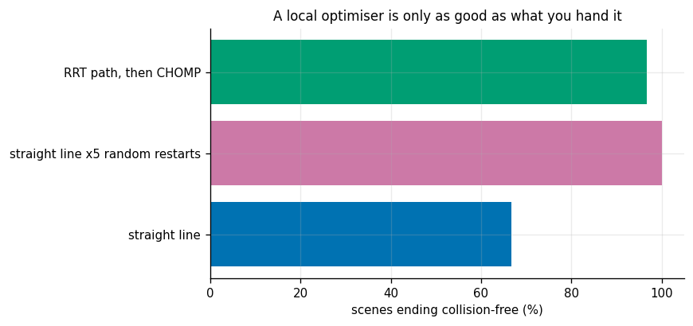
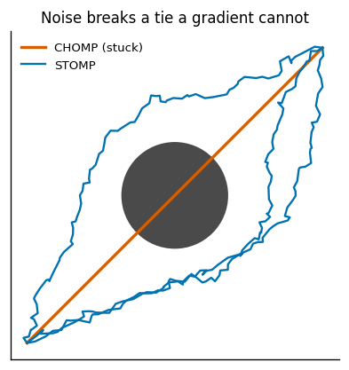
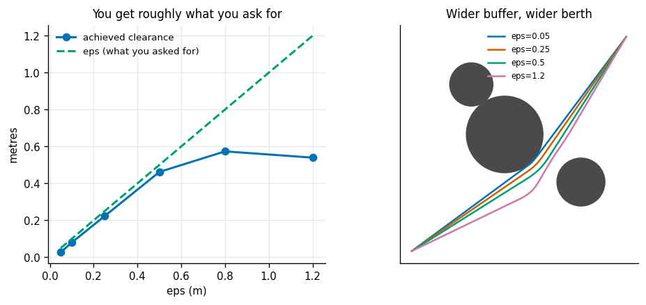
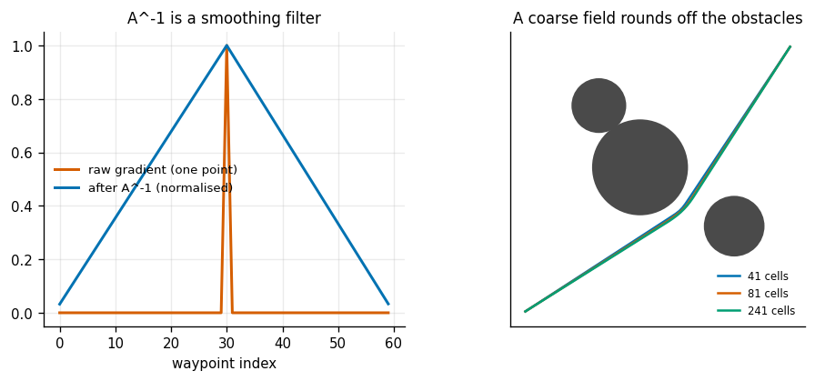

# CHOMP from Scratch

## Key Insight

Instead of separating path search from path smoothing, [trajectory optimization](/shared/glossary/#trajectory-optimization) formulates motion planning as a continuous mathematical minimization problem. [CHOMP](/shared/glossary/#chomp) uses functional gradient descent to optimize an initial trajectory, pulling it away from obstacles using the gradient of a [Signed Distance Field (SDF)](/shared/glossary/#sdf) while simultaneously minimizing joint velocity and acceleration. This project implements CHOMP on a 2D grid to show how gradient descent can smoothly guide a path out of collision, while exploring how the optimizer can get trapped in local minima.

**This is project 35.** It imports `rrt.py` from [project 32](../32-rrt-in-2d/README.md) and `smooth.py` from [project 34](../34-shortcut-smoothing/README.md).

---

## Files

| file | what it is |
|---|---|
| `chomp.py` | exact distance transform, the SDF, the CHOMP update, and a gradient-free [STOMP](/shared/glossary/#stomp) for comparison |
| `run.py` | the seven experiments |
| `outputs/` | figures and `results.csv` |

```bash
python3 run.py      # about three minutes; NumPy and Matplotlib only
```

---

## Decoding the name

**CHOMP** = *Covariant Hamiltonian Optimization for Motion Planning* (Ratliff et al., 2009). Two of those words carry the whole idea.

**"Optimization"** — the trajectory is not searched for, it is *improved*. You hand CHOMP a complete, probably terrible trajectory and it walks downhill. There is no tree, no sampling, no notion of exploring. This is the opposite end of the spectrum from [projects 32 and 33](../32-rrt-in-2d/README.md).

**"Covariant"** — the downhill direction is measured with a ruler that understands *trajectories*, rather than one that treats the N waypoints as N unrelated points. This is the part that makes it work, and experiment 2 measures exactly how much it is worth. ("Hamiltonian" refers to the Hamilton-Jacobi framing used in the original derivation; nothing in the code needs it.)

---

## 1. The signed distance field, and a line pushed out of collision



A [Signed Distance Field](/shared/glossary/#sdf) stores, at every point, the distance to the nearest obstacle surface — **positive outside** an obstacle and **negative inside** it. Two properties make it the right data structure here:

1. it is defined *everywhere*, including deep inside an obstacle, so a trajectory that starts in collision still gets told which way is out;
2. its gradient points directly away from the nearest surface, so "push the trajectory out of collision" becomes one subtraction.

A beginner should ask: **the occupancy grid from [project 27](../27-particle-filter/README.md) already says where the obstacles are — why build a second map?** Because an occupancy grid answers "blocked?" with a yes or a no, and a yes carries neither a direction nor a magnitude. Gradient descent needs something to descend, and a bare yes/no has no slope anywhere except an infinite one at the boundary. The SDF is the same information turned into a smooth, differentiable surface. That conversion is the enabling step for every optimization-based planner.

We build it with the exact Felzenszwalb-Huttenlocher [distance transform](/shared/glossary/#distance-transform): one sweep along the rows, one along the columns, tracking the lower envelope of one parabola per candidate source. Exact and linear time — 896 ms for a 241 x 241 field in plain Python.

| | |
|---|---|
| field range | −1.58 m (deep inside) to 5.65 m (far outside) |
| straight-line start | 12.735 m long, **0.699 m deep inside an obstacle** |
| collision-free after | **5 iterations** |
| final | 13.020 m long, 0.466 m clearance |

**The obstacle cost has three pieces**, and the reason for each is worth stating:

```
  d < 0          c = -d + eps/2            grows without limit inside an obstacle
  0 <= d < eps   c = (d - eps)^2 / (2 eps) a soft buffer, smoothly reaching zero
  d >= eps       c = 0                     far away, no opinion at all
```

The middle piece is what makes the whole thing differentiable. A cost that jumped straight from "0" to "huge" at the surface would have an infinite gradient exactly at the surface and none anywhere else — useless for gradient descent. The quadratic ramp gives a gradient that grows steadily as the robot approaches, so the trajectory starts turning away *before* it touches anything.

---

## 2. What "covariant" buys



The plain gradient of the cost tells you how to move each waypoint to reduce cost fastest — treating the waypoints as N independent points. CHOMP instead multiplies that gradient by `A^-1`, where `A = K'K` is built from the finite-difference operator `K`. The identical cost function, the identical step size, one matrix multiply different:

| 1/step size | covariant: iterations to collision-free | final length | curvature | plain: iterations | final length | curvature |
|---|---|---|---|---|---|---|
| 500 | **11** | 13.021 | 0.0006 | **never** | 12.832 | 0.0036 |
| **200** | **5** | 13.021 | 0.0006 | **1 257** | 13.268 | 0.0082 |
| 100 | 3 | 13.021 | 0.0006 | 629 | 13.428 | 0.0087 |
| 50 | 2 | 13.021 | 0.0006 | 315 | 13.311 | 0.0055 |
| 20 | 1 | 13.037 | 0.0006 | 127 | 13.155 | 0.0025 |

**At the same step size, covariant is collision-free in 5 iterations and plain takes 1 257 — 251x.** At each method's own best setting the ratio is still 127x. And the plain version's answer is worse: 3 to 14 times the curvature, and a longer path.

Why. Experiment 7 shows the mechanism directly: feed a single-waypoint "kick" through `A^-1` and it spreads over **58 waypoints instead of 1**.

That is the entire trick. The plain gradient says "move waypoint 40 sideways", which creates a kink — and the smoothness term then spends hundreds of iterations ironing that kink back out, largely undoing the obstacle progress. `A^-1` converts "move this point" into "move this *stretch* of trajectory", so every step is already smooth and nothing has to be undone.

The word "covariant" means the update does not depend on how you happened to parameterise the trajectory. Double the number of waypoints and the plain gradient's steps change size; the covariant one takes the same path.

---

## 3. Local minima: the one you can see coming, and the one you cannot



**The visible one.** Put a circular obstacle exactly on the straight line between start and goal. After 1 500 iterations the trajectory is still **1.52 m deep inside it**, and the run reports itself in collision.

It is not stuck for lack of effort. It is stuck because the problem is *symmetric*: the push to the left and the push to the right are exactly equal, so they cancel, and the only force left is the one squashing the trajectory straight into the obstacle's centre. A gradient method sitting on a perfect saddle has nowhere to go.

Move the obstacle sideways and the tie breaks:

| obstacle offset from the line | escapes? | final clearance |
|---|---|---|
| 0.00 m | **no** | −1.520 m |
| **0.01 m** | **yes** | 0.455 m |
| 0.05 m | yes | 0.453 m |
| 0.50 m | yes | 0.468 m |

**One centimetre is enough.** The failure is knife-edge, not a broad basin — which is exactly why it never shows up in a demo and does show up in production, where symmetry is usually approximate rather than exact and the resulting gradient is tiny but nonzero (so the optimizer crawls instead of stopping, which is harder to diagnose).

**The invisible one.** On 30 random 5-obstacle scenes, starting from a straight line, CHOMP ends collision-free **67% of the time** (20 of 30). There is no clean geometric story for the 10 failures; they are ordinary local minima in a cluttered cost landscape. That number is the honest headline for gradient-based planning: **a third of the time, on easy-looking problems, it simply does not find a valid answer.**

---

## 4. Initialisation decides everything



Same 30 scenes, same optimizer, only the starting trajectory changes:

| initialisation | success | mean length | mean time |
|---|---|---|---|
| straight line | 67% | **13.211 m** | 273 ms |
| straight line, 5 noisy restarts, keep the best | **100%** | 13.445 m | 1 382 ms |
| RRT path, then CHOMP | **97%** | 13.688 m | **292 ms** |

Three things.

**Five restarts fixed everything, for 5x the time.** Random restarts are the cheapest possible answer to a local-minimum problem and they are usually the right one when a single solve takes a quarter of a second.

**An RRT initialisation got 97% for essentially the same cost as one straight-line solve** — 292 ms against 273 ms, because RRT on these scenes takes about 20 ms. This is the [Phase 5](../../README.md) pipeline in one line: **sample a path globally, then optimise it locally.** The sampler cannot produce a good path but is very hard to trap; the optimizer produces excellent paths but is trapped easily. Each covers the other's failure.

**And the successful runs are the shortest.** Straight-line initialisation wins on mean length (13.211 m) precisely because when it *does* succeed, it succeeds on the easy scenes where the straight line was nearly right. That is survivorship bias, and it is the reason a mean over successes only is a misleading number to publish on its own. The full picture needs both columns.

---

## 5. STOMP: the same cost, no gradient



[STOMP](/shared/glossary/#stomp) (Stochastic Trajectory Optimization for Motion Planning, Kalakrishnan et al., 2011) optimises the *identical* cost function without ever computing a derivative. Each round it jiggles the current trajectory `k` different ways, scores each one, and moves toward the cheap ones with a softmax weighting.

Why would anyone give up the gradient? Because a gradient only knows the cost immediately around the current trajectory. A noisy sample can land on the *far side* of an obstacle and report back that things are cheaper over there — information no local derivative could ever supply.

(The noise is drawn with covariance `A^-1`, the same matrix CHOMP uses in its update. That makes the jiggles *smooth* — neighbouring waypoints move together — instead of white noise that would shred the trajectory.)

**On the symmetric trap that stops CHOMP dead: STOMP escapes 10 times out of 10.** CHOMP escapes 0 out of 10. The noise breaks a tie that a gradient cannot.

But on ordinary scenes the trade is much less one-sided:

| method | success | mean length | cost evaluations | time |
|---|---|---|---|---|
| CHOMP | 60% | **13.182 m** | 1 500 | 263 ms |
| STOMP | **80%** | 18.109 m | 3 900 | 306 ms |

**STOMP solved a third more scenes and its paths are 37% longer.** That is the honest summary. Randomised search finds *a* valley more reliably and settles at the bottom of it far less precisely, because a softmax over 12 noisy samples is a much blunter instrument than an exact derivative.

Neither number makes one method "better". If you need a valid trajectory and length is secondary, STOMP. If you need a good trajectory and can afford restarts, CHOMP with restarts (experiment 4: 100% success at 13.445 m). If you want both, initialise CHOMP from something global — which is experiment 4's third row.

---

## 6. The clearance dial



`eps` is the width of the soft buffer around every obstacle: the distance at which the cost stops being zero and the trajectory starts being pushed away.

| eps | length | true clearance achieved | clearance / eps |
|---|---|---|---|
| 0.05 m | 12.863 m | 0.027 m | 0.55 |
| 0.10 m | 12.877 m | 0.080 m | 0.80 |
| 0.25 m | 12.926 m | 0.223 m | 0.89 |
| **0.50 m** | 13.021 m | 0.462 m | **0.92** |
| 0.80 m | 13.121 m | 0.574 m | 0.72 |
| 1.20 m | 13.237 m | 0.540 m | **0.45** |

**Going from 5 cm to 1.2 m of requested buffer bought 0.51 m of real clearance for 2.9% extra length.** Clearance is cheap; ask for it.

But notice the last column. Up to about 0.5 m you get roughly 90% of what you asked for. Past that the ratio collapses — at `eps = 1.2` you asked for 1.2 m and got 0.54 m. The buffer has grown wide enough that the buffers around *different obstacles overlap*, and the trajectory has to squeeze between two pushes that cannot both be satisfied. Where it settles is set by the geometry of the gap, not by your parameter.

The practical rule: `eps` is a request, not a guarantee, and the request stops being honoured once it exceeds roughly half the width of the tightest gap on the route.

---

## 7. Resolution, and where the smoothing comes from



**Number of waypoints:**

| waypoints | length | clearance | time |
|---|---|---|---|
| 20 | 12.994 m | 0.388 m | 245 ms |
| 80 | 13.021 m | 0.462 m | 286 ms |
| 320 | 13.030 m | 0.486 m | 584 ms |

The answer barely moves — 0.3% in length across a 16x change — and the cost grows only 2.4x, because the per-iteration work is dominated by a dense `A^-1` multiply that is small either way. Coarse discretisation reports slightly *shorter* paths with slightly *less* clearance, for the same reason coarse anything does: it does not look between its own points.

**SDF grid resolution** (clearance re-measured on a fine reference field, so the numbers are comparable):

| SDF cells | cell size | length | true clearance | build time |
|---|---|---|---|---|
| 41 | 0.250 m | 12.989 m | 0.378 m | 23 ms |
| 81 | 0.125 m | 13.010 m | 0.437 m | 108 ms |
| 161 | 0.0625 m | 13.018 m | 0.456 m | 356 ms |
| 241 | 0.0417 m | 13.021 m | 0.463 m | 811 ms |
| 401 | 0.0250 m | 13.021 m | 0.463 m | 2 320 ms |

Converged by 241 cells; the last row costs 2.9x the build time for zero change. A coarse field rounds the obstacles off and the trajectory cuts corners that are not really there — visible in the right-hand panel of the figure — but even the 41-cell field is only 0.085 m optimistic on clearance. **SDFs are forgiving. Build them coarse and check the answer on a fine one**, which is what this experiment does and what a production system should do too.

**And the mechanism behind everything in experiment 2:** a one-waypoint kick, passed through `A^-1`, spreads over **58 of the 60 waypoints**. The left-hand panel shows the spike going in and the broad smooth bump coming out. `A^-1` is a smoothing filter, and applying it to the gradient is what makes every CHOMP step a *trajectory* update instead of a *point* update.

---

## What to take away

1. **An SDF is an occupancy grid turned differentiable.** "Blocked?" has no gradient; "how far, and which way?" has one everywhere.
2. **The covariant step is not a detail — it is the algorithm.** 251x fewer iterations at the same step size, and a smoother answer.
3. **A perfectly symmetric obstacle is a perfect trap**, and 1 cm of asymmetry escapes it. Watch for near-symmetry in production, where the gradient is tiny rather than zero.
4. **Straight-line initialisation solved 67% of random scenes.** Restarts got 100%; an RRT initialisation got 97% for the price of one solve.
5. **[STOMP](/shared/glossary/#stomp) solves a third more scenes and returns 37% longer paths.** Gradient-free finds valleys; gradients find bottoms.
6. **Clearance is cheap** (0.51 m for 2.9% length) **until the buffers of neighbouring obstacles overlap**, after which `eps` stops being honoured.
7. **Build the SDF coarse and verify on a fine one.** A 41-cell field was 0.085 m optimistic; a 241-cell one was converged.

## Next

[Project 36](../36-topp/README.md) takes a smooth geometric path — from here, or from [project 34](../34-shortcut-smoothing/README.md) — and answers the question none of these planners has asked yet: *how fast should the robot actually go?*
