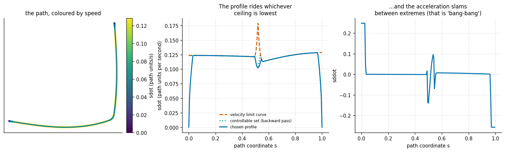
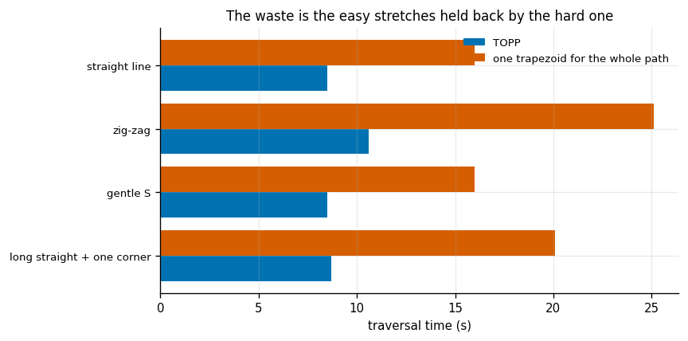
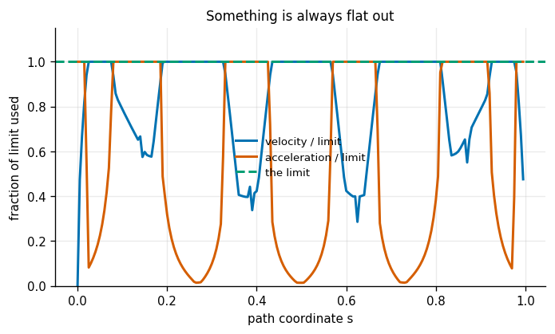
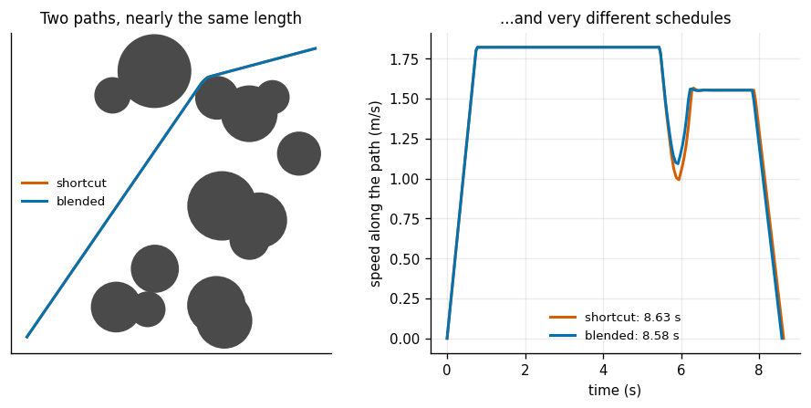
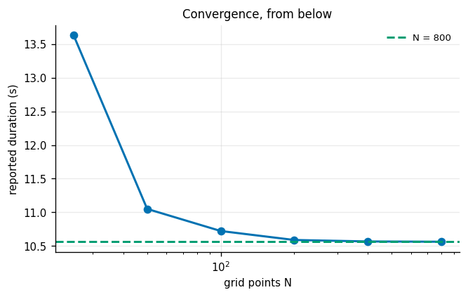
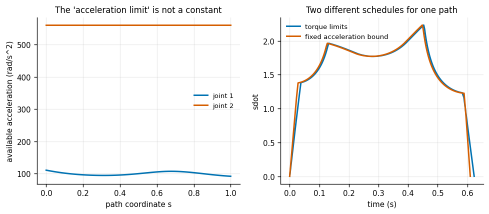
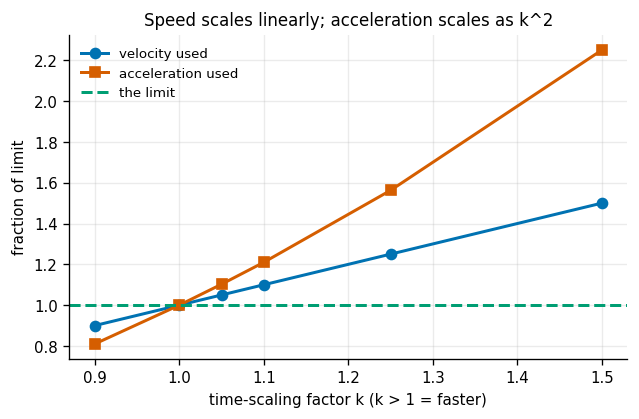

# TOPP

## Key Insight

A geometric path only dictates *where* the robot travels, not *when* or *how fast* it should move, leaving joint velocities and accelerations undefined. [TOPP (Time-Optimal Path Parameterization)](/shared/glossary/#topp) calculates the optimal velocity profile along a pre-planned path, ensuring the robot travels as fast as possible without violating its physical joint-velocity and acceleration limits. This project implements TOPP to parameterize a geometric path, demonstrating how velocity profile limits prevent actuator damage while maximizing motion efficiency.

**This is project 36.** It imports `rrt.py` from [project 32](../32-rrt-in-2d/README.md), `smooth.py` from [project 34](../34-shortcut-smoothing/README.md), and `dynamics.py` from [project 10](../10-inverse-dynamics-from-scratch/README.md) for the torque-limited case.

---

## Files

| file | what it is |
|---|---|
| `topp.py` | cubic spline path, an exact 2-variable LP, TOPP-RA, and two baselines |
| `run.py` | the seven experiments |
| `outputs/` | figures and `results.csv` |

```bash
python3 run.py      # about two and a half minutes; NumPy and Matplotlib only
```

---

## The idea, and why splitting the problem this way is the whole trick

The input is a **geometric path**: a curve `q(s)` through joint space where `s` runs from 0 to 1 and says *where* you are but nothing about *when*. The output is a **trajectory**: the same curve plus a schedule `s(t)`.

Planning a trajectory directly means searching over positions *and* velocities at once, which is a far larger space (that is [project 37](../37-direct-collocation/README.md)). Fixing the path first turns the timing question into a problem with **one unknown function of one variable** — and that one is solvable exactly.

The algorithm implemented here is **TOPP-RA** (Pham & Pham, 2018). "RA" stands for *Reachability Analysis*, which is what the two sweeps do.

### The change of variable that makes it linear

Write `x = sdot^2` (squared speed along the path) and `u = sddot`. Then the chain rule gives

```
  joint velocity      qdot_j  = q'_j sdot         ->   x <= (v_j / |q'_j|)^2
  joint acceleration  qddot_j = q'_j u + q''_j x
```

Both limits are now **linear in `(u, x)`**. That is the entire reason for squaring the speed rather than using `sdot` directly, and it is why the problem has an exact answer instead of merely a good numerical one. Every stage becomes a small two-variable linear program, which `topp.py` solves by enumerating the corners of the feasible polygon — with about 16 constraints there are at most 120 corners, so this is a few hundred arithmetic operations and it cannot fail to converge.

### Two sweeps, and why one is not enough

**Backward pass.** For every grid point, compute the largest squared speed from which it is still possible to reach the end while obeying every limit. This is the *controllable set*.

**Forward pass.** Start at the required initial speed and, at every step, go as fast as the controllable set allows.

A beginner should ask: **the forward pass already respects every limit at every step — why is the backward pass needed at all?** Because a forward-only pass is greedy about the present and blind to the future. It will happily accelerate into a corner it then cannot slow down for, and discover the problem when it is too late to fix. The backward pass converts local limits into a *global* speed plan; braking distance becomes automatic, because a point 10 cm before a hairpin inherits the hairpin's speed limit plus however much speed you can shed in 10 cm.

### One more thing that looks redundant

The path is fitted with a **C²-continuous cubic spline** before anything else happens. Why bother, when the waypoints already describe the path?

Because the acceleration constraint contains `q''(s)`. A piecewise-straight path has `q'' = 0` everywhere *except* at the corners, where it is infinite — and no timing law survives that. Fitting a spline is how a corner acquires a finite (if large) curvature that the solver can reason about.

---

## 1. The speed profile



A path with one long straight and one tight corner, joint limits 1.0 rad/s and 2.0 rad/s²:

| | |
|---|---|
| duration | **8.701 s** |
| solve time | 194 ms for 200 grid points, two sweeps |
| worst limit violation | **1.0000** (exactly at the limit, never over) |
| fraction of the path with some limit saturated | **99.5%** |

The middle panel is the picture to remember. Three curves: the **velocity limit curve** (the ceiling `x <= (v/|q'|)²` alone), the **controllable set** from the backward pass, and the profile actually chosen.

For most of the path the chosen profile sits exactly on the lowest ceiling — the green dotted controllable set is hidden underneath the blue line because they coincide. The interesting part is the dip at `s = 0.52`, the corner. The *velocity* ceiling actually rises there (the orange spike), because the path is turning rather than advancing, so a higher `sdot` would be legal on velocity grounds alone. The profile dips anyway, because the *acceleration* limit says so: the robot must have shed speed before it arrives and must build it back afterwards, and both take distance. **A speed limit at a corner is not set at the corner; it is set by how far you have to slow down beforehand.**

The right panel shows `sddot` slamming between its extremes. That is [bang-bang control](/shared/glossary/#bang-bang-control), and it is not a numerical artefact — it is what time-optimal *means*. If you were not using all of the acceleration available at some moment, you could have gone faster there, so that answer would not have been optimal.

---

## 2. TOPP against one global speed limit



The honest baseline is a single trapezoid profile for the whole path: accelerate at a constant rate, cruise, brake. Finding the fastest legal version is a one-dimensional search, because time-scaling by a factor `k` divides every speed by `k` and every acceleration by `k²`.

| path | TOPP | one trapezoid | saving | constant-speed (cheating) |
|---|---|---|---|---|
| long straight + one corner | **8.701 s** | 20.082 s | **56.7%** | 10.123 s |
| gentle S | **8.501 s** | 16.000 s | 46.9% | 8.000 s |
| zig-zag | **10.588 s** | 25.129 s | **57.9%** | 12.565 s |
| straight line | **8.501 s** | 16.000 s | 46.9% | 8.000 s |

**TOPP is 47-58% faster than one global profile.** The waste it removes is exactly the easy stretches being held back by the hardest corner: a single number for the whole path has to satisfy the tightest constraint anywhere on it.

The last column is worth explaining because it looks like it beats the trapezoid. Constant-speed traversal is exactly 2x faster in every row, and it is *physically impossible* — it starts and stops instantaneously. The factor of two is not a coincidence: a triangular speed profile spends its entire life either speeding up or slowing down, so its average speed is exactly half its peak, and here the peak is set by the velocity limit in all four cases. TOPP beats the honest baseline; the cheating one is in the table so you can see the shape of the arithmetic.

Notice also that even for a **straight line**, TOPP saves 47%. Nothing about that is a corner. It is purely that TOPP accelerates to the velocity limit and *stays there*, while the trapezoid has one peak.

---

## 3. Which limit binds where



On the zig-zag path, at each of 200 stages, which constraint is at 98% or more of its bound:

| | |
|---|---|
| velocity limit active | 52.5% of the path |
| acceleration limit active | 45.5% |
| **at least one active** | **98.0%** |
| both at once | 0.0% |

**Something is flat out 98% of the time.** Theory says 100%, and the 2% gap is the handful of stages where the two ceilings cross over.

This is the cheapest possible check that a time-optimal solver really found the optimum, and it is worth adding to any implementation you write: if a substantial fraction of your trajectory has slack in every constraint, you have a bug, because you could have gone faster there.

Across all four test paths the saturated fraction was 98.0% to 99.5%.

**"Both at once: 0.0%"** is the other half of the story. Velocity limits and acceleration limits bind in *different places* — velocity on the long straights where you can build speed, acceleration in the corners where the path bends. They alternate; they do not overlap.

---

## 4. The headline: the shortest path is not the fastest path



Eight RRT plans on an obstacle map, each in three forms, all timed by the same TOPP with limits 1.5 rad/s and 2.0 rad/s²:

| path | length | tightest bend | traversal time |
|---|---|---|---|
| raw RRT | 15.375 m | 0.180 m | 15.915 s |
| shortcut ([project 34](../34-shortcut-smoothing/README.md)) | **13.364 m** | 0.410 m | 8.826 s |
| shortcut + blended corners | 13.317 m | **1.118 m** | **8.456 s** |

Two separate results.

**Shortcutting bought 13.1% of the length and 44.5% of the time.** The time saving is more than three times the length saving, and it did not come from the length. It came from the *shape*: the raw RRT path's tightest bend has a radius of 0.18 m, and TOPP has to crawl through every one of those. Removing the zig-zags removed the crawling.

**Blending the corners cost −0.35% in length and bought another 4.2% in time.** Two paths of essentially identical length, differing by 4% in traversal time, and the entire difference is curvature. The blended path's tightest bend is 2.7x wider, so the same joint acceleration limit permits a higher speed through it.

**The transferable claim:** *path length is a proxy for traversal time, and it is a poor one.* Every planner in [projects 31 through 35](../31-a-star-on-a-grid/README.md) optimises length, because length is easy to compute and does not require knowing the robot's limits. If what you actually care about is cycle time, length will systematically mislead you in favour of paths with sharp corners. The right pipeline is: plan for length, smooth for curvature, then time it.

---

## 5. Grid resolution



| N | duration | versus N = 800 | worst limit violation | solve time |
|---|---|---|---|---|
| 25 | 13.633 s | **+29.07%** | 1.0000 | 24 ms |
| 50 | 11.050 s | +4.62% | 1.0000 | 50 ms |
| 100 | 10.722 s | +1.51% | 1.0000 | 96 ms |
| 200 | 10.588 s | +0.24% | 1.0000 | 190 ms |
| 400 | 10.566 s | +0.04% | 1.0000 | 401 ms |
| 800 | 10.562 s | 0.00% | 1.0000 | 780 ms |

Solve time is exactly linear in N, and the answer converges **from above**: a coarse grid reports a *longer* duration than a fine one. That is the safe direction, and it happens because a coarse grid does not resolve the tight parts of the path well enough to exploit them.

Compare this with [project 33](../33-rrt-connect-for-an-arm/README.md)'s resolution experiment, where a coarse collision check reported success on plans that were in collision — an error in the *dangerous* direction. Here the discretisation error only costs you speed, and the constraints are respected exactly at every resolution (the violation column is 1.0000 throughout). **Not every discretisation is a safety issue; know which kind yours is.**

---

## 6. Torque limits instead of acceleration limits



An "acceleration limit" is a convenient fiction. What a robot really has is a **torque limit**, and along a fixed path

```
  tau = [M q'] u  +  [M q'' + C q'] x  +  g(q)
```

which is again linear in `(u, x)` — so exactly the same solver handles it. Using the 2-link arm and RNEA from [project 10](../10-inverse-dynamics-from-scratch/README.md):

| | |
|---|---|
| torque limits | 60 Nm, 30 Nm |
| joint speed limits | 4 rad/s |
| **time-optimal under true torque limits** | **0.623 s** |

Now calibrate a fixed acceleration bound the way an engineer asked for "the arm's acceleration limit" would: at the mid-path pose, `tau_max_j / M_jj` gives 99.7 and 560.8 rad/s².

| | |
|---|---|
| time-optimal under that fixed acceleration bound | 0.610 s (looks 2% faster) |
| **its real torque demand, recomputed** | **1.71x the motor limit** |

**The fixed bound is not conservative — it asks the motors for 71% more torque than they have.** And it never announces this. The trajectory satisfies its stated acceleration constraint exactly; the constraint was simply the wrong one.

Where the error comes from is visible in the details. Gravity alone costs 0.85 Nm and 1.41 Nm at the mid-path pose — 1.4% and 4.7% of the budget — *before any acceleration is asked for*, and that share rises sharply elsewhere:

| joint | available acceleration along the path | gravity torque along the path |
|---|---|---|
| 1 | 91.6 to 110.5 rad/s² (1.21x) | 0.08 to **9.85 Nm** |
| 2 | 560.8 rad/s² (constant) | 0.07 to 1.97 Nm |

Joint 1's inertia varies by only 21% as the elbow folds, but its **gravity load varies by a factor of 120**, from nearly nothing when the arm is folded to 9.85 Nm when it is stretched out. A constant acceleration bound is blind to that entirely: it charges the same for accelerating uphill as for accelerating downhill.

The practical rule: **a fixed acceleration limit calibrated at one pose is legal at that pose and nowhere else.** If your robot has meaningful gravity load or configuration-dependent inertia — which is every arm — constrain torque directly.

---

## 7. Verification, and the cost of shaving 10% off



First, the check that the solver did what it claimed. Re-deriving joint velocity and acceleration from the schedule, on all four paths:

| path | velocity used / limit | acceleration used / limit |
|---|---|---|
| long straight + one corner | 1.0000 | 1.0000 |
| gentle S | 1.0000 | 1.0000 |
| zig-zag | 1.0000 | 1.0000 |
| straight line | 1.0000 | 1.0000 |

Exactly at the limit everywhere, never over. That is what "time-optimal" should look like.

Now the question a manager asks: *can we just run it 10% faster?* Time-scaling the finished trajectory by a factor `k`:

| k | duration | velocity used | acceleration used | legal? |
|---|---|---|---|---|
| 0.90 | 11.765 s | 0.900 | 0.810 | yes |
| 1.00 | 10.588 s | 1.000 | 1.000 | yes |
| **1.05** | 10.084 s | 1.050 | **1.103** | **no** |
| 1.10 | 9.626 s | 1.100 | **1.210** | no |
| 1.50 | 7.059 s | 1.500 | **2.250** | no |

**A 10% speed-up asks for 21% more acceleration**, because acceleration scales with the *square* of the time-scaling factor while velocity scales linearly. Fifty percent faster demands 125% more acceleration.

This is why "just run it a bit faster" is a bigger request than it sounds, and why the safety margin you get from slowing down is larger than it sounds too: running at 90% speed uses only 81% of the acceleration budget.

---

## What to take away

1. **Fix the path, then solve for the schedule.** One unknown function of one variable, and it has an exact answer.
2. **Squaring the speed is what makes it linear.** With `x = sdot²`, both velocity and acceleration limits become straight lines in `(u, x)`.
3. **Two sweeps, not one.** A forward-only pass accelerates into corners it cannot brake for; the backward pass is what makes braking distance automatic.
4. **The optimum is [bang-bang](/shared/glossary/#bang-bang-control), and 98-99% saturation is your free correctness check.**
5. **TOPP beats one global profile by about half** — 47-58% here, and 47% even on a straight line.
6. **The shortest path is not the fastest path.** Two paths of identical length differed by 4.2% in time; shortcutting bought 13% of length and 44% of time. Length is a poor proxy for cycle time.
7. **A fixed acceleration bound calibrated at one pose demanded 1.71x the motor torque elsewhere.** Constrain torque, not acceleration.
8. **Speed scales linearly, acceleration as the square.** A 10% speed-up costs 21% more acceleration.

## Next

[Project 37](../37-direct-collocation/README.md) stops separating path from timing and optimises both at once, which is the only way to plan a motion whose *shape* depends on the dynamics — a cart-pole that must swing up before it can balance.
