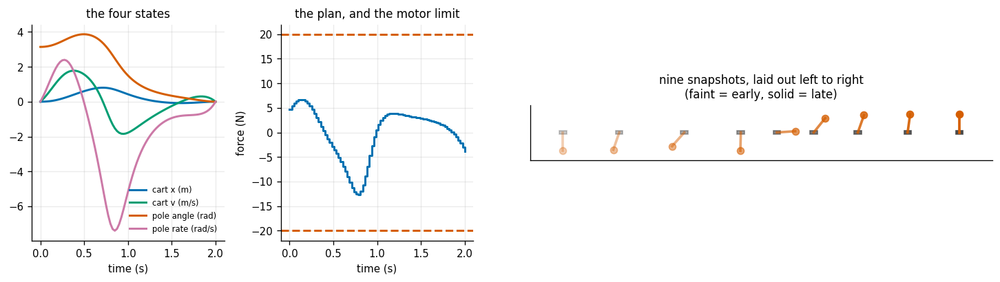
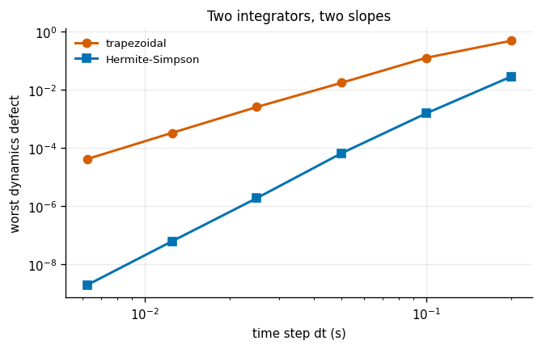
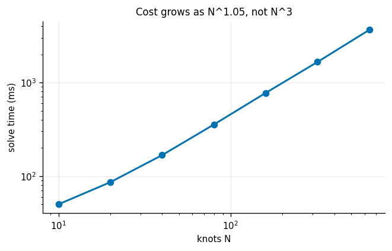
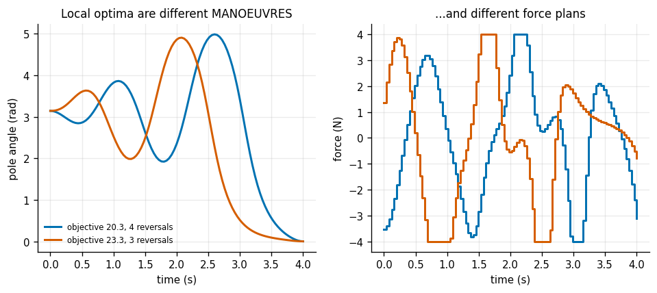
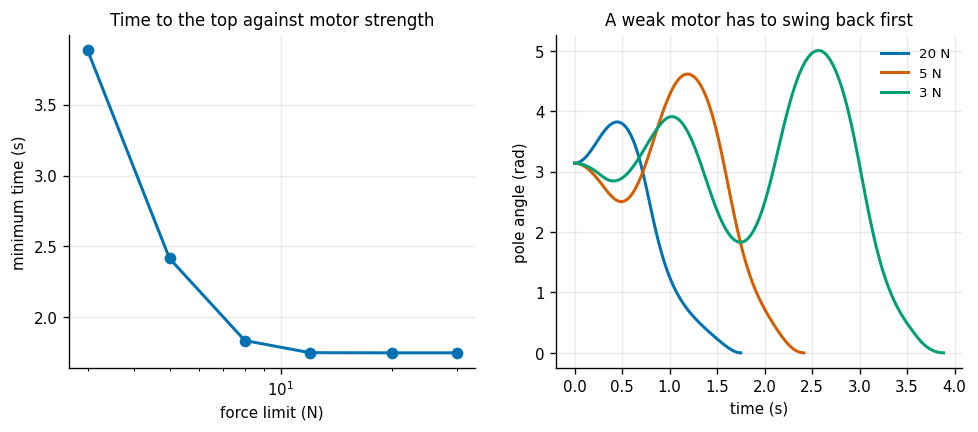
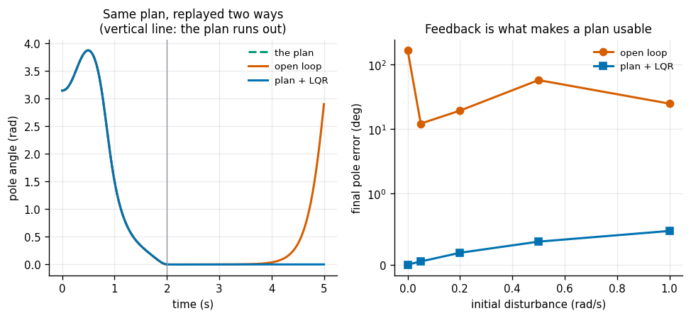
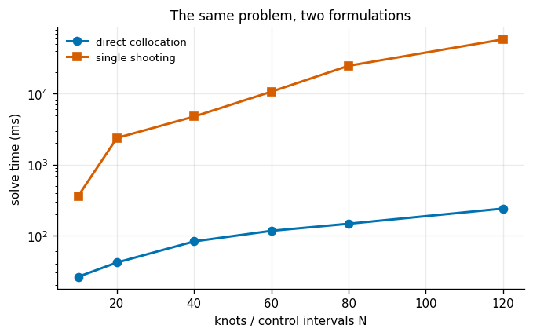

# Direct Collocation

## Key Insight

For underactuated systems like the [CartPole](/shared/glossary/#cartpole), finding a trajectory that respects the system's physical dynamics is extremely difficult using geometric planners alone. [Direct collocation](/shared/glossary/#direct-collocation) solves this by discretizing both the robot's [states](/shared/glossary/#state) and control inputs, enforcing the dynamics equations as algebraic constraints at collocation points, and solving the resulting problem using [IPOPT](/shared/glossary/#ipopt). This project plans a cart-pole swing-up maneuver to show how optimization can discover complex dynamic maneuvers, which are then stabilized near the upright [setpoint](/shared/glossary/#setpoint) using a local [LQR](/shared/glossary/#lqr) controller.

**This is project 37.** It imports `cartpole.py` and `lqr.py` from [project 09](../09-cart-pole-lqr/README.md).

---

## Files

| file | what it is |
|---|---|
| `collocation.py` | the CasADi dynamics, trapezoidal and Hermite-Simpson collocation, single shooting, and an accurate replay |
| `run.py` | the seven experiments |
| `outputs/` | figures and `results.csv` |

```bash
pip install casadi      # brings IPOPT with it
python3 run.py          # about six minutes
```

---

## Why "direct", why "collocation", and why re-write the dynamics

**"Direct"** means the state trajectory is a decision variable in its own right, not something you obtain by simulating. The dynamics appear as equality *constraints* linking consecutive knots.

That sounds wasteful — why solve for something you could compute? — and it is the entire reason the method works on unstable systems. Because the states are free variables, the solver may hold an intermediate guess that does not satisfy the physics at all, and repair it gradually. Simulation has no such freedom: every guess is physically exact, and therefore every guess is stuck with wherever the instability takes it. Experiment 7 measures what that costs.

**"Collocation"** is the classical name for "make the residual vanish at selected points" — the collocation points. Here the residual is *(the state derivative implied by the interpolating polynomial)* minus *(the state derivative the physics demands)*, forced to zero at each knot.

**And the CasADi question.** [Project 09](../09-cart-pole-lqr/README.md) already has the cart-pole equations in NumPy. Why write them again in [CasADi](/shared/glossary/#casadi)? Because [IPOPT](/shared/glossary/#ipopt) does not want the *value* of the dynamics, it wants their *derivatives* with respect to every one of several hundred decision variables — exactly, and cheaply. A NumPy function can only be differentiated by finite differences: slow, and noisy enough to stop a Newton-type solver from converging. CasADi builds a symbolic graph of the same formula and hands IPOPT exact first and second derivatives. Same physics, differentiable packaging.

---

## 1. The swing-up



Cart 1 kg, pole 0.1 kg on a 0.5 m rod, 20 N of force available, 2 seconds, minimum effort:

| | |
|---|---|
| solved in | **675 ms, 10 IPOPT iterations** |
| problem size | 324 state variables + 80 controls = 404 unknowns, 328 equality constraints |
| final state | `[0, 0, 0, 0]` exactly |
| pole direction reversals | 1 |
| peak force used | 12.59 N of the 20 N available |
| mechanical energy | −0.491 J (hanging) to +0.491 J (upright); the balance point needs +0.491 J |

Look at the right-hand panel and the story is legible: the cart darts one way, the pole swings out behind it, the cart reverses hard, and the pole whips over the top. This is **energy pumping** — the same motion a person makes on a playground swing — and nobody told the optimizer to do it. It emerged from "reach the upright state, minimise force squared".

That is the thing direct collocation does that no geometric planner can. There is no *path* here in the [projects 31-35](../31-a-star-on-a-grid/README.md) sense. The cart-pole is **underactuated**: four states, one motor. You cannot ask for a cart position and a pole angle independently, so the shape of the motion is dictated by the dynamics rather than chosen. The optimizer had to discover the manoeuvre, not smooth a route.

---

## 2. Trapezoidal against Hermite-Simpson



Two ways to write the constraint linking knot `k` to knot `k+1`. **Trapezoidal** interpolates the derivative with a straight line. **[Hermite-Simpson](/shared/glossary/#hermite-simpson-collocation)** fits a cubic through both knots and also enforces the dynamics at the *midpoint*, costing one extra evaluation per interval.

The measurement is the **defect**: take each pair of consecutive knots, integrate the plan's own control accurately from the first, and see how far you land from the second. A collocation solution satisfies its own approximation exactly; this asks how good that approximation was.

| N | dt | trapezoidal defect | ms | Hermite-Simpson defect | ms | ratio |
|---|---|---|---|---|---|---|
| 10 | 0.200 s | 4.90e−01 | 25 | 2.87e−02 | 46 | 17x |
| 20 | 0.100 s | 1.27e−01 | 42 | 1.57e−03 | 83 | 81x |
| 40 | 0.050 s | 1.76e−02 | 75 | 6.69e−05 | 202 | 264x |
| 80 | 0.025 s | 2.59e−03 | 152 | **1.91e−06** | 360 | **1 354x** |
| 160 | 0.0125 s | 3.34e−04 | 331 | 6.28e−08 | 812 | 5 319x |
| 320 | 0.0063 s | 4.21e−05 | 708 | 1.98e−09 | 1 699 | **21 301x** |

Fitting the slopes: trapezoidal error scales as **dt^2.74**, Hermite-Simpson as **dt^4.80**. Theory says 2 and 4; both are converging faster than the worst case, which is normal on a smooth problem.

**Read this the practical way.** To halve the error, trapezoidal needs 1.4x the knots and Hermite-Simpson needs 1.19x. At N = 80 the two cost 152 ms and 360 ms — Hermite-Simpson is 2.4x slower per solve and 1 354x more accurate. There is no problem size at which that is a bad trade, which is why every serious implementation defaults to Hermite-Simpson or something better.

---

## 3. How many knots, and what they cost



| N | unknowns | IPOPT iterations | time | objective | defect |
|---|---|---|---|---|---|
| 10 | 54 | 14 | 50 ms | 59.941 | 2.87e−02 |
| 40 | 204 | 10 | 167 ms | 53.806 | 6.69e−05 |
| 80 | 404 | 10 | 356 ms | 53.508 | 1.91e−06 |
| 320 | 1 604 | 10 | 1 661 ms | 53.414 | 1.98e−09 |
| 640 | 3 204 | 9 | 3 661 ms | 53.410 | 6.16e−11 |

**Solve time scales as N^1.05 — essentially linear.** For a general nonlinear program with 3 204 variables that would be astonishing; here it is structural. Knot `k` appears only in the constraints linking it to knots `k−1` and `k+1`, so the constraint Jacobian is **banded**, and the sparse linear algebra inside IPOPT costs time proportional to the number of non-zeros rather than to the cube of the matrix size. It is the same reason [project 30](../30-factor-graph-practice/README.md)'s pose graph scales: a robot only ever couples things that are near each other in time.

**The iteration count is flat at 10** across a 64x range of problem sizes. Newton-type methods converge in a number of steps set by how *nonlinear* the problem is, not by how *big* it is.

Note also that the objective is still creeping down at N = 640 (53.410 versus 53.508 at N = 80). Adding knots does not merely make the answer more accurate — it makes it *better*, because a finer discretisation can express a slightly cheaper manoeuvre.

---

## 4. The initial guess, and the answers it leads to



**Strong motor, 2 s horizon (20 N):**

| guess | solved | mean iterations | objective min / max | distinct answers | reversals |
|---|---|---|---|---|---|
| all zeros | **0/1** | — | — | — | — |
| hold the start pose | 1/1 | 38.0 | 53.508 / 53.508 | 1 | 1 |
| linear interpolation | 1/1 | **10.0** | 53.508 / 53.508 | 1 | 1 |
| random | 10/10 | 14.5 | 53.508 / 53.508 | **1** | 1 |

**Weak motor, 4 s horizon (4 N):**

| guess | solved | mean iterations | objective min / max | distinct answers | reversals |
|---|---|---|---|---|---|
| all zeros | 0/1 | — | — | — | — |
| hold the start pose | 1/1 | 69.0 | 20.315 / 20.315 | 1 | 4 |
| linear interpolation | **0/1** | — | — | — | — |
| random | **4/10** | 37.0 | **20.315 / 23.292** | **2** | 3 and 4 |

Two regimes, two completely different stories.

**With plenty of authority and a short horizon there is effectively one manoeuvre**, and every starting guess that converges finds it — the same objective to three decimal places from ten different random starts. If your problem looks like this, initialisation hardly matters.

**With a weak motor and a long horizon there are several manoeuvres**, and which one you get is decided by where you started. Ten random guesses produced 4 successes and **2 genuinely different trajectories**: one that pumps 3 times (objective 23.292) and one that pumps 4 times (objective 20.315, 13% cheaper). The plots show them as visibly different motions, not numerical noise on the same motion.

Nothing here is a bug. **IPOPT is a local method**: it walks downhill from wherever you put it and stops at the bottom of whichever valley that was. And the failure of the "all zeros" guess in both regimes is instructive — it is the *worst* possible start, because the zero state is the upright balance point, so the guess claims the pole is already up.

This is the exact complement of [projects 32 and 33](../32-rrt-in-2d/README.md): sampling planners explore globally and optimise badly; this optimises beautifully and does not explore at all. Which is why real systems chain them.

---

## 5. Weaker motors need more pumps



Now the horizon `T` becomes a decision variable too, and the objective is mostly `T` — so the solver is asked for the *fastest* swing-up rather than merely a feasible one:

| force limit | solved | minimum time | pole direction reversals | peak force |
|---|---|---|---|---|
| 30 N | yes | 1.748 s | 1 | 12.93 N |
| 20 N | yes | 1.748 s | 1 | 12.93 N |
| 12 N | yes | 1.749 s | 1 | 12.00 N |
| 8 N | yes | 1.835 s | 1 | 8.00 N |
| 5 N | yes | 2.415 s | **2** | 5.00 N |
| **3 N** | yes | **3.884 s** | **4** | 3.00 N |
| 2 N | **no** | — | — | — |
| 1.5 N | **no** | — | — | — |

**A 30 N motor gets there in 1.75 s with one reversal; a 3 N motor needs 3.88 s and four.** The reversal count is the cleanest possible picture of energy pumping: with too little force to throw the pole up directly, the only way to reach 0.491 J is to swing back and forth, adding a little energy on each pass — exactly how a child gets a playground swing going.

Note the first three rows are identical. Above about 13 N the force limit stops binding at all, because minimising time on this problem never wants more than 12.93 N. **Buying a stronger motor past that point buys nothing.**

**Two honest caveats.**

First, **these solves are warm-started from each other.** Each one uses the previous, stronger-motor answer as its initial guess. From a cold straight-line guess, everything at 5 N and below fails to converge. That technique is [continuation](/shared/glossary/#warm-start) — solve an easy version, then walk the difficulty up — and it is doing real work here, not saving a few iterations.

Second, **below 3 N the solver stops converging even with a warm start.** The manoeuvre needs more and more pumps, and with a fixed 120 knots each pump gets fewer points to be described with. The fix is more knots, not a better solver; we report the failure rather than hiding it.

---

## 6. The plan is not a controller



The plan is 120 forces. Replaying them through an accurate integrator, and then continuing to simulate for a further 3 seconds after the plan runs out:

| | final pole angle | final cart position |
|---|---|---|
| open loop | **166.02 deg** | −0.011 m |
| plan + [LQR](/shared/glossary/#lqr) | **0.01 deg** | +0.001 m |

**Open loop, the pole reaches the top and then falls straight back down.** That is not a failure of the plan — the plan ends at exactly the right state and the replay confirms it. It is that an inverted pole is an unstable equilibrium: once the forces stop, the tiniest residual error grows exponentially. Nothing was correcting it, because there was nothing to correct with.

Adding a disturbance makes it worse:

| extra pole rate at t = 0 | open loop | plan + LQR |
|---|---|---|
| 0.00 rad/s | 166.0 deg | **0.0 deg** |
| 0.05 rad/s | 12.1 deg | **0.0 deg** |
| 0.20 rad/s | 19.3 deg | 0.2 deg |
| 0.50 rad/s | 57.4 deg | 0.3 deg |
| 1.00 rad/s | 24.8 deg | 0.5 deg |

**A 0.05 rad/s error — about 3 degrees per second, less than any real sensor's noise — costs 12 degrees at the end open loop, and nothing at all with feedback.**

### The gain has to be gated, and this cost a debugging cycle

The LQR gain comes from [project 09](../09-cart-pole-lqr/README.md), computed from the dynamics **linearised about the upright**. Applying it during the whole swing-up — where the pole hangs at π radians and the linearisation is meaningless — is far worse than useless: measured, it drove the cart **69 m down a 3 m rail**. The gain is therefore switched on only once the pole is within 0.5 rad of upright.

A beginner should ask: **if the plan already gets us to the top, why add a controller at all — and if the controller is so good, why bother planning?** They do different jobs and neither can do the other's. The plan is a *global* answer: it finds a manoeuvre through a region where no linear controller is valid. The LQR is a *local* answer: it is only meaningful in a small neighbourhood of the upright, and inside that neighbourhood it rejects disturbances the plan cannot even perceive. A plan-tracking controller valid for the *whole* manoeuvre needs a time-varying gain (a Riccati sweep backwards along the trajectory), which is a different and larger computation.

---

## 7. Collocation against single shooting



[Single shooting](/shared/glossary/#single-shooting) is the obvious alternative: make only the *controls* decision variables and obtain the states by integrating forward. Far fewer variables, and every candidate is automatically physically exact.

| N | collocation | iters | ok | single shooting | iters | ok |
|---|---|---|---|---|---|---|
| 10 | 26 ms | 12 | yes | 361 ms | 144 | yes |
| 20 | 42 ms | 10 | yes | 2 373 ms | 307 | **no** |
| 40 | 83 ms | 10 | yes | 4 760 ms | 168 | yes |
| 60 | 117 ms | 10 | yes | 10 664 ms | 133 | yes |
| 80 | 147 ms | 10 | yes | 24 727 ms | 191 | yes |
| 120 | **240 ms** | 10 | yes | **58 294 ms** | 160 | yes |

**Where both succeed, shooting is 115x slower and needs 15x the iterations.** At N = 120 that is 240 milliseconds against 58 seconds.

The reason is exactly the "physically exact" property that sounded like an advantage. On an unstable system, a tiny change to an early control multiplies into an enormous change at the end — that is what "unstable" means. So the solver sees a gradient hundreds of times larger for `u[0]` than for `u[119]`, an [ill-conditioned](/shared/glossary/#condition-number) problem, and it stalls. Notice also that shooting's iteration count is erratic (144, 307, 168, 133, 191, 160) while collocation's is a flat 10: the solver is fighting the formulation, not the physics.

Direct collocation trades more variables for a *better-conditioned* problem. Every knot is a place where the solver can adjust the trajectory locally, so no single variable holds enormous influence over the endpoint. **That trade — more unknowns, better conditioning — is the central design idea of the method, and this table is the measurement that justifies it.**

---

## What to take away

1. **Making the states decision variables is the point.** It lets the solver hold physically wrong intermediate guesses and repair them, which is exactly what an unstable system requires.
2. **[Hermite-Simpson](/shared/glossary/#hermite-simpson-collocation) costs 2.7x per solve and is 1 354x more accurate.** Use it.
3. **Solve time is linear in the number of knots** because the constraint Jacobian is banded — and the iteration count does not grow at all.
4. **How much the initial guess matters depends on the problem, not on the method.** Ten random guesses found one answer on the easy problem and two distinct manoeuvres on the hard one; the "all zeros" guess failed on both.
5. **A weak motor needs more pumps** — 1 reversal at 30 N, 4 at 3 N — and [warm-starting](/shared/glossary/#warm-start) from the stronger case is what makes those solves converge at all.
6. **The plan is not a controller.** Open loop the pole falls over even with no disturbance; plan + LQR holds it to 0.5 degrees under a 1 rad/s kick. And the LQR must be gated to the region where its linearisation is valid.
7. **[Single shooting](/shared/glossary/#single-shooting) is 115x slower on the same problem.** More variables bought better conditioning, and that is the whole trade.

## Next

[Project 38](../38-footstep-planning/README.md) closes Phase 5 by going back to discrete search — but over a lattice of footsteps, where the "actions" are motion primitives a leg can actually execute.
