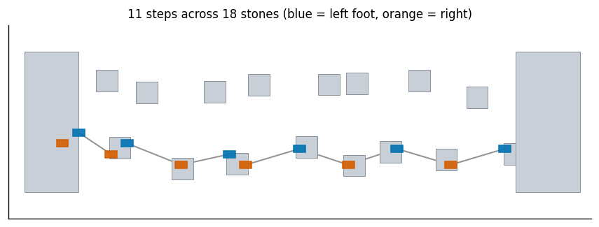
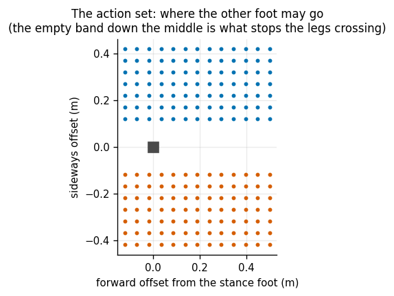
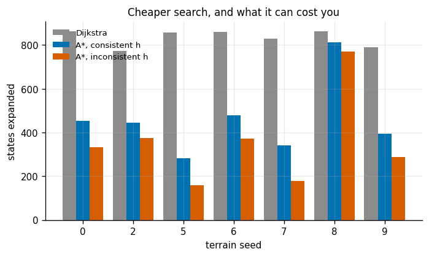
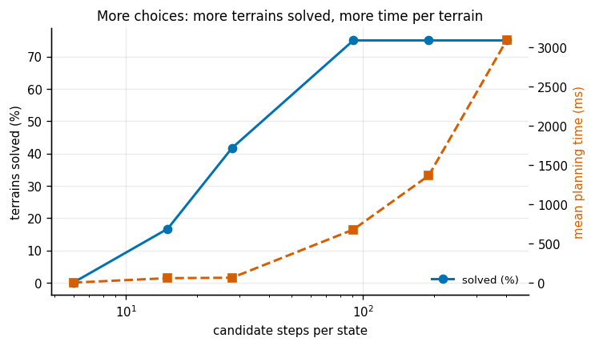
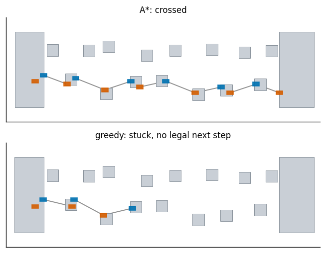
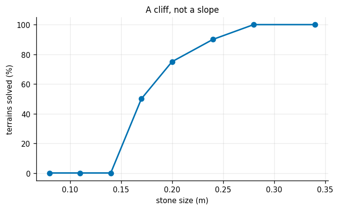
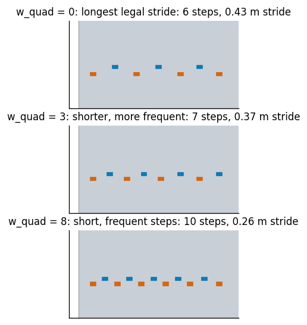
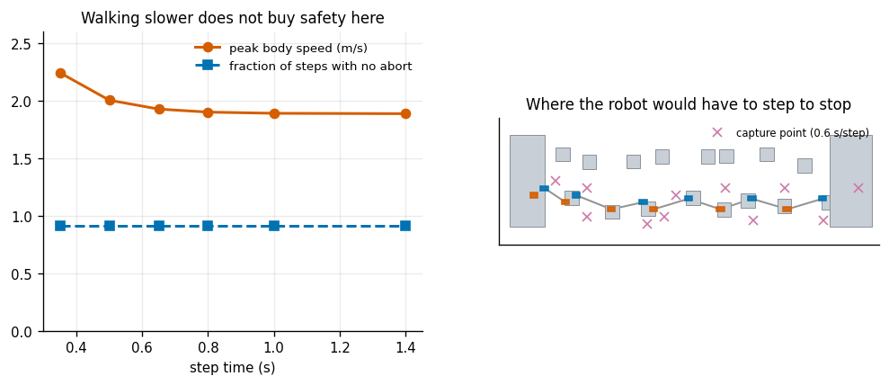

# Footstep Planning

## Key Insight

For legged robots walking on rough or discontinuous terrain, planning continuous whole-body trajectories is highly complex and prone to collision. [Footstep planning](/shared/glossary/#footstep-planning) simplifies this by first planning a discrete sequence of stable foot placements on a footstep lattice using an [A* search](/shared/glossary/#a-star-search). This project implements footstep planning for a planar biped crossing stepping stones to demonstrate how discrete graph search can solve complex locomotion problems before continuous joint trajectories are generated.

**This is project 38**, the last of Phase 5. It stands alone (only Matplotlib styling is shared), but it is deliberately the mirror image of [project 31](../31-a-star-on-a-grid/README.md): the same A*, on a graph that is not a grid.

---

## Files

| file | what it is |
|---|---|
| `footstep.py` | terrain, step kinematics and cost, A* over the lattice, a greedy baseline, and the LIP capture-point check |
| `run.py` | the seven experiments |
| `outputs/` | figures and `results.csv` |

```bash
python3 run.py      # about two minutes; NumPy and Matplotlib only
```

---

## The abstraction, and what it throws away

A walking robot has an enormous continuous state — every joint, every joint rate, the floating base — and a plan that lasts many seconds. Planning all of that at once is hopeless. Footstep planning throws almost all of it away and keeps one thing: **where the feet go**.

```
  state  = (position of the stance foot, which foot it is)
  action = a discrete choice of where to put the other foot next
```

That turns walking into a graph search, and [project 31](../31-a-star-on-a-grid/README.md)'s A* already solves graph searches. Everything the robot does *between* two footfalls — swinging the leg, shifting its weight, bending its knees — is delegated to a lower layer, on the assumption that it can execute any step the planner declares legal.

**Experiment 7 is about what happens when that assumption is not quite true**, and it is the most important part of this project.

This is a [lattice planner](/shared/glossary/#lattice-planner): motion is restricted to a fixed menu of pre-computed primitives. The advantage over sampling a continuous space is that the primitives can be made *executable by construction* — only steps this robot's hips can actually reach are ever in the menu, so the planner never proposes something impossible.

---

## 1. The terrain, and a plan across it



| | |
|---|---|
| step limits | forward −0.12 to +0.50 m, sideways 0.12 to 0.42 m |
| action lattice | 13 forward x 7 sideways = **91 candidate steps per state** |
| terrain | 18 stones, 2.07 m² of support in a 7.0 m² corridor (**29%**) |
| planned in | 350 ms, 281 states expanded, cost 8.626 |
| the plan | **11 steps**, mean length 0.401 m (0.373 m forward), longest 0.539 m |



The action figure repays a look. The **empty band down the middle** is not a gap in the sampling — it is the constraint that the feet may not cross. In the code, `dy` is always stored positive and takes its sign from *which foot is swinging*: a left foot may only ever land to the left of the right foot. That single convention encodes "do not trip over your own legs" without any explicit self-collision test.

---

## 2. The heuristic, and a subtlety [project 31](../31-a-star-on-a-grid/README.md) could not show



Three versions of A* on the same seven terrains. The heuristic is built the same way as project 31's: every step advances at most `dx_max` and costs at least `w_step + w_len * dx_max`, so

- **linear**: `h = (remaining / dx_max) * (cheapest step)`
- **ceil**: `h = ceil(remaining / dx_max) * (cheapest step)`

| terrain | Dijkstra | A*, linear h | optimal? | A*, ceil h | optimal? |
|---|---|---|---|---|---|
| 0 | 864 | 454 | yes | **334** | **no** |
| 2 | 772 | 445 | yes | 376 | **no** |
| 5 | 858 | 281 | yes | 160 | **no** |
| 6 | 860 | 478 | yes | 371 | yes |
| 7 | 830 | 340 | yes | 179 | **no** |
| 8 | 862 | 813 | yes | 770 | **no** |
| 9 | 791 | 395 | yes | 288 | **no** |

| | expansions saved | optimal on |
|---|---|---|
| linear (consistent) | 2.00x | **7 of 7** |
| ceil (admissible but inconsistent) | **2.97x** | **1 of 7** |

**Two separate lessons.**

**The heuristic is worth less here than on an open grid.** Project 31 got 15-24x on open ground; here it is 2x. Same reason as that project's maze: most branches die immediately because there is no stone under them, so Dijkstra was never going to explore them either. The heuristic can only save you from exploring places that were worth exploring.

**And [admissible](/shared/glossary/#admissible-heuristic) is not enough.** The ceiling heuristic never overestimates — you cannot take a fractional step, so rounding up is honest — and it is 50% faster still. It is also wrong on six terrains out of seven.

Why: A* as implemented here never reconsiders a state once it has settled it, and that shortcut is only safe for a [consistent](/shared/glossary/#consistent-heuristic) heuristic, one that never *drops* by more than the cost of the step causing the drop. The ceiling version fails that test. A 1 cm shuffle that happens to cross a rounding boundary makes `h` fall by a whole stride's worth while costing almost nothing, so a state can be settled at a bad cost and a cheaper route to it discovered too late.

The damage is small — 0.3% over optimal on average, 1.0% at worst — which is precisely what makes it dangerous. It is fast, it looks fine, and it is not what you asked for.

---

## 3. How finely to chop the step space



Twelve terrains per row:

| lattice | actions | solved | mean cost | mean expanded | mean time |
|---|---|---|---|---|---|
| 3 x 2 | 6 | **0%** | — | 47 | 4 ms |
| 5 x 3 | 15 | 17% | 12.072 | 252 | 60 ms |
| 7 x 4 | 28 | 42% | 10.317 | 151 | 65 ms |
| **13 x 7** | **91** | **75%** | 9.279 | 531 | 679 ms |
| 21 x 9 | 189 | 75% | 9.140 | 526 | 1 366 ms |
| 31 x 13 | 403 | 75% | **9.055** | 506 | **3 089 ms** |

**Two different failures at the two ends.**

*Too coarse*, and there is simply no legal step onto the next stone — a 6-action menu solved nothing at all. The stones are 0.20 m across; a menu whose forward offsets are 0.31 m apart will miss most of them entirely. Note that this failure is fast: 47 expansions, 4 ms, no answer.

*Too fine*, and every state has hundreds of children, so the search slows sharply while finding nothing better. Going from 91 to 403 actions costs **4.5x the time** and buys 2.4% in path cost — and the success rate does not move at all, because by 91 actions the lattice can already reach every stone the kinematics allow.

That flat 75% is the honest ceiling: on a quarter of these terrains **no plan exists**, and no amount of lattice refinement changes that. Experiment 5 shows where the line falls.

---

## 4. The greedy baseline, and exactly where it fails



The obvious algorithm: always take the step that gets you furthest forward.

| | solved |
|---|---|
| A* | **18 / 24 = 75%** |
| greedy | **1 / 24 = 4%** |

On the 17 terrains A* solved and greedy did not, greedy got **30% of the way across** before running out of legal steps.

**The reason is worth naming, because it generalises well beyond walking.** Reaching forward as far as possible now usually lands on the **far edge** of a stone — and from the far edge, the next stone is out of range. Search wins because it is willing to take a *short* step in order to set up a long one.

That is the difference between optimising the next decision and optimising the sequence, and it is precisely what the `g` term in `f = g + h` buys you. [Project 31](../31-a-star-on-a-grid/README.md)'s greedy best-first search paid only 3.3% in path length for dropping `g`, because on an open grid almost every local decision is recoverable. Here, on discontinuous terrain, dropping it costs 71 percentage points of *success*. **How much greediness costs is a property of how forgiving the world is.**

---

## 5. Terrain difficulty: a cliff, not a slope



Twenty terrains per row; only the stone size changes:

| stone size | support area | solved | mean cost | mean expanded |
|---|---|---|---|---|
| 0.34 m | 3.14 m² | 100% | 8.075 | 553 |
| 0.28 m | 2.59 m² | 100% | 8.382 | 491 |
| 0.24 m | 2.28 m² | 90% | 8.782 | 511 |
| **0.20 m** | 2.02 m² | **75%** | 9.469 | 560 |
| **0.17 m** | 1.86 m² | **50%** | 9.828 | 578 |
| **0.14 m** | 1.72 m² | **0%** | — | 605 |
| 0.11 m | 1.61 m² | 0% | — | 574 |

**Between 0.24 m and 0.14 m stones — a 40% change in size and a 25% change in total support area — the success rate falls from 90% to zero.** That is a phase transition, not a gradual degradation.

Two details worth noticing.

**The mean cost rises as the terrain gets harder** (8.08 to 9.83), and it rises only over the terrains that were still solvable. Harder terrain does not merely cost you failures; the plans you do get are worse, because the planner is forced onto stones it would not have chosen.

**The expansion count barely changes** — 491 to 605 across the whole sweep, including the rows where nothing is found. A failed search here is not a long search; it is a search that quickly runs out of anywhere to go. If you are monitoring a planner in production, "expanded a lot of states" is *not* a reliable signal that a problem is hard.

The control at the bottom of the sweep: on flat ground the plan is 9 steps costing 7.676, found by expanding 1 464 states. **Flat ground expands nearly three times as many states as stepping stones**, because on flat ground every one of the 91 actions is legal from every state. Sparse terrain prunes the search for free.

---

## 6. The cost function IS the gait



On flat ground nothing but the cost function can decide how the robot walks:

| w_step | w_len | w_quad | w_lat | steps | mean stride | mean sideways |
|---|---|---|---|---|---|---|
| 0.35 | 1.0 | 0.0 | 0.6 | 9 | 0.456 m | 0.150 m |
| 0.35 | 1.0 | 1.0 | 0.6 | 9 | 0.456 m | 0.150 m |
| 0.35 | 1.0 | **3.0** | 0.6 | **11** | **0.373 m** | 0.100 m |
| 0.35 | 1.0 | **8.0** | 0.6 | **16** | **0.256 m** | 0.100 m |
| **2.00** | 1.0 | 3.0 | 0.6 | **9** | **0.456 m** | 0.100 m |
| 0.35 | 1.0 | 3.0 | **0.0** | 11 | 0.373 m | 0.100 m |
| 0.35 | 1.0 | 3.0 | **4.0** | 9 | 0.456 m | **0.150 m** |

Rows 1-4 change only the **quadratic** length penalty: the stride shrinks from 0.46 m to 0.26 m and the step count rises from 9 to 16. Row 5 raises the flat per-step charge instead and pushes straight back the other way.

**Why is a quadratic term needed at all, when the cost already charges for length?** Because with only *linear* terms, "shortest total length" and "fewest steps" both want the longest stride the legs allow, so every weight setting produces the same gait. (Rows 1 and 2 are the residue of that: at `w_quad = 1` the quadratic term is still too weak to bite.) Real walking energy grows faster than linearly with stride length — doubling the stride costs much more than twice as much — and it is that *superlinearity* that creates an interior optimum for the planner to find.

**And an honest complication.** Rows 6 and 7 vary only the stance-width penalty, and they changed the **stride** too (0.373 m against 0.456 m). The knobs are not independent: a wider stance makes each step longer through the quadratic term, which then changes what the forward part of the cost wants. **Tuning a gait cost is not four separate dials; it is one surface.**

---

## 7. Kinematically fine, dynamically committed



Everything above asked one question of the terrain: *is there a stone here?* Nothing asked how fast the robot would be moving.

To ask that we need a dynamic model. The [linear inverted pendulum](/shared/glossary/#linear-inverted-pendulum) is the standard crude one: all the mass at one point at a fixed height, balancing on a massless leg over the stance foot. Fixing the height makes it linear — `xddot = omega^2 (x - p)` with `omega = sqrt(g / height)`.

Its key quantity is the **[capture point](/shared/glossary/#capture-point)**, `xi = x + xdot / omega`: the spot where the next foot must land for the body to come to rest. It is the only part of the state that runs away if you do nothing.

**(a) Does walking more slowly help?**

| step time | peak body speed | capture point off every stone |
|---|---|---|
| 0.35 s | 2.24 m/s | 10 / 11 |
| 0.50 s | 2.00 m/s | 10 / 11 |
| 0.80 s | 1.90 m/s | 10 / 11 |
| 1.40 s | 1.89 m/s | **10 / 11** |

**No — and the flatness is a real property of the model, not a numerical accident.** Under the LIP, position diverges like `exp(omega t)`, so however long you take, you arrive at the next foot travelling at very nearly `omega x (step length)`. The capture point therefore sits about **one stride beyond the foot you are about to plant**, no matter how slowly you walk. Walking is controlled falling: you cannot stop inside the current step.

**(b) What does change it.** Body height changes `omega` and therefore the speed:

| body height | omega | peak speed | capture point off-stone |
|---|---|---|---|
| 0.50 m | 4.43 s⁻¹ | 2.41 m/s | 10 / 11 |
| 0.80 m | 3.50 s⁻¹ | 1.94 m/s | 10 / 11 |
| 1.50 m | 2.56 s⁻¹ | **1.51 m/s** | 10 / 11 |

A taller robot walks more calmly — 37% less body speed for the same footsteps — which is one real reason tall bipeds look more composed than short ones. It still did not change the count here.

Shortening the stride would, but on **this** terrain it cannot: re-planning with a 0.40 m maximum stride finds no plan at all, and neither does 0.30 or 0.24. The stones themselves demand a long stride. **You cannot always choose to walk carefully; sometimes the terrain has already decided.**

**(c) The control that makes the measurement mean something.** Run the identical check on flat ground:

| | peak body speed | capture point off-stone |
|---|---|---|
| stepping stones | 1.94 m/s | **10 / 11** |
| flat ground | 1.88 m/s | **0 / 9** |

**The body speed is essentially identical — it is the same walking.** What changed is that on flat ground there is always something underneath the capture point. So the problem is not the gait, and it is not the LIP model being pessimistic. **It is that the plan crosses gaps at a speed which leaves the robot no legal place to abort.**

And a purely geometric footstep planner cannot see this, because it never asked about speed. This is the honest limit of the whole approach, and there are two standard fixes: bolt a dynamic filter onto the step cost so committing steps are charged for, or plan over *(footstep, step duration)* pairs so that speed becomes a decision the search can make.

---

## What to take away

1. **Footstep planning is an abstraction, and its value is exactly what it drops.** Continuous whole-body motion becomes a graph the size of a small grid.
2. **[Consistency](/shared/glossary/#consistent-heuristic), not just admissibility.** The ceiling heuristic never overestimates, is 50% faster, and returned non-optimal plans on 6 terrains out of 7.
3. **A heuristic saves you only from branches worth exploring.** 2x here against 24x on an open grid, because sparse terrain has already pruned the tree.
4. **Greedy solved 4% where A* solved 75%.** Search wins by being willing to take a short step to set up a long one — and how much greediness costs depends on how forgiving the world is.
5. **Difficulty is a cliff.** 90% to 0% success over a 40% change in stone size, with the expansion count barely moving. Do not use "the search worked hard" as a difficulty signal.
6. **The cost function is the gait**, a quadratic length term is what makes stride length a real decision, and the weights interact.
7. **A kinematically perfect plan can be dynamically committed.** Ten of eleven steps had no legal abort; walking slower did not help; the same gait on flat ground scored zero. Geometry alone cannot see this.

## Phase 5 in one line

Sampling explores globally and optimises badly ([32](../32-rrt-in-2d/README.md), [33](../33-rrt-connect-for-an-arm/README.md)); optimisation refines locally and does not explore ([35](../35-chomp-from-scratch/README.md), [37](../37-direct-collocation/README.md)); discrete search does both but only over a menu you wrote in advance ([31](../31-a-star-on-a-grid/README.md), 38); and none of them has said anything about *time* until you parameterise the path ([36](../36-topp/README.md)) — at which point you discover the shortest path was never the fastest one.
