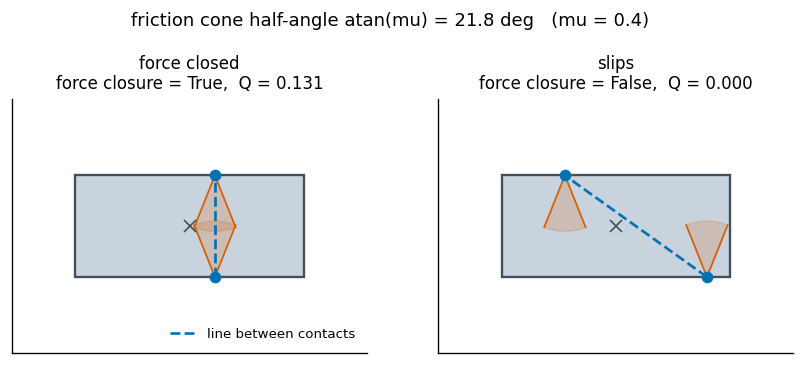
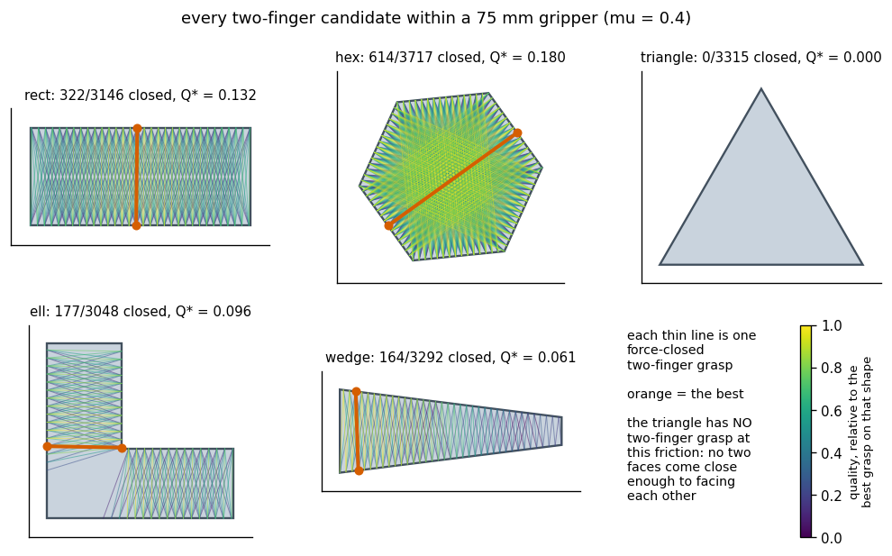
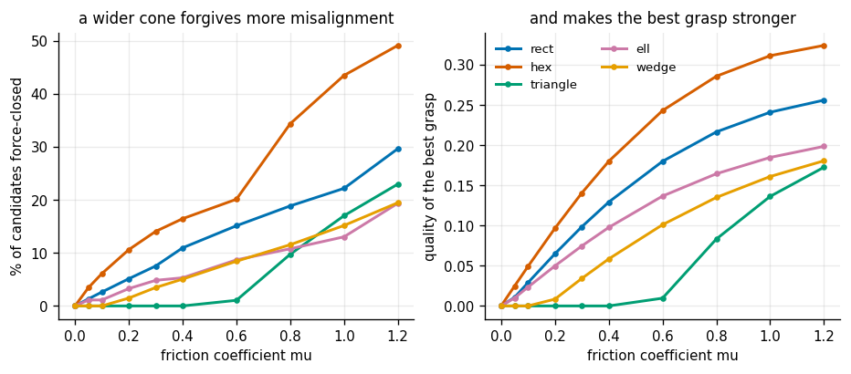
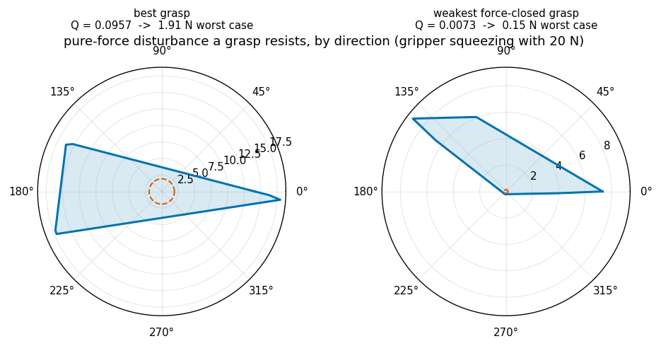
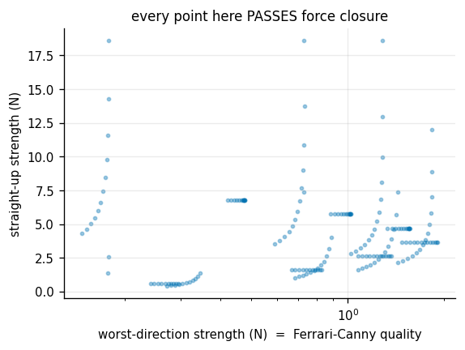
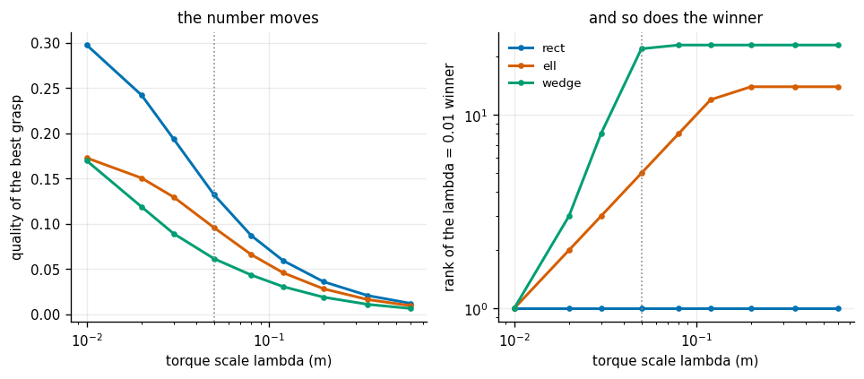
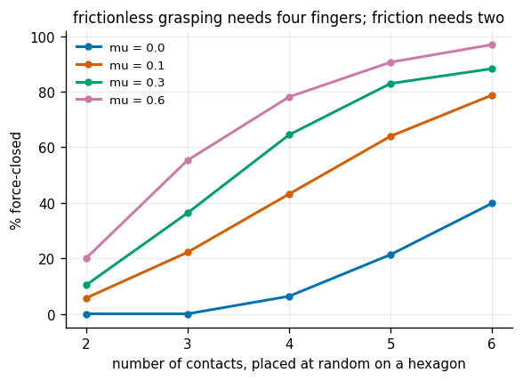

# Analytic 2D Grasp

## Key Insight

Classical [grasp synthesis](/shared/glossary/#grasp-synthesis) uses geometric models of objects to compute contact points that achieve [force closure](/shared/glossary/#force-closure), ensuring the grasp can resist any external disturbance. In a 2D polygonal setup, this is determined by constructing [friction cones](/shared/glossary/#friction-cone) at each contact and checking if their overlap spans the object's center of mass. Visualizing these friction cones and validating force closure is the foundational step for planning stable grasps before moving to complex, high-dimensional objects.

**This is project 39**, the first of Phase 6. It is pure geometry — NumPy and Matplotlib only, no simulator — and it is the phase's foundation: [project 40](../40-top-down-learned-grasp/README.md) reuses the force-closure test written here as the *truth oracle* that labels its training data.

---

## Files

| file | what it is |
|---|---|
| `grasp2d.py` | polygons, friction cones, wrenches, the exact force-closure test, the Ferrari-Canny quality metric |
| `run.py` | the seven experiments |
| `outputs/` | figures and `results.csv` |

```bash
python3 run.py      # about 45 seconds; NumPy and Matplotlib only
```

---

## The one idea, in three steps

Everything in this project is the same idea repeated.

```
  1. a CONTACT can only push in a limited set of directions   -> friction cone
  2. each push direction does something to the whole object    -> a WRENCH
  3. the grasp is good when those wrenches cancel anything     -> force closure
```

**Step 1 — the friction cone.** [Coulomb friction](/shared/glossary/#coulomb-friction) says the sideways force a contact can carry is at most `mu` times the force pressing in: `|f_t| <= mu * f_n`. Draw every force direction that satisfies that and you get a cone around the inward normal with half-angle `atan(mu)`. Push inside the cone and the finger grips; push outside and it slides. With `mu = 0.4` that cone is 21.8 degrees wide — the finger may be almost 22 degrees off square and still hold.

**Step 2 — the wrench.** A *wrench* is what a force does to a whole object, not just to the point it is applied at: two numbers of force plus one of torque in 2D (six numbers in 3D). The torque part is why *where* you push matters and not only which way.

**Step 3 — force closure.** The grasp is force-closed when every possible disturbance can be cancelled by some combination of contact pushes. A finger can push but not pull, so only *non-negative* combinations are allowed — and that one-sidedness is the entire difficulty. The condition works out to a clean geometric statement:

> the origin must lie strictly inside the [convex hull](/shared/glossary/#convex-hull) of the contact wrenches

A [convex hull](/shared/glossary/#convex-hull) is the shape you get by shrink-wrapping a set of points. If the origin is inside it, every direction is covered by some contact. If the origin is on the edge or outside, there is a direction nothing can push against — and a disturbance that way wins.

### A number that is not free: the torque scale

A wrench mixes newtons with newton-metres, and you cannot compare them until you divide the torque by *some* length. `grasp2d.py` calls it `LAMBDA` and sets it to 5 cm, roughly the size of the objects. **This is an arbitrary choice, and experiment 6 measures how much the answer depends on it.** Most grasp-metric papers make the same choice; most do not mention it.

---

## 1. Two grasps, one picture



The same rectangle, the same friction, two finger placements.

| | closing line vs. normal | force closure | quality Q |
|---|---|---|---|
| fingers opposite each other | **0.0 deg** | **True** | 0.131 |
| fingers offset along the block | **54.5 deg** | False | 0.000 |

The rule you can read straight off the figure: **the line joining the two contacts must lie inside both friction cones.** At 54.5 degrees the closing line leaves a 21.8-degree cone by a wide margin, so squeezing merely makes the block squirt out sideways.

This two-finger shortcut is not an approximation. For exactly two frictional point contacts in the plane it is *equivalent* to the full hull test — experiment 4 checks it on 2 465 grasps and finds 100% agreement. The word **antipodal** for such a pair comes from Greek *anti-podes*, "feet opposite": the antipodes are the point on the far side of the Earth, and antipodal contacts are the two points facing each other across the object.

---

## 2. Every candidate grasp on five shapes



Every pair of boundary points within a 75 mm gripper, scored. Each thin line is one force-closed grasp, coloured by quality; the orange line is the best one.

| shape | candidates | force-closed | best Q | quality spread among the closed ones |
|---|---|---|---|---|
| rect | 3 146 | 10.2% | 0.132 | 7.3e-03 .. 1.3e-01 |
| hex | 3 717 | **16.5%** | **0.180** | 6.7e-03 .. 1.8e-01 |
| **triangle** | 3 315 | **0.0%** | — | **none at all** |
| ell | 3 048 | 5.8% | 0.096 | 7.3e-03 .. 9.6e-02 |
| wedge | 3 292 | 5.0% | 0.061 | 1.3e-04 .. 6.1e-02 |

Two rows are worth stopping on.

**The triangle has no two-finger grasp at all.** Not a bad one — none. A triangle has no two faces that come anywhere near facing each other: any two of its edge normals are 120 degrees apart, and the closing line would have to lie within 21.8 degrees of *both*. This is not a search failure, it is geometry. Experiment 3 finds the friction coefficient at which it becomes possible (`mu` just over 0.577, which is `tan(30 deg)`), and that is higher than most real material pairs.

**Only 5-16% of candidates work.** Sampling grasps at random and executing the first one that looks plausible fails five times out of six. That is why grasp *planning* exists as a subject at all.

---

## 3. How much of grasping is just rubber



| shape | `mu = 0` | `mu = 0.4` | `mu = 1.0` |
|---|---|---|---|
| rect | 0.00% | 10.95% | 22.16% |
| hex | 0.00% | 16.44% | 43.44% |
| triangle | 0.00% | **0.00%** | 17.00% |
| ell | 0.00% | 5.31% | 13.02% |
| wedge | 0.00% | 5.05% | 15.16% |

**With no friction, two fingers can never work — on any shape, at any placement.** The reason is dimensional, and it explains the entire industry of rubber fingertips. A frictionless contact can push in exactly *one* direction (straight in along the normal), so two contacts give you two wrench directions. Surrounding the origin in a three-dimensional space needs at least four. Two is not "usually not enough"; it is impossible. Experiment 7 confirms the number is four.

Going from `mu = 0.2` to `mu = 0.4` **multiplies the number of workable grasps by 1.84**. In plain terms: gluing rubber pads onto your fingertips roughly doubles the set of places your planner is allowed to grip, without changing a line of code. Mechanical design and algorithm design trade in the same currency here, and the rubber is cheaper.

---

## 4. Three tests, and which one is wrong

Three ways to answer "is this force-closed?", run on the same 2 465 grasps.

| test | what it does | agrees with the exact test | cost per grasp |
|---|---|---|---|
| **exact** (every pair of wrenches) | searches for a separating direction, exhaustively | — | 119 us |
| **antipodal** (two fingers only) | is the closing line inside both cones? | **100.000%** | ~2 us |
| **random directions** (4 000 samples) | try directions; if none is unopposed, declare success | **99.757%** | 162 us |

**The random-direction test is both slower and wrong.** It is what most people write first, and it fails in the one direction that matters: all six of its errors were **false positives — grasps it declared safe that were not**. A test whose mistakes say "this will hold" when it will not is worse than no test.

The reason is measurable. For the grasp it missed by the widest margin, the set of directions that would have exposed the failure covers **5 in a million of the sphere**. Catching it by sampling needs about **200 000 random directions** — fifty times the budget, for one grasp, with no way to know in advance which grasp needs it.

The exact test avoids sampling entirely with a small piece of reasoning. *If* a separating direction exists at all, you can always rotate it until it is perpendicular to two of the wrenches, so trying `w_i x w_j` for every pair covers every case there is. Finitely many candidates, no luck involved.

The two-finger shortcut, meanwhile, is 60 times faster than the exact test and never wrong — **while the assumption behind it holds**. It applies to exactly two frictional point contacts in the plane. With three fingers, or in 3D, it is no longer equivalent to force closure and you are back to the hull.

---

## 5. What one quality number is hiding

Passing the force-closure test is a yes/no answer, so it cannot rank anything. On the L-shape **177 grasps pass** — and they are not remotely equally good.



Two of those 177, with the gripper squeezing at 20 N. The blue outline is how large a pure force disturbance the grasp resists, direction by direction. The dashed circle is the [Ferrari-Canny metric](/shared/glossary/#ferrari-canny-metric) `Q` — the *worst* direction, which also has to cover the torques the polar plot cannot draw, which is why it sits well inside the outline.

| | Q | holds straight up | holds in its worst direction | ratio |
|---|---|---|---|---|
| best grasp | 0.0957 | 3.67 N | **1.92 N** | 1.9x |
| weakest passing grasp | 0.0073 | **4.31 N** | **0.15 N** | **29x** |

**Read the second row twice.** The weak grasp holds *more* weight straight up than the good one — 4.31 N against 3.67 N. If your test is "does it lift the object", it passes with room to spare. Then something nudges it from an unlucky angle with 0.2 N and it drops.

That is what the Ferrari-Canny metric is for, and why it is a *minimum* over directions rather than an average: a grasp fails in whichever direction it is weakest, and averaging would flatter a grasp that is strong in five directions and helpless in the sixth. It is named after Carlo Ferrari and John Canny, who defined it in 1992.



Every point in that scatter **passes force closure**. Their worst-direction strength spans **0.15 N to 1.91 N** — a factor of 13 — and **52% of them hold less than 1 N in some direction**. The plain consequence: *force closure is a filter, not a ranking.* Use it to throw away the impossible, then rank the survivors with a [grasp quality metric](/shared/glossary/#grasp-quality-metric).

---

## 6. The arbitrary length hiding inside the metric



`Q` mixes forces and torques, so it depends on the length used to make the units comparable. Vary it from 1 cm to 60 cm and re-run the whole search:

| shape | distinct winners across the sweep | worst rank of the `lambda = 1 cm` winner |
|---|---|---|
| rect | 1 | 1st |
| ell | 2 | **14th** |
| wedge | **5** | **23rd** |

On the rectangle the choice does not matter — symmetry makes one grasp dominate at every scale. On the wedge **five different grasps take first place** depending on a number nobody measured, and the grasp that wins at 1 cm falls to 23rd at 60 cm.

The practical reading: **treat a grasp quality number as a filter, not as truth.** Two grasps whose `Q` differs by a factor of two are genuinely different; two whose `Q` differs by 10% may simply have swapped places because of a units convention. Choosing the length near the object's actual size (the dotted line, 5 cm) is the usual convention and at least defensible — it makes "one unit of torque" mean "the force it takes to spin an object this big".

---

## 7. How many fingers you need



Contacts placed at random on a hexagon, 600 trials per cell:

| | 2 contacts | 3 | 4 | 5 | 6 |
|---|---|---|---|---|---|
| `mu = 0.0` | **0.0%** | **0.0%** | **6.3%** | 21.3% | 39.8% |
| `mu = 0.1` | 5.7% | 22.2% | 43.2% | 64.0% | 78.8% |
| `mu = 0.3` | 10.3% | 36.3% | 64.5% | 83.0% | 88.3% |
| `mu = 0.6` | 20.0% | 55.3% | 78.2% | 90.7% | 97.0% |

The frictionless row is the classical theorem, measured: **four contacts is the minimum for force closure in 2D without friction, and the count is exactly zero below it.** (The same argument in 3D gives seven.) With even a little friction — `mu = 0.1`, slippery plastic — two contacts already work 5.7% of the time and three work 22%.

This is the quantitative version of why a two-finger [gripper](/shared/glossary/#gripper) is a sensible design at all. It works *only* because of friction. Take the rubber off and the same gripper cannot hold anything in principle, no matter where you place it.

---

## What to take away

- **Force closure is a "does the hull contain the origin" test**, and the exact version is both faster than sampling and never wrong. Sampling's errors are false positives, which is the dangerous direction.
- **A binary test cannot rank.** Among grasps that all pass, worst-direction strength varies by more than a factor of ten, and the one that lifts the most weight can be the easiest to knock loose.
- **Friction is doing most of the work.** Two fingers hold nothing without it, and doubling `mu` roughly doubles the space of workable grasps.
- **Every grasp metric contains an arbitrary length.** On symmetric objects it does not matter. On awkward ones it changes the winner.

The next project stops assuming the object's shape is known. [Project 40](../40-top-down-learned-grasp/README.md) keeps this exact test as the *truth* — it generates the training labels — but has to choose grasps from a noisy depth image instead, which turns out to be a very different problem.

---

## Try This

1. **Add a third finger** to the `ell` and see whether the notch becomes graspable. `cone_generators` already accepts any number of contacts.
2. **Set the torque scale per shape** (the object's own radius) instead of one global constant, and see whether experiment 6's disagreement shrinks.
3. **Give the two contacts different friction** — a rubber pad and a steel pad. Nothing in the test assumes they match; the two cones simply have different half-angles.
4. **Add soft-finger contacts**, which can also apply a torque about the contact normal. In 2D that is one extra generator per contact, and it lets two fingers grasp shapes that currently fail.
