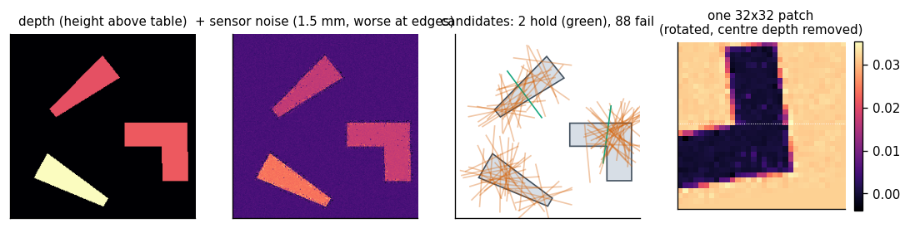
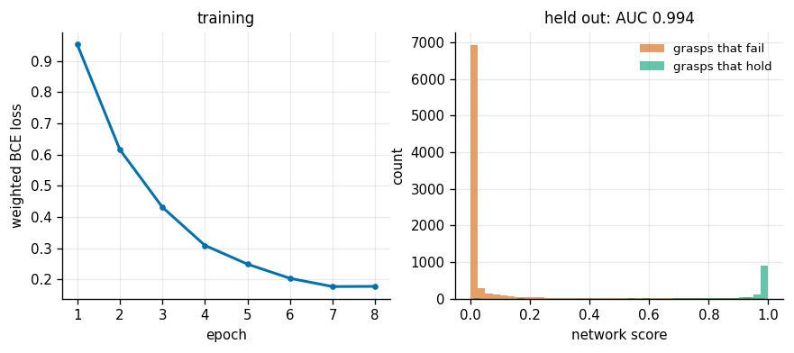
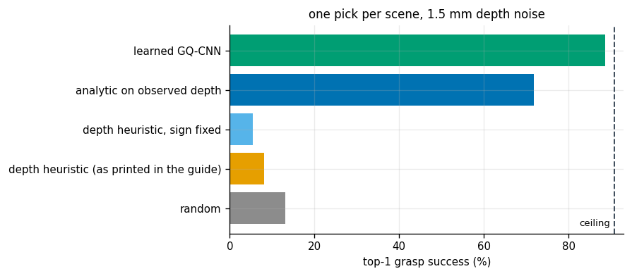
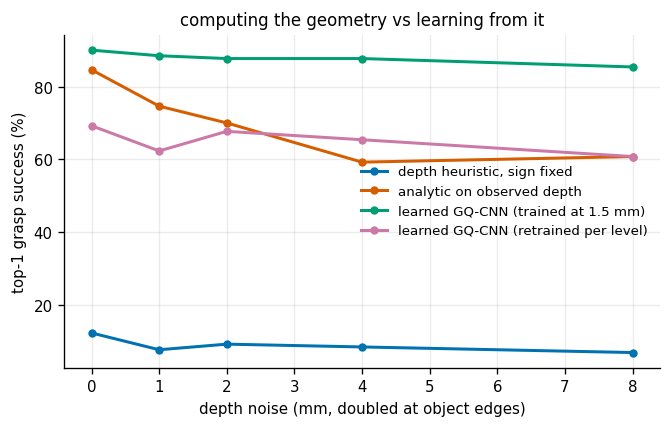
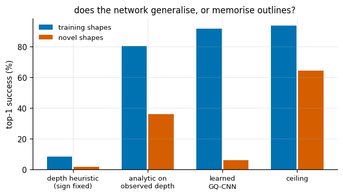
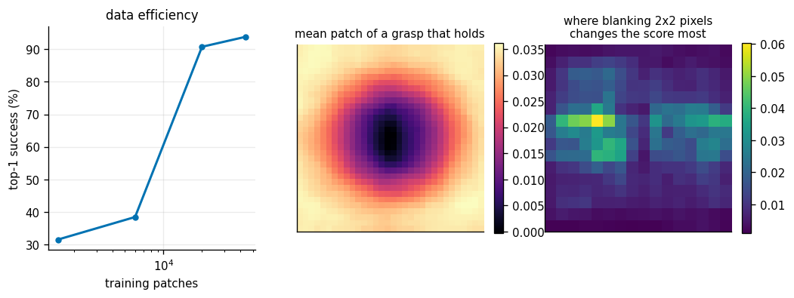

# Top-Down Learned Grasp

## Key Insight

For unstructured environments where object geometry is unknown, robots use a [grasp-quality network](/shared/glossary/#grasp-quality-network) trained on visual data to predict the success of candidate grasps. By feeding [depth maps](/shared/glossary/#depth-map) into the network, the robot can evaluate hundreds of candidate [antipodal grasps](/shared/glossary/#antipodal-grasp) across an object's surface in real-time. This data-driven approach allows the [gripper](/shared/glossary/#gripper) to successfully grasp novel, arbitrary objects without needing explicit 3D computer models of each item.

**This is project 40.** It is [project 39](../39-analytic-2d-grasp/README.md) turned inside out: 39 knew the object's exact shape and computed the answer; here a depth camera gives a noisy picture, and 39's exact test is demoted to the *teacher* that labels the training data.

---

## Files

| file | what it is |
|---|---|
| `topdown.py` | the depth camera, the scenes, the truth oracle (calls project 39), and the two hand-written scorers |
| `net.py` | the [GQ-CNN](/shared/glossary/#gq-cnn): 32x32 depth patch in, one probability out |
| `run.py` | the six experiments |
| `outputs/` | figures and `results.csv` |

```bash
python3 run.py      # about ten minutes on CPU; needs torch, cv2, numpy
```

---

## The setup, and the one thing that makes it possible

The objects are project 39's polygons, extruded upwards into prisms. That single choice is why this project fits on a laptop: because the footprint is a polygon we know exactly, **project 39's force-closure test can label any proposed grasp as truth, with no simulator and no human**. Forty-four thousand labels cost eighty-five seconds.

This is exactly how [Dex-Net](/shared/glossary/#dex-net) was built, only with 3D meshes and a slower physics model. And it is worth being clear about the apparent circularity, because it is the first thing a careful reader asks:

> *If an exact test already labels every grasp, why train a network to imitate it? Just run the exact test.*

Because the exact test needs the object's **true** shape, and at run time you do not have it — you have a depth image with millimetres of noise, missing pixels, and no back side. The two things the network is asked to do that the analytic test cannot are:

1. **work from measurements**, where every geometric quantity is uncertain, and
2. **learn which measurements to trust** — because it was trained on the same kind of noisy pictures it will be shown.

Experiment 4 is where that pays off, and experiment 5 is where it does not.

---

## 1. A scene, its labels, and one training patch



The [depth map](/shared/glossary/#depth-map) is what a top-down camera 60 cm above the table returns. The noise added in the second panel has a specific shape: **it is four times worse at object edges**, because that is where a real sensor mixes the near surface and the far surface into one wrong reading (a "flying pixel"). Edges are also exactly where the fingers go, so the noise attacks the measurement the grasp depends on.

Green lines hold, red lines fail. A grasp holds only when four separate things go right, and the network has to discover all four from pixels:

| the label says | how often, over 44 000 grasps |
|---|---|
| **ok** | **13.9%** |
| not force closed (the two contacts do not face each other) | 68.2% |
| too wide for the gripper | 10.2% |
| force-closed but too weak for the object's weight | 6.8% |
| too narrow, off the object, or the fingers hit a neighbour | 0.9% |

The fourth panel is one training patch. Two conventions in it do most of the work, and both are borrowed from Dex-Net:

- **The crop is rotated** so the fingers always close left-to-right. Without this the network must learn the same grasp separately at every angle, roughly a sixteen-fold waste.
- **The depth at the centre pixel is subtracted.** The network then sees "how much does the surface rise and fall around here", not "how far away is the table". Absolute distance is a fact about where you bolted the camera, not about the grasp, and leaving it in means the model breaks the day someone raises the mount.

---

## 2. Training



| | |
|---|---|
| training patches | 44 000 |
| positive rate | 13.9% |
| held-out accuracy | 0.954 |
| held-out **AUC** | **0.994** |

AUC here is the probability that a randomly chosen *good* grasp scores above a randomly chosen *bad* one — the number that matters when all you ever do is take the arg-max. At 0.994 the network almost never puts a failure above a success.

Accuracy alone would have been misleading: predicting "bad" for everything scores 87%.

---

## 3. Top-1 grasp success

One pick per scene, 220 fresh scenes, at 1.5 mm of depth noise.



| scorer | top-1 success | time per scene |
|---|---|---|
| **ceiling** (some candidate in the set would have held) | **90.9%** | — |
| **learned GQ-CNN** | **88.6%** | 6.3 ms |
| analytic test, run on the observed depth | 71.8% | 16.5 ms |
| random | 13.2% | 1.4 ms |
| the depth heuristic printed in the guide | **8.2%** | 1.7 ms |
| the same heuristic with its second term's sign flipped | 5.5% | 1.9 ms |

**The learned scorer reaches 88.6% of a 90.9% ceiling** — it is very nearly picking the best available grasp every time, and it is faster than the analytic pipeline because it does not have to segment anything.

**Both depth heuristics score below random, and the reason is instructive.** The heuristic samples depth at a *fixed* distance either side of the grasp centre — half the gripper's maximum opening. It is a good score when that distance is tuned to the object, because then one probe lands on the object and the other two land on the table. Here the objects are 40 mm to 100 mm across while the probe is always at 37.5 mm, so both probes usually land back on the same object and the score measures nothing. It then reliably prefers the middle of large flat objects, which are the grasps that are too wide to close.

The lesson is not that the snippet is wrong; it is that **a hand-written scorer carries an assumption about scale, and here that assumption is violated by design.** Flipping the sign of its second term does not rescue it, because the problem is the fixed probe width, not the sign. The two methods that work — the analytic pipeline and the network — both *find* the object's width instead of assuming it.

---

## 4. The noise sweep: where learning pays



| depth noise | analytic on observed depth | learned (trained at 1.5 mm) | learned (retrained at each level) |
|---|---|---|---|
| 0.0 mm | **84.6%** | 90.0% | 69.2% |
| 1.0 mm | 74.6% | 88.5% | 62.3% |
| 2.0 mm | 70.0% | 87.7% | 67.7% |
| 4.0 mm | 59.2% | 87.7% | 65.4% |
| 8.0 mm | **60.8%** | **85.4%** | 60.8% |

**The analytic method loses 24 points across the sweep; the network loses 5.** This is the headline of the whole project. The analytic pipeline has to recover a surface normal from the mask boundary, and a normal that is 25 degrees wrong flips a force-closure verdict all on its own. The network never estimates a normal; it was shown noisy patches with correct labels and learned which patches are reliably graspable *despite* the noise.

The third column is an honest complication, and it points the other way from what you would expect. Retraining the network at each noise level — matching training conditions to test conditions, the textbook advice — performs **worse everywhere**, by 20 points. The reason is mundane and important: those models each saw 320 scenes rather than 1 000, because the sweep has to train five of them. **At this scale, three times the data beats matching the noise level.** Before concluding that a domain-matched model is better, check that it saw as much data.

---

## 5. Novel shapes: where learning does not pay



The same trained network, shown three outlines it has never seen (a T, an arrow, and a tapered slab) instead of the five it trained on.

| | depth heuristic | analytic on observed depth | **learned GQ-CNN** | ceiling |
|---|---|---|---|---|
| training shapes | 8.3% | 80.6% | **91.7%** | 93.9% |
| **novel shapes** | 1.7% | **36.1%** | **6.1%** | 64.4% |

**The network collapses from 91.7% to 6.1% — below random — while the analytic method keeps 36.1%.** Note that the task itself got harder: the ceiling drops from 93.9% to 64.4%, because the novel shapes are thinner and more awkward. But that accounts for a third of the fall, not for all of it.

What the network learned, it appears, was largely *these five outlines*. That is the standard failure of a [data-driven](/shared/glossary/#data-driven-grasping) scorer trained on a narrow object set, and it is why the real Dex-Net dataset contains thousands of meshes rather than five. The analytic method has no such failure mode available to it: it computes the same test on whatever geometry it measures, so a new outline is not a new situation.

The practical reading, and it is the reason both approaches are still in use: **the learned scorer is better where you have data and worse where you do not, and its failure is silent.** It does not report low confidence on the arrow; it confidently picks a bad grasp.

---

## 6. How much data, and what the network looked at



| training patches | top-1 success |
|---|---|
| 1 500 | 31.5% |
| 6 000 | 38.5% |
| **20 000** | **90.8%** |
| 44 000 | 93.8% |

**Almost nothing happens until 20 000 patches, and then almost everything happens at once.** With 14% positives, 6 000 patches contain only ~830 successful grasps spread over five shapes at every angle — not enough to separate "narrow enough to close" from "wide flat surface". This cliff, rather than a gentle curve, is what makes small grasp datasets so frustrating: you cannot tell from the 6 000-sample result whether more data would help.

The right-hand panels ask what the network keys on. Blanking a 2x2 block of pixels and measuring how much the score moves:

| region | how much the score moves |
|---|---|
| the two fingertip sites (left and right edges) | 0.0125 |
| the middle of the patch | **0.0188** |

**The centre matters 1.5 times more than the fingertip sites.** That is not what a textbook grasp analysis would predict — force closure is a statement about the two *contacts*. But the label here is dominated by "is this too wide" and "is there enough object here for the weight", and both of those are visible in the middle of the patch. The network learned what actually predicts the label, which is not the same as what the physics is written in terms of.

---

## What to take away

- **An exact analytic test makes an excellent teacher and a poor deployed system**, because it needs geometry you do not have at run time. Using it to label data is how you get the best of both.
- **The learned scorer's advantage is noise, not accuracy.** On clean depth it beats the analytic pipeline by 5 points; at 8 mm of noise, by 25.
- **Its disadvantage is anything it has not seen.** Five training outlines produced a model that scores below random on a shape with a notch, and it fails confidently.
- **Read your baselines before trusting them.** A three-line depth heuristic that assumes a fixed gripper span scores worse than picking at random on objects of varied size.
- **Check the data budget before believing an ablation.** The "retrained per noise level" curve looks like evidence against domain matching; it is mostly evidence about a third as much data.

[Project 42](../42-anygrasp-pipeline/README.md) drops the top-down restriction and the known-shape oracle at the same time: full [6-DoF grasping](/shared/glossary/#6-dof-grasping) from a [point cloud](/shared/glossary/#point-cloud), with the labels coming from actually executing the grasp in a physics simulator.

---

## Try This

1. **Train on all eight shapes** (move the novel ones into `TRAIN_SHAPES`) and re-run experiment 5. How many outlines does it take before a ninth one transfers?
2. **Feed the network the raw depth** instead of the centre-subtracted patch, then evaluate with the camera 10 cm higher. This should break it, and seeing exactly how much is worth the two minutes.
3. **Add the gripper width as an extra input** and let the network score several widths per position — that is what the full Dex-Net does, and it removes the fixed-width assumption that sinks the hand-written heuristic.
4. **Replace the truth oracle with a physics simulation** (project 42 has one) and see how much the labels disagree. Analytic labels are themselves a model, and the places where they are wrong are where a learned system inherits a bias.
