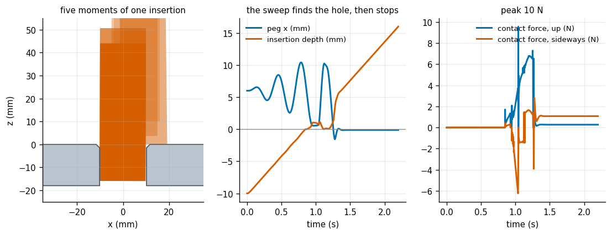
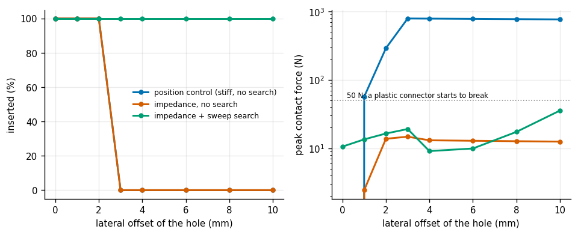
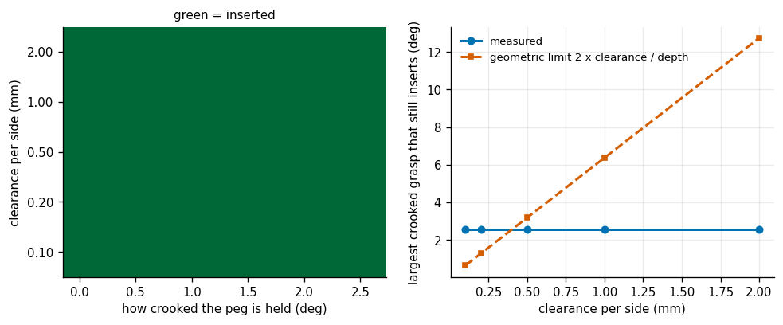
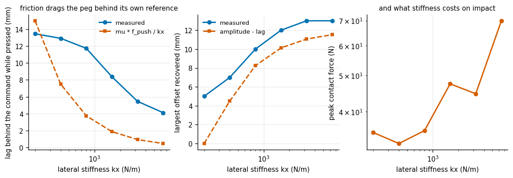
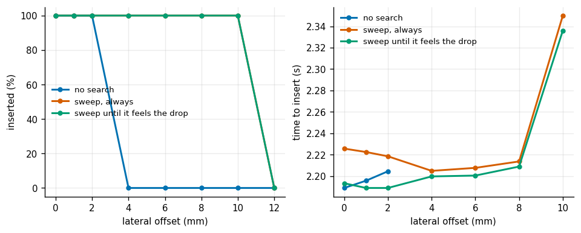
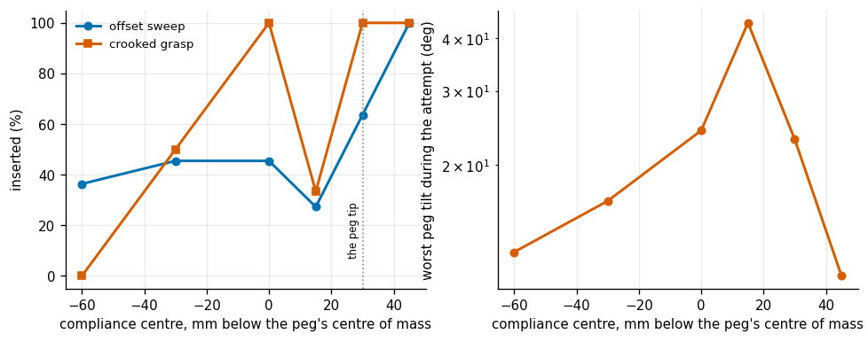
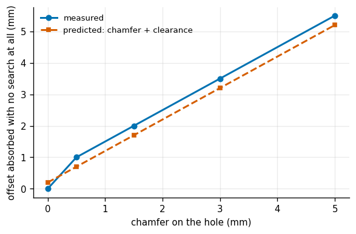

# Peg-in-Hole with Impedance

## Key Insight

Robotic insertion tasks with tiny clearances, such as [peg-in-hole](/shared/glossary/#peg-in-hole) assembly, will fail and jam under rigid position control due to small alignment errors. By employing software [compliance](/shared/glossary/#compliance) via [impedance control](/shared/glossary/#impedance-control), the robot acts as a virtual [spring-damper](/shared/glossary/#damper) system that yields to contact forces rather than fighting them. Combining this compliance with search strategies like spiral force-search allows the robot to locate the hole, align the parts, and complete the insertion smoothly and safely.

**This is project 41.** It is where [project 12](../12-impedance-control/README.md)'s virtual spring earns its keep: 12 built the controller and pushed it against a flat wall, and here it has to fit a 20.0 mm peg into a 20.4 mm hole while the robot's idea of where the hole is is wrong by six millimetres.

---

## Files

| file | what it is |
|---|---|
| `peg.py` | the peg, the chamfered hole, the contact model with [Coulomb friction](/shared/glossary/#coulomb-friction), the impedance controller with a movable compliance centre, and the three search strategies |
| `run.py` | the seven experiments |
| `outputs/` | figures and `results.csv` |

```bash
python3 run.py      # about five minutes; NumPy and Matplotlib only
```

---

## Two modelling choices, and why

**Planar, not 3D.** The classical analysis of insertion (Whitney, 1982) is planar: a rectangular peg, a slot, two contact points, friction. Everything that goes wrong in a real round peg — one-point contact, two-point contact, [jamming](/shared/glossary/#jamming), [wedging](/shared/glossary/#wedging) — already goes wrong here with three state variables instead of six. The one thing the plane cannot show is the *shape* of the search: in 3D you sweep an Archimedean [spiral](/shared/glossary/#spiral-search) across the surface, here you sweep a line back and forth. That is one extra dimension and nothing else changes.

**A hand-written contact model, not a physics engine.** The experiment is a competition between the controller's stiffness and the world's stiffness. If the world's stiffness were a solver setting nobody chose, the sweeps would be measuring the solver. Here `K_CONTACT = 2e5 N/m` is a number in the file, so "how stiff is the world compared to the arm" is a question with an answer.

The scale of the problem, for orientation:

```
   peg width        20.0 mm
   hole width       20.4 mm     ->  clearance 0.20 mm per side (a 2% ratio)
   robot's error    up to 12 mm  ->  SIXTY times the clearance
```

That ratio is the whole subject. No amount of better calibration closes it, because the clearance is what makes the parts a fit in the first place.

---

## 1. One insertion, traced



Six millimetres off, and it goes in.

| | |
|---|---|
| clearance | 0.20 mm per side |
| starting offset | 6.0 mm |
| time to insert | 2.2 s |
| **peak contact force** | **9.9 N** |

The middle panel shows the strategy: while the peg is blocked, the commanded position sweeps sideways with a growing amplitude; the moment the tip drops past the surface the sweep stops and the controller simply pushes down. Ten newtons is a force you could resist with one finger.

---

## 2. What a stiff robot does instead



Same peg, same hole, same offsets. The only difference is the controller.

| controller | inserted | worst contact force |
|---|---|---|
| position control (stiff, no search) | 3 / 8 | **791 N** |
| impedance, no search | 3 / 8 | 14.7 N |
| **impedance + sweep search** | **8 / 8** | 35.5 N |

**The stiff controller does succeed sometimes — by force.** At 2 mm and 4 mm of offset it drives the peg down the chamfer with hundreds of newtons and the parts deflect their way into alignment. Seven hundred and ninety-one newtons is eighty kilograms pressing on a 20 mm peg. On a real cell that is a bent pin, a cracked connector housing, or a tripped force limit; the plot marks 50 N, roughly where a plastic connector starts to yield.

The mechanism is worth stating plainly. A position controller answers the question *"where should the tool be?"* and pushes as hard as its motors allow to get it there. When "there" is inside a steel plate, "as hard as its motors allow" is the answer it gives. The impedance controller answers a different question — *"how should the tool resist being pushed?"* — so contact produces a bounded force by construction. There is also an explicit cap here, `f_push = 12 N`, on how hard it presses down; without it the descending reference keeps sinking into the plate and the spring force grows without limit, which is exactly what the position controller does.

**But compliance alone is not enough**: the compliant controller with no search inserts 3 out of 8, the same as the stiff one. Yielding stops you breaking things; it does not tell you where the hole is. That takes a search.

---

## 3. Clearance, and what actually limits you



The natural expectation is that a tighter hole is harder. Over the range that matters, it is not — but a crooked grasp is.

| clearance per side | crooked grasp still inserted, up to | geometry alone would allow |
|---|---|---|
| 0.10 mm | **2.58 deg** | 0.64 deg |
| 0.20 mm | **2.58 deg** | 1.27 deg |
| 0.50 mm | **2.58 deg** | 3.18 deg |
| 1.00 mm | **2.58 deg** | 6.37 deg |
| 2.00 mm | **2.58 deg** | 12.73 deg |

The "geometry alone" column is `2 x clearance / depth`: a peg tilted by more than that cannot physically pass through a hole of that depth, because its diagonal is wider than the opening.

Two things fall out, and they point in opposite directions.

**At tight clearances the robot beats the geometric limit — by four times.** At 0.10 mm the peg cannot go in at 2.58 degrees *tilted*, and yet it does. It is straightened on the way: the chamfer and the hole lip push the tilted peg upright during the first millimetre of engagement, and by the time it is deep enough for the limit to bite, it is no longer crooked. **This is compliance doing geometric work** — the parts align each other, and the controller's only job is to not fight them.

**At loose clearances the geometry stops being the constraint at all.** The measured limit is flat at 2.58 degrees whether the hole has 0.1 mm or 2 mm of play. Something else is binding: past that tilt the peg's corner catches on the lip in a way this controller cannot recover from. **If you are failing at 2 degrees of misalignment, opening up the tolerance will not help you** — and machining a looser hole is the expensive fix people reach for first.

---

## 4. The search only works if it can out-pull friction



The sweep moves the *command*, not the peg. While the peg is pressed against the plate, friction resists sideways motion, and the spring has to drag it across.

```
   sideways pull available  =  kx * (how far the command has swept)
   friction holding it back =  mu * f_push
```

Set them equal and you get the amount the peg lags behind its own command: `mu * f_push / kx`. Measured against predicted:

| lateral stiffness | measured lag while pressed | predicted `mu·f_push/kx` | largest offset recovered |
|---|---|---|---|
| 200 N/m | **13.5 mm** | 15.0 mm | 5 mm |
| 400 N/m | 12.9 mm | 7.5 mm | 7 mm |
| 800 N/m | 11.7 mm | 3.8 mm | 10 mm |
| 1600 N/m | 8.4 mm | 1.9 mm | 12 mm |
| 3200 N/m | 5.5 mm | 0.9 mm | 13 mm |
| 6400 N/m | **4.1 mm** | 0.5 mm | 13 mm |

**The prediction is right at the soft end and wrong at the stiff end**, and the disagreement is informative. At 200 N/m friction really is the whole story (13.5 measured against 15 predicted). As the spring gets stiffer, friction stops mattering and the lag flattens out at about 4 mm — that residue is not friction at all but *dynamic* tracking error: the reference is sweeping at 3 Hz and the peg has mass, so it arrives late no matter how stiff the spring is. A formula that only models the static balance cannot see that, and would have told you a 6400 N/m spring tracks its command to half a millimetre.

The rightmost panel is the price: peak contact force rises with stiffness, because a stiff spring converts the same position error into a bigger push. **The lateral stiffness is a genuine trade** — soft enough to be safe, stiff enough to drag the peg across the plate — and the two requirements are opposed.

---

## 5. Three search strategies



| strategy | inserted | mean time when it works | mean peak force |
|---|---|---|---|
| no search | 3 / 8 | 2.20 s | 10.1 N |
| sweep, always | 7 / 8 | 2.23 s | 15.9 N |
| sweep until it feels the drop | 7 / 8 | 2.22 s | 16.3 N |

**Searching more than doubles the success rate and costs 30 milliseconds.** The insertion time barely moves because the sweep happens *while* the peg descends, not before it.

The two sweeps tie here, which is worth reporting because it is not what the design predicted. The "stop when you feel the drop" version watches the tip's height and freezes the lateral command as soon as the peg enters — the idea being that continuing to wiggle after you are in scrapes the sides and can pull the peg back out. In earlier tuning (a rotationally softer wrist) that mattered a great deal; with the wrist stiffness used here the blind sweep does not manage to pull itself back out, so the extra logic buys nothing. **The contact-state estimator earns its place only when the rest of the system is loose enough for the failure it prevents to be possible.**

---

## 6. Where the spring is attached



Here is a question that sounds like it has an obvious answer: the spring has one stiffness, so why should it matter *which point on the peg* it pulls on?

It matters because **a force applied away from a point also produces a torque about that point.** Attach the spring at the wrist, and a sideways bump on the peg's tip has a long lever arm, so the peg rotates — tilting itself into a jam. Attach it at the tip, and the lever arm is zero, so the same bump slides the peg sideways, which is the correction you wanted. The mechanical version of this trick — rubber and steel laid out so the elastic centre projects out beyond the wrist to the tool tip — is the [Remote Centre of Compliance](/shared/glossary/#remote-center-of-compliance-rcc), and it is the single part that made robotic assembly work in the 1980s.

For this experiment the wrist's rotational spring is deliberately softened (`KTH_SOFT = 0.15`, versus 1.0 elsewhere). A stiff angular servo straightens the peg by itself and hides the effect entirely — and a real RCC wrist genuinely is this floppy in rotation.

| compliance centre, relative to the peg's centre of mass | inserted (offset sweep) | inserted (crooked grasp) | worst tilt reached |
|---|---|---|---|
| 60 mm **above** (at the wrist) | 4 / 11 | **0 / 6** | 12.4 deg |
| 30 mm above | 5 / 11 | 3 / 6 | 16.4 deg |
| at the centre of mass | 5 / 11 | 6 / 6 | 24.2 deg |
| 15 mm below | 3 / 11 | 2 / 6 | 43.6 deg |
| 30 mm below (**at the peg tip**) | 7 / 11 | 6 / 6 | 23.0 deg |
| **45 mm below (beyond the tip)** | **11 / 11** | **6 / 6** | **10.9 deg** |

**Moving one parameter — with the same springs, the same search, the same peg — takes the success rate from 4/11 to 11/11.** And the best setting is *past* the tip, not at it, which is exactly how commercial RCC wrists are specified: the compliance centre is projected to or beyond the end of the tool.

The last column shows the mechanism directly. The configurations that fail are the ones where the peg ends up flopping at 20-44 degrees; the winning configuration keeps it under 11. The middle rows are noisy (15 mm below does worse than the centre of mass) — with eleven offsets per row, one row is worth about one point of resolution, and the trend, not each row, is the result.

---

## 7. The chamfer: machining beats control



Now switch the search off entirely and let the hole's bevelled mouth do the work.

| chamfer | offset absorbed with **no search at all** | predicted (chamfer + clearance) |
|---|---|---|
| 0.0 mm | 0.0 mm | 0.2 mm |
| 0.5 mm | 1.0 mm | 0.7 mm |
| 1.5 mm | 2.0 mm | 1.7 mm |
| 3.0 mm | 3.5 mm | 3.2 mm |
| 5.0 mm | **5.5 mm** | 5.2 mm |

The prediction is simple geometry: the peg's corner lands on the slope if it is within `chamfer + clearance` of the edge, and once it is on the slope, gravity and the downward push do the rest. Measurement tracks it to within half a millimetre across the whole range.

**A 5 mm [chamfer](/shared/glossary/#chamfer) is worth 5.5 mm of capture range, for free, with no sensing, no search, and no controller.** Compare that against experiment 5, where a sweeping search bought 7 mm and cost a control strategy, a tuned stiffness, and two seconds.

This is the most practically useful number in the project. Before writing an insertion controller, ask whether the part can be chamfered — and if you are designing the part, chamfer it. Assembly is one of the few places in robotics where the mechanical fix is strictly better than the algorithmic one.

---

## What to take away

- **Compliance stops you breaking things; search finds the hole.** Each alone inserts 3/8; together, 8/8.
- **A stiff position controller "succeeds" at 791 N.** Success rate is the wrong metric on its own — always report the force.
- **The search has a condition**: `kx x amplitude > mu x push force`. If the sideways pull cannot beat friction, the command sweeps past a peg that never moves, and the failure is silent.
- **The compliance centre is a free parameter worth as much as everything else combined** — 4/11 to 11/11 from moving it to beyond the peg tip.
- **A chamfer buys capture range one-for-one.** Machining is cheaper than control.
- **Clearance was not the limiting factor** over a 20x range; a 2.6 degree crooked grasp was.

[Project 42](../42-anygrasp-pipeline/README.md) returns to grasping, in full 3D and with a physics simulator judging every attempt.

---

## Try This

1. **Make the peg round and go to 3D.** The contact model becomes a rim-versus-plane test; the search becomes an actual Archimedean spiral. Nothing else in the file changes.
2. **Add force feedback to the search**: stop sweeping when the measured lateral force drops (the peg has entered), instead of watching the tip's height, which a real robot cannot measure.
3. **Vary the friction coefficient** from 0.1 to 0.5 and re-run experiment 4. The prediction says the recoverable offset should fall linearly with `mu`.
4. **Run the strategy through project 12's arm** by feeding the contact wrench into its `simulate(..., ext_fn=...)`, and measure the stiffness the tool *actually* renders versus the one you commanded. A real arm's inertia distorts it, and the distortion is direction-dependent.
