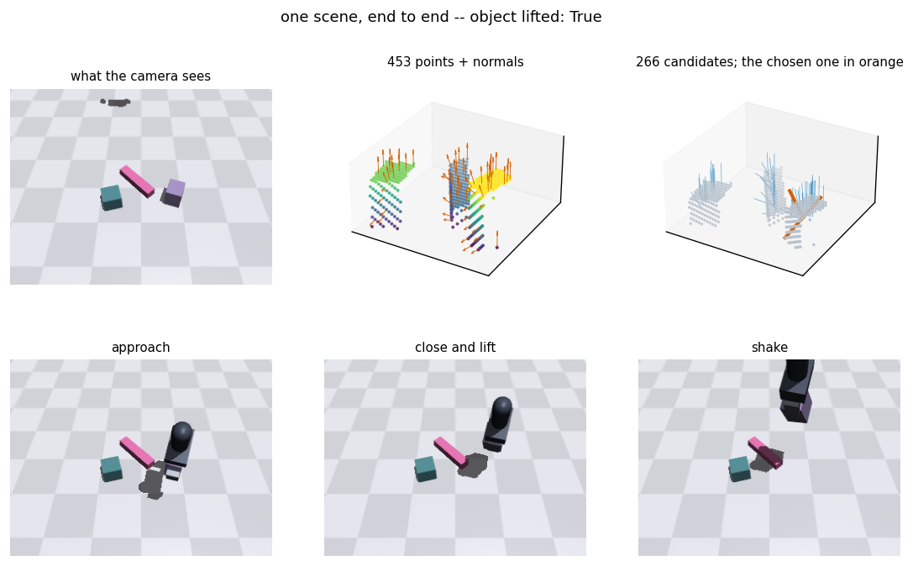
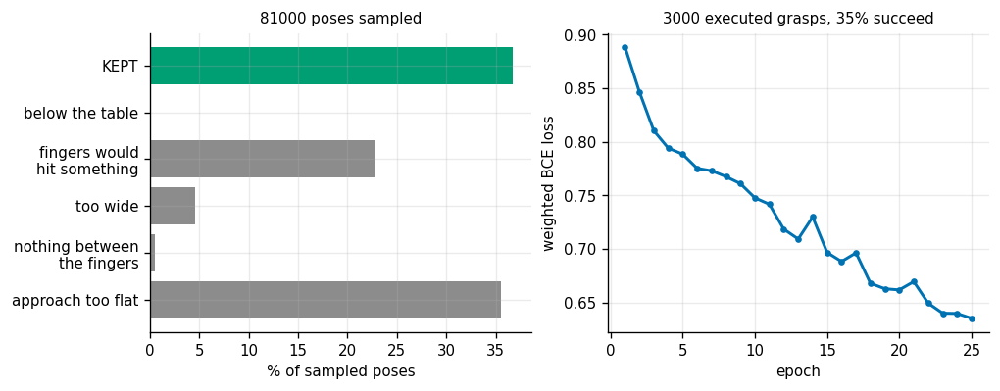
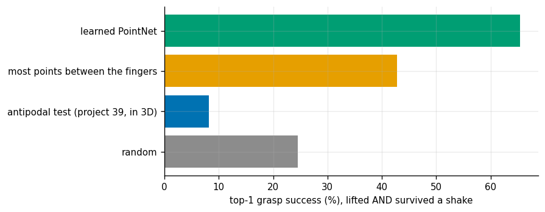
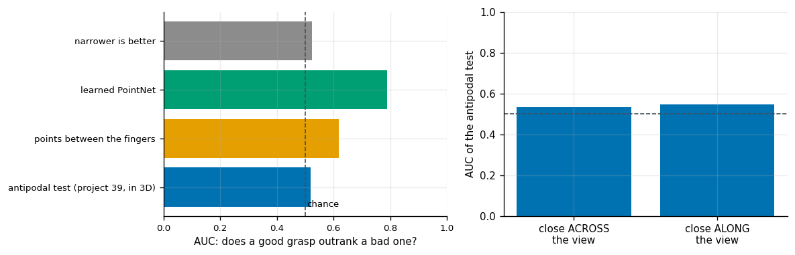
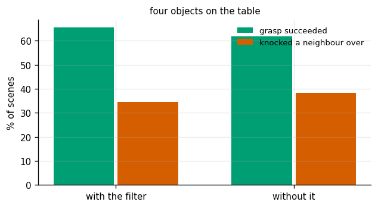
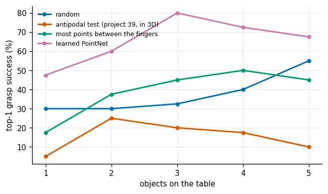
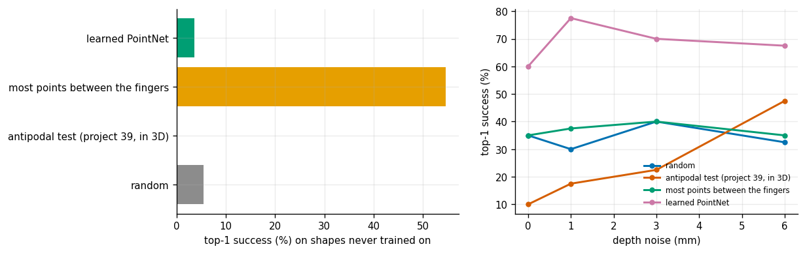

# AnyGrasp Pipeline

## Key Insight

Deploying [AnyGrasp](/shared/glossary/#anygrasp) on a physical manipulator creates a robust 3D grasping pipeline that works directly with raw [point clouds](/shared/glossary/#point-cloud) from a depth camera (which generates a [depth map](/shared/glossary/#depth-map)). The network processes the scene to perform [6-DoF pose estimation](/shared/glossary/#6-dof-pose-estimation) for thousands of candidate grasps, scoring each based on surface geometric features. Executing these grasps on a real arm demonstrates how data-driven models bypass the need for prior CAD models, enabling reliable picking of arbitrary, highly cluttered objects.

**This is project 42.** The published AnyGrasp weights are not freely redistributable and a real arm is not in the room, so this project builds the *same pipeline shape* end to end — depth camera, point cloud, [6-DoF](/shared/glossary/#6-dof-grasping) candidate generation, filtering, learned scoring, execution — with a physics simulator standing in for the arm and a [PointNet](/shared/glossary/#pointnet) small enough to train in ninety seconds standing in for the released model. Every number below comes from a grasp that was actually executed.

---

## Files

| file | what it is |
|---|---|
| `pick.py` | the table, the objects, the parallel-jaw gripper, the depth camera, and `execute()` — the routine that decides whether a grasp worked. **Shared with [project 43](../43-visuomotor-pick/README.md).** |
| `grasps.py` | surface normals, 6-DoF candidate generation, the collision filter, and the antipodal scorer lifted from [project 39](../39-analytic-2d-grasp/README.md) |
| `net.py` | the miniature PointNet |
| `run.py` | the seven experiments |
| `outputs/` | figures and `results.csv` |

```bash
python3 run.py      # about seven minutes on CPU; needs mujoco, torch, numpy
```

---

## Three design decisions, stated rather than hidden

**A floating gripper, not an arm.** [Project 33](../33-rrt-connect-for-an-arm/README.md) already spent a whole project planning arm motions around a shelf. The question here is *which grasp to choose*, and putting an arm in the loop would mix the two: a grasp that scores zero because the elbow could not reach it tells you nothing about the grasp. So the hand is welded to a target we can place anywhere. This is also how grasp datasets such as ACRONYM are generated.

**Slippery objects.** Friction is set to 0.35, roughly smooth plastic on a rubber pad. With sticky contacts almost every candidate that *fits* also *holds*, and then no scorer can beat any other — the benchmark measures nothing. Slippery objects are what makes grasp choice matter.

**Lift, then shake.** After the lift, the gripper oscillates 5 cm sideways at 3 Hz for 0.7 s, and the object has to still be there. This is [project 39](../39-analytic-2d-grasp/README.md)'s quality metric made physical: that project measured a grasp that lifts the weight but falls apart under a nudge from the wrong direction, and a lift-only test cannot tell those apart. Warehouses accelerate hard; so does this benchmark.

---

## 1. The pipeline, stage by stage



```
   depth image  ->  point cloud  ->  normals  ->  candidate poses
                ->  filters  ->  score  ->  execute
```

| | |
|---|---|
| cloud points above the table | 453 |
| candidate grasps generated | 266 |
| candidate generation | 63 ms |

The camera looks down at a slant rather than straight down. That is deliberate: a top-down view of a tabletop gives an almost complete surface, whereas a slanted one leaves the far side of every object missing, which is the defining difficulty of grasping from a single viewpoint.

**Where the candidates come from.** [Project 40](../40-top-down-learned-grasp/README.md) could enumerate every grasp in an image because a top-down grasp is only four numbers. A 6-DoF grasp is six, and enumerating six dimensions is hopeless. So candidates are *generated from the observed surface*: pick a point, take the approach direction to be straight into the surface there, and enumerate only the one remaining freedom — the roll of the wrist about that approach. The surface normal decides five of the six numbers for free.

A [surface normal](/shared/glossary/#point-cloud) is estimated the standard way: take the points within 14 mm, compute their covariance, and take the eigenvector with the *smallest* eigenvalue. The neighbourhood is a little patch of surface, so it spreads out a lot in two directions and hardly at all in the third — and "hardly at all" is the direction sticking out of the surface. The sign is ambiguous from geometry alone (a plane has two faces), so it is resolved the only way one camera can: the normal must point back toward the camera, because that is the side we saw.

---

## 2. The funnel: which filter kills what



81 000 poses sampled across 300 scenes:

| filter | rejected |
|---|---|
| approach too flat (would come at the object sideways or from below) | 35.5% |
| **the fingers would hit something on the way in** | **22.7%** |
| too wide for the gripper | 4.5% |
| nothing between the fingers | 0.5% |
| below the table | 0.1% |
| **kept** | **36.8%** |

**The collision filter throws away more candidates than every geometric test combined.** That is the practical difference between a grasp *detector* and a grasp *planner*: the detector says "these two surfaces face each other", and the planner also has to get the metal there. On a cluttered table, "can the hand physically arrive" is the binding constraint.

The training set is then 3 000 grasps executed in the simulator, of which **35.2% succeeded**. That is the number the network has to predict.

---

## 3. Four scorers, judged by execution



One pick per scene, 110 fresh scenes, success = lifted **and** survived the shake.

| scorer | top-1 success |
|---|---|
| **learned PointNet** | **65.5%** |
| most points between the fingers | 42.7% |
| random | 24.6% |
| **the antipodal test, lifted into 3D** | **8.2%** |

Two results are worth separating.

**The learned scorer wins clearly**, at 2.7 times random. Its input is just the little cloud of points that would end up between the fingers, written in the grasp's own frame — the 3D version of [project 40](../40-top-down-learned-grasp/README.md)'s rotated crop, and for the same reason: it means the network never has to learn the same grasp at forty orientations.

**The point count is a strong, free baseline.** "Grab where there is the most material between the fingers" needs no normals, no training, and no assumptions, and it captures nearly half the gap between random and learned.

**And [project 39](../39-analytic-2d-grasp/README.md)'s exact test — the one that was provably correct in 2D — scores three times *worse* than random.** That deserves its own experiment.

---

## 4. What each score actually knows



The same signals, measured by AUC over 315 executed grasps. (AUC = the probability that a randomly chosen successful grasp scores above a randomly chosen failure; 0.5 is chance.)

| signal | AUC |
|---|---|
| learned PointNet | **0.788** |
| points between the fingers | 0.619 |
| "narrower is better" | 0.525 |
| **antipodal test (project 39, in 3D)** | **0.519** |

**The antipodal test is at chance on average, yet its arg-max is three times worse than random.** Those two facts are not in conflict, and the gap between them is the lesson of this experiment:

> **AUC measures the average ranking. Top-1 success only ever looks at the extreme.** A score can be uninformative overall while its *highest* values pick out a systematically bad kind of grasp — and it is the highest values that a robot acts on.

Concretely: the geometric test rewards two surfaces that face each other squarely. Estimated from a single viewpoint, the surfaces that look most squarely opposed are grazing patches near the silhouette edge of an object, where the normal estimate is dominated by a handful of points on one visible face. Those look ideal and slide straight out of the fingers.

The right-hand panel tests the obvious explanation and **rejects it**. If the problem were the invisible far side, grasps whose fingers close *along* the line of sight (one contact face completely hidden) should score much worse than grasps closing *across* it. Measured: 0.546 against 0.535. **No difference.** The hypothesis was wrong, and it is reported here rather than quietly dropped, because a plausible mechanism that the data does not support is worth as much as one it does.

There is also a striking side effect in experiment 7 below: adding depth noise makes the antipodal test *better* (8% to 47% success). Noise cannot add information, so what it removes is the systematic bias — randomising a score that reliably picks bad grasps improves it, all the way up to chance.

---

## 5. The collision filter



Four objects on the table. The comparison adds, rather than removes: "without it" scores the same candidates *plus* the ones the filter would have rejected.

| | top-1 success | disturbed a neighbouring object |
|---|---|---|
| with the collision filter | **65.5%** | **34.5%** |
| the same candidates, plus the rejected ones | 61.8% | 38.2% |

**A 3.6-point gain in success and 3.6 points fewer knocked-over neighbours** — a real effect, and a smaller one than the funnel's 22.7% rejection rate might suggest. The reason is that the learned scorer has partly learned to avoid the colliding grasps by itself: it was trained on executed outcomes, and a grasp that ploughs into a neighbour usually fails, so the network learned to score it low. **The filter and the network overlap.** The filter is still worth keeping, because it is exact and free and its failures do not depend on the training distribution — but the honest number is 3.6 points, not 22.7.

Note also that a third of successful picks disturb a neighbour even *with* the filter. The filter checks the fingers against the observed points; it cannot see what happens after contact starts.

---

## 6. Clutter



| objects on the table | random | antipodal | most points | **learned** |
|---|---|---|---|---|
| 1 | 30.0% | 5.0% | 17.5% | **47.5%** |
| 2 | 30.0% | 25.0% | 37.5% | **60.0%** |
| 3 | 32.5% | 20.0% | 45.0% | **80.0%** |
| 4 | 40.0% | 17.5% | 50.0% | **72.5%** |
| 5 | 55.0% | 10.0% | 45.0% | **67.5%** |

**Everything gets *better* with more clutter, including random picking**, which is the opposite of what "clutter is hard" would suggest. The reason is a selection effect worth internalising, because it appears in every top-1 benchmark:

> With one object, the pipeline must grasp *that* object. With five, it only has to find *one* good grasp anywhere on the table — and five objects offer five times as many chances.

Random goes from 30% to 55% for exactly this reason and does no learning at all. If you report a top-1 bin-picking number without saying how many objects were in the bin, the number is close to meaningless.

The learned scorer peaks at three objects and falls back slightly at five, which is the real clutter effect finally showing through: with five objects the neighbours start blocking the good grasps.

---

## 7. Novel shapes and a noisy camera



Trained on boxes, cylinders and bars; tested on L-shapes and T-shapes.

| scorer | training shapes (from experiment 3) | **novel shapes** |
|---|---|---|
| **learned PointNet** | **65.5%** | **3.6%** |
| most points between the fingers | 42.7% | **54.5%** |
| random | 24.6% | 5.5% |
| antipodal test | 8.2% | 0.0% |

**The learned scorer collapses to 3.6% — below random — while the untrained point-count heuristic actually goes *up*, to 54.5%.**

This is the same inversion [project 40](../40-top-down-learned-grasp/README.md) found with its 2D outlines, now reproduced in 6-DoF with physics-derived labels. Two independent setups, the same conclusion: **a learned grasp scorer trained on a narrow object set has learned the object set, and it fails confidently rather than reporting doubt.** It is exactly why the real Dex-Net and GraspNet datasets contain thousands of meshes and why "we trained on N object categories" is the first number to look for in a grasping paper.

The depth-noise sweep:

| depth noise | antipodal | most points | learned |
|---|---|---|---|
| 0 mm | 10.0% | 35.0% | 60.0% |
| 1 mm | 17.5% | 37.5% | **77.5%** |
| 3 mm | 22.5% | 40.0% | 70.0% |
| 6 mm | **47.5%** | 35.0% | 67.5% |

The learned scorer is essentially flat (the wobble is 40-scene sampling noise), which matches [project 40](../40-top-down-learned-grasp/README.md)'s result that a network trained on noisy data stays flat under noise. And the antipodal test climbs from 10% to 47% *because* of the noise, as explained in experiment 4 — the least intuitive number in this project, and a clean demonstration that a score below chance is worse than no score at all.

---

## What to take away

- **Generate candidates from the surface, do not search the pose space.** The normal determines five of six degrees of freedom; only the wrist roll has to be enumerated.
- **The collision filter is the biggest single filter** (22.7% of candidates), but only worth 3.6 points of success once a learned scorer has partly absorbed the same information.
- **AUC and top-1 can disagree completely.** A signal at chance on average can be actively harmful at its maximum, and the maximum is what the robot executes.
- **Report the number of objects in the bin.** Random picking goes from 30% to 55% between one and five objects.
- **A learned scorer fails silently on unseen shapes**, and the trivial heuristic it beat by 23 points beats *it* by 51 on shapes it has not seen.

[Project 43](../43-visuomotor-pick/README.md) uses this same simulator but asks a different question: instead of choosing one grasp and executing it open-loop, can a policy steer the hand there from camera images, one small step at a time?

---

## Try This

1. **Add a second camera** on the opposite side and merge the clouds. Experiment 4 says visibility was not the antipodal test's problem — this measures whether that survives the obvious fix.
2. **Train on the L and T shapes as well** and re-run experiment 7. How many shape families does it take before a new one transfers?
3. **Swap the shake for a heavier object** and see whether the ranking of scorers changes. The benchmark's difficulty knob is friction and mass, and every conclusion here is conditional on where it is set.
4. **Feed the learned scorer the collision-filtered candidates only during training** but all candidates at test time, and see how much of the filter it really learned.
