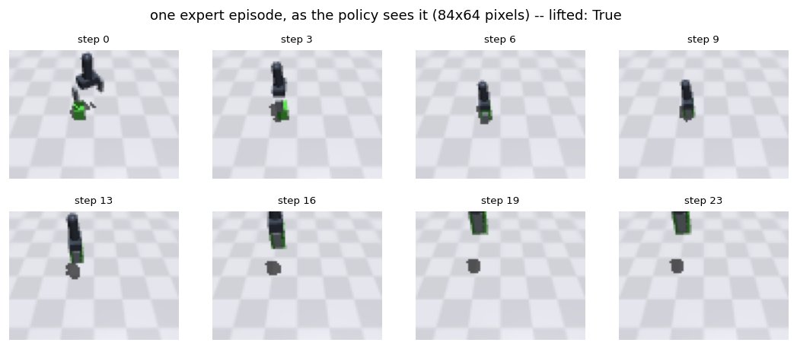
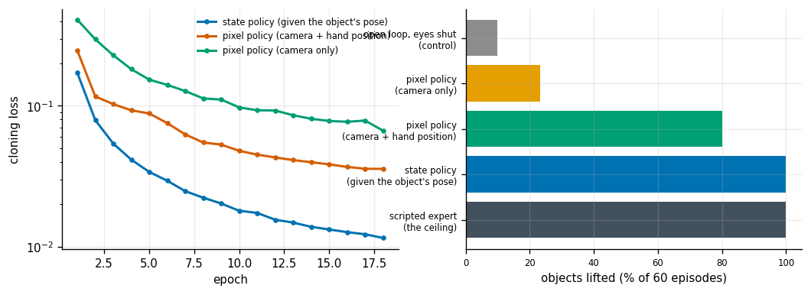
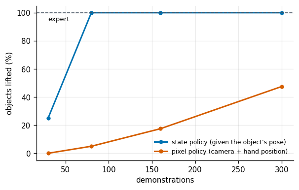
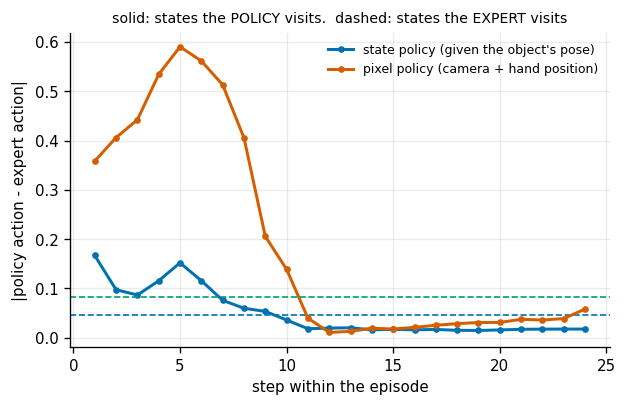
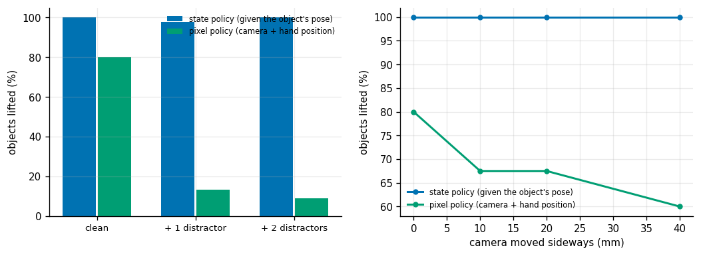

# Visuomotor Pick

## Key Insight

Rather than dividing a [manipulation](/shared/glossary/#manipulation) task into separate perception, planning, and control steps, a [visuomotor policy](/shared/glossary/#visuomotor-policy) maps camera images directly to joint motor commands. Training such policies end-to-end using [reinforcement learning](/shared/glossary/#reinforcement-learning) inside simulators like [MuJoCo](/shared/glossary/#mujoco) allows the robot to adapt to visual variations and contact dynamics. This direct connection between sight and action enables highly reactive pick-and-place behaviors that can handle moving targets and unexpected physical disturbances during execution.

**This is project 43.** It reuses [project 42](../42-anygrasp-pipeline/README.md)'s simulator and gripper and asks a different question: instead of computing one grasp and executing it open-loop, can a network steer the hand to the object from camera images, one small step at a time?

The policy here is trained by [behavior cloning](/shared/glossary/#behavior-cloning) rather than reinforcement learning. That is a deliberate downscale and it is worth naming: RL from pixels on this task needs millions of environment steps, which is a GPU-week, while cloning a scripted expert needs 300 episodes and eight minutes. What is lost is the ability to exceed the expert; what is kept — and what this project is actually about — is the *end-to-end* part: one network, pixels in, motion out, with no pose estimation step in the middle.

---

## Files

| file | what it is |
|---|---|
| `env.py` | the pick task on top of project 42's simulator: an action, an observation, an episode, and the scripted expert |
| `policy.py` | three policies with an identical body and different inputs |
| `run.py` | the seven experiments |
| `outputs/` | figures and `results.csv` |

```bash
python3 run.py      # about nine minutes on CPU; needs mujoco, torch, numpy
```

---

## The task

```
  observation  ->  84 x 64 RGB image + where the robot's own hand is
  action       ->  dx, dy, dz, d(yaw), open/close        (5 numbers)
  episode      ->  24 decisions
  success      ->  the object ends up 8 cm off the table
```

The hand starts somewhere above the table, deliberately *not* over the object, with a random wrist angle. It has to move across, turn the wrist to close across the object's short axis, come down, close, and lift.

**One number was changed from project 42**, and stating it matters: the objects' friction is raised from 0.35 to 0.9. Project 42 made them slippery on purpose, so that *which* grasp you choose decides whether it holds — that was the thing it measured. Here the thing being measured is whether a policy can steer itself to a good grasp from pictures, so the grasp itself must be reliable; otherwise every score is half policy skill and half coin flip.

### The expert, and why it cannot be deployed

The expert reads the object's exact position and orientation from the simulator. It is *privileged*: on a real robot it would need a perfect pose estimator, which is the thing we are trying to avoid building. It lands the object **300 times out of 300**.

Two details in the script were bugs before they were features:

- **Latch the gripper.** Once the fingers are shut, the only remaining action is to lift. Without that latch the script re-runs its alignment test, sees the hand is low, opens again, and loops forever — and every demonstration it records teaches the policy to do the same.
- **Do not aim at the object's centre of mass.** The fingers are 48 mm long and stick out below the hand, so aiming the middle of the fingers at the middle of a short object drives the fingertips into the table. Short objects must be gripped near their top.

---

## 1. What the policy sees



Eighty-four by sixty-four pixels, from a fixed camera at the edge of the table. The hand is in the frame, which matters: a third-person camera has to show both the robot and the object for an end-to-end policy to work at all.

The policy is *also* given its own hand position. That looks redundant — the hand is right there in the image — and it is worth saying why it is not:

> Extracting the hand's exact position from a 84 x 64 image is a hard perception problem in itself, and it is one the robot never needs to solve, because joint encoders report it exactly and for free. Feeding proprioception alongside pixels is standard in every real visuomotor system for this reason. **The camera is there for the things the robot cannot already measure — the object.** Experiment 3's third row measures precisely what removing this costs.

---

## 2. Cloning

All three policies share the same convolutional body and the same training loop; only the input differs. Any difference in the results is therefore a difference in *information*, not in architecture, which is the only way the comparison means anything.

| policy | sees | held-out action error |
|---|---|---|
| state | the object's true pose + hand position | **0.047** |
| pixel | the camera image + hand position | 0.084 |
| image-only | the camera image | 0.103 |

| | |
|---|---|
| expert episodes collected | 300 (all successful) |
| training frames | 7 200 |
| collection time | 58 s |

---

## 3. Success rates



| | objects lifted |
|---|---|
| scripted expert (the ceiling) | **100%** |
| **state policy** (given the object's pose) | **100%** |
| **pixel policy** (camera + hand position) | **80%** |
| pixel policy (camera only) | 23% |
| **open loop, eyes shut (control)** | **10%** |

Read the last row first. It replays the *average* expert action sequence with no observation at all. At 10% it establishes that the task genuinely requires feedback — without that control, an 80% result proves nothing, because a task where the object is always in roughly the same place can be solved by a fixed motion.

**The pixel policy pays 20 points for having to look.** The state policy is handed five numbers that exactly describe the object; the pixel policy has to extract the same information from 16 000 noisy ones, and it recovers most but not all of it. That gap is the honest cost of end-to-end, and it is the reason production systems still often run a pose estimator: the 20 points are cheaper to buy with a better perception module than with more data.

**Removing proprioception costs 57 points** (80% to 23%), far more than removing the object's pose did. This is the answer to the "isn't the hand already in the image?" question above: it is in the image, and the network cannot get it out well enough to act on. Encoders are exact, free, and unoccluded, and no amount of convolution competes with that.

---

## 4. How many demonstrations



| demonstrations | state policy | pixel policy |
|---|---|---|
| ~30 | 25% | 0% |
| ~80 | **100%** | 5% |
| ~160 | 100% | 17.5% |
| ~300 | 100% | **47.5%** |

(This sweep retrains from scratch with a different random seed and grades on 40 episodes rather than 60, so its 300-demonstration point — 47.5% — sits below the 80% reported in experiment 3 for the same amount of data. **Seed and evaluation size move a pixel policy by tens of points at this scale**, which is worth knowing before reading any single number here as precise. The shape of the curve is the result; its height is not.)

**The state policy is finished at 80 demonstrations; the pixel policy is still climbing at 300.** That is the data cost of learning perception and control together instead of separately: the state policy has to learn a five-input control law, and the pixel policy has to learn the same control law *plus* a visual encoder, from the same 24 numbers per episode of supervision.

The practical reading, and it is why "just clone it end-to-end" is not free advice: **an end-to-end policy needs roughly an order of magnitude more demonstrations than a policy given the state**, and demonstrations on real hardware are the expensive resource in the whole field.

---

## 5. Compounding error: the gap between watching and doing



This is [behavior cloning](/shared/glossary/#behavior-cloning)'s known failure, measured directly. Solid lines are the policy's error *at the states it actually reaches when driving*; dashed lines are its error on held-out states the *expert* reached.

| | on the expert's own states | worst point while driving (step 5) | step 24 | worst / held-out |
|---|---|---|---|---|
| state policy | 0.047 | **0.150** | 0.018 | **3.2x** |
| pixel policy | 0.084 | **0.590** | 0.058 | **7.1x** |

**Both policies are three to seven times worse on the states they drive themselves into than on the states the expert put them in** — and the gap is entirely inside the first ten steps, the part of the episode where the hand is crossing the table and the wrist is turning. By the time the hand is over the object, both are *below* their held-out error, because the remaining actions are "come down", "close", "lift", and those are easy.

That shape is worth reading carefully, because it is not the textbook picture of error growing steadily with time. What it says is that **the distribution shift lives where the decisions are hard**, and here that is the approach. The reaching phase is where the expert's demonstrations are most spread out (every episode starts somewhere different), so it is also where the policy is most likely to end up somewhere the data does not cover — and the pixel policy, which has to work out where things are from an image, ends up there four times as often.

The mechanism: cloning only ever shows the network states the expert visited. The moment the policy makes a small error, it is somewhere the expert never went, where its training says nothing — so it errs more, and lands somewhere stranger still. [DAgger](/shared/glossary/#dagger) exists precisely to close this loop by asking the expert what it would have done *at the states the policy reaches*, and it is [project 55](../55-dagger/README.md) in Phase 8.

---

## 6 + 7. Two ways to break it



**A distractor object.** One or two extra objects are added to the table that have nothing to do with the task; the policy must still pick the first one.

| | state policy | pixel policy |
|---|---|---|
| clean | 100% | **80.0%** |
| + 1 distractor | 97.8% | **13.3%** |
| + 2 distractors | 100% | **8.9%** |

**One irrelevant object on the table takes the pixel policy from 80% to 13%.** The state policy does not notice, because its input is five numbers describing the object it is supposed to pick and nothing else.

This is the sharpest result in the project and the one with the most direct consequence. The pixel policy was trained on scenes with exactly one object, so "the object" and "the only thing on the table" were the same thing in every training image, and the network had no reason to learn which one it was told to pick. It did not learn a *wrong* rule; it learned a rule that was correct on every example it saw. **The cost of end-to-end learning is that the network chooses its own features, and it will happily choose one that is an accident of your data collection.**

Nothing about this is fixable with a bigger network. It is fixable by collecting demonstrations with distractors present, which is a statement about the dataset, not the model.

**Moving the camera.** Nothing about the physics changes; only the pictures do.

| camera moved sideways | state policy | pixel policy |
|---|---|---|
| 0 mm | 100% | 80.0% |
| 10 mm | 100% | 67.5% |
| 20 mm | 100% | 67.5% |
| 40 mm | 100% | **60.0%** |

**Four centimetres of camera movement costs 20 points**, and the state policy is untouched because the camera is not in its input at all.

The degradation is gentler than the distractor result, which is itself informative: the network has clearly learned something about the *relative* geometry of hand and object rather than memorising absolute pixel coordinates, or a 40 mm shift (about 8% of the image width) would have destroyed it. But 20 points is still 20 points, and it comes from something no one would think to log — a mounting bracket that was bumped, a tripod nudged during cleaning.

**A pixel policy is coupled to its camera in a way that nothing in the code records.** That is the practical reason production visuomotor systems either fix the camera rigidly, calibrate it and warp the image back into a canonical frame, or randomize the camera pose during data collection ([project 44](../44-in-hand-cube-reorientation/README.md) measures what that kind of randomization typically costs and buys).

---

## What to take away

- **Always run the eyes-shut control.** Replaying the mean expert action scores 10% here; any headline number has to be read against it.
- **End-to-end costs data, not just accuracy.** The state policy saturates at 80 demonstrations; the pixel policy is still improving at 300.
- **Proprioception is not redundant with a camera that shows the robot.** Removing it costs more than removing the object's pose.
- **Cloning's error grows within an episode**, because the states a policy reaches are not the states it was trained on. That is a property of the training scheme, not of the network.
- **A pixel policy is coupled to the camera it trained with.** Nothing physical changes when the mount shifts, and the policy does not know that.

---

## Try This

1. **Add [DAgger](/shared/glossary/#dagger)**: roll out the policy, ask the expert what it would have done at each state it reached, add those to the dataset, retrain. Experiment 5 measures exactly the quantity DAgger is designed to shrink.
2. **Randomize the camera pose during data collection** and re-run experiment 7. This is [domain randomization](/shared/glossary/#domain-randomization) applied to perception, and [project 44](../44-in-hand-cube-reorientation/README.md) shows what its premium usually looks like.
3. **Give the policy the last two frames** instead of one. Nothing in a single frame says whether the object is moving, and a stack of frames is the cheapest possible memory.
4. **Move the camera onto the wrist.** A wrist camera never loses the object to distance but does lose it to its own fingers — the trade that makes [tactile sensing](/shared/glossary/#tactile-sensing) interesting.
