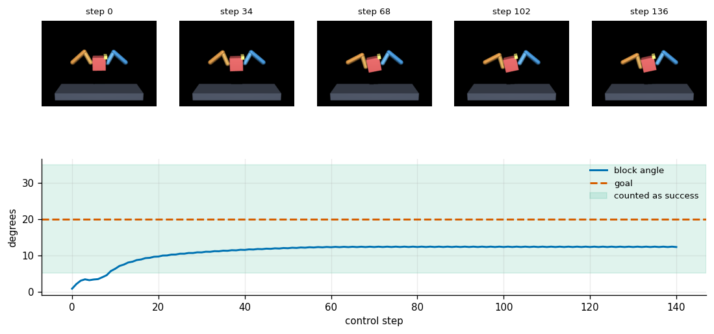
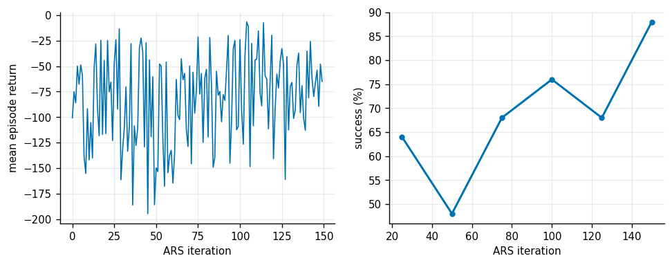
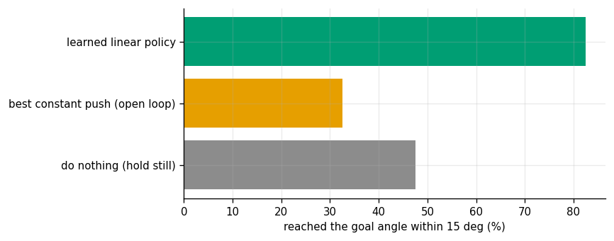
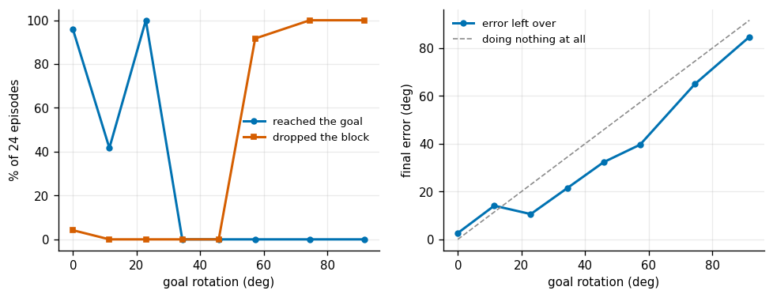
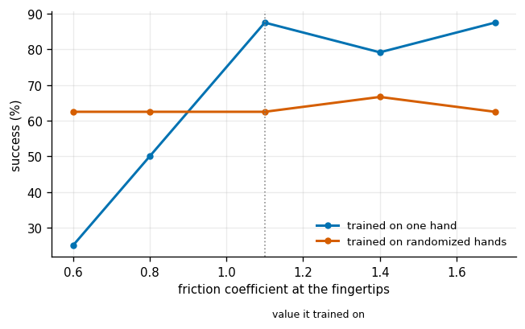
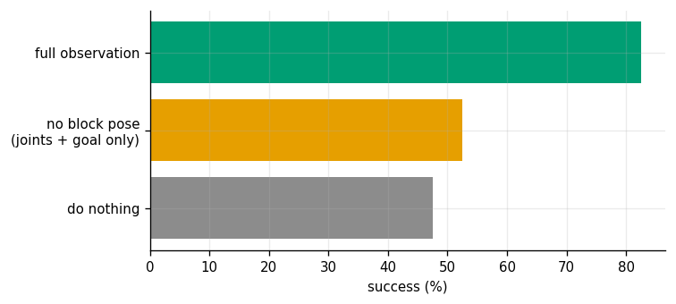

# In-Hand Cube Reorientation

## Key Insight

Controlling multi-finger hands to perform [in-hand manipulation](/shared/glossary/#in-hand-manipulation) requires managing continuous contact changes and joint coordination. By training a control [policy](/shared/glossary/#policy) using [reinforcement learning](/shared/glossary/#reinforcement-learning) in a physics simulator like [MuJoCo](/shared/glossary/#mujoco), the robot can learn to rotate a cube to arbitrary target orientations. Applying [sim-to-real](/shared/glossary/#sim-to-real) transfer techniques ensures the learned [policy](/shared/glossary/#policy) remains robust against the unmodeled friction, [backlash](/shared/glossary/#backlash), and sensor noise of physical robotic hands.

**This is project 44.** It is the only project in Phase 6 where the contacts *move during the task* — the whole difficulty of in-hand manipulation — and the only one trained by [reinforcement learning](/shared/glossary/#reinforcement-learning) rather than by imitation or supervision.

---

## Files

| file | what it is |
|---|---|
| `hand.py` | the planar two-finger hand, the block, the reward, and the episode |
| `ars.py` | Augmented Random Search: [evolution strategies](/shared/glossary/#evolution-strategies) in sixty lines |
| `run.py` | the seven experiments |
| `outputs/` | figures and `results.csv` |

```bash
python3 run.py      # about six minutes on CPU; needs mujoco, numpy, matplotlib
```

---

## What is downscaled, and what is not

The famous in-hand results (OpenAI's Rubik's cube; the Shadow-hand papers) use a 24-joint hand, vision or touch, and tens of thousands of GPU-hours. None of that fits on a laptop. What *does* fit is the part that makes in-hand manipulation different from every other control problem in this guide:

> **The contacts are not fixed.** Which face each finger touches, and whether it is rolling or sliding, changes several times during one rotation, and the controller has to keep working across those changes.

Two fingers and a square in a plane reproduce that faithfully and run at ten thousand simulator steps a second.

**The honest limitation, stated before the results rather than after:** a planar two-finger hand cannot rotate a square indefinitely. Past some angle a finger runs out of travel, and the only way onward is to *let go and re-grasp* — finger gaiting — which this hand deliberately does not have. Experiment 4 measures exactly where that wall is, and it is the most useful number here.

The block is held **in the air** between the two fingertips, not resting on a shelf. A shelf sounds easier, but then rotating the block means fighting the shelf's friction and the experiment stops being about the two contacts. Held in the air, the grasp is precisely [project 39](../39-analytic-2d-grasp/README.md)'s two-frictional-contact problem, and rotating it means rolling those two contacts around the block.

### Why ARS rather than PPO

[ARS](/shared/glossary/#evolution-strategies) (Mania, Guy and Recht, 2018) is the whole algorithm in three lines:

```
  1. draw N random perturbations of the policy weights
  2. run one episode with (weights + delta) and one with (weights - delta)
  3. step the weights toward the deltas whose PLUS run beat their MINUS run
```

No value function, no replay buffer, no backpropagation through the simulator. This task has **72 policy parameters** and an episode that runs in 15 milliseconds, and its dynamics are a sequence of contact events whose gradients are either undefined or useless. ARS never differentiates anything; it only compares two numbers. The price is that it scales badly with parameter count, which is why nobody trains a convolutional network this way.

---

## 1. The hand, and one learned episode



The fingers do not push the block around like a bulldozer; they roll their contact points across its faces, one advancing while the other retreats, and the block turns between them.

| | |
|---|---|
| goal for this episode | 20.1 deg |
| where it settles | 12.3 deg |
| dropped | no |

Two things in the lower plot are typical of the whole project. The turn happens in the **first forty steps** and then stops — the policy is not slowly grinding towards the goal, it is running out of finger travel. And it settles **eight degrees short**, inside the 15-degree tolerance but visibly short, which is the same residual error experiment 4 charts across the whole range of goals.

---

## 2. Learning



| | |
|---|---|
| policy | linear, **72 parameters** |
| ARS iterations | 150 |
| episodes simulated | 4 800 |
| wall-clock | **75 s** |
| success at 25 iterations | 64% |
| success at the end | **88%** |

Two implementation details did more work than the algorithm itself, and both are the kind of thing that turns "it doesn't learn" into "it learns in a minute".

**A standard deviation floor on the observation normalizer.** ARS standardizes each observation by its running standard deviation, because a linear policy multiplies each input by one weight and an input that ranges over 3 would otherwise get thirty times the influence of one that ranges over 0.1. But several of these observations barely move during an episode — the block's height changes by two millimetres — and dividing by their *true* standard deviation multiplies that wobble by five hundred. The policy then saturates its actuators on sensor noise and throws the block within five steps. Asking for standardized inputs can get you amplified ones; the floor (0.1) fixes it in one line.

**A drop penalty that covers the steps that will not happen.** The reward is `-|angle error|` at every step, and dropping the block ends the episode. With a small fixed drop penalty, *the fastest way to stop losing points is to throw the block away immediately* — and the search finds that within ten iterations, reporting a beautifully improving return while doing nothing useful. Charging for the remaining steps at a worse-than-worst rate makes holding on strictly better than quitting.

This is worth generalising: **any early-terminating episode needs its terminal penalty priced against the reward it avoids.** Otherwise "fail fast" is the optimal policy.

---

## 3. Against two baselines



| | success (within 15 deg) | mean final error | drop rate |
|---|---|---|---|
| do nothing (just hold still) | 47.5% | 16.6 deg | 0% |
| best constant push, found by trying 150 of them | **32.5%** | 23.9 deg | 0% |
| **learned linear policy** | **82.5%** | **6.8 deg** | 15% |

**Read the first row before the third.** Doing nothing scores 47.5%, because goals are drawn uniformly in ±34 degrees and the tolerance is 15 degrees — so nearly half the goals are already satisfied at the start. Any paper reporting 60% on a task like this without a do-nothing control has reported nothing. The mean-error column is the honest headline: **16.6 degrees down to 6.8**.

**The best open-loop push is worse than doing nothing.** A constant action cannot be conditioned on the goal, so it turns the block by whatever amount it turns the block and overshoots half the targets. That is the control that establishes the task genuinely needs a *policy*, not just a motion.

The learned policy drops the block on 15% of episodes. That is the trade it has chosen: pushing hard enough to turn the block also risks losing it, and the reward function's exchange rate between the two is what sets the balance.

---

## 4 + 5. How far it turns before it has to let go



| goal | reached it | dropped | error left over |
|---|---|---|---|
| 0 deg | 95.8% | 4.2% | 2.6 deg |
| 11 deg | 41.7% | 0% | 14.1 deg |
| **23 deg** | **100%** | 0% | 10.6 deg |
| **34 deg** | **0%** | 0% | 21.4 deg |
| 46 deg | 0% | 0% | 32.3 deg |
| **57 deg** | 0% | **91.7%** | 39.6 deg |
| 74 deg | 0% | **100%** | 64.9 deg |
| 92 deg | 0% | 100% | 84.7 deg |

**There are two different walls here, and they are 25 degrees apart.**

The first is at about 30 degrees: beyond it the policy still turns the block *part* of the way (the right panel shows the leftover error staying below the do-nothing line at every goal), but never far enough to land inside the tolerance. This is the fingers running out of travel — the geometric limit promised at the top of this page. To go further the hand would have to release one finger, reposition it, and re-grip, which is [finger gaiting](/shared/glossary/#in-hand-manipulation), and it is the single feature separating this project from the published in-hand results.

The second is at about 55 degrees, where the drop rate goes from 0% to 92% in one step. Past this point the policy is trying so hard that it loses the grasp. **A robot asked for something impossible does not fail gently; it fails destructively.** Whatever calls this controller needs to know its own reach, because the controller will not tell it.

The 11-degree row (41.7%, worse than its neighbours) is a threshold artefact, not a real dip: the mean error there is 14.1 degrees, sitting right on the 15-degree pass mark, so half the episodes fall on each side. It is a good reminder that a thresholded success rate is a noisier statistic than the quantity it thresholds.

---

## 6. Domain randomization



Two policies: one trained on a single hand (`mu = 1.1`), one trained on a *different* hand every episode — friction 0.7 to 1.6, servo gain 3.0 to 5.5, block size 16 to 20 mm, density 280 to 620.

| fingertip friction at test time | trained on one hand | trained on randomized hands |
|---|---|---|
| **0.6** | **25.0%** | **62.5%** |
| 0.8 | 50.0% | 62.5% |
| **1.1** (the value it trained on) | **87.5%** | 62.5% |
| 1.4 | 79.2% | 66.7% |
| 1.7 | **87.5%** | 62.5% |

**This is the [domain randomization](/shared/glossary/#domain-randomization) trade, seen cleanly and in both directions.** The specialist is best on the hand it was trained on (87.5% versus 62.5%) and collapses when the fingers get slippery (25%). The generalist is flat: **never very good, never very bad**.

The plain consequence for a real robot: if you know your hardware's friction to within a few percent, randomizing costs you 25 points for nothing. If you do not — and after a month of use, a rubber fingertip's friction is not what the datasheet said — the specialist is the one that fails, and it fails by a factor of 2.5. Randomization is insurance, and like insurance it has a premium.

Note also that the specialist's curve is *not* symmetric around its training point: it is fine at 1.7 and ruined at 0.6. Extra friction is a bigger grip margin, so training at one value and deploying at a higher one is safe; the risk is entirely on the low side. Randomizing over a range you will never see downward costs you the premium and buys nothing.

---

## 7. Without seeing the block



The last experiment removes the block's position and orientation from the observation, leaving joint angles, joint speeds, and the goal. This is roughly what a real hand has when its own fingers are blocking the camera — the situation that makes [tactile sensing](/shared/glossary/#tactile-sensing) valuable, since touch is the one sensor that contact cannot occlude.

| | success | mean final error |
|---|---|---|
| do nothing | 47.5% | 16.6 deg |
| **no block pose** (joints and goal only) | 52.5% | **12.3 deg** |
| **full observation** | **82.5%** | **6.8 deg** |

**Blind control gets about a third of the way.** It is clearly better than doing nothing on error (12.3 against 16.6 degrees), and clearly worse than seeing the block (12.3 against 6.8). What it can do is unsurprising once stated: the goal is in its observation and the block always starts near zero, so "turn by roughly this much" is partly an open-loop mapping it can memorise. What it cannot do is *correct* — and correcting is what the other 30 points are.

Two lessons sit on top of each other here. First, watch out for tasks where the goal alone almost specifies the answer; that is a property of the benchmark, not of the policy. Second, when contact hides the object from your camera, joint sensing alone recovers a real but partial fraction of the performance, and the gap is what tactile sensors are sold to close.

---

## What to take away

- **Price your terminal penalty against the reward it avoids.** An episode that ends on failure makes failing fast optimal unless you charge for the steps that never happened.
- **Standardizing an observation that barely moves amplifies its noise.** Put a floor on the running standard deviation.
- **Report the do-nothing control.** Here it scores 47.5%, which is most of what a careless reader would credit to learning.
- **Open loop is worse than nothing** on a goal-conditioned task, because a fixed motion cannot be conditioned on the goal.
- **Two separate walls**: a geometric one at 30 degrees where the fingers run out of travel and gaiting would be needed, and a destructive one at 55 degrees where the policy starts losing the block.
- **Domain randomization is insurance with a premium**: -25 points at the nominal friction, +37 points at the low end.

---

## Try This

1. **Add finger gaiting** by letting the policy command a finger to release (a fifth action, and a term in the reward for regaining contact). This is the single change that would move the 30-degree wall, and it is genuinely hard.
2. **Replace the block pose with contact information only** — which finger link is touching and how hard — and see how much of the 30-point gap tactile sensing recovers.
3. **Widen the randomization to include the block's mass distribution** (an off-centre weight) and check whether the flat 62% curve stays flat.
4. **Swap ARS for a small MLP policy** and watch the sample cost climb. ARS's weakness is parameter count, and it is instructive to see where it stops working.
