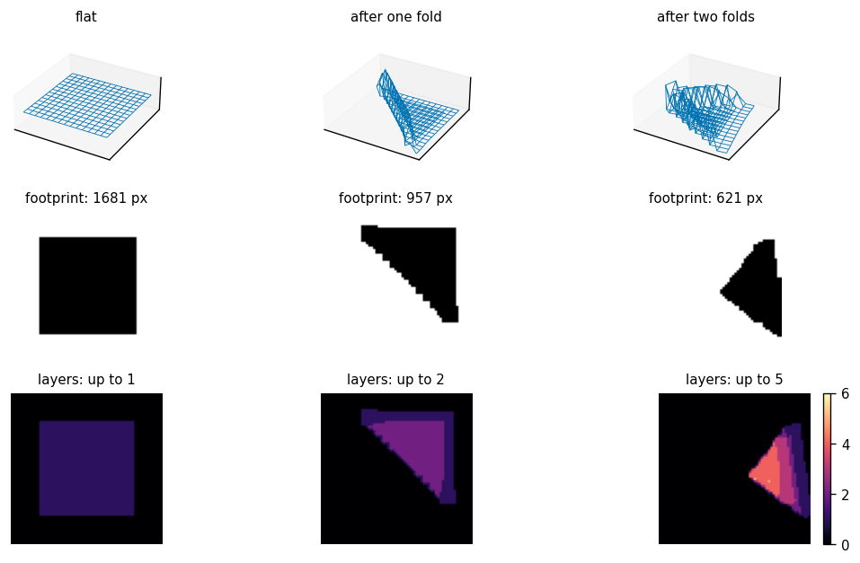
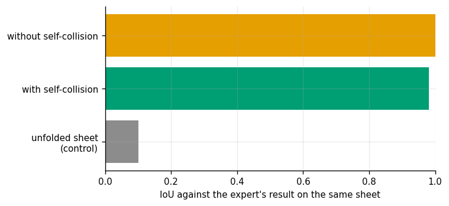
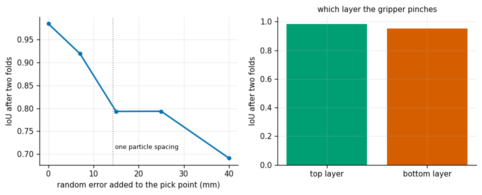
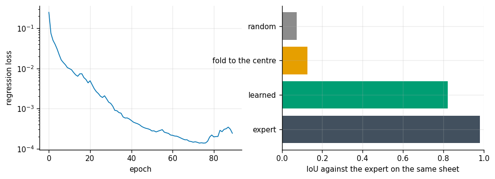
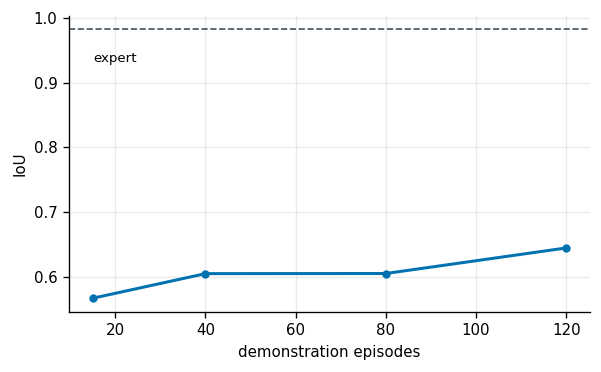

# Cloth Folding

## Key Insight

[Manipulating](/shared/glossary/#manipulation) soft, flexible objects like cloth is a major challenge in robotics because they can wrinkle, fold, and stretch in infinite ways. [Deformable manipulation](/shared/glossary/#deformable-manipulation) tasks like cloth folding bypass complex 3D shape models in favor of pick-and-place primitive actions guided by visual feedback. By capturing top-down images of the workspace, a robot can plan grasp and release points on the cloth, measuring its folding accuracy by comparing the overlap between the final cloth shape and a target folded shape.

**This is project 45**, the last of Phase 6. It is the only project in the phase where the object has no pose at all — a sheet of cloth has no position and orientation, only a shape — and that single fact changes every part of the pipeline.

---

## Files

| file | what it is |
|---|---|
| `cloth.py` | the cloth, simulated by [position-based dynamics](/shared/glossary/#position-based-dynamics); the [pick-and-place](/shared/glossary/#pick-and-place) primitive; the footprint and layer views; the expert |
| `run.py` | the six experiments and the learned policy |
| `outputs/` | figures and `results.csv` |

```bash
python3 run.py      # about nine minutes; needs numpy, cv2, torch, matplotlib
```

---

## Why the simulator is written by hand

Cloth is not a rigid body. A rigid-body engine models it, if at all, as hundreds of small bodies joined by hundreds of joints — slow, fiddly, and mostly a demonstration of that engine's solver. Fifty lines of [position-based dynamics](/shared/glossary/#position-based-dynamics) give a cloth that folds convincingly and runs a whole episode in under a second, which is what makes six experiments affordable.

PBD is worth one paragraph because its central idea is unusual: **it never computes a force.** It guesses where every particle would drift to under gravity, then *moves the positions* until the constraints hold — this edge is 14 mm long, this point is above the table — and reads the velocity back from how far each position actually ended up moving.

Why not springs? A [mass-spring model](/shared/glossary/#mass-spring-model) stiff enough to look like cloth needs a tiny time step, because a stiff spring plus a big step overshoots and the overshoot grows. **A projection cannot overshoot**: it stops as soon as the constraint is satisfied. That is why nearly every real-time cloth in games and robotics is built this way.

The cloth is a 15 x 15 grid with three families of constraints, and each family is doing a distinguishable job:

| constraint | connects | what breaks without it |
|---|---|---|
| structural | neighbours | the sheet stretches like rubber |
| shear | diagonals | the sheet collapses into a parallelogram, like a paper fan |
| bend | every *second* particle | the sheet creases into knife-edges instead of curves |

---

## 1. The cloth and one fold sequence



| | flat | after one fold | after two folds |
|---|---|---|---|
| footprint | 1 681 px | 957 px | 621 px |
| area ratio | 1.000 | **0.569** | **0.369** |
| thickest point | 1 layer | 2 layers | 5 layers |

The top-down footprint is what a camera above the table would see, and the bottom row is the ground truth a camera *cannot* see: how many layers of cloth are stacked at each point. The layer view is why self-collision has to be in the simulator at all — without it the top layer sinks straight through the bottom one and lands on the table, and a two-layer fold and a flat sheet become indistinguishable from above, which is exactly the view the metric uses.

Notice that one fold gives 0.569, not 0.500. A real fold does not land perfectly: the free edge overshoots slightly and the crease is a curve rather than a line. **The physics, not the geometry, sets what "folded in half" actually looks like** — which is the reason the target below is generated by folding rather than drawn by hand.

---

## 2. The metric, and the control that makes it mean something



The metric is [IoU](/shared/glossary/#iou) — intersection over union — of the final footprint against a target footprint. Two decisions make it honest:

**The target is generated, not drawn.** It comes from running the expert on *the same starting sheet*. Grading against a hand-drawn rectangle would ask "did you reach a shape the physics cannot reach from here", which no policy can pass and no metric should ask.

**There is a do-nothing control.** An *unfolded* sheet scores **IoU 0.102** against the target. Without that number, a policy scoring 0.5 could be doing half the job or none of it.

| | IoU vs the expert's own result | area after two folds | thickest point |
|---|---|---|---|
| unfolded sheet (control) | **0.102** | 1.000 | 1 layer |
| with self-collision | 0.980 | 0.363 | 5.4 layers |
| without self-collision | 1.000 | 0.340 | 6.1 layers |

The two physics rows both score near 1.0, and that is *not* evidence that self-collision does not matter: each row is graded against a target generated with its own physics, so the IoU there is measuring reproducibility, not quality. The columns that compare the two are the other ones. Turning self-collision off leaves the cloth **6.1 layers thick instead of 5.4 and 7% smaller in area** — the layers are passing through each other and settling flatter than real cloth would. **Check what a comparison is holding fixed before reading its headline number.**

---

## 3 + 4. How accurately you have to grab



Random error added to each pick point, then the same two folds:

| error added to the pick | IoU after two folds |
|---|---|
| 0 mm | **0.985** |
| 7 mm | 0.919 |
| 15 mm | 0.793 |
| 25 mm | 0.793 |
| 40 mm | **0.691** |

**Forty millimetres of error — a fifth of the whole sheet — still scores 0.691, against 0.102 for not folding at all.** This is the most encouraging result in the project, and it is a property of the *action*, not of the policy: reaching for a corner and missing by 40 mm still grabs *some* edge of the cloth, and dragging that edge across to the far side still folds the sheet roughly in half. The pick-and-place primitive fails gracefully.

Compare that with [project 41](../41-peg-in-hole-with-impedance/README.md), where 0.2 mm of clearance made 6 mm of error a research problem. **Deformable manipulation is forgiving in exactly the place rigid assembly is not**, because the object absorbs the error by changing shape.

The right panel asks which *layer* the gripper pinches — the top of a fold or the bottom one underneath:

| | IoU |
|---|---|
| top layer (what a real gripper takes) | 0.983 |
| bottom layer | 0.951 |

**A near-null result, and worth reporting as one.** The first fold has only one layer, so there is nothing to get wrong; only the second fold can pinch the wrong sheet, and even then dragging the lower layer across still produces something fold-shaped. The effect is real but small here — 3 points — and it would grow with the number of folds, since every extra fold adds a layer to pick the wrong one from.

---

## 5. A learned pick-and-place policy



The policy is a small convolutional network: the top-down footprint goes in, four numbers come out — where to pick and where to place. It is trained by [behavior cloning](/shared/glossary/#behavior-cloning) on the expert, over sheets dropped at random positions and orientations.

**One design decision made this learnable at all.** The obvious expert is "pick corner number 0 and place it on corner number 2". But a square sheet looks identical under a quarter turn, so *which corner is number 0* is not a question a camera can answer — a policy trained on that target would be learning to guess, and its loss would bottom out at the variance of the guess. The expert used here instead picks **the point furthest along a fixed diagonal of the image** and places it on the opposite extreme. Same fold, and now a function of what is visible.

This is the same lesson as [Transporter Networks](/shared/glossary/#transporter-networks) and the rest of the pick-and-place literature: express the action in terms the image determines, and the learning problem becomes small.

| policy | mean IoU |
|---|---|
| **scripted expert** (the ceiling) | **0.982** |
| **learned network** | **0.821** |
| drag the extreme point to the sheet's centre | 0.126 |
| random pick and place | 0.073 |
| *(unfolded sheet, from experiment 2)* | *0.102* |

The learned policy reaches 84% of the expert's score from 240 training examples. The two controls do their job: **"fold to the centre" scores 0.126, barely above not folding at all**, which confirms that the metric is measuring the *right* fold rather than merely "the sheet got smaller".

---

## 6. How many demonstrations



| demonstration episodes | mean IoU (12 test sheets, seed 1) |
|---|---|
| 15 | 0.567 |
| 40 | 0.605 |
| 80 | 0.605 |
| 120 | 0.644 |

**This curve is nearly flat, and the flatness is the result.** Eight times the data buys 0.08 of IoU. Fifteen demonstrations — thirty training examples — already get most of the way.

That should not be surprising once the action space is taken seriously: the network has to output four numbers that are, in effect, "find the two extreme points of this blob". It is a *geometric* function of the image, the same function at every scale and rotation, and geometric functions of that kind are exactly what convolutions are good at. Compare [project 43](../43-visuomotor-pick/README.md), where the pixel policy was still climbing at 300 demonstrations: there the network had to learn a whole *control law* through a visual encoder, one 24-step episode at a time. **Compressing a manipulation into two points is not just a modelling convenience — it is what makes the learning problem small.**

One honest caveat on the table above. The headline policy in experiment 5, trained on the same 120 demonstrations with a different random seed and graded on 20 sheets rather than 12, scored **0.821** — well outside this table's range. At this scale **the training seed moves the score about as much as an eight-fold change in the data does**, so the correct reading of experiment 6 is "more data is not the bottleneck here", not "120 demonstrations gives 0.644".

---

## What to take away

- **Position-based dynamics is the reason this project fits in a laptop.** Projecting positions instead of integrating forces removes the stiffness limit that makes cloth expensive.
- **Grade against a generated target, and always publish a do-nothing control.** An unfolded sheet scores 0.102 here; without that number, 0.5 is unreadable.
- **The pick-and-place primitive is remarkably forgiving.** 40 mm of pick error — a fifth of the sheet — still scores 0.69. Deformable objects absorb error by deforming.
- **Define the action in terms the image determines.** "Pick corner 0" is unlearnable on a symmetric sheet; "pick the extreme point along this diagonal" is the same fold and is learnable.
- **A comparison is only as good as what it holds fixed.** The self-collision rows both score IoU ~1.0 against their own targets while differing by a whole layer of cloth.

That closes Phase 6. Across seven projects the same shape keeps appearing: an exact geometric method that is correct and brittle, a learned method that is robust inside its training distribution and silent outside it, and a trivial baseline that is much stronger than anyone expects. The practitioner's job is not to pick a side but to know which regime the task is in.

---

## Try This

1. **Add a third and fourth fold** and watch both the IoU and the wrong-layer penalty grow. The layer count is where deformable manipulation gets genuinely hard.
2. **Give the network a target mask as a second input channel** so it can be asked for folds it was not trained on — a triangle, a strip, a specific corner. That turns a single-skill policy into a goal-conditioned one.
3. **Replace the regression head with two heatmaps** (pick and place), as [Transporter Networks](/shared/glossary/#transporter-networks) do. Predicting *where* in an image is usually far more data-efficient than regressing coordinates.
4. **Wrinkle the sheet before the first fold** by dropping it from a height with random velocities. Every result here starts from a flat sheet, and flat is the easy case.
