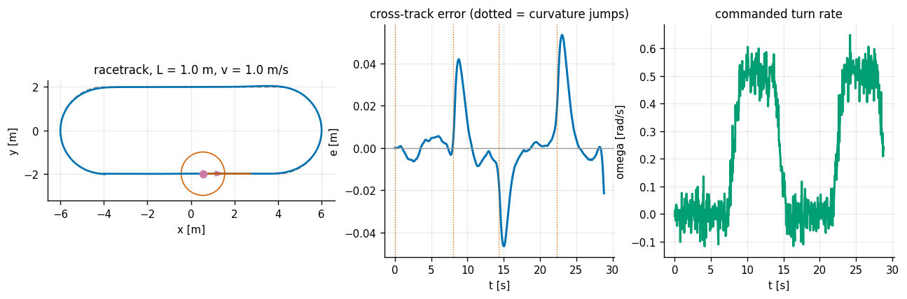
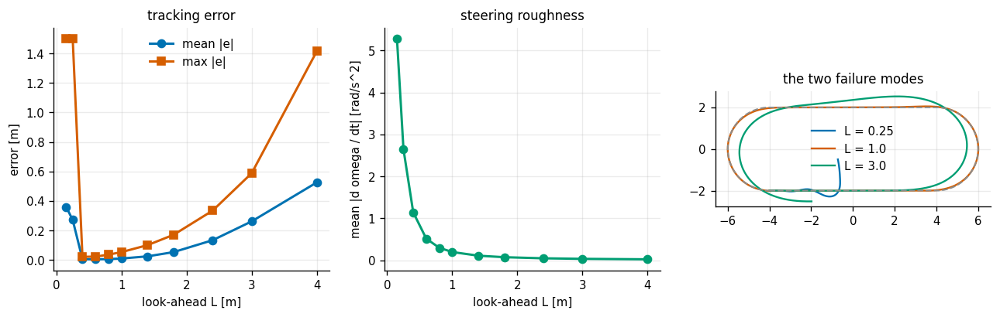
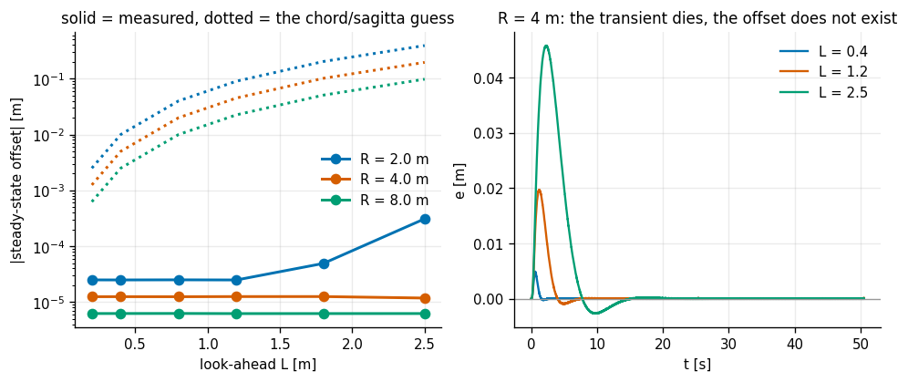
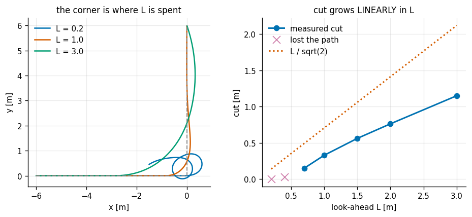
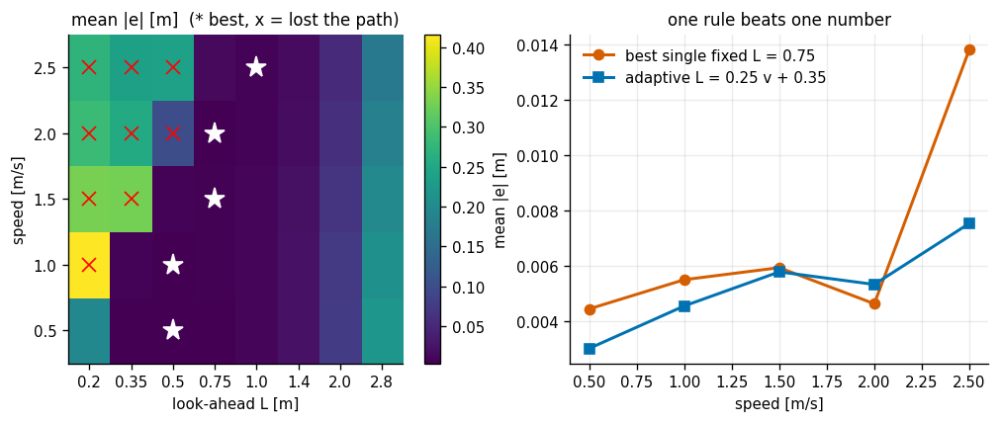
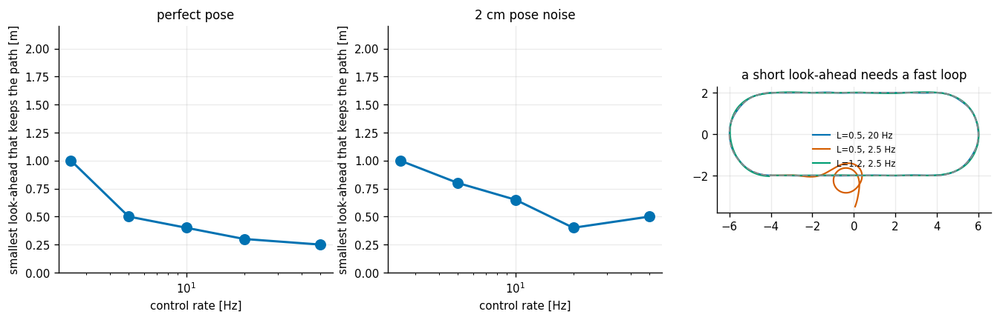
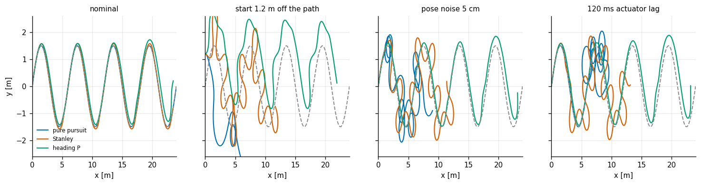

# Pure Pursuit

## Key Insight

Implement a [pure pursuit](/shared/glossary/#pure-pursuit) path-tracking controller to steer a [differential drive](/shared/glossary/#differential-drive) robot along a pre-planned reference path. By finding a target point on the path at a defined look-ahead distance, the robot can compute its target angular velocity and follow curves smoothly. Tuning the look-ahead distance reveals the fundamental trade-off in path tracking: a short look-ahead tracks paths tightly but risks steering instability, while a long look-ahead provides smooth trajectories at the expense of cutting corners.

**This is project 46**, the first of Phase 7. It is where the guide stops asking "what route should the robot take?" and starts asking "how does the robot actually follow the route it was given?" — and the answer turns out to depend less on the controller than on how fast the loop runs and how good the position estimate is.

---

## Files

| file | what it is |
|---|---|
| `robot.py` | the [differential-drive](/shared/glossary/#differential-drive) robot, the path, and three trackers — **imported by projects 47, 49 and 53** |
| `run.py` | the seven experiments |
| `outputs/` | figures and `results.csv` |

```bash
python3 run.py      # about 2 minutes; needs numpy and matplotlib only
```

---

## Why "pure pursuit"?

The name says what the algorithm does and, just as importantly, what it does *not* do. **Pursuit**: like a dog chasing a car, the robot picks a point ahead of itself and steers at it, continuously. **Pure**: there is nothing else. No plan, no optimisation, no model of the future. One target point in, one turn rate out.

The whole controller is one line of geometry. Put the target point in the robot's own frame as `(x_r, y_r)`. Exactly one circle passes through the robot, is tangent to its current heading, and also passes through the target. That circle's curvature (how sharply it bends — one over its radius) is

```
kappa = 2 * y_r / L^2
```

Read it in plain language: **the further sideways the target is, the harder you turn; the further ahead it is, the gentler you turn.** And `L` — the look-ahead distance — enters *squared*, which is why it is such a powerful knob and why everything in this project comes back to it.

---

## The robot, and why it has limits

The unicycle model says a differential-drive base moves forward at speed `v` and rotates at rate `omega`, and can never slide sideways. That last part is the [non-holonomic constraint](/shared/glossary/#nonholonomic-constraint) — and it is the entire reason path tracking needs a *controller* rather than a subtraction. If the robot could slide sideways, correcting a 10 cm offset would be "move 10 cm sideways" and there would be no project here.

`robot.py` adds four things the textbook unicycle does not have, and each one exists to make a specific later experiment possible:

| what | why it is there |
|---|---|
| acceleration and turn-rate limits | a real chassis cannot jump to a new turn rate |
| a first-order actuator lag (`tau`) | a motor's current loop chases its command, it does not meet it |
| a **control period** separate from the physics step | the controller only gets to look every 1/`ctrl_hz` seconds, and its command is held constant in between (a [zero-order hold](/shared/glossary/#zero-order-hold)) |
| **pose noise** on what the controller sees | the controller never sees the true pose; it sees whatever the localiser reports |

The last two matter far more than they look. A simulator that calls the controller on every physics step, with the exact state, makes every gain look good — it is the single most flattering bug a tracking study can have. Experiments 6 and 7 exist because of these two lines.

---

## 1. One lap, and where the error actually lives



The test track is two 8 m straights joined by two half-circles of radius 2 m. What matters about it is that the curvature is **discontinuous** at the four joins — it jumps from 0 to 1/2 with no ramp. Splitting the lap's error by where on the track it happened:

| where on the track | mean \|cross-track error\| |
|---|---|
| straight, away from the joins | 0.0054 m |
| inside an arc, away from the joins | 0.0112 m |
| **within 0.6 m of a curvature jump** | **0.0195 m** |

The error is concentrated at the joins — 3.6× the straight sections. That points at the next question.

---

## 2. The look-ahead sweep: two failure modes, one knob



Same track, same speed, 2 cm of pose noise, 20 Hz control, 60 ms actuator lag. Only `L` changes:

| look-ahead L | mean \|e\| | steering roughness | verdict |
|---|---|---|---|
| 0.15 m | 0.359 | 5.29 | **lost the path** |
| 0.25 m | 0.272 | 2.65 | **lost the path** |
| 0.40 m | 0.0055 | 1.15 | |
| **0.60 m** | **0.0046** | 0.52 | **best** |
| 1.00 m | 0.0099 | 0.20 | |
| 2.40 m | 0.134 | 0.05 | cuts corners |
| 4.00 m | 0.525 | 0.03 | cuts corners badly |

There is a genuine interior optimum, and the two sides of it fail for completely different reasons:

- **Too short**: because curvature goes as `2*y_r/L²`, halving `L` *quadruples* the response to a given sideways offset. With 2 cm of pose noise, `L = 0.15` turns that noise into a curvature command of order `2 × 0.02 / 0.0225 = 1.8` per metre — a turn radius of half a metre, commanded at random, twenty times a second. The steering-roughness column shows it directly: **176× rougher at L = 0.15 than at L = 4.0**.
- **Too long**: the robot aims so far ahead that it stops following the path and starts following the *destination*. In the right-hand panel the `L = 3.0` trace visibly bulges outside the track at both ends.

**The practical reading: the "best" look-ahead is not a property of the path. It is set by how noisy your position estimate is and how sharply the path turns.**

---

## 3. Does pure pursuit really cut corners?



"Pure pursuit cuts corners" is repeated everywhere, and it has an obvious-looking explanation: the robot aims at a point `L` away and drives the straight **chord** to it, and a chord cuts inside an arc by the *sagitta* (the gap between a chord and the arc it spans), `L²/(8R)`. For `R = 2 m` and `L = 2.5 m` that predicts cutting inside by 39 cm.

Running it with a perfect pose estimate and a fast loop, on a pure circle:

| radius R | look-ahead L | sagitta prediction | **measured steady-state offset** |
|---|---|---|---|
| 2 m | 0.8 | 0.040 m | 0.00003 m |
| 2 m | 2.5 | **0.391 m** | **0.00031 m** |
| 4 m | 2.5 | 0.195 m | 0.00001 m |
| 8 m | 2.5 | 0.098 m | 0.00001 m |

**The prediction is wrong by four orders of magnitude. On a constant-curvature arc, pure pursuit has exactly zero steady-state offset**, for any look-ahead and any radius.

The algebra says why, and it is short enough to follow. Suppose the robot settles onto a circle of radius `r` concentric with a reference circle of radius `R`, heading tangentially. Put the robot at `(r, 0)`. The target `T` sits on the reference circle at distance `L`, so `T_x = (R² + r² − L²) / (2r)`, and in the robot's frame `y_r = r − T_x`. In steady state the commanded curvature must equal the curvature it is actually driving:

```
2 * y_r / L^2  =  1/r
(r^2 - R^2 + L^2) / (r L^2)  =  1/r
r^2 - R^2 + L^2  =  L^2      →   r = R
```

The `L²` cancels completely. The chord argument is wrong because the robot does not *drive* the chord — it drives the arc through the target that is tangent to its heading, and on a circular path that arc **is** the path.

**So corner cutting is real, but it happens only where the curvature CHANGES**, which is exactly what experiment 1 measured and what experiment 4 pins down. This is worth carrying: a widely repeated rule of thumb turned out to describe the transient, not the steady state.

---

## 4. Corner cutting, measured on one right angle



A single 90° corner, perfect pose, fast loop:

| look-ahead L | how far inside the corner it cut | turn rate the corner needs | outcome |
|---|---|---|---|
| 0.2 m | — | 7.07 rad/s | **could not make the turn** |
| 0.4 m | — | 3.54 rad/s | **could not make the turn** |
| 0.7 m | 0.15 m | 2.02 rad/s | |
| 1.0 m | 0.33 m | 1.41 rad/s | |
| 2.0 m | 0.76 m | 0.71 rad/s | |
| 3.0 m | 1.15 m | 0.47 rad/s | |

Two things at once. The cut grows **linearly** in `L` (roughly `L/√2` — the geometry of cutting the corner of a right angle), not quadratically as the sagitta story would suggest. And below `L ≈ 0.7 m` the robot **fails outright** — not from noise this time, but from physics. Turning 90° within a look-ahead of `L` needs a turn radius of about `L/√2`, so a turn rate of `v√2/L`. At `L = 0.2` and 1 m/s that is 7.1 rad/s, and the chassis can only do 2.5.

**Short look-ahead and sharp corner are the same constraint seen twice**: the robot has to physically fit the turn inside the look-ahead.

---

## 5. Look-ahead has to grow with speed — but not for the reason you would guess



Sweeping speed against look-ahead, with pose noise:

| speed | look-ahead with the lowest error | **smallest look-ahead that keeps the path at all** |
|---|---|---|
| 0.5 m/s | 0.50 m | 0.20 m |
| 1.0 m/s | 0.50 m | 0.35 m |
| 1.5 m/s | 0.75 m | 0.50 m |
| 2.0 m/s | 0.75 m | 0.75 m |
| 2.5 m/s | 1.00 m | 0.75 m |

The *optimum* barely moves — 0.5 m to 1.0 m over a five-fold speed range. The **stability boundary** moves nearly four-fold, and at 2.0 m/s it has climbed all the way up to meet the optimum. So the usual advice "scale your look-ahead with speed" is right, but the reason is not that you track better with a longer look-ahead when you go fast. **It is that your safety margin evaporates.** At 0.5 m/s you can pick anything from 0.2 to 1.4 m and be fine; at 2.0 m/s the window has closed to a point.

A single adaptive rule `L = 0.25 v + 0.35` against the best *single* fixed value over the whole range:

| speed | adaptive L | adaptive error | best fixed L = 0.75 |
|---|---|---|---|
| 0.5 | 0.47 | **0.0030** | 0.0045 |
| 1.0 | 0.60 | **0.0046** | 0.0055 |
| 1.5 | 0.72 | **0.0058** | 0.0059 |
| 2.0 | 0.85 | 0.0053 | **0.0046** |
| 2.5 | 0.97 | **0.0075** | 0.0138 |

The rule wins at four speeds out of five and loses narrowly at one. That is a real but modest gain — worth reporting as such rather than as a triumph, because the fixed value was itself chosen with knowledge of the whole speed range, which a real deployment would not have.

---

## 6. The control period is the other half of the story



The same question — what is the smallest look-ahead that still keeps the path? — at 1.5 m/s, as the control loop slows down. Run twice, once with a perfect pose estimate and once with 2 cm of noise, so the two causes can be told apart:

| control rate | perfect pose | 2 cm pose noise |
|---|---|---|
| 50 Hz | 0.25 m | 0.50 m |
| 20 Hz | 0.30 m | 0.40 m |
| 10 Hz | 0.40 m | 0.65 m |
| 5 Hz | 0.50 m | 0.80 m |
| 2.5 Hz | 1.00 m | 1.00 m |

Both columns climb as the loop slows: **a slow loop needs a long look-ahead**, because between decisions the robot drives blind, and a short look-ahead leaves no room for that. Going from 50 Hz to 2.5 Hz costs a factor of 4 in the minimum viable look-ahead.

And the noisy column sits above the clean one nearly everywhere — noise costs you look-ahead on top of whatever the loop rate already costs. (The one place it dips below, at 20 Hz, is a single grid step and should not be read as a real effect.)

**Two independent things buy the same thing.** If you cannot make your loop faster, you must make your look-ahead longer, and you will cut more corners as a result. That is the actual engineering trade inside a navigation stack.

---

## 7. Three trackers, and the experiment that changes the ranking



Three controllers on a slalom, each with its one gain tuned by sweep:

- **[Pure pursuit](/shared/glossary/#pure-pursuit)** — one term: aim at a point `L` ahead.
- **Stanley** — two terms: line up with the path *and* null the cross-track error, with the correction angle `atan(k·e / v)`. Dividing by speed is the point: at 10 m/s a 1 m offset needs a gentle nudge, at 0.5 m/s it needs a sharp turn, and one gain gives both. It is named after Stanley, the Stanford car that won the 2005 DARPA Grand Challenge with it.
- **Heading-P** — the naive baseline: turn to match the path's direction, with no cross-track term at all. It lines the robot *up* with the path but never pulls it *onto* the path.

Everything was tuned twice: once on a clean simulator, once with 5 cm of pose noise. Then each tuned gain was evaluated on both.

| controller | tuned on | its gain | error on clean | error with 5 cm noise |
|---|---|---|---|---|
| pure pursuit | clean | L = 0.2 | **0.0005 m** | **0.480 m** |
| pure pursuit | noisy | L = 0.5 | 0.0106 m | **0.0142 m** |
| Stanley | clean | k = 9.0 | 0.0269 m | 0.453 m |
| Stanley | noisy | k = 4.0 | 0.0566 m | 0.068 m |
| heading-P | clean | k = 14 | 0.136 m | 0.150 m |
| heading-P | noisy | k = 14 | 0.136 m | 0.150 m |

Three things fall out, and the third is the one worth remembering.

**Pure pursuit is the best controller here** — 0.0005 m on the clean simulator, 50× better than Stanley and 270× better than heading-P.

**The gain tuned on the clean simulator is a disaster in the noisy one.** `L = 0.2` goes from 0.0005 m to 0.480 m — **960× worse**. The noise-tuned gain gives up a factor of 21 on the clean case and buys a factor of **34** on the noisy one. Tuning where you will not deploy picks the wrong answer, confidently.

**And heading-P — the worst controller of the three, the one with a term missing — is the only one that barely notices the noise at all** (0.136 → 0.150 m, a 10% degradation against 960% and 1600%). It has no cross-track term, so there is no `1/L²` amplifier for the noise to come through. It is not a good controller. It is a *robust* one, and the two are not the same thing.

This is the experiment that justifies the pose-noise line in the simulator. Without it, the ranking reads "pure pursuit, tuned as tight as possible", and the surprise arrives on the robot.

---

## What carries forward

- `robot.py` is the chassis, path and trackers for the rest of Phase 7. **[Project 47](../47-dwa-local-planner/README.md)** puts a local planner on top of the same robot, **[project 49](../49-amcl-on-a-known-map/README.md)** replaces the perfect pose with a real [particle filter](/shared/glossary/#particle-filter) and closes the loop on its estimate, and **[project 53](../53-social-navigation/README.md)** drives the same robot through a moving crowd.
- The interior optimum in look-ahead, with a *different* cause of failure at each end, is the shape of nearly every tuning problem in this phase — compare the horizon sweep in **[project 48](../48-mpc-for-an-ackermann-car/README.md)** and the particle floor in **[project 49](../49-amcl-on-a-known-map/README.md)**.
- The "tune where you deploy" result generalises well past this controller. It is the same lesson [domain randomization](/shared/glossary/#domain-randomization) exists to address in **[project 52](../52-learned-locomotion/README.md)**.

---

## Things worth trying

1. Give the pose estimate a **lag** as well as noise (localisers are late, not just wrong) and see whether that pushes the optimum further than noise alone did.
2. Add a **feedforward** term from the path's known curvature. Pure pursuit is purely reactive; a tracker that knows the corner is coming should not need as long a look-ahead — and [project 50](../50-quadrotor-min-snap/README.md) measures exactly what that kind of feedforward is worth on a very different vehicle.
3. Rerun experiment 3 on a path whose curvature ramps smoothly (a clothoid) instead of jumping. The prediction from experiment 1 is that the joins stop being special and the whole lap's error collapses.
