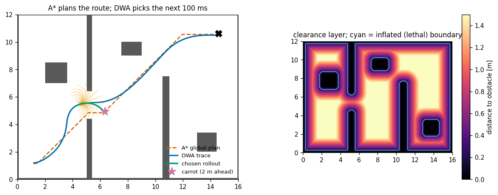
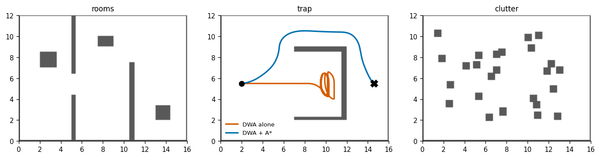
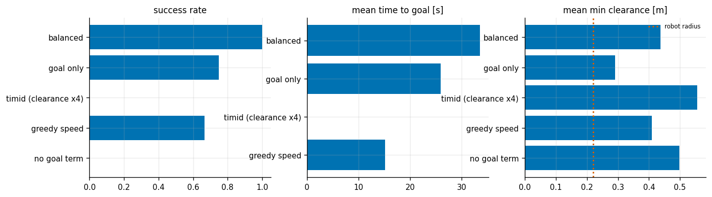
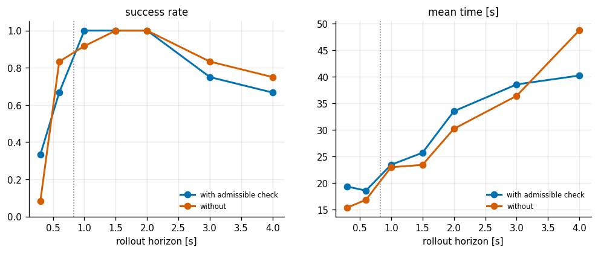
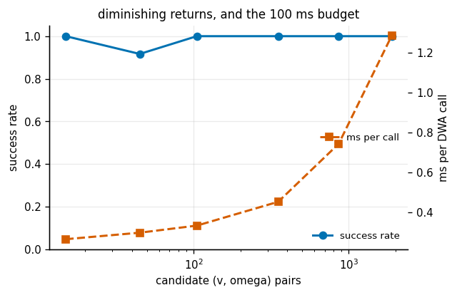
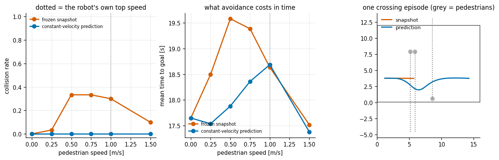

# DWA Local Planner

## Key Insight

Integrate a local obstacle-avoidance controller based on the [Dynamic Window Approach (DWA)](/shared/glossary/#dynamic-window-approach-dwa) with an [A* search](/shared/glossary/#a-star-search) global planner. While the global planner finds a static route to the target, the local planner dynamically selects velocity commands that avoid obstacles by projecting the robot's [state](/shared/glossary/#state) forward in time. This layered navigation stack ensures the robot can navigate complex rooms while reacting immediately to dynamic obstacles.

**This is project 47.** [Project 46](../46-pure-pursuit/README.md) followed a path that was handed to it. Here the robot has to *choose* what to do next, ten times a second, with obstacles in the way — and the central result is that a local planner alone cannot navigate a building, no matter how good it is.

---

## Files

| file | what it is |
|---|---|
| `dwa.py` | the [costmap](/shared/glossary/#costmap), three test maps, the A* glue, and the DWA itself |
| `run.py` | the six experiments |
| `outputs/` | figures and `results.csv` |

It imports [project 46](../46-pure-pursuit/README.md)'s `DiffDrive`, [project 31](../31-a-star-on-a-grid/README.md)'s A* `search`, and [project 35](../35-chomp-from-scratch/README.md)'s exact distance transform.

```bash
python3 run.py      # about 2.5 minutes; needs numpy and matplotlib only
```

---

## Why "dynamic window"? Two ideas in one name

**Window.** Instead of asking "where should I go", DWA asks "which pair of numbers `(v, omega)` should I send in the next 100 ms". The search space is two numbers, not a path. Every candidate pair is rolled forward with the model, scored, and the best one is sent. Then the whole thing is thrown away and redone next tick.

**Dynamic.** The window is not the robot's full speed range. It is only the part *reachable within one control period given the acceleration limits*. A robot at 1.0 m/s that can decelerate at 1.2 m/s² cannot be at 0 m/s in 100 ms, so 0 m/s is not in the window and there is no point scoring it.

That second word turns out to explain one of this project's stranger results — see experiment 5.

---

## Why a costmap, when you already have a map?

A beginner-reasonable objection: the occupancy grid already says which cells are blocked. Why build two more layers on top of it?

Because "blocked / free" answers the wrong question twice.

- **The [inflation layer](/shared/glossary/#costmap)** marks every cell within the robot's radius of an obstacle as lethal. This is what lets the rest of the stack pretend the robot is a *point*. Instead of checking a 44 cm disc against the walls at every rollout step (expensive, and repeated millions of times), you grow the obstacles by the robot once and then check single points. The global planner in particular must plan on the inflated map: a route through a 30 cm gap is not a route for a 44 cm robot, and a planner on the raw grid would happily return one.
- **The distance layer** stores, for every free cell, the distance in metres to the nearest obstacle. This turns "did I hit something" (a yes/no that a cost function cannot be smooth in) into "how close am I" (a number a cost function can trade off). Without it there is no way to express "prefer the middle of the corridor".

The distance layer is computed with the exact Felzenszwalb distance transform imported from [project 35](../35-chomp-from-scratch/README.md), rather than a cheap chamfer approximation, because clearance is a number every experiment below is scored on. An approximate transform would put a few percent of bias into every clearance measurement, and the bias would look like a result.

---

## 1. One navigation run



Left: the room, the A* global plan, the fan of candidate rollouts at one instant, the one that was chosen, and the "carrot" — the point on the global plan 2 m ahead, which is the only thing the local planner is ever told about the goal.

Right: the distance layer, with the inflated boundary drawn on top.

| | |
|---|---|
| time to goal | 21.1 s |
| path length | 17.3 m |
| closest approach to anything | 0.90 m |
| **DWA call cost** | **0.43 ms** |

At 0.43 ms per call, a 10 Hz local planner is using 0.4% of one core. Keep that number: it is why experiment 5 turns out the way it does.

---

## The carrot, and what it hides

The interface between the two planners is one point. The local planner never sees the goal 30 m away; it sees a point 2 m away that the global planner promises lies on a route to the goal.

That is the whole design of a layered navigation stack, and it is worth naming explicitly, because a beginner may reasonably ask why you need two planners when one would do. **The local planner is allowed to be short-sighted and greedy precisely because the long-range thinking has been delegated.** A* runs once per goal on a static map and thinks about the whole building; DWA runs ten times a second and thinks about the next two seconds. Neither could do the other's job at the other's rate.

---

## 2. What the global plan is actually for



Same DWA, same weights, run with the carrot from A* and run with the true goal as the target:

| map | planner | success | of the failures: collisions | timeouts | mean path | mean time |
|---|---|---|---|---|---|---|
| rooms | DWA alone | 6/12 | 0 | 6 | 21.2 m | 33.6 s |
| rooms | **DWA + A\*** | **9/12** | 0 | 3 | **15.2 m** | 26.5 s |
| **trap** | DWA alone | **0/5** | 0 | 5 | — | — |
| **trap** | **DWA + A\*** | **5/5** | 0 | 0 | 16.4 m | 20.6 s |
| clutter | DWA alone | 10/12 | 0 | 2 | 14.5 m | 27.7 s |
| clutter | **DWA + A\*** | **12/12** | 0 | 0 | **12.8 m** | 33.5 s |

The "trap" map is a U-shaped room whose mouth faces the start and whose closed back faces the goal. A greedy local planner drives straight in — every step of the way, going forward gets it closer to the goal — and then finds nothing but wall. Its 2 m horizon cannot see that the way out is 4 m *backwards*. **0/5 against 5/5** is as clean a demonstration as this kind of experiment gets: this is not a tuning problem, it is a horizon problem, and no amount of weight-fiddling fixes it.

Two honest details in the same table. Note that **no configuration ever collides** — every failure is a timeout. The admissible-velocity rule (experiment 4) is doing its job. And on the clutter map, DWA+A\* takes *longer* (33.5 s vs 27.7 s) while travelling *shorter* (12.8 m vs 14.5 m): following the global plan means squeezing through gaps at reduced speed instead of taking the open, wandering route. Success rate went up; wall-clock went down. Report both.

---

## 3. The three weights, and the safety setting that makes things worse



DWA scores each rollout with three terms: how close its endpoint gets to the carrot (**heading**), how much room it leaves (**clearance**), and how fast it goes (**velocity**). Twelve queries on the cluttered map:

| weights | success | mean time | mean closest approach | collisions | timeouts | frozen |
|---|---|---|---|---|---|---|
| balanced (1.0 / 1.6 / 0.35) | **12/12** | 33.5 s | 0.44 m | 0 | 0 | 0% |
| goal only (1.0 / 0 / 0) | 9/12 | **25.9 s** | 0.29 m | 0 | 3 | 29% |
| **timid — clearance ×4** | **0/12** | — | 0.56 m | 0 | 12 | 0% |
| greedy speed (1.0 / 0.4 / 2.0) | 8/12 | **15.1 s** | 0.41 m | 0 | 4 | 8% |
| no goal term (control) | 0/12 | — | 0.50 m | 0 | 12 | 0% |

**Turning the safety weight up by 4× took success from 12/12 to 0/12.** That is the result worth sitting with, because "if in doubt, increase the clearance weight" is exactly what an anxious engineer does.

The failure mode is not what you would guess. The `frozen` column — the fraction of control ticks where no command at all was admissible — is **0%**. It is not stopping. It is *wandering*: with clearance dominating, the highest-scoring rollout is always the one that goes deeper into open space, and the doorway it needs to pass through is by definition the least open place on the route. The robot happily drives to the middle of the room and stays there, and the timeout catches it.

The "no goal term" row is the control that makes this readable — it fails the same way (0/12, all timeouts, 0% frozen) for the obvious reason. Seeing the timid arm produce the *same signature* as deleting the goal term is what identifies the mechanism.

And the two speed-oriented rows show the honest cost of the balanced setting: greedy-speed finishes in 15.1 s against 33.5 s — **2.2× faster** — and pays 4 failures for it. There is no free configuration here.

---

## 4. The horizon, and the admissible-velocity rule



Each rollout is simulated forward for `sim_time` seconds. Sweeping it, with and without the admissible-velocity rule:

| rollout horizon | with admissible check | without |
|---|---|---|
| 0.3 s | 0.333 | **0.083** |
| 0.6 s | 0.667 | 0.833 |
| 1.0 s | **1.000** | 0.917 |
| 1.5 s | **1.000** | **1.000** |
| 2.0 s | **1.000** | **1.000** |
| 3.0 s | 0.750 | 0.833 |
| 4.0 s | 0.667 | 0.750 |

The horizon has an interior optimum around 1–2 s. Too short and the robot commits to speeds it cannot undo; too long and every rollout eventually runs into *something*, so the planner rejects options it should have taken and creeps.

The **admissible-velocity rule** keeps only speeds the robot could still stop from before hitting the nearest obstacle on that rollout: `v ≤ sqrt(2 · a · d)`. Its point is that some situations are *already* lost at the moment of choosing — no future braking command can save them — and the rule refuses to enter them.

It works exactly where you would expect and **backfires where you would not**. At a 0.3 s horizon it takes success from 0.083 to 0.333 (4×); the rollout is too short to see the obstacle, so the braking condition is the only safety left. But at 0.6 s it *costs* 17 points (0.667 vs 0.833). With a horizon of 0.6 s at 1 m/s the rollout reaches 0.6 m, and the braking distance at top speed is `1.0²/(2×1.2) = 0.42 m` — the same order. The check then vetoes speeds that were in fact fine, and the robot gets stuck behind narrow gaps it could have driven through.

**A conservative rule is not free. It is a bet that the thing it refuses is more likely to hurt you than to be the answer**, and whether that bet pays depends on how it lines up with the rest of your tuning.

---

## 5. How many candidates are worth scoring? (a null result)



| candidates (nv × nw) | success | ms per call | mean path | velocity resolution |
|---|---|---|---|---|
| **15** (3 × 5) | **1.000** | 0.27 | 13.8 m | 0.120 m/s |
| 45 (5 × 9) | 0.917 | 0.30 | 13.0 m | 0.060 m/s |
| 105 (7 × 15) | 1.000 | 0.33 | 12.8 m | 0.040 m/s |
| 351 (13 × 27) | 1.000 | 0.45 | 12.8 m | 0.020 m/s |
| 861 (21 × 41) | 1.000 | 0.72 | 12.7 m | 0.012 m/s |
| 1891 (31 × 61) | 1.000 | 1.26 | 12.7 m | 0.008 m/s |

**126× more candidates buys 8% shorter paths and nothing else.** Even 15 candidates solves every query.

The "dynamic" half of the name explains it. The window is only `2·a·dt` wide — with `a = 1.2 m/s²` and `dt = 0.1 s`, that is 0.24 m/s of speed and 0.5 rad/s of turn rate, total. A coarse grid over a *tiny* box is still a fine grid. The rightmost column makes it concrete: even the 3 × 5 grid resolves speed to 12 cm/s, which is finer than anything the chassis can meaningfully act on within one tick.

The single dip at 45 candidates (0.917) is one query out of twelve and should be read as noise, not as structure.

---

## 6. Obstacles that move, and one line of prediction



A costmap is a **snapshot**. A plain DWA rolls its *own* motion two seconds into the future while assuming every obstacle stays frozen where it is right now. Adding four characters — moving each obstacle along its current velocity during the rollout — is the minimum viable prediction.

Thirty crossing scenarios in an empty room, pedestrians launched so their paths intersect the robot's near the middle:

| pedestrian speed | frozen snapshot: collisions | with prediction: collisions | snapshot time | prediction time |
|---|---|---|---|---|
| 0.00 m/s | 0.00 | 0.00 | 17.6 s | 17.6 s |
| 0.25 m/s | 0.03 | **0.00** | 18.5 s | 17.5 s |
| 0.50 m/s | **0.33** | **0.00** | 19.6 s | 17.9 s |
| 0.75 m/s | **0.33** | **0.00** | 19.4 s | 18.4 s |
| 1.00 m/s | 0.30 | **0.00** | 18.6 s | 18.7 s |
| 1.50 m/s | 0.10 | **0.00** | 17.5 s | 17.4 s |

**A third of the encounters end in a collision without prediction, and none with it — at no cost in time to goal.** For a four-character change that is an unusually good deal, and it is why every real navigation stack has some form of it.

The scenario design matters here and is worth explaining, because the first version of this experiment measured almost nothing. Scattering obstacles randomly around a cluttered map means most of them never come near the robot, so the handful of encounters that matter get averaged away with dozens of non-events — the comparison then measures the map, not the planner. Aiming the pedestrians at points the robot will actually pass through gives every episode a real encounter.

The non-monotone tail is real and worth explaining rather than smoothing: at 1.5 m/s the snapshot planner's collision rate drops back to 0.10. **Pedestrians faster than the robot's own top speed cross its path and are gone before it arrives.** The dangerous regime is the one where the human moves at roughly walking pace — comparable to the robot — which is, inconveniently, the only regime that occurs in a building.

This is where [project 53](../53-social-navigation/README.md) picks up: constant-velocity prediction is the floor, not the ceiling, and a person is not the same problem as a moving box.

---

## What carries forward

- `dwa.py`'s `Costmap` and `astar_path` are reused by [project 49](../49-amcl-on-a-known-map/README.md) (to plan the patrol route) and [project 53](../53-social-navigation/README.md) (which replaces `dwa_step` with a social variant).
- The layered structure — slow-and-smart over fast-and-stupid — is the shape of the whole phase. [Project 51](../51-quadruped-trotting-mpc/README.md) is the same idea at a different timescale: a 33 Hz [MPC](/shared/glossary/#mpc) over a 500 Hz leg controller.
- The trap map is a reusable demonstration that a horizon is not a tuning parameter you can trade against anything else.

---

## Things worth trying

1. Add a **[recovery behaviour](/shared/glossary/#costmap)** — rotate in place, or back up — when no command is admissible for several ticks running, and see whether it rescues the 3/12 timeouts on the rooms map.
2. Replace the carrot with a **local goal chosen by cost**, rather than a fixed distance along the plan. The 2 m carrot is arbitrary, and on the rooms map it is what pulls the robot into doorway walls.
3. Make the obstacles' *predicted* velocity noisy, and watch the prediction advantage in experiment 6 erode. That sweep is the core of [project 53](../53-social-navigation/README.md).
