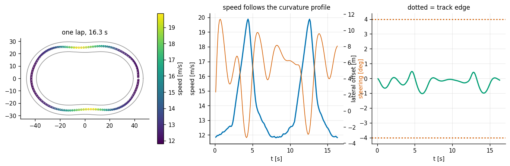
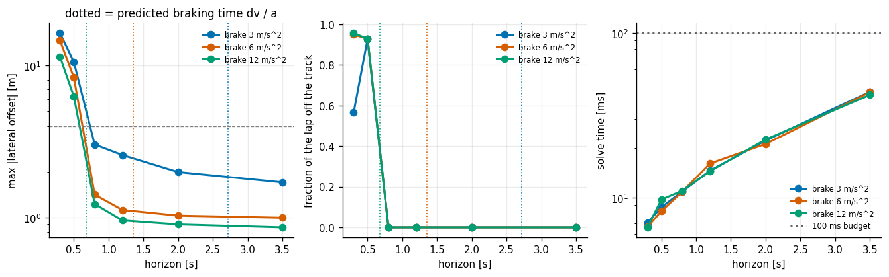
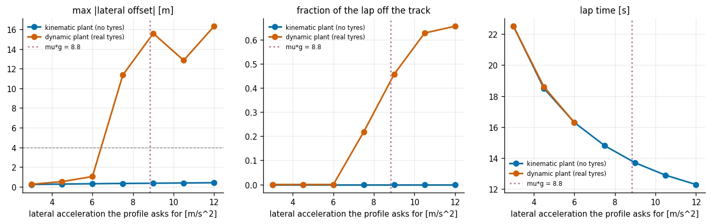
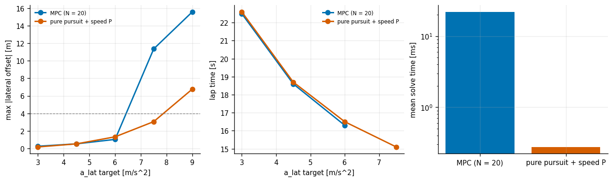
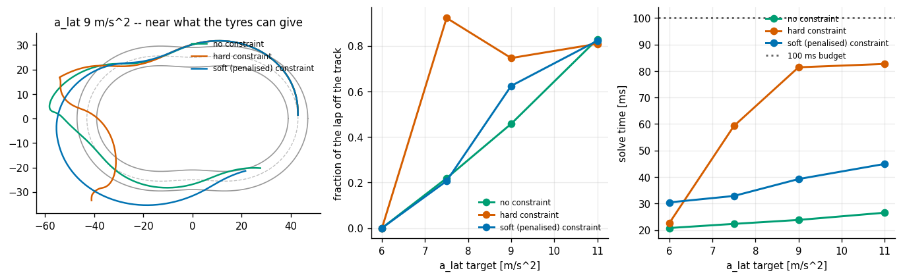
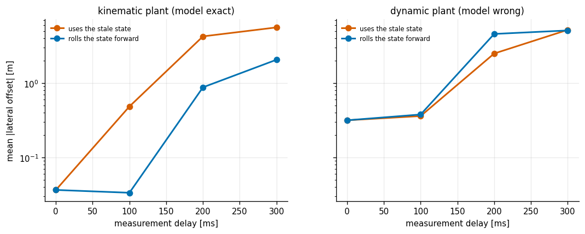

# MPC for an Ackermann Car

## Key Insight

Control an [Ackermann steering](/shared/glossary/#ackermann-steering) car around a racetrack using a [kinematic bicycle model](/shared/glossary/#kinematic-bicycle-model) within a [Model Predictive Control (MPC)](/shared/glossary/#mpc) framework. Unlike simpler robots, a car-like vehicle has a minimum turning radius and cannot slide sideways, introducing [nonholonomic constraints](/shared/glossary/#nonholonomic-constraint) to the path tracking challenge. The MPC solver handles these constraints by optimizing steering inputs over a rolling time horizon, minimizing deviation from the centerline while respecting physical limits.

**This is project 48.** Its real subject is not the optimiser — it is the *gap between the model the controller believes and the car it is actually driving*, and what that gap costs as you go faster.

---

## Files

| file | what it is |
|---|---|
| `car.py` | two vehicle models, the racetrack, the CasADi MPC, and a pure-pursuit baseline |
| `run.py` | the six experiments |
| `outputs/` | figures and `results.csv` |

```bash
python3 run.py      # about 7 minutes; needs numpy, casadi and matplotlib
```

---

## The two models, and why there are two

This is the design decision the whole project rests on, so it is worth being explicit about why it is not redundant to have two models of the same car.

**`kin_step` — the kinematic bicycle.** Wheels roll and never slide. Five states: position, heading, speed, steering angle. No mass, no tyres, no friction. **This is what the MPC believes.**

**`dyn_step` — the dynamic bicycle.** Tyres generate sideways force only by *slipping* a little, and that force saturates. Seven states, including the two the kinematic model does not have at all: sideways speed in the car's own frame, and yaw rate. **This is the plant — the thing being driven.**

Running a controller built on the first against the second is not a mistake to be fixed. It is what every real vehicle stack does: a controller that used the full tyre model would be slower to solve and would need tyre parameters nobody measures accurately. The interesting question is *how fast you can go before the simplification stops being harmless*, and experiment 3 answers it.

Two names decoded while we are here:

- **"Bicycle model"** is literal. The two front wheels are collapsed into one at the centre of the front axle, and the two rears into one at the rear, because below hard cornering the left and right wheel of an axle do nearly the same thing.
- **"Ackermann"** is the steering *geometry* that makes that collapse a good approximation. Rudolph Ackermann patented the linkage in 1818: it turns the inner wheel more sharply than the outer one, so all four wheels trace circles about one shared centre instead of scrubbing sideways.

The one line carrying all the [non-holonomy](/shared/glossary/#nonholonomic-constraint) is `psi_dot = v · tan(delta) / L` — **you can only change heading by moving**. A car standing still cannot rotate however hard you turn the wheel, which is exactly what makes parallel parking a planning problem.

The tyre force uses a saturating law, `Fy = Fmax · tanh(C·alpha / Fmax)`. For a small slip angle `alpha` it is the textbook linear `Fy = C·alpha`; as `alpha` grows it flattens out at `Fmax = mu × (weight on that axle)`. **That flattening is the friction limit**: past it, asking for more steering gives no more turning. That is what understeer feels like from the driver's seat.

---

## How the MPC is built

Direct multiple shooting in CasADi: the future states are decision variables and the physics is an *equality constraint* linking them, rather than the model being rolled out inside the cost. This conditions far better — a rolled-out model makes the cost a deeply nested composition of the dynamics, and the optimiser has to differentiate through all of it.

Two implementation points that are easy to skip and expensive to skip:

- **The problem is compiled once.** Its *structure* never changes between control steps — only the current state and the reference do — so those enter as parameters and the whole solve becomes one function call. Rebuilding the optimisation problem every tick is the slowest possible way to run MPC and also the most common.
- **[Warm start](/shared/glossary/#warm-start).** Consecutive MPC problems differ by 100 ms of driving, so the previous answer is nearly the new one. Feeding the previous primal and dual variables back in lets [IPOPT](/shared/glossary/#ipopt) converge in a handful of iterations instead of dozens.

The heading error in the cost is written as `sin²(Δψ) + (1−cos(Δψ))²` rather than `Δψ²`. Without that, a lap crossing the ±π line asks the car to spin a full turn.

---

## 1. One lap



A 228 m closed track whose tightest radius is 23.4 m. The reference speed comes from the curvature: `v = sqrt(a_lat / kappa)`, which is just "centripetal acceleration `v²·kappa` must not exceed what the tyres can supply". It is the single most useful line in racing-line code, and it says a corner's speed limit is set by its radius and nothing else.

| | |
|---|---|
| lap time | 16.3 s |
| mean speed | 14.05 m/s |
| mean \|lateral offset\| | 0.315 m |
| max \|lateral offset\| | 1.028 m (track half-width 4 m) |
| **mean solve time** | **22.5 ms** |
| **worst solve time** | **97.0 ms** |

Note the last two rows against a 100 ms control period. The *average* solve uses a fifth of the budget; the *worst* uses 97% of it. Sizing a real-time controller off the mean is how you get a control loop that misses its deadline once a lap, at the corner entry, which is the worst possible moment.

---

## 2. How far ahead does the horizon need to see? (a prediction, refuted twice)



The speed profile drops abruptly at every corner entry — it is computed point by point, with no backward smoothing — so the MPC has to do the braking itself, and the horizon is exactly the warning it gets. That suggests a clean, testable prediction:

> **The horizon must cover the braking time, `Δv / a_brake`.**

With a profile speed range of 8.15 m/s, that predicts a needed horizon of 2.72 s at 3 m/s² of braking, 1.36 s at 6, and 0.68 s at 12. Sweeping horizon against braking power, and asking whether the car completed a clean lap without leaving the track:

| horizon | brake 3 m/s² | brake 6 m/s² | brake 12 m/s² |
|---|---|---|---|
| 0.3 s | off track 57% | off track 95% | off track 96% |
| 0.5 s | off track 93% | off track 93% | off track 93% |
| **0.8 s** | **clean** | **clean** | **clean** |
| 1.2 s | clean | clean | clean |
| 2.0 s | clean | clean | clean |
| 3.5 s | clean | clean | clean |
| *predicted need* | *2.72 s* | *1.36 s* | *0.68 s* |

**The threshold is 0.8 s regardless of braking power.** Cutting the brakes by a factor of four does not move it at all. The prediction is wrong.

Second attempt: maybe it is *steering* speed, not braking. Same sweep, brakes fixed, only the steering-rack rate limit changing:

| horizon | rack 0.4 rad/s | rack 1.2 rad/s | rack 4.0 rad/s |
|---|---|---|---|
| 0.5 s | off track | off track | off track |
| **0.8 s** | **clean** | **clean** | **clean** |

**Also flat.** A ten-fold change in steering speed does not move the threshold either.

Two physical explanations, both refuted by the data. What is left is the textbook answer that does not correspond to any single physical time constant: **a receding-horizon controller without a terminal cost is unstable below a critical horizon, and that critical horizon is a property of the closed loop**, not of the brakes or the rack. It is worth having tried and failed to explain it mechanically, because the temptation with MPC is always to reach for "it needs to see far enough to do X", and here no X works.

The cost side of the same sweep is monotone and boring, which is the point: solve time goes from 6.7 ms at N=3 to 67 ms at N=50, roughly linear in the horizon. Past 0.8 s you are paying for accuracy you can measure (mean offset falls from 0.42 m at N=8 to 0.28 m at N=35) and stability you already had.

---

## 3. The model the controller believes vs the car it is driving



The same MPC, the same track, asking for more and more lateral acceleration — run once against a kinematic plant (where the model is *exactly right*) and once against the dynamic one.

| a_lat asked for | kinematic plant: max offset | dynamic plant: max offset | dynamic: fraction of lap off track |
|---|---|---|---|
| 3.0 | 0.222 m | 0.247 m | 0% |
| 4.5 | 0.266 m | 0.519 m | 0% |
| 6.0 | 0.301 m | **1.028 m** | 0% |
| **7.5** | 0.330 m | **11.36 m** | **22%** |
| 9.0 | 0.353 m | 15.59 m | 40% |
| 12.0 | 0.405 m | 16.32 m | 66% |

**On the kinematic plant, going faster costs almost nothing** — the max offset creeps from 0.22 m to 0.41 m across a four-fold increase in cornering demand. It is a perfect model of a perfect car, and the MPC tracks it beautifully at any speed. That column is the control that makes the other one readable.

**On the dynamic plant, the wheels come off between 6.0 and 7.5 m/s².** The friction limit is `mu·g = 8.83 m/s²`, so failure arrives at roughly **85% of the theoretical limit**, not at it. That is not a discrepancy — it is the tanh tyre law. To get 85% of maximum lateral force out of a tyre you need `tanh(x) = 0.85`, so `x = 1.26`, which for the front axle means a slip angle of about 5°. The kinematic model assumes slip is exactly zero. Five degrees of unmodelled slip, held through a corner, is metres.

**The lesson is not "the kinematic model is bad".** Up to 6 m/s² — 68% of the friction limit, and more than any delivery robot or campus shuttle will ever use — the difference between the two plants is under a metre on a 4 m half-width track. The kinematic model is an excellent model right up until it is a catastrophic one, and the boundary is predictable from `mu·g`.

---

## 4. MPC vs pure pursuit (the uncomfortable result)



The baseline is [project 46](../46-pure-pursuit/README.md)'s tracker converted to a steering angle — `delta = atan(L · kappa)`, which asks which wheel angle produces that curvature on this wheelbase — plus a P controller on the same speed profile. Both controllers get exactly the same information.

| a_lat target | MPC mean offset | pure pursuit mean offset | MPC lap | PP lap |
|---|---|---|---|---|
| 3.0 | 0.137 m | **0.107 m** | 22.5 s | 22.6 s |
| 4.5 | 0.127 m | **0.119 m** | 18.6 s | 18.7 s |
| 6.0 | **0.315 m** | 0.330 m | 16.3 s | 16.5 s |
| **7.5** | 2.503 m, **22% off track** | **0.985 m, on track** | — | **15.1 s** |
| 9.0 | 5.124 m, 46% off | **2.266 m, 25% off** | — | — |
| **cost per step** | **~23 ms** | **~0.30 ms** | | |

**Pure pursuit beats the MPC at four of the five speeds, and finishes a clean lap at 7.5 m/s where the MPC leaves the track — at 1/77 of the compute.**

That deserves an explanation rather than an apology, because it is not a bug. The MPC's advantages are (a) preview and (b) constraint handling. On this problem, (a) has already been spent: the speed profile *is* the preview, computed from curvature before the lap starts, and both controllers get it. And (b) has nothing to bind on — a 4 m half-width track never constrains anything. So the MPC brings no advantage, while bringing a liability the geometric controller does not have: **it plans several steps ahead using a model that is wrong at the friction limit, and commits to that plan.** Pure pursuit re-derives its steering from geometry every tick and has no plan to be wrong about.

So the fair conclusion is narrow and worth stating precisely: *on a wide track with a precomputed speed profile, MPC's machinery earns nothing.* To check that it earns something *somewhere*, the same comparison on a track narrowed to 1.2 m of half-width:

| controller | max lateral offset | fraction of lap off track | solve time |
|---|---|---|---|
| MPC, no bounds | 1.028 m | **0%** | 20.9 ms |
| MPC, soft bounds | 1.028 m | **0%** | 29.5 ms |
| pure pursuit | 1.321 m | **7.3%** | 0.30 ms |

**MPC wins here — and note *how*.** The soft-bounded and unbounded MPC runs are byte-for-byte identical, so the boundary constraint contributed nothing. The MPC won purely by tracking 22% tighter in the worst case, and on a 1.2 m track that difference is the difference between on and off. When the margin shrinks below the controller's own error, accuracy stops being cosmetic.

---

## 5. Hard constraints, soft constraints, and none



The obvious way to keep a car on a track is to add `|lateral offset| ≤ half-width` as a constraint. Three arms, on the dynamic plant:

| a_lat | | fraction off track | **solver failures** | solve time |
|---|---|---|---|---|
| 6.0 | no constraint | 0% | 0% | 21.4 ms |
| 6.0 | hard constraint | 0% | 0% | 24.0 ms |
| 6.0 | soft constraint | 0% | 0% | 30.8 ms |
| **7.5** | no constraint | **22%** | 0% | 23.9 ms |
| **7.5** | **hard constraint** | **92%** | **93%** | **55.0 ms** |
| **7.5** | soft constraint | **21%** | 0% | 33.3 ms |
| 9.0 | no constraint | 46% | 0% | 25.1 ms |
| 9.0 | hard constraint | 75% | 80% | 77.7 ms |
| 9.0 | soft constraint | 62% | 0% | 40.1 ms |

**The hard constraint is by far the worst of the three, and it is worst exactly where it was supposed to help.** At 7.5 m/s² it takes the off-track fraction from 22% to 92% while more than doubling the solve time.

The mechanism is in the failure column. Past the friction limit, "stay on the track" is a constraint the *physics cannot satisfy*, so the problem becomes **infeasible** — and an infeasible solve does not return a cautious plan, it returns a number that is not a plan at all. 93% of the control steps in that run were solver failures. The controller did not become conservative; it stopped being a controller.

The soft constraint is the standard fix and it works exactly as advertised: a slack variable with a heavy penalty, so the problem *always* has an answer — "go as far inside as you can, and pay for the rest". Zero solver failures at every speed. It costs 40% more solve time and, honestly, **buys nothing over having no constraint at all** on this track (21% vs 22% off at 7.5). Its value is not in this table; its value is that it cannot produce the hard constraint's failure.

**A constraint your physics can violate is not a safety feature.** It converts a degraded controller into a broken one.

---

## 6. The solver takes time, and the car keeps moving while it thinks



The state the controller acts on is always old — by however long perception, transport and the solve took. The standard fix is to roll the state forward through the model by the delay, so you plan from where the car *will* be. It costs one model evaluation. Does it work?

| delay | kinematic plant, stale state | kinematic plant, **compensated** | dynamic plant, stale | dynamic plant, **compensated** |
|---|---|---|---|---|
| 0 ms | 0.036 m | 0.036 m | 0.315 m | 0.315 m |
| **100 ms** | 0.484 m | **0.033 m** | 0.360 m | 0.377 m |
| **200 ms** | 4.248 m (off track) | **0.876 m (clean lap)** | 2.496 m (off) | **4.579 m (worse)** |
| 300 ms | 5.606 m | 2.059 m | 5.197 m | 5.103 m |

On the **kinematic** plant, compensation is spectacular: 100 ms of delay costs a factor of 13 uncompensated and is essentially free when compensated (0.033 vs 0.036 at zero delay). At 200 ms it is the difference between leaving the track and a clean lap.

On the **dynamic** plant it does nothing at 100 ms (0.360 → 0.377) and is actively *worse* at 200 ms (2.496 → 4.579).

The reason is the same one that drives experiment 3, and the two-plant design is what makes it visible: **delay compensation is only as good as the model you compensate with.** The forward roll uses the *kinematic* model, which is exactly right on the kinematic plant and wrong in a specific direction on the dynamic one. Predicting 200 ms ahead with a model that ignores tyre slip does not remove the delay error; it replaces it with a model error of comparable size, pointed somewhere else. Running the experiment on only the realistic plant would have produced "compensation does not help", which is true and uninformative. Running it on both says *why*.

---

## What carries forward

- The two-plant structure — a plant that is deliberately richer than the controller's model — is the honest way to evaluate any model-based controller, and it is what [project 51](../51-quadruped-trotting-mpc/README.md) does again with a single-rigid-body MPC driving a full 18-degree-of-freedom quadruped.
- "Pure pursuit beats MPC when nothing constrains" is a specific instance of a general habit worth keeping: **before adopting the more powerful method, check that its extra power has something to bite on.**
- The soft-constraint pattern reappears in [project 51](../51-quadruped-trotting-mpc/README.md)'s friction pyramid, where the same choice — inscribe a simpler shape and keep the problem solvable — is made for the same reason.

---

## Things worth trying

1. Give the MPC the **dynamic** model and rerun experiment 3. The failure should move from 7.5 m/s² up towards `mu·g` — and the solve time should go up too, which is the actual trade a real racing stack makes.
2. Replace the reference-tracking cost with **model predictive contouring control**: reward progress along the track and penalise lateral deviation, instead of tracking a point that moves at a precomputed speed. That is the formulation where MPC finally has something pure pursuit cannot do, because the speed profile becomes an *output* rather than an input.
3. Add a term to the cost that penalises predicted slip angle. That is the cheapest way to make a kinematic controller aware of a limit it cannot model.
