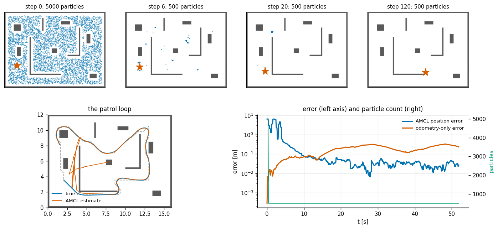
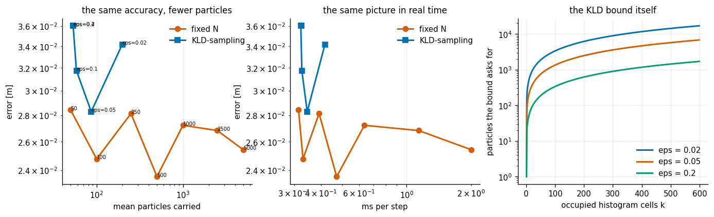
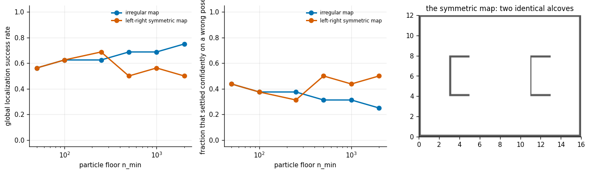
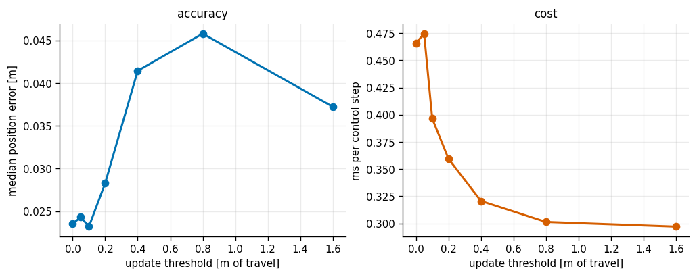
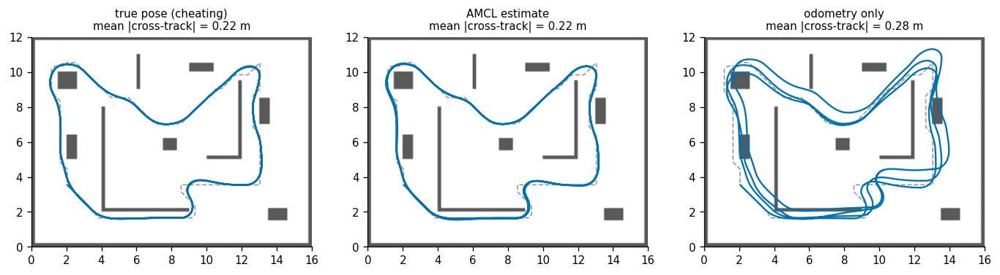
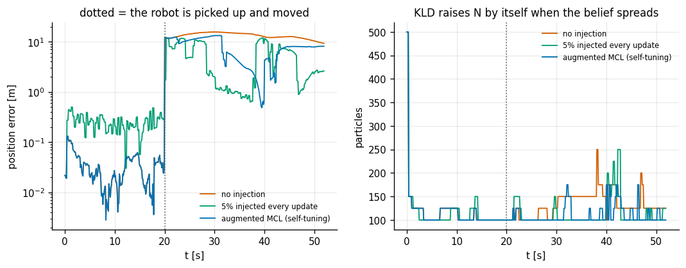

# AMCL on a Known Map

## Key Insight

Localize a mobile robot within a known occupancy grid map using [Adaptive Monte Carlo Localization (AMCL)](/shared/glossary/#adaptive-monte-carlo-localization-amcl). By representing the robot's possible positions as a set of particles, the algorithm combines noisy wheel [odometry](/shared/glossary/#odometry) with [lidar](/shared/glossary/#lidar) scans to estimate the robot's pose. As the robot moves and detects features, the [particle filter](/shared/glossary/#particle-filter) resamples to converge on the true location, dynamically adjusting the particle count to balance estimation accuracy with real-time computational constraints.

**This is project 49.** It is also the project that closes Phase 7's loop: the robot does not just *estimate* its pose, it **drives on the estimate**, using [project 46](../46-pure-pursuit/README.md)'s tracker on a route planned by [project 47](../47-dwa-local-planner/README.md)'s A*.

---

## Files

| file | what it is |
|---|---|
| `amcl.py` | KLD-sampling, update thresholds, and the AMCL filter |
| `run.py` | the six experiments and the closed-loop driver |
| `outputs/` | figures and `results.csv` |

It imports [project 27](../27-particle-filter/README.md)'s `GridMap`, sensor models and resamplers; [project 46](../46-pure-pursuit/README.md)'s `DiffDrive` and `pure_pursuit`; and [project 47](../47-dwa-local-planner/README.md)'s `Costmap` and A* glue.

```bash
python3 run.py      # about 3 minutes; needs numpy and matplotlib only
```

---

## Isn't this just project 27 again?

A fair question, and the answer is the whole reason there are two projects.

[Project 27](../27-particle-filter/README.md) built a [particle filter](/shared/glossary/#particle-filter) on a known map: sample the motion, weight by the laser scan, resample, and inject random particles when the robot looks lost. All of that is *imported* here, not rewritten. What AMCL adds is **not accuracy — it is cost**, and it adds it in two places:

1. **[KLD-sampling](/shared/glossary/#adaptive-monte-carlo-localization-amcl)** — the "Adaptive" in the name. A plain filter is stuck with one particle count `N`, chosen once. It has to be huge (thousands) so that finding yourself from scratch can work at all, and then it keeps paying for those thousands forever — long after the cloud has collapsed into a 10 cm blob where fifty particles would do. KLD-sampling reads the *spread* of the current cloud and asks for exactly as many particles as that spread needs, freshly, at every step.
2. **Update thresholds** — do nothing at all until the robot has actually moved. A standing robot gets no new information from a new scan, but a naive filter still resamples on it, and resampling without new information throws diversity away for free.

Neither is about being more right. Both are about not paying for certainty you already have.

And the third addition is structural rather than algorithmic: here the pose estimate **drives the robot** (experiment 5), which is the difference between an estimation exercise and a navigation stack.

---

## What the KLD bound actually says

The formula is

```
n = (k-1)/(2*eps) * ( 1 - 2/(9(k-1)) + sqrt(2/(9(k-1))) * z )^3
```

In plain language: **the number of particles you need grows with `k`, how many distinct cells your belief is spread over, and shrinks with `eps`, how much error you are willing to tolerate.** A belief squeezed into one histogram cell needs almost nothing. A belief smeared over 400 cells needs thousands.

"KLD" is **Kullback-Leibler divergence**, the standard measure of how far one probability distribution is from another — named after Solomon Kullback and Richard Leibler, who introduced it in 1951. The bound is the sample count at which the KL divergence between your true belief and the one your particles represent stays below `eps` with probability `1 − delta`. The crucial part for a robot is that this depends on the **shape** of the belief, which changes every single step — so the right `N` changes every step too, and a fixed `N` is by construction wrong nearly all the time.

The implementation is a loop, and the loop *is* the algorithm: draw a few particles, see how many *new* histogram cells they landed in, recompute how many the bound now demands, and stop as soon as you have that many. A tight cloud fills no new cells, the bound stays low, and the loop exits after a couple of blocks. A spread cloud keeps filling new cells and the bound keeps running away from you.

---

## 1. One patrol lap



The robot starts with **no idea where it is** — 5000 particles scattered uniformly over the free space — and drives a 44 m patrol loop planned by A*.

| | |
|---|---|
| particles at the start | 5000 |
| particles once settled | 500 (the floor; see experiment 3) |
| time to converge under 0.5 m | 4.3 s |
| settled position error | **0.031 m** |
| settled heading error | **0.38°** |
| odometry-only error after one lap | 0.23 m |
| filter cost per control step | 0.64 ms |
| measurement updates run / skipped | 174 / 346 |

The top row of the figure is the belief collapsing: a uniform scatter, then a handful of surviving hypotheses, then a blob. The bottom right shows the error against the particle count on the same axis — the count drops as the error drops, which is exactly the behaviour a fixed `N` cannot produce.

Note the last row: **two thirds of the scans were never used**, because the robot had not moved 0.2 m since the previous update. That is experiment 4.

---

## 2. KLD-sampling vs a fixed count (and the honest reading)



This is measured in the **tracking** regime — the filter starts with a rough idea of where it is, which is what a real robot gets when you tell it its starting pose. Mixing in the global search would measure a different question and hide this one.

| | mean particles carried | median error | ms per step |
|---|---|---|---|
| fixed N = 50 | 50 | 0.028 m | 0.31 |
| fixed N = 100 | 100 | 0.025 m | 0.33 |
| fixed N = 500 | 500 | 0.024 m | 0.47 |
| fixed N = 2500 | 2500 | 0.027 m | 1.14 |
| fixed N = 5000 | 5000 | 0.025 m | 2.00 |
| KLD, eps = 0.02 | 198 | 0.034 m | 0.42 |
| **KLD, eps = 0.05** | **87** | **0.028 m** | **0.34** |
| KLD, eps = 0.1 | 58 | 0.032 m | 0.33 |
| KLD, eps = 0.4 | 53 | 0.036 m | 0.32 |

Two readings, and the second is the honest one.

**A hundred-fold range in particle count changes the tracking error by nothing at all** — every row sits between 0.024 and 0.036 m. Once the belief is a single tight blob, fifty samples describe it as well as five thousand, and the extra 4950 are 6× the compute for nothing.

**And therefore KLD-sampling does not beat a well-chosen fixed `N` here.** KLD at eps = 0.05 carries 87 particles at 0.34 ms; fixed N = 100 carries 100 at 0.33 ms and is marginally *more* accurate. That is not a failure of the method — it is a correct statement of what the method is for. **KLD's value is that it finds the right number by itself, without you having to know in advance that 100 was the answer** — and, crucially, without breaking when the belief spreads out again, which is exactly when a fixed 100 would fail. Experiments 3 and 6 are where that matters.

The right-hand panel plots the bound itself: at eps = 0.05, one occupied cell asks for the floor, 100 cells asks for about a thousand particles, 600 cells for several thousand. The curve is the mechanism.

---

## 3. Global localization, and the one parameter that decides it



Starting with no idea where you are is a much harder problem than tracking, and it is governed by a parameter that looks like a safety detail: **`n_min`, the floor KLD-sampling is never allowed to shrink below.**

Sixteen runs per setting:

| particle floor | irregular map: converged | settled confidently on a wrong pose | ms per step |
|---|---|---|---|
| 50 | 9/16 (0.56) | 0.44 | 0.38 |
| 100 | 10/16 (0.63) | 0.38 | 0.39 |
| 250 | 10/16 (0.63) | 0.38 | 0.49 |
| 500 | 11/16 (0.69) | 0.31 | 0.64 |
| 1000 | 11/16 (0.69) | 0.31 | 0.98 |
| **2000** | **12/16 (0.75)** | **0.25** | **1.63** |

The floor matters, and the mechanism is worth understanding because it is a general property of particle filters, not a quirk of this one.

**The first scan makes the weights extremely peaked.** Twelve laser beams in an irregular room are very informative, so after one measurement update almost all the probability sits on a handful of particles. If the filter is allowed to shrink to 50 particles right at that moment, every hypothesis except one dies — and **if the survivor is the wrong one, no amount of further evidence brings the right one back.** Resampling can only ever *copy* particles that already exist; it cannot invent a hypothesis that has been deleted.

That is why the "confidently wrong" column is the right thing to count, not just the failure rate. A filter that is merely *uncertain* still recovers. A filter that is *certain and wrong* does not, and 25–44% of runs end that way.

Raising the floor from 50 to 2000 buys 19 points of success and costs **4.3× the compute** — the exact opposite of the trade KLD was introduced to make. This is not a contradiction: it says the floor should be high while you are lost and low once you are found, which is precisely what an adaptive count with a *time-varying* floor would do, and what plain `n_min` does not.

The symmetric map (two identical alcoves, mirrored left to right) shows the same range of outcomes but **does not get better with a bigger floor** — 0.56 at `n_min` = 50, 0.50 at 2000. More particles cannot resolve an ambiguity the sensor genuinely cannot see: if two places in the room produce identical scans, splitting your belief more finely between them does not tell you which one you are in.

---

## 4. Update thresholds: doing nothing while standing still



AMCL only runs a measurement update once the robot has travelled some distance (or turned some angle) since the last one.

| threshold | updates run (of 520) | fraction skipped | ms per control step | median error |
|---|---|---|---|---|
| 0 m (update always) | 520 | 0% | 0.466 | 0.0235 m |
| 0.1 m | 259 | 50% | 0.397 | **0.0232 m** |
| **0.2 m** | **174** | **67%** | **0.359** | 0.0283 m |
| 0.4 m | 98 | 81% | 0.321 | 0.0415 m |
| 0.8 m | 68 | 87% | 0.301 | 0.0458 m |
| 1.6 m | 60 | 89% | 0.297 | 0.0372 m |

**Skipping half the updates costs nothing measurable** (0.0232 vs 0.0235 m) and saves 15% of the filter's time. Skipping two thirds costs 20% of the accuracy and saves 23% of the time. Past that the accuracy degrades and the savings flatten — by 0.8 m you are down to 68 updates and further increases barely change anything, because the robot is moving fast enough that it crosses the threshold nearly every tick anyway.

The reason the first row is nearly free is worth stating plainly: **a stationary robot's new scan carries almost no new information**, so an update on it is mostly a resample, and every resample throws away particle diversity. Doing less can be strictly better, not just cheaper.

The default in real AMCL is 0.2 m and 0.2 rad, and the table shows why: it is the knee, where two thirds of the work disappears for a fifth of the accuracy.

---

## 5. Closing the loop — drive on the estimate



Three laps of the same patrol route, with [project 46](../46-pure-pursuit/README.md)'s tracker fed by three different pose sources:

| the tracker is given | mean \|cross-track\| | worst seed | **control steps in collision** | final odometry drift |
|---|---|---|---|---|
| the **true pose** (cheating) | 0.216 m | 0.217 m | 3.4 | 0.69 m |
| the **AMCL estimate** | **0.215 m** | 0.217 m | **3.8** | 0.54 m |
| **odometry only** | 0.279 m | 0.331 m | **198.6** | 0.90 m |

**Driving on the AMCL estimate is indistinguishable from driving on the truth** — 0.215 m against 0.216 m. That is the payoff of the whole project stated in one number.

But look at what the *mean* metric nearly hid. Odometry-only has a mean cross-track error of 0.279 m, which is only 29% worse and sounds survivable. Its collision count is **198.6 control steps against 3.8** — a factor of 52. Dead reckoning drifts, the robot's *belief* about the route stays perfectly on it, and it grinds along a wall while its own log reports excellent tracking.

**A mean error is the wrong summary for a failure that is concentrated.** This is why the collision counter is in the table at all, and why one lap would not have been enough: over 44 m the drift is only 0.23 m, and the experiment would have concluded that odometry is fine. Three laps is what makes it visible.

---

## 6. Kidnapping, and the difference between a fixed and a self-tuning fix



At step 200 the robot is picked up and put down somewhere else, without telling the filter. Six seeds each:

| recovery strategy | recovered | mean recovery time |
|---|---|---|
| no injection | **0/6** | — |
| 5% random particles injected on every update | **0/6** | — |
| **augmented MCL (self-tuning injection)** | **4/6** | 20.1 s |

**No injection recovers 0/6**, for exactly the reason experiment 3 identified: resampling only copies particles that already exist, and after the kidnap none of them is anywhere near the truth.

**A constant 5% injection also recovers 0/6**, which is the surprising row. Five percent of ~110 particles is five random poses per update, scattered over a 16 × 12 m room. The chance that any of them lands close enough to the true pose to out-weight the (wrong but confident) incumbent cloud is small, and the ones that do not land well are deleted at the next resample. A trickle of random guesses is not a recovery mechanism; it is a small permanent tax.

**Augmented MCL recovers 4/6.** It keeps two running averages of how well the scans are being explained — one that reacts in a few steps, one that barely moves — and injects a fraction equal to the *gap between them*. While the filter is happy they agree and nothing is injected. The moment the robot is moved, the fast average collapses while the slow one lags, and the gap becomes large, so a large burst of fresh hypotheses goes in **at exactly the moment it is needed**. It is a self-tuning panic button, and the difference between it and the constant 5% is not the mechanism but the *timing*: the same total number of random particles, concentrated where they can do something.

---

## What carries forward

- This project is the one that makes the phase's stack real: a global plan ([47](../47-dwa-local-planner/README.md)), a tracker ([46](../46-pure-pursuit/README.md)), and a localiser feeding the tracker, all running together.
- "A concentrated failure hides inside a mean" recurs throughout the phase — see [project 51](../51-quadruped-trotting-mpc/README.md), where a controller's average velocity error looks fine right up to the step where it falls over.
- The "confidently wrong" distinction — a wrong belief you cannot recover from is qualitatively different from an uncertain one — is the same reason [project 53](../53-social-navigation/README.md) measures freezing separately from collisions.

---

## Things worth trying

1. Make `n_min` **time-varying**: high while the effective sample size says the belief is spread, low once it has collapsed. Experiment 3 says this should get the 2000-floor success rate at the 50-floor compute.
2. Feed AMCL's own **covariance** to the path tracker and shorten the look-ahead when the estimate is confident, lengthen it when it is not. [Project 46](../46-pure-pursuit/README.md)'s experiment 7 says that is exactly the right knob.
3. Add a moving obstacle to the map that is *not* in the stored map, and watch the scan likelihood degrade. That is the failure mode that sends real AMCL installations into the kidnapped-robot branch every day.
