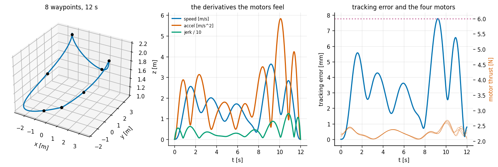
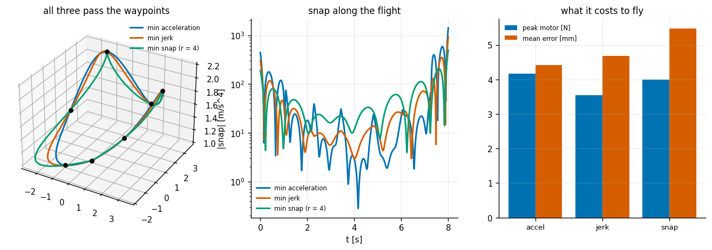
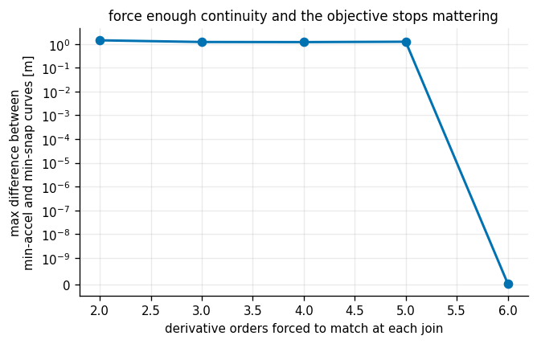
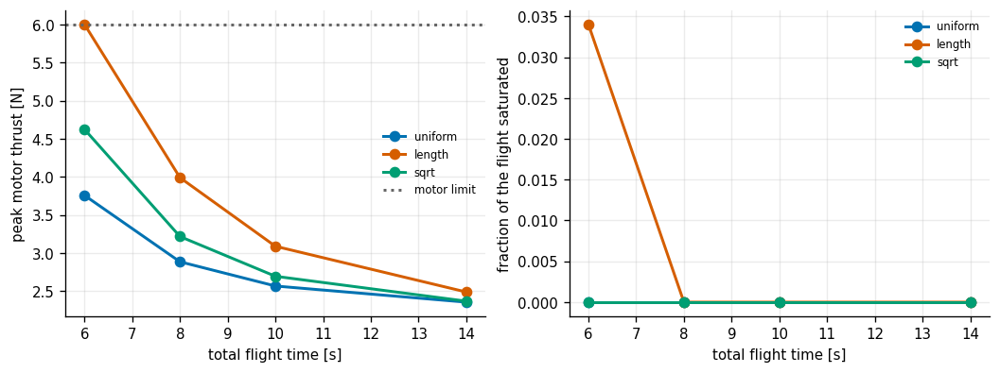
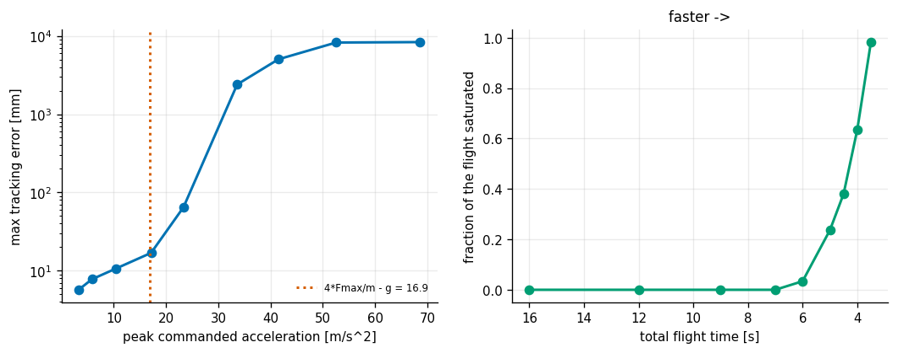
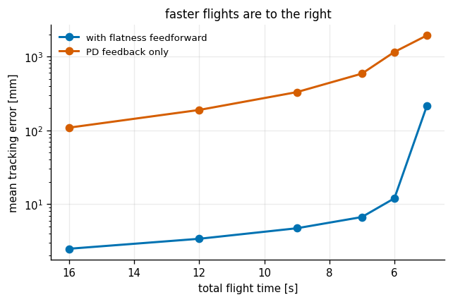

# Quadrotor Min-Snap

## Key Insight

Generate and track a [minimum-snap trajectory](/shared/glossary/#minimum-snap-trajectory) through a sequence of waypoints for a [quadrotor](/shared/glossary/#quadrotor) drone. Because a quadrotor's position and [yaw](/shared/glossary/#yaw) are [differentially flat](/shared/glossary/#differential-flatness), its 3D flight paths can be planned directly as smooth polynomials, bypassing full rotational dynamics. Minimizing snap—the fourth derivative of position over time—produces trajectories that avoid sudden accelerations, allowing the drone's motors to track the path precisely without saturating.

**This is project 50.** It is the phase's one flying vehicle, and it is here because a [quadrotor](/shared/glossary/#quadrotor) is the cleanest example in robotics of a hard-looking control problem that a single mathematical property makes easy.

---

## Files

| file | what it is |
|---|---|
| `quad.py` | the quadrotor, its [differential flatness](/shared/glossary/#differential-flatness), and the geometric SE(3) controller |
| `minsnap.py` | the piecewise-polynomial trajectory optimiser and the time-allocation rules |
| `run.py` | the six experiments |
| `outputs/` | figures and `results.csv` |

```bash
python3 run.py      # about 80 seconds; needs numpy and matplotlib only
```

---

## The one idea: differential flatness

A quadrotor has four motors and six degrees of freedom, so it is **under-actuated** — there are more things it could do than knobs to do them with. It cannot fly sideways without tilting, because the only force it can produce points along its own body z-axis. That sounds like it should make planning hard.

A system is **differentially flat** when some set of outputs exists — the *flat outputs* — from which the entire state and every input can be written down algebraically, using only those outputs and their derivatives. No integration. No solving anything. For a quadrotor the flat outputs are `(x, y, z, yaw)`.

The name comes from Fliess, Lévine, Martin and Rouchon (1992). The intuition behind "flat" is that the system, *seen through those outputs*, has been flattened out — there is no hidden internal dynamics left to worry about, no state you have to simulate forward to discover.

The consequence is the reason this project exists:

> **Plan any smooth-enough curve in `(x, y, z, yaw)` and a quadrotor can fly it — and you can read the required attitude and motor forces straight off the curve's derivatives.**

Trajectory generation stops being a twelve-dimensional optimal-control problem and becomes "draw four smooth one-dimensional functions".

The algebra in `flat_to_state` makes it concrete, and every line is forced:

- the thrust direction must point along **acceleration + gravity**, because that is the only force the vehicle has;
- the yaw you asked for pins down the last rotation about that axis, giving a unique attitude;
- differentiating the thrust direction gives angular velocity — so **jerk** (the derivative of acceleration) sets how fast the vehicle must *rotate*;
- differentiating once more gives angular acceleration, and therefore torque — so **snap** (the fourth derivative of position) sets the motor *differential*.

That last line is the entire argument for minimising snap rather than, say, acceleration. **Snap is the derivative that maps directly onto the quantity the four motors have a hard limit on.** It is not an aesthetic choice.

("Snap" is the fourth derivative of position: position, velocity, acceleration, jerk, snap. And yes, the joke names for the fifth and sixth are crackle and pop, and they are in the literature.)

---

## Why go through the motors?

`Quad.step` takes a thrust and a torque but applies them **through a mixer that converts them into four individual motor forces, clips each one to `[0, 6 N]`, and then recomputes what thrust and torque the clipped set actually produces.**

Commanding thrust and torque directly would be simpler and would quietly let the controller ask for a torque that no set of four non-negative, bounded motor forces can produce. Going through the mixer is what makes **saturation visible** — and saturation, not the control law, is what actually limits how aggressively a quadrotor can fly. Experiments 4, 5 and 6 all measure it.

For the same reason `expm_so3` uses Rodrigues' exact rotation exponential rather than `R + R·hat(w)·dt`. The cheap version drifts off the rotation manifold within a few hundred steps: the matrix stops being orthonormal and every direction it reports is slightly wrong. Rodrigues costs the same and stays exact.

---

## 1. One flight



Eight waypoints, 12 seconds, minimum snap:

| | |
|---|---|
| peak speed / acceleration | 3.64 m/s / 5.84 m/s² |
| peak jerk / snap | 12.5 m/s³ / 97.6 m/s⁴ |
| mean tracking error | **3.4 mm** |
| max tracking error | 7.8 mm |
| worst waypoint miss | 2.8 mm |
| peak motor thrust | 2.68 N (limit 6.0 N) |
| fraction of flight saturated | **0%** |

Millimetre tracking at half the motor limit. That is what flatness plus a feedforward controller buys, and experiment 6 measures how much of it comes from the feedforward specifically.

---

## 2. Which derivative should you minimise? (not the answer you expect)



Same waypoints, same 8 s, same polynomial degree, same continuity — **only the objective changes**:

| minimise | peak accel | peak jerk | **peak snap** | total snap cost | peak motor | mean error |
|---|---|---|---|---|---|---|
| acceleration | **11.04** | 67.1 | 1418.5 | 163 963 | 4.17 N | **4.42 mm** |
| jerk | 9.48 | 48.1 | 913.3 | 66 576 | **3.54 N** | 4.67 mm |
| **snap** | 13.13 | **42.0** | **494.1** | **39 549** | 3.99 N | 5.48 mm |

Minimum snap wins on the thing it optimises — **2.9× less peak snap and 4.1× less total snap cost than minimising acceleration** — and it **loses on two of the other three columns**. It has the *highest* peak acceleration (13.13 vs 11.04) and the *worst* tracking error (5.48 mm vs 4.42 mm). Minimum jerk, not minimum snap, produces the lowest peak motor thrust.

This is worth taking seriously rather than explaining away. Minimising a derivative does not make a trajectory "smoother" in general; **it makes it smoother in that derivative, at the expense of the others.** The case for snap is specifically that snap is what drives the *torque* demand, and torque is where a quadrotor's four motors fight each other — so on a flight aggressive enough to saturate, snap is the right thing to minimise. On this flight, which never saturates, the argument has nothing to bite on, and the numbers say so honestly.

---

## 3. When the objective does not matter at all



The trajectory is a piecewise polynomial. At each internal join, some number of derivative orders are forced to match. Sweeping how many, and comparing the minimum-acceleration and minimum-snap curves:

| derivative orders matched at each join | free parameters left | max difference between the two curves | peak snap (min-accel) | peak snap (min-snap) |
|---|---|---|---|---|
| 2 | 24 | 1.42 m | 3103.5 | 467.0 |
| 3 | 18 | 1.21 m | 1725.0 | 494.1 |
| 4 | 12 | 1.20 m | 1418.5 | 494.1 |
| 5 | 6 | 1.24 m | 1037.5 | 494.1 |
| **6** | **0** | **0.000000 m** | **494.1** | **494.1** |

At continuity order 6 the two curves are **bit-for-bit identical**, and both have exactly the peak snap of the minimum-snap solution.

The arithmetic explains it completely. A degree-7 polynomial has 8 coefficients per segment. With 7 segments that is 56 unknowns. Requiring both endpoints of every segment (14 constraints), six matched derivative orders at each of the 6 internal joins (36), and three pinned derivatives at each end of the flight (6) gives exactly 56 equations. **The system is square: the constraints alone pin every coefficient, and the cost function never gets a vote.**

This is why the classic min-snap formulation is often described as having a *closed form*. It is closed-form because there is nothing left to optimise. If you want the objective to actually do something, you must leave some derivative orders free — which is what `cont=4` does here, and why the sweep in experiment 2 shows any difference at all.

---

## 4. How to split the time between the legs



The polynomial solve needs a duration for every leg. Three rules:

- **uniform** — every leg gets the same time. A 5 m leg and a 0.5 m leg both get 2 s, so the long one demands 10× the speed.
- **length** — time proportional to leg length, giving constant average speed. The obvious choice.
- **sqrt** — time proportional to `length^0.5`, so short legs get relatively *more* time than their length suggests.

| total flight time | uniform: peak motor | length: peak motor | sqrt: peak motor |
|---|---|---|---|
| 6 s | **3.76 N** | **6.00 N (saturated 3.4%)** | 4.62 N |
| 8 s | **2.89 N** | 3.99 N | 3.22 N |
| 10 s | **2.57 N** | 3.09 N | 2.70 N |
| 14 s | **2.36 N** | 2.49 N | 2.37 N |

**The "obvious" rule is the worst one.** Length-proportional allocation is the only one that saturates the motors at 6 s, and it demands 60% more peak thrust than uniform at that speed.

Why: on this waypoint set the legs are of similar length but differ sharply in how much *turning* happens at their ends. Length-proportional allocation gives a short leg between two long ones a short time — but a short leg between two long ones is usually a sharp corner, and corners cost *acceleration*, not distance. The `sqrt` rule exists to soften exactly that, and it lands between the two, which is what a compromise rule should do.

The general point: **time allocation is not a scheduling detail bolted on before the real optimisation. It is a first-class part of the problem**, and getting it wrong costs more than the choice of objective in experiment 2 did.

---

## 5. How fast can it be flown?



The most upward acceleration four motors can produce, minus gravity, is `4 × 6 N / 0.9 kg − 9.81 = 16.9 m/s²`. That is a prediction of where the flight should start failing.

| total time | peak speed | peak accel | fraction saturated | max tracking error |
|---|---|---|---|---|
| 16 s | 2.73 | 3.28 | 0% | 5.7 mm |
| 12 s | 3.64 | 5.84 | 0% | 7.8 mm |
| 9 s | 4.85 | 10.38 | 0% | 10.6 mm |
| **7 s** | 6.24 | **17.15** | **0%** | 16.9 mm |
| **6 s** | 7.28 | **23.35** | **3.4%** | **64.7 mm** |
| 5 s | 8.73 | 33.62 | 23.7% | 2 399 mm |
| 4 s | 10.91 | 52.53 | 63.5% | 8 233 mm |
| 3.5 s | 12.47 | 68.61 | 98.3% | 8 341 mm |

The prediction brackets the onset: at 17.15 m/s² of demand (just past the 16.9 limit) there is still no saturation and 17 mm of error; by 23.35 m/s² saturation has started and the error has jumped 4×. From there it is a cliff — 5 s to 4 s takes the error from 2.4 m to 8.2 m.

The prediction is close but not exact, and the reason is instructive: **the 16.9 m/s² figure assumes all four motors push equally, which is only true when the drone is not turning.** A real trajectory needs the motors to *differ* in order to generate torque, and every newton spent on a torque differential is a newton not available for thrust. So the true limit is somewhat below the straight-line figure, and the amount depends on how much snap the trajectory demands — which loops back to experiment 2.

Notice also that tracking error degrades *smoothly* right up to saturation and then goes off a cliff. **A quadrotor gives essentially no warning**: it flies beautifully at 17 m/s² and is 2.4 m off the path at 33.

---

## 6. What the flatness feedforward is worth



The geometric SE(3) controller (Lee, Leok & McClamroch, 2010) can be run with or without the terms that flatness supplies — the reference acceleration, the reference angular velocity from jerk, and the reference angular acceleration from snap. Stripping them leaves a plain PD on position plus a PD on attitude.

("Geometric" means it never converts attitude to [Euler angles](/shared/glossary/#euler-angles): the orientation error is computed as a rotation *between* two rotation matrices. No gimbal lock, no wrapping. It works upside down, which Euler-based controllers do not.)

| total flight time | with feedforward | PD feedback only | ratio |
|---|---|---|---|
| 16 s | **2.48 mm** | 108.94 mm | **44×** |
| 12 s | 3.39 mm | 189.28 mm | 56× |
| 9 s | 4.71 mm | 330.25 mm | 70× |
| 7 s | 6.69 mm | 588.07 mm | 88× |
| 6 s | 12.00 mm | 1157.31 mm | 96× |
| 5 s | 216.82 mm | 1940.97 mm | 9× |

**The feedforward is worth between one and two orders of magnitude at every speed** — this is the single biggest effect in the project, far larger than the choice of objective or the time-allocation rule.

The intuition is that a PD controller can only respond to error that has *already happened*. To hold a 5 m/s² acceleration it must first drift far enough off the path to generate the required correction — the error is the input. The feedforward supplies the acceleration directly from the plan, so the feedback only has to clean up what the model got wrong.

The ratio does not simply grow with aggressiveness, though. It climbs from 44× to 96× and then **collapses to 9× at 5 s**. Past saturation the feedforward is asking for forces the motors cannot deliver, so the advantage evaporates — not because the feedback got better, but because both arms are now failing for the same reason. **The last row is not a data point about feedforward; it is a data point about saturation**, and reading it as the former would be the mistake.

---

## What carries forward

- Flatness is why this vehicle gets a *closed-form* planner while the quadruped in [project 51](../51-quadruped-trotting-mpc/README.md) needs an online [quadratic program](/shared/glossary/#quadratic-program). A legged robot's contact schedule is discrete and switching, so no equivalent flat output exists.
- The "minimise the derivative that maps onto your actuator limit" reasoning generalises directly: on a wheeled robot it is usually jerk (which maps onto motor current slew), not snap.
- The feedforward result is the same lesson as [project 48](../48-mpc-for-an-ackermann-car/README.md)'s latency experiment, from the other side: a model-based term is enormously valuable *and* only as good as the model.

---

## Things worth trying

1. Make the **time allocation an optimisation variable** rather than a rule, minimising total time subject to a peak-thrust bound. Experiment 4 says the gains available there are large.
2. Add a **payload the controller does not know about** (scale the commanded thrust by 0.9) and rerun experiment 6. The feedforward should go from a huge advantage to a systematic bias — the same trap [project 48](../48-mpc-for-an-ackermann-car/README.md) hit with delay compensation.
3. Constrain the trajectory to stay inside a corridor of boxes. That turns the equality-constrained QP into an inequality-constrained one, and is how min-snap is actually used for obstacle avoidance.
