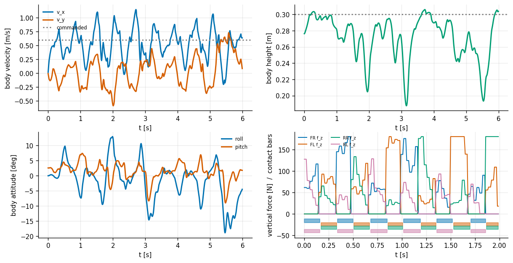
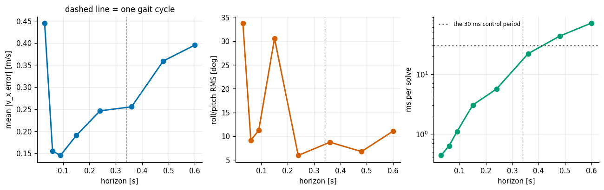
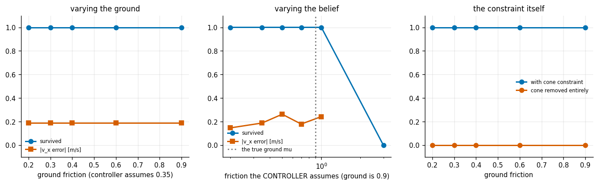
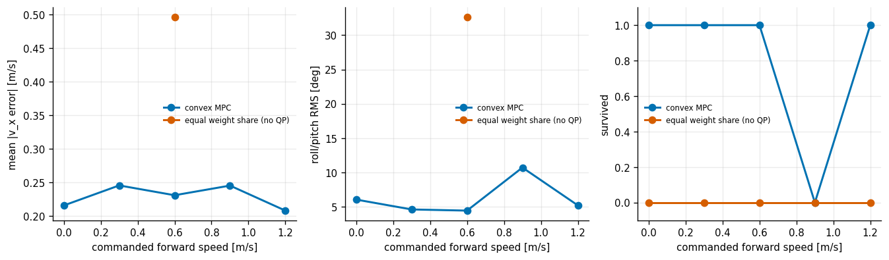
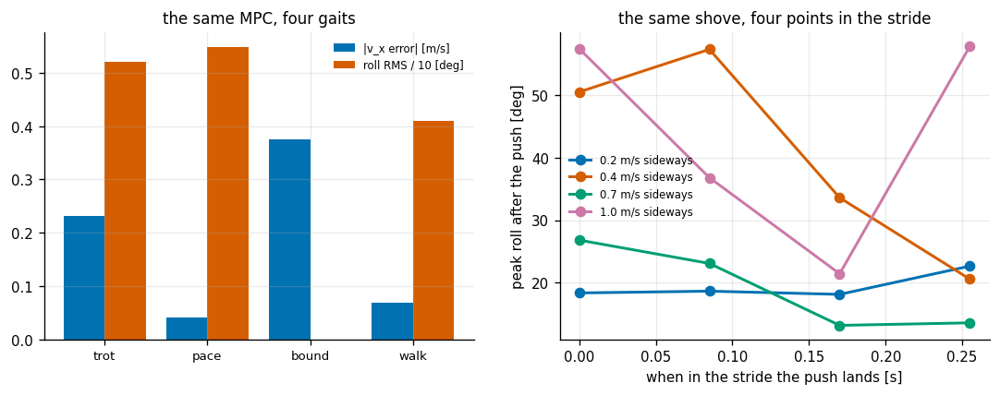

# Quadruped Trotting MPC

## Key Insight

Implement a convex [Model Predictive Control (MPC)](/shared/glossary/#mpc) controller to generate stable trotting [gaits](/shared/glossary/#gait) on a quadruped robot. The controller simplifies the robot's complex legged [kinematics](/shared/glossary/#kinematics) into a [centroidal dynamics](/shared/glossary/#centroidal-dynamics) model, tracking the momentum of its center of mass. By solving a [quadratic optimization problem](/shared/glossary/#quadratic-program) at each step, the [MPC](/shared/glossary/#mpc) computes the ground reaction forces for the feet in contact, which are then converted to joint torques via a [Whole-Body Control (WBC)](/shared/glossary/#wbc) loop to maintain dynamic balance.

**This is project 51.** It is the phase's hardest build: a 12-joint robot in MuJoCo, a [quadratic program](/shared/glossary/#quadratic-program) solved 33 times a second, and a leg controller under it — and the four bugs it took to get walking are worth as much as the results.

---

## Files

| file | what it is |
|---|---|
| `quadruped.py` | the MuJoCo robot, closed-form leg IK, the [gait](/shared/glossary/#gait) schedule, and foot placement — **imported by [project 52](../52-learned-locomotion/README.md)** |
| `mpc.py` | the convex MPC over the single-rigid-body model, and the leg controller |
| `run.py` | the five experiments |
| `outputs/` | figures and `results.csv` |

```bash
python3 run.py      # about 2 minutes; needs numpy, mujoco, casadi and matplotlib
```

---

## The simplification that made modern quadrupeds work

The full dynamics of a quadruped are 18-dimensional, non-linear, and change *discontinuously* every time a foot touches down. Optimising over that at 50 Hz is not realistic. The trick (Di Carlo, Wensing, Katz, Bledt & Kim, 2018) is to throw away nearly all of it:

> **Pretend the robot is a single rigid brick, and the legs are massless force generators attached at known points.**

That is the **[centroidal](/shared/glossary/#centroidal-dynamics)** or single-rigid-body model. The legs weigh about 14% of this robot, so the approximation is not free. What it buys is enormous: **the dynamics become linear in the ground reaction forces**, so the whole problem becomes a [quadratic program](/shared/glossary/#quadratic-program), which solves in milliseconds and always finds the global optimum — no local minima to get stuck in, ever.

The state is 13 numbers: roll-pitch-yaw, position, angular rate, linear velocity, and **gravity**. Gravity is carried as a thirteenth state that never changes, purely so the dynamics can be written as `x' = A x + B u` with no constant term. That is a standard trick, and it is why every published version of this matrix has a stray "1" in it.

The QP is **condensed**: every future state is written in terms of the force sequence, so the unknowns are only the forces. For a 10-step horizon that is 120 variables instead of 250.

---

## Why a friction *pyramid*, not a cone

The true constraint on a foot is `sqrt(fx² + fy²) ≤ mu·fz` — a [friction cone](/shared/glossary/#friction-cone). Written that way the problem is a second-order cone program, a different and slower class of solver.

The pyramid — `|fx| ≤ mu·fz` and `|fy| ≤ mu·fz` — is the square inscribed in that circle. It is slightly **conservative**: it forbids some diagonal forces that friction would actually allow. Every published convex-MPC quadruped uses it anyway, because keeping the problem a plain QP is worth more than the corner of the cone you lose. This is the same "make it solvable rather than exact" choice [project 48](../48-mpc-for-an-ackermann-car/README.md) made with soft constraints, for the same reason.

---

## The two controllers under the MPC

Once the QP has chosen the forces, the legs have to produce them, and the two kinds of leg get completely different treatment:

- **Stance leg:** `tau = -J^T f`. The minus sign is Newton's third law in one character — the QP solved for the force the *ground* pushes on the foot with, so the leg must push *down* on the ground by the same amount. `J^T` maps a force at the foot into torques at the joints, the same transpose that appears in every manipulator's static force analysis.
- **Swing leg:** a joint-space PD to a foot trajectory. A swinging leg carries no load, so there is nothing to optimise; it just has to arrive at the next foothold on time.

**Splitting the problem this way is what makes the whole stack fast enough.** A single optimisation covering all four legs and their contact switching would be a mixed-integer program. Here the discrete part (which feet are down) comes from a fixed schedule, and everything left is convex.

---

## Where the feet go: the Raibert rule

```
p_foot = p_hip + (v * T_stance / 2) + k * (v - v_desired)
```

Marc Raibert's rule, from the hopping robots of the 1980s, and still what every quadruped uses. The first term is "keep up with the body" — put the foot where the hip will be halfway through the stance, so the leg neither trips nor trails. The second is the balance term: **if the body is moving faster than you wanted, step further ahead**, which leans the support line back and slows it down. It is the same instinct as sticking a foot out when you are shoved.

And "**trot**" is a contact pattern, nothing more: the two diagonal pairs (front-right with rear-left, front-left with rear-right) exactly half a cycle apart. It is the gait almost every quadruped robot walks with, because a diagonal pair puts the support line straight through the centre of mass, so the body is nearly balanced without shifting its weight side to side.

---

## Four bugs, and why they are in the README

Every one of these produced a robot that exploded on the first timestep, and each looked like a physics problem and was not.

1. **MuJoCo reads joint ranges in DEGREES by default.** `range="0.1 2.7"` on the knee silently meant *2.7 degrees*. The knee's standing angle is 98°, so the joint-limit constraint fired at full force on step one. One line — `<compiler angle="radian"/>` — and it went away. This cost the longest debug session in the project.
2. **MuJoCo does not exclude parent-child geom pairs.** Each leg link's capsule starts exactly where its parent's ends, so without explicit `<exclude>` tags every joint contained two capsules overlapping by their radii. (Phase 5's [project 33](../33-rrt-connect-for-an-arm/README.md) hit exactly this.)
3. **The foot is a sphere, and the site sits at its centre.** Aiming the site at ground level buries the sphere 24 mm in the floor, and MuJoCo answers with a contact impulse that launches the robot. Every foot target is `z = FOOT_R`, not `z = 0`. (Phase 6's [project 44](../44-in-hand-cube-reorientation/README.md) hit the capsule version of this.)
4. **Starting exactly tangent to the floor is also wrong** — MuJoCo then sees *no* contact at all, and a stance controller pushing against nothing throws the robot into the air just as effectively. The fix is neither: drop the last centimetre with a joint PD and let it settle.

And one that was not a physics bug at all: the reference position advanced by `v · dt_mpc · n_substeps` instead of `v · dt_mpc`, so the target ran away 15× too fast and the robot chased it at 2.6× the commanded speed. **A tracking controller that overshoots by a constant factor is almost always a units error in the reference, not a gain problem.**

---

## 1. One trot



Commanded 0.6 m/s forward, 6 seconds:

| | |
|---|---|
| mean forward speed | 0.526 m/s |
| mean \|v_x error\| | 0.233 m/s |
| body height error | 33.3 mm |
| roll/pitch RMS | 5.29° |
| peak **requested** joint torque | 39.7 N·m (motors clip at 24) |
| **QP solve time** | **9.1 ms** (control period 30 ms) |

The bottom-right panel shows the vertical forces with contact bars underneath: each diagonal pair's force ramps up as it lands and drops to zero as it lifts, exactly as the schedule promises. Note that the forces regularly hit the per-foot ceiling of 180 N — the QP is running against its own bound, not choosing freely.

Three honest notes on the table. The 0.233 m/s velocity error is not a tracking failure — a trotting body genuinely surges and slows within each stride, and the mean absolute error is dominated by that oscillation rather than by any offset (the *mean* speed is 0.526 against 0.6, visible in the top-left panel). The height figure is likewise a *mean*: the trace swings between 0.19 m and 0.30 m, so the body is bobbing by several centimetres each stride. And the requested torque exceeds the motor limit at peaks, so the clip is active: this robot is working at its actuator ceiling even at half a metre per second.

---

## 2. How far ahead does the MPC need to look?



| horizon | gait cycles covered | roll/pitch RMS | solve time | survived 5 s |
|---|---|---|---|---|
| 0.03 s (N=1) | 0.09 | 33.8° | 0.4 ms | **no** |
| 0.06 s (N=2) | 0.18 | 9.2° | 0.6 ms | **no** |
| 0.09 s (N=3) | 0.26 | 11.2° | 1.1 ms | **no** |
| 0.15 s (N=5) | 0.44 | 30.6° | 3.0 ms | **no** |
| **0.24 s (N=8)** | **0.71** | **6.0°** | 5.6 ms | **yes** |
| 0.36 s (N=12) | 1.06 | 8.7° | 21.9 ms | **yes** |
| 0.48 s (N=16) | 1.41 | 6.8° | 43.1 ms | yes |
| 0.60 s (N=20) | 1.76 | 11.1° | 71.1 ms | **no** |

The horizon has to cover roughly **three quarters of a gait cycle** before the robot stays up. Below that, the MPC cannot see the next contact switch, so it optimises forces for a support pattern that is about to stop existing.

The failure at N=20 is the interesting one, and it is not about the horizon at all — it is about the **clock**. At 71 ms of solve time against a 30 ms control period, the controller is more than two periods late with every command. A longer horizon bought better predictions and paid for them with staleness, and the staleness won. This is [project 48](../48-mpc-for-an-ackermann-car/README.md)'s latency result in a different costume, and it is the practical reason real quadruped MPCs sit at 10 steps: not because 20 would predict worse, but because 20 does not fit in the budget.

---

## 3. Friction: the ground's, and the controller's belief about it



Three separate questions, deliberately not swept together — sweeping ground friction and the controller's assumed friction at once cannot tell you which one caused a failure.

**Varying the ground, controller fixed at mu = 0.35:**

| ground mu | 0.2 | 0.3 | 0.4 | 0.6 | 0.9 |
|---|---|---|---|---|---|
| survived | yes | yes | yes | yes | yes |
| \|v_x error\| | 0.188 | 0.188 | 0.188 | 0.188 | 0.188 |

**Bit-for-bit identical at every friction.** That is a null result and a real one: a controller that never *asks* for a tangential force above 0.35 of the normal force will never notice a ground that can supply 0.9, and at 0.6 m/s this trot never asks for more than 0.2 either. Friction only matters once you demand it — which this gentle a gait does not. (The honest limitation: a faster gait or a hard acceleration would demand more, and the sweep would come alive.)

**Varying what the controller believes, ground fixed at 0.9:**

| controller assumes | 0.2 | 0.35 | 0.5 | 0.7 | 1.0 | **3.0** |
|---|---|---|---|---|---|---|
| \|v_x error\| | **0.147** | 0.188 | 0.263 | 0.179 | 0.243 | 0.370 |
| survived | yes | yes | yes | yes | yes | **no (fell at 2.3 s)** |

**The most conservative belief tracks best.** Assuming mu = 0.2 on ground that offers 0.9 gives the *lowest* velocity error of the whole sweep, and believing in mu = 3.0 — friction that does not exist — puts the robot on the floor in 2.3 seconds.

That is worth unpacking, because it is the reverse of the intuition that a constraint should be set to the truth. The pyramid constraint is not only a physics statement; it is also the only thing bounding the horizontal forces the QP is allowed to request. A tight pyramid keeps those forces small, and small horizontal forces mean small, smooth corrections. A loose pyramid lets the optimiser reach for large lateral forces to fix small errors, the legs hit their torque limits trying to produce them, and the correction arrives distorted. **The friction cone is doing double duty as a regulariser, and it earns more in that role than in its nominal one.**

**Removing the constraint entirely:**

| | ground 0.2 | 0.3 | 0.4 | 0.6 | 0.9 |
|---|---|---|---|---|---|
| with cone | walks | walks | walks | walks | walks |
| **cone removed** | **falls at 3.0 s** | falls | falls | falls | falls |

Identical failure at every friction, which confirms the mechanism above: without the pyramid the robot does not fall because it *slips*, it falls because the QP asks for forces the legs cannot make. The failure has nothing to do with the ground.

---

## 4. Is the QP earning its keep?



The control is the simplest thing that could work: give every foot that is down an equal share of the body weight, straight up, with no optimisation at all.

| commanded speed | MPC survived | roll/pitch RMS | equal-share survived |
|---|---|---|---|
| 0.0 m/s | yes | 6.1° | **no** |
| 0.3 m/s | yes | 4.6° | **no** |
| 0.6 m/s | yes | 4.5° | **no** |
| 0.9 m/s | **no** | 10.7° | **no** |
| 1.2 m/s | yes | 5.2° | **no** |
| **cost per call** | **~9 ms** | | **0.009 ms** |

**Equal weight sharing falls over in every single case, including standing still.** It cannot even stand: with two diagonal feet down and no way to produce a horizontal force, there is nothing to correct a body that starts to tip. The MPC survives 4 of 5. The QP is earning its keep, and by a wide margin.

The MPC's own failure at 0.9 m/s is reported rather than hidden. It is not a monotone speed limit — 1.2 m/s works — which means it is a resonance between the gait period, the step length at that speed and the foot-placement gain, not a capability boundary. That kind of speed-band instability is entirely normal in hand-tuned legged controllers, and it is exactly what [project 52](../52-learned-locomotion/README.md)'s learned policy is measured against.

---

## 5. Gaits, and a push



The same MPC, four contact schedules, all commanded 0.6 m/s:

| gait | contact pattern | mean speed | \|v_x error\| | roll RMS | pitch+roll RMS |
|---|---|---|---|---|---|
| **trot** | diagonal pairs | 0.532 | 0.231 | 5.21° | 4.46° |
| **pace** | left pair / right pair | **0.630** | **0.042** | 5.48° | **3.02°** |
| bound | front pair / rear pair | 0.338 | 0.374 | **0.00°** | 12.51° |
| walk (duty 0.75) | three feet down | 0.602 | 0.069 | 4.10° | 3.72° |

**The trot the project is named after is the worst of the three viable gaits here** — 5.5× the velocity error of pace and 3.3× that of the walk.

The reason is specific to this robot rather than to trotting in general: the trunk is 0.38 m long and only 0.22 m wide, so the diagonal support line of a trot is short in the direction that matters, while a pace's two same-side feet give a *longer* support base fore-and-aft. On a robot with a wider stance the ranking would flip, which is why real quadrupeds trot. The lesson is not "pace is better" — it is that **the gait is a parameter of the same controller, and its best value is a property of the body, not of the algorithm.**

Bound is the diagnostic that confirms this reading: with both front feet and both rear feet moving together it has **exactly zero roll** (nothing ever asymmetrically loads it left-right) and the worst pitch of all four (nothing stops it from see-sawing). Each gait's weakness is exactly the axis its contact pattern leaves unsupported.

**The push test.** A sideways velocity shove at four different points within the stride:

| shove | recovered | mean peak roll | spread of peak roll across the four timings |
|---|---|---|---|
| 0.2 m/s | **4/4** | 19.5° | 18.2° – 22.7° |
| 0.4 m/s | 3/4 | 40.5° | **20.6° – 57.2°** |
| 0.7 m/s | **4/4** | 19.2° | 13.2° – 26.8° |
| 1.0 m/s | 2/4 | 43.3° | **21.4° – 57.7°** |

The headline is not the magnitude column — it is the spread. **At 0.4 m/s the same shove produces anywhere between 21° and 57° of roll depending purely on where in the stride it lands**, and 57° is the falling-over threshold. The recovery mechanism is foot placement, and foot placement only gets to act when a foot is about to be *placed*; a shove that arrives just after both swing feet have committed to their landing spots has to be ridden out for most of a stride before anything can respond.

This is why the first version of this experiment — sweeping magnitude at one fixed instant — produced a survival curve that jumped around and meant nothing. **A disturbance test on a periodic system must sweep the phase, or it is sampling one arbitrary point of a strongly phase-dependent function.**

---

## What carries forward

- `quadruped.py` is [project 52](../52-learned-locomotion/README.md)'s robot, and this MPC is the baseline the learned policy is measured against.
- The "the constraint is also a regulariser" finding is a generally useful suspicion: whenever a bound both models physics *and* limits what an optimiser may request, check which job it is actually doing.
- The N=20 failure is [project 48](../48-mpc-for-an-ackermann-car/README.md)'s latency lesson, arrived at from a different direction: **a controller's horizon and its solve time are not independent knobs.**

---

## Things worth trying

1. Add a proper **[whole-body QP](/shared/glossary/#wbc)** between the MPC and the joints, solving for joint accelerations and contact forces together subject to torque limits. The clipped 39.7 N·m torque request in experiment 1 says there is something to win there.
2. Sweep the gait **period and duty factor** jointly at several speeds. Real controllers schedule the gait as a function of commanded speed, and experiment 5 shows the ranking is not fixed.
3. Rerun experiment 3 at 1.2 m/s or with a hard acceleration, where the friction demand should finally exceed 0.2 and the ground sweep should stop being flat.
