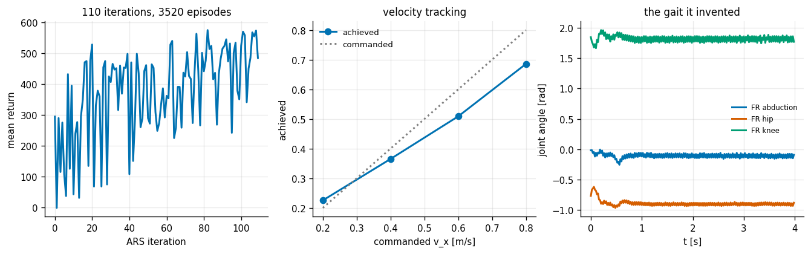
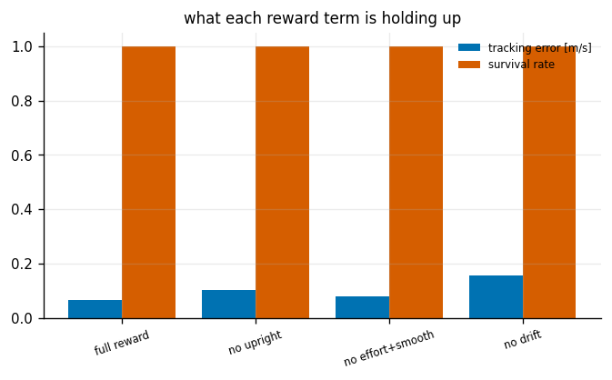
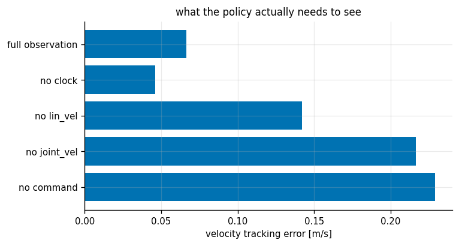
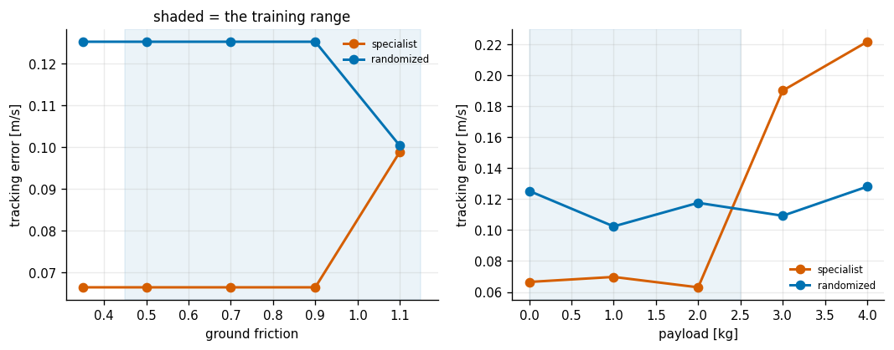
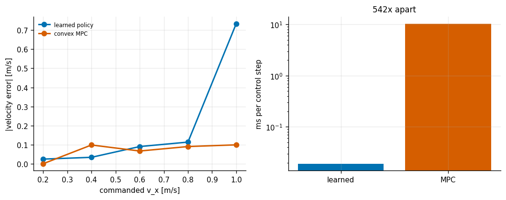
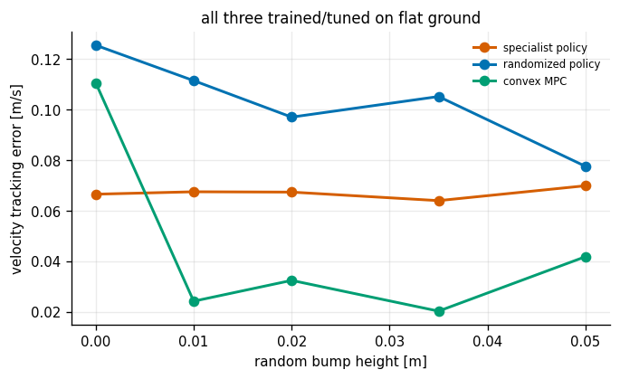

# Learned Locomotion

## Key Insight

Train a [legged locomotion](/shared/glossary/#legged-locomotion) control [policy](/shared/glossary/#policy) using [reinforcement learning](/shared/glossary/#reinforcement-learning) in the GPU-accelerated [Isaac Lab](/shared/glossary/#isaac-lab) simulation environment. Instead of hand-crafting [gait](/shared/glossary/#gait) sequences or footstep planners, the policy learns to coordinate the robot's joints directly from joint angles and inertial measurements to match a target velocity. By applying [domain randomization](/shared/glossary/#domain-randomization) to physics parameters like friction, mass, and latencies, the learned policy develops robustness for successful [sim-to-real](/shared/glossary/#sim-to-real) transfer.

**This is project 52.** It walks the same robot as [project 51](../51-quadruped-trotting-mpc/README.md), and the head-to-head between the two is the point: one controller was designed, the other was found by random search, and they end up in very nearly the same place at a factor of 600 difference in running cost.

---

## Files

| file | what it is |
|---|---|
| `env.py` | the [reinforcement learning](/shared/glossary/#reinforcement-learning) environment wrapping [project 51](../51-quadruped-trotting-mpc/README.md)'s robot |
| `ars.py` | [Augmented Random Search](/shared/glossary/#augmented-random-search), parallelised across CPU cores |
| `run.py` | the six experiments |
| `outputs/` | figures, `results.csv`, and the trained `policy.npz` |

```bash
python3 run.py      # about 9 minutes on 12 cores; needs numpy, mujoco and matplotlib
```

---

## No GPU: what changed, and what did not

The guide asks for [Isaac Lab](/shared/glossary/#isaac-lab), which trains thousands of robots at once on a GPU. There is no usable GPU here, so this project runs **the same recipe at a scale a laptop can afford**: one MuJoCo robot, a *linear* policy, and [Augmented Random Search](/shared/glossary/#augmented-random-search) spread across twelve CPU cores.

Everything that makes the recipe work is kept — the observation set, the reward terms, the joint-position action space, the [domain randomization](/shared/glossary/#domain-randomization). Only the parallelism is smaller. So the numbers below are about the *method*, not about how fast a GPU is, and the conclusions transfer; the wall-clock does not.

[ARS](/shared/glossary/#augmented-random-search) is the right algorithm for that substitution, and not just because it is simple. It computes no gradient at all: perturb the weights in a random direction, run one episode with `+delta` and one with `−delta`, step toward whichever did better. **Because there is no back-propagation, every rollout is completely independent, so the whole thing parallelises perfectly across processes** — which is the same property that Isaac Lab exploits with thousands of GPU-simulated robots. The policy here is a single 12 × 50 matrix: **600 parameters, no hidden layer**.

("Augmented" is three specific additions from Mania, Guy & Recht 2018: normalise the observations by a running mean and standard deviation; divide the update by the standard deviation of the returns actually collected, so the step size is independent of the reward scale; and keep only the best few directions.)

---

## Three design choices, and how many survived contact with the data

**The action is a joint-angle offset, not a torque.** The policy outputs twelve small numbers added to a fixed standing pose, and a stiff joint PD converts those to torques. A policy that outputs torques must learn gravity compensation before it can learn to walk; a policy that outputs positions gets that for free from the PD and only has to learn the *shape* of the gait. This one is load-bearing — without it nothing trains at all.

**The observation includes a gait clock** (sin and cos of a fixed-frequency phase). The argument: without a clock the policy cannot tell "early in the stride" from "late in the stride", because the rest of the observation is nearly identical at both, and a linear map has no memory with which to invent one.

**The observation includes the previous action**, giving the policy a memory of exactly one step — the standard way a memoryless linear map is coaxed into producing something periodic.

Those last two are the textbook recipe. Experiment 3 tests them, and **the recipe loses.**

---

## The normalizer bug worth knowing about

The observation mixes body height in metres (which moves by centimetres) with joint velocities in rad/s (which move by tens). A linear policy on raw numbers like that is dominated by whichever entry happens to have the largest units, so the observations are normalised by a running mean and standard deviation.

Two details in that one class caused two separate silent failures:

- **The standard deviation needs a floor, not an epsilon.** Several observations barely move at all; dividing by their true standard deviation multiplies their noise by hundreds and saturates the actuators within a few steps. (The same trap appeared in Phase 6's [project 44](../44-in-hand-cube-reorientation/README.md).)
- **The parallel variance merge can go slightly negative.** Batch statistics from the worker processes are combined with Chan's formula, and for an entry that is *constant within a batch* — the velocity command is — the algebra lands on something like `−1e-12` instead of exactly zero. `sqrt` of that is NaN, the NaN divides into every observation, and **every training run in the project silently returned `nan`** with no error raised anywhere. Clamping at zero before the square root fixes it.

---

## 1. Training



| | |
|---|---|
| ARS iterations | 110 |
| episodes simulated | 3 520 |
| policy parameters | **600** (12 × 50, linear) |
| tracking error over the command set | **0.066 m/s** |
| survival | 4/4 commands |

| commanded | 0.2 | 0.4 | 0.6 | 0.8 |
|---|---|---|---|---|
| achieved | 0.226 | 0.365 | 0.509 | 0.686 |

The gait in the right-hand panel was never specified anywhere. There is no [gait schedule](/shared/glossary/#gait-schedule) in this project, no [Raibert](/shared/glossary/#raibert-heuristic) rule, no swing trajectory — all of the periodic leg motion in that plot is something a 600-parameter linear map discovered by random search over 3 520 episodes.

The tracking has a consistent slight undershoot (0.509 for a command of 0.6), which is what an exponential tracking reward produces: the reward is nearly flat near the target, so the last 15% is worth very little against the effort terms that oppose it.

---

## 2. The reward terms, removed one at a time



| reward | final training return | tracking error | survival |
|---|---|---|---|
| **full** | 485 | **0.066** | 1.0 |
| no upright term | 490 | 0.102 | 1.0 |
| no effort + smoothness terms | **613** | 0.079 | 1.0 |
| no sideways-drift term | 435 | **0.156** | 1.0 |

Everything still walks. Reward shaping here changes *how well*, not *whether* — this robot's stability comes mostly from the joint PD and the position action space, not from the reward.

The drift term matters most (2.4× the tracking error without it): with nothing penalising sideways motion, the policy finds gaits that crab along diagonally, which still make forward progress but track the *commanded* velocity vector badly.

The "no effort + smoothness" row is the trap. **It has by far the highest training return (613 vs 485) and worse tracking than the full reward.** That is not a contradiction — removing a penalty from the reward mechanically raises the number the reward reports, so comparing returns across different reward functions is meaningless. Only the tracking column, which is measured the same way for every row, can be compared. This is the most common way to fool yourself in reward shaping, and it is worth having the row in the table for exactly that reason.

---

## 3. The observation, removed one part at a time



| observation | tracking error |
|---|---|
| **no gait clock** | **0.046** |
| **full observation** | **0.066** |
| no body linear velocity | 0.142 |
| no joint velocities | 0.216 |
| no velocity command | 0.229 |

**Removing the gait clock made the policy better.** 0.046 against 0.066 — a 30% improvement from deleting the two inputs that the standard recipe says are necessary for a memoryless policy to produce a periodic gait.

The argument for the clock was not silly, and it is worth saying why it fails here rather than just recording that it did. A clock at a *fixed* frequency imposes a stride rate the policy must live with, whatever speed it has been asked for. But the natural stride rate of a walking robot changes with speed, and this policy is trained across four commanded speeds. So the clock is not just unhelpful — it is **an actively wrong constraint at three of the four speeds**, and the policy does better generating its own rhythm from the physical feedback loop between joint angles, contact and body velocity. (A clock whose frequency was a function of the command would be a different and probably better proposition.)

The three genuinely load-bearing inputs are ordinary: **joint velocities** (3.3× worse without them — with a memoryless policy, they are the only way to know which direction a leg is currently moving), **the velocity command** (3.5× worse, and obviously so: a policy that cannot see what speed was asked for can only output one speed), and **body linear velocity** (2.2× worse — without it there is no feedback on the very quantity being tracked).

**The pattern: everything that carries physical state mattered; both of the tricks for faking memory did not.**

---

## 4. Domain randomization: insurance, and its premium



Two policies — a *specialist* trained only on the nominal robot, and a *randomized* one trained with friction resampled in 0.45–1.15, payload in 0–2.5 kg and torque scale in 0.8–1.2 on every episode.

| friction | 0.35 | 0.5 | 0.7 | 0.9 | 1.1 |
|---|---|---|---|---|---|
| specialist | 0.066 | 0.066 | 0.066 | **0.066** | 0.099 |
| randomized | 0.125 | 0.125 | 0.125 | 0.125 | 0.100 |

| payload | 0 kg | 1 kg | 2 kg | **3 kg** | **4 kg** |
|---|---|---|---|---|---|
| specialist | **0.066** | 0.070 | **0.063** | **0.190** | **0.222** |
| randomized | 0.125 | 0.102 | 0.118 | **0.109** | **0.128** |

**The premium is real: the randomized policy is 1.9× worse on the nominal robot** (0.125 vs 0.066), and it never wins anywhere inside the friction range at all — the specialist is simply insensitive to friction, so there was nothing to insure against.

**The payout is real too, and it arrives outside the training range.** At 3 and 4 kg of payload — beyond the 2.5 kg the randomized policy ever saw — the specialist degrades 3.4× (0.066 → 0.222) while the randomized policy barely moves (0.109, 0.128). It ends up **1.7× better than the specialist** at 4 kg.

That combination is the honest shape of [domain randomization](/shared/glossary/#domain-randomization), and it matches what Phase 6's [project 44](../44-in-hand-cube-reorientation/README.md) found on a completely different task: **you pay a flat premium everywhere and collect only in the tail.** The decision to buy it is a decision about how well you know your robot, not about how well the policy performs on the day.

Note also that the specialist is *flat* in friction and steep in payload. Randomising an axis the task does not depend on costs you the premium and buys nothing — so it is worth checking which axes actually move your metric before randomising them.

---

## 5. The learned policy against the convex MPC



Both controllers on the same robot, same speeds:

| commanded | learned error | learned survived | MPC error | MPC survived |
|---|---|---|---|---|
| 0.2 | 0.026 | yes | **0.002** | yes |
| 0.4 | **0.035** | **yes** | 0.099 | **no (fell)** |
| 0.6 | 0.091 | yes | **0.068** | yes |
| 0.8 | 0.114 | yes | **0.091** | yes |
| **1.0** | **0.733** | yes | **0.100** | yes |
| **cost per control step** | **0.017 ms** | | **10.2 ms** | |

**The MPC tracks better at three of the five speeds and the learned policy at two, and the learned policy costs 600× less per step.** A 12 × 50 matrix multiply against a 120-variable [quadratic program](/shared/glossary/#quadratic-program) is not a close race on compute.

Two rows carry most of the information.

**At 0.4 m/s the MPC falls over and the policy does not.** That is the speed-band instability [project 51](../51-quadruped-trotting-mpc/README.md) reports in its own experiment 4 — a resonance between gait period, step length and foot-placement gain that hand tuning did not catch. The learned policy has no such band, because it was trained across the whole speed range and any setting that fell over scored badly.

**At 1.0 m/s the learned policy collapses to 0.267 m/s while the MPC delivers 0.9.** The policy was trained on commands up to 0.8, and 1.0 is outside its distribution. This is the standard trade in one line: **the designed controller degrades gracefully outside its tuning; the learned one does not degrade, it stops working.** Neither is uniformly better, and knowing which failure mode you can tolerate is the actual engineering decision.

---

## 6. Ground it never saw



All three controllers were trained or tuned on perfectly flat ground. Now the floor is a random height field:

| bump height | specialist policy | randomized policy | convex MPC |
|---|---|---|---|
| 0 (flat) | **0.066** | 0.125 | 0.110 (**fell**) |
| 0.01 m | 0.067 | 0.111 | **0.024** |
| 0.02 m | 0.067 | 0.097 | **0.032** |
| 0.035 m | **0.064** | 0.105 | **0.020** |
| 0.05 m | 0.070 | 0.077 | **0.042** |

**Every controller is essentially flat across a 5 cm bump height** — a bump nearly a fifth of the leg's length. Nothing degrades. That is a genuine null result, and the reason is worth naming: none of these controllers ever *looks* at the terrain. They are all blind, feedback-only systems reacting to what their bodies feel, and a blind reactive controller that can reject a push can also reject a bump, because to the body those are the same disturbance.

Two curiosities in the table, both reported rather than smoothed. The MPC "fell" on **flat** ground and survived every bumpy case — that is the 0.5 m/s command landing inside its unstable speed band again, and the bumps perturbing it out of the resonance. And the randomized policy gets slightly *better* on rough ground (0.125 → 0.077), which is the same story from the other side: it was trained on varying friction, and a rough floor changes the effective friction in a way it has already seen.

**The conclusion is narrow and worth stating precisely:** rough terrain of this kind does not need terrain awareness. Terrain that must be *stepped over* rather than absorbed — gaps, stairs, stones — is a different problem, and Phase 5's [project 38](../38-footstep-planning/README.md) shows what it takes.

---

## What carries forward

- The head-to-head is the phase's cleanest statement of the design-versus-learning trade: comparable performance, 600× compute difference, and **opposite failure modes** — a designed controller has bad *bands*, a learned one has a hard *boundary*.
- The gait-clock result generalises: an inductive bias that is right in general can be wrong for your specific conditioning, and an ablation is cheap.
- The return-versus-metric trap in experiment 2 applies to every reward-shaping study ever run. **Never compare returns across different reward functions.**

---

## Things worth trying

1. Make the gait clock's **frequency a function of the commanded speed**. Experiment 3 says the fixed clock was the problem, not the idea of a clock.
2. Give the policy a **history of the last few observations** instead of just the previous action, or replace the linear map with a two-layer network. The joint-velocity ablation says physical state is what this policy is short of.
3. Add **observation latency** to the randomisation (real robots see the past). It is the one sim-to-real axis this project leaves out, and the one [project 48](../48-mpc-for-an-ackermann-car/README.md) shows is most punishing.
