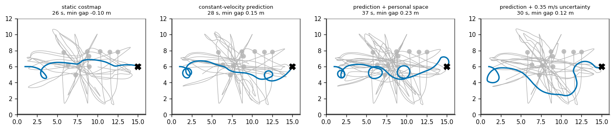
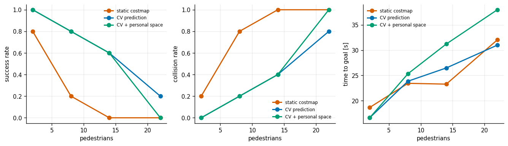
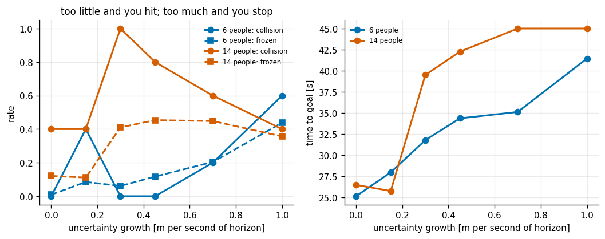
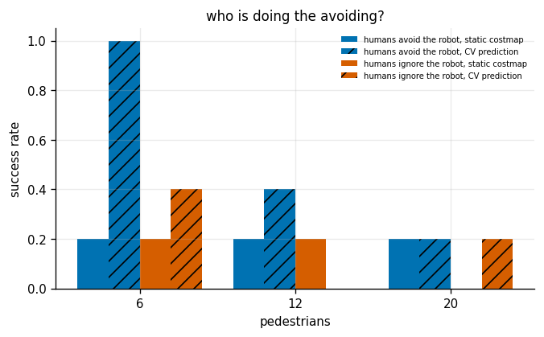
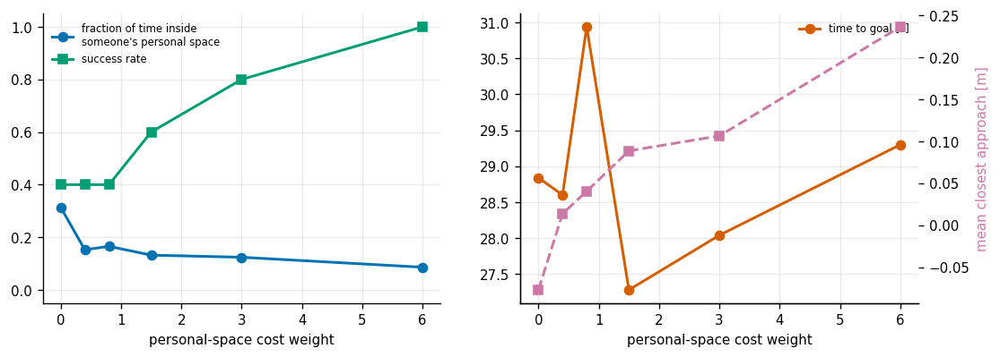
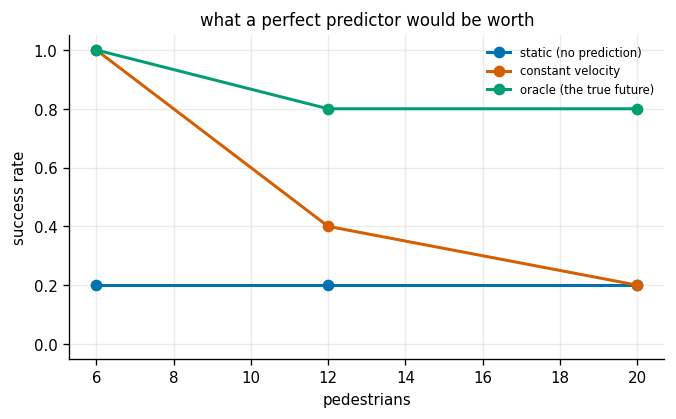

# Social Navigation

## Key Insight

Design a navigation stack that integrates [social navigation](/shared/glossary/#social-navigation) principles for a mobile robot operating around moving pedestrians. By predicting the future trajectories of humans in the environment, the local planner performs predictive collision avoidance to negotiate passing maneuvers. This prevents the robot from freezing in crowds or invading personal spaces, creating natural and socially comfortable interactions in shared public areas.

**This is project 53**, the last of Phase 7. It takes [project 47](../47-dwa-local-planner/README.md)'s local planner and puts it in the one environment its assumptions were never built for: obstacles that move on their own, have opinions about being crowded, and move around *you*.

---

## Files

| file | what it is |
|---|---|
| `social.py` | the [social force](/shared/glossary/#social-navigation) crowd, three predictors, and a DWA with a personal-space cost |
| `run.py` | the six experiments |
| `outputs/` | figures and `results.csv` |

It imports [project 47](../47-dwa-local-planner/README.md)'s `Costmap` and A* glue, [project 46](../46-pure-pursuit/README.md)'s `DiffDrive`, and [project 31](../31-a-star-on-a-grid/README.md)'s `search`.

```bash
python3 run.py      # about 5 minutes; needs numpy and matplotlib only
```

---

## Why a person is not just a moving box

[Project 47](../47-dwa-local-planner/README.md) already showed that adding constant-velocity prediction takes collisions with moving obstacles from 33% to 0%. So what is left?

Three things, and each needs its own piece of machinery here:

1. **They move** — handled by prediction, and [project 47](../47-dwa-local-planner/README.md) did that. But *how much* prediction, and how confident should you be in it? That is experiment 3, and it turns out to be the hardest question in the project.
2. **They have personal space.** Passing a human at 5 cm is technically a success and socially a failure. A collision checker cannot express that; a cost can.
3. **They avoid you back.** This is the one that quietly breaks evaluations. If the simulated humans step aside, a robot that does almost nothing scores well, and your benchmark is measuring the humans. Experiment 4 measures exactly how much of the "success" in experiments 1–3 was actually the pedestrians' doing.

---

## The crowd

The pedestrians use the **social force model** (Helbing & Molnár, 1995). The name is literal: each person is treated as a particle, and their walking is modelled as a sum of forces — one pulling towards their goal, one pushing away from every other person, one pushing away from walls. Repulsion falls off exponentially in the gap between their edges.

It is not a claim about psychology. It is the simplest model that reproduces the things real crowds do — lane formation in corridors, clogging at doorways — and that is what makes it a fair test bed rather than a set of obstacles on rails.

`react_to_robot` switches the robot's own repulsion term on and off. That single flag is experiment 4.

---

## Prediction, and the uncertainty knob

Three predictors:

- **static** — they stay where they are. What a plain [costmap](/shared/glossary/#costmap) believes, because a costmap is a snapshot.
- **constant velocity** — two lines of code, and the baseline that most published pedestrian predictors only beat by a few centimetres over a two-second horizon.
- **oracle** — the true future, obtained by rolling a copy of the crowd forward. Not implementable on a robot; here as the ceiling that any predictor could reach.

On top of that sits `sigma_rate`, which grows a circle of uncertainty around each prediction at so many metres per second of horizon. **It is the knob that produces the freezing robot**: make it large enough and every future is blocked, so the only safe action is to stop — for ever.

---

## Personal space is a cost, not a constraint

The proxemic term adds a penalty for every rollout step that comes within 45 cm of a person (roughly the boundary of what Edward Hall called *intimate distance*), scaled by how deep the intrusion goes.

It is deliberately a **cost** and not a hard constraint. Making personal space a constraint means that in a corridor where every option intrudes on somebody, no option is legal and the robot stops — which is worse manners than squeezing past. As a cost it says "prefer not to", and the planner can trade it against making progress. This is the same lesson [project 48](../48-mpc-for-an-ackermann-car/README.md) learned the expensive way: a constraint your world can violate turns a degraded controller into a broken one.

---

## 1. One crossing, four planners



Ten pedestrians, same seed, same crossing:

| planner | time | closest approach | fraction of time in someone's space | frozen | collided |
|---|---|---|---|---|---|
| static costmap | 26.1 s | **−0.10 m** | 0.35 | 13% | **yes** |
| constant-velocity prediction | 28.4 s | 0.15 m | 0.24 | 2% | no |
| prediction + personal space | 37.2 s | **0.23 m** | **0.16** | 0.3% | no |
| prediction + 0.35 m/s uncertainty | 30.4 s | 0.12 m | **0.10** | 9% | no |

A negative closest approach means the robot's disc overlapped a person's — a collision. Prediction fixes it. Personal space then buys another 8 cm of clearance and a third less time spent inside someone's bubble, for 31% more time to goal.

---

## 2. Crowd density



Five seeds each:

| pedestrians | static: success | CV prediction: success | CV + personal space: success |
|---|---|---|---|
| 2 | 1.0 | 1.0 | 1.0 |
| 8 | 0.2 | **0.6** | **0.8** |
| 14 | 0.2 | **0.6** | **0.6** |
| 22 | 0.0 | 0.2 | 0.0 |

Prediction is worth 3× at moderate density and stops mattering at high density, where **everything fails**. That ceiling is not a tuning problem — at 22 people in a 16 × 12 m room there is often simply no gap, and a robot that insists on making progress will touch somebody.

---

## 3. The freezing robot



This is the experiment the guide's own text sets up: *"Underconfident predictions cause freezing; overconfident ones cause crashes."* Sweeping how fast the uncertainty circle grows:

**Six pedestrians:**

| uncertainty growth | success | collision rate | frozen | time to goal | closest approach |
|---|---|---|---|---|---|
| 0.00 m/s | **1.0** | 0.0 | 0.9% | 25.1 s | 0.38 m |
| 0.15 m/s | 0.6 | 0.4 | 8.5% | 28.0 s | 0.48 m |
| 0.30 m/s | 0.8 | 0.0 | 6.1% | 31.8 s | 0.56 m |
| 0.45 m/s | 0.8 | 0.0 | 11.7% | 34.4 s | **0.61 m** |
| 0.70 m/s | 0.6 | 0.2 | 20.4% | 35.1 s | 0.57 m |
| **1.00 m/s** | **0.2** | 0.6 | **43.8%** | 41.4 s | 0.18 m |

**Fourteen pedestrians:**

| uncertainty growth | success | collision rate | frozen | time to goal |
|---|---|---|---|---|
| 0.00 m/s | **0.6** | 0.4 | 12% | 26.5 s |
| 0.15 m/s | **0.6** | 0.4 | 11% | 25.8 s |
| 0.30 m/s | 0.0 | 1.0 | 41% | 39.5 s |
| 0.45 m/s | 0.0 | 0.8 | 45% | 42.3 s |
| 1.00 m/s | 0.0 | 0.4 | 36% | 45.0 s (never arrived) |

The freezing behaviour is unmistakable: **the fraction of ticks with nothing safe to do goes from 1% to 44%**, and the time to goal climbs monotonically from 25 s to 41 s and then to "did not arrive".

But the second half of the guide's sentence — that being *too confident* causes crashes — **does not appear in this data at all.** Zero uncertainty is the best setting at both densities. The uncertainty knob only ever makes things worse.

That deserves an explanation rather than a shrug, and there is one. The crowd here moves smoothly under social forces, with no sudden direction changes, so **constant velocity is already an excellent predictor over a two-second horizon** — the honest uncertainty is close to zero, and any inflation is over-inflation. In a world with jinking pedestrians or a slower perception pipeline, the left-hand side of that curve would exist. The lesson to take is the one the data supports: **an uncertainty margin is only worth its cost when your predictor is genuinely uncertain, and adding one "for safety" without measuring your predictor's actual error is a way to freeze a robot that was fine.**

The collision column at 14 people shows the freezing failure mode in its ugliest form: at `sigma = 0.3`, collisions go *up* to 1.0 while frozen time goes to 41%. A robot that stops in the middle of a crowd is not safe — it becomes an obstacle that people have to walk around, and in this simulation they walk into it.

---

## 4. Do the humans avoid you back? (the evaluation trap)



Every number above was produced with pedestrians who steer around the robot. Turning that off — the humans now ignore the robot completely, as if it were invisible:

| planner | pedestrians | humans avoid the robot | **humans ignore the robot** |
|---|---|---|---|
| static costmap | 6 | 0.2 | 0.2 |
| static costmap | 12 | 0.2 | 0.2 |
| static costmap | 20 | 0.2 | 0.0 |
| **CV prediction** | **6** | **1.0** | **0.4** |
| **CV prediction** | **12** | **0.4** | **0.0** |
| CV prediction | 20 | 0.2 | 0.2 |

**The good planner's success rate at 6 pedestrians drops from 1.0 to 0.4 when the humans stop cooperating.** More than half of what looked like the planner's competence was the crowd getting out of the way.

Note which row moves and which does not. The static-costmap planner scores 0.2 either way — it was already failing, and there was nothing for the pedestrians' cooperation to rescue. **Reciprocity only flatters a planner that is nearly working**, which is exactly the regime you are in when you are trying to decide whether your system is ready.

This is the single most important methodological point in the project. Publish a social-navigation result without saying whether your simulated humans avoid the robot, and the number means very little. Real people *do* avoid robots — so the cooperative number is arguably the more realistic one — but the gap between the two is the size of the safety margin you do not have when someone is looking at their phone.

---

## 5. What politeness costs (and it is not what you would expect)



Twelve pedestrians, sweeping the personal-space weight:

| weight | success | collision rate | closest approach | fraction of time in someone's space | time to goal | path length |
|---|---|---|---|---|---|---|
| 0.0 | 0.4 | 0.6 | −0.077 m | 0.313 | 28.8 s | 21.3 m |
| 0.4 | 0.4 | 0.6 | 0.014 m | 0.152 | 28.6 s | 22.2 m |
| 0.8 | 0.4 | 0.6 | 0.040 m | 0.166 | 30.9 s | 22.1 m |
| 1.5 | 0.6 | 0.4 | 0.089 m | 0.132 | 27.3 s | 22.4 m |
| 3.0 | 0.8 | 0.2 | 0.106 m | 0.124 | 28.0 s | 23.3 m |
| **6.0** | **1.0** | **0.0** | **0.237 m** | **0.086** | **29.3 s** | 24.2 m |

The framing "what politeness costs" turned out to be the wrong framing, and the table says so. **Going from no personal-space term to the strongest one takes success from 0.4 to 1.0 and collisions from 0.6 to 0.0, for 0.5 seconds and 14% more distance.**

Politeness was not a trade against safety. **It was safety**, arriving under a different name. The mechanism is straightforward once you see it: a hard collision check only rejects a rollout once it is *already* going to touch somebody, at which point the robot has few options left. The proxemic cost starts pushing at 45 cm, so the robot begins its avoidance early, while cheap options still exist. A margin is a form of lookahead.

This is worth contrasting with [project 47](../47-dwa-local-planner/README.md)'s experiment 3, where turning the clearance weight up 4× took success from 12/12 to **0/12**. Same-shaped intervention, opposite result. The difference is what the margin is around: static walls form a *fixed* geometry, so a robot that always prefers open space never enters the doorway it needs. People *move*, so preferring space around them costs a detour rather than a permanent refusal. **"Add a safety margin" is not a rule with a sign; it depends on whether the thing you are avoiding will get out of the way.**

---

## 6. How good does the prediction have to be?



| pedestrians | static (no prediction) | constant velocity | **oracle (the true future)** |
|---|---|---|---|
| 6 | 0.2 | **1.0** | **1.0** |
| 12 | 0.2 | 0.4 | **0.8** |
| 20 | 0.2 | 0.2 | **0.8** |

Two clean readings and a useful conclusion.

At low density **constant velocity is already perfect** — a 5× gain over no prediction and nothing left for a better predictor to win. This is why constant velocity remains such a stubborn baseline in the pedestrian-prediction literature: over two seconds, in uncrowded space, people mostly do keep going.

At high density the picture inverts. Constant velocity collapses to 0.2 while the oracle holds 0.8 — **a factor of four still on the table.** Crowded space is exactly where people stop moving in straight lines, because they are busy avoiding each other, and that is precisely the interaction a constant-velocity model cannot represent.

So the honest answer to "how good does the prediction have to be" is *it depends entirely on density*, and the headroom for a learned predictor is zero in the easy case and 4× in the hard one. Which is a good argument for measuring your density before choosing your predictor.

---

## What Phase 7 adds up to

Reading projects 46–53 together, the same shape appears at every timescale:

- **A slow, smart layer over a fast, stupid one.** A* over DWA ([47](../47-dwa-local-planner/README.md)); a 33 Hz [MPC](/shared/glossary/#mpc) over a 500 Hz leg controller ([51](../51-quadruped-trotting-mpc/README.md)); a curvature-derived speed profile over a 10 Hz tracker ([48](../48-mpc-for-an-ackermann-car/README.md)).
- **The world does not sit still while you compute.** The horizon that fails in [46](../46-pure-pursuit/README.md), the snapshot costmap in [47](../47-dwa-local-planner/README.md), the stale state in [48](../48-mpc-for-an-ackermann-car/README.md), and the frozen pedestrian here are the same problem four times.
- **The control matters more than the method.** Nearly every headline in this phase came from an arm that was there to make the main number readable: the kinematic plant in [48](../48-mpc-for-an-ackermann-car/README.md), driving on the true pose in [49](../49-amcl-on-a-known-map/README.md), the equal-weight-share controller in [51](../51-quadruped-trotting-mpc/README.md), and the non-reactive crowd here.

---

## Things worth trying

1. Make the pedestrians **occasionally change their minds** (resample a goal mid-crossing). That should finally produce the left-hand side of experiment 3's curve, where zero uncertainty starts to hurt.
2. Implement **ORCA / reciprocal velocity obstacles**, in which the robot assumes each human will take *half* the avoidance effort. It is the principled version of what experiment 4 shows is happening implicitly.
3. Add a **passing-side preference** (keep right) to the cost. Real crowds coordinate on a convention, and a robot that does not have one is a permanent source of the awkward side-step dance.
