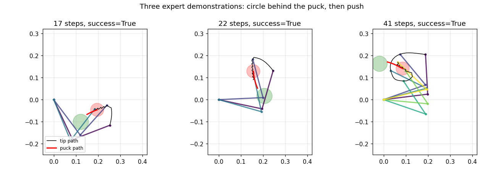
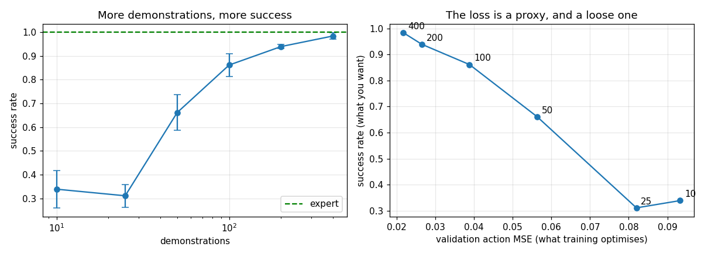
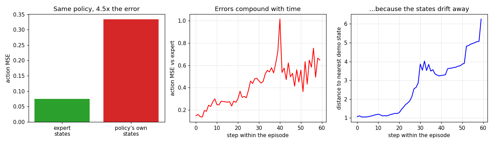
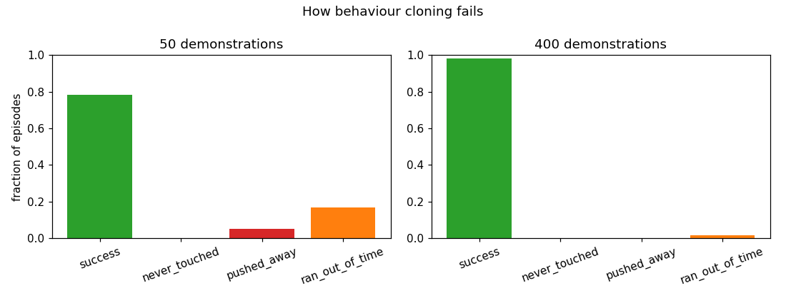
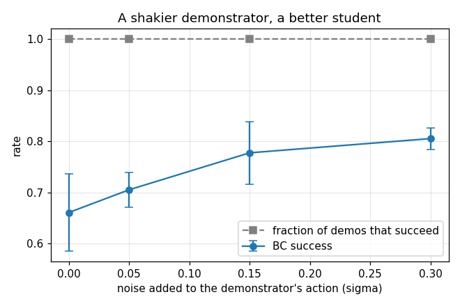
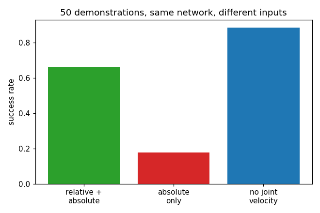

# Behavior Cloning on a Sim Arm

## Key Insight

[Behavior cloning (BC)](/shared/glossary/#bc) is the foundational baseline for [imitation learning](/shared/glossary/#imitation-learning), framing behavioral reproduction as standard [supervised learning](/shared/glossary/#supervised-learning) where neural networks predict motor [actions](/shared/glossary/#action-conditioning) from current sensory [observations](/shared/glossary/#state). By training a simple [MLP policy](/shared/glossary/#mlp) on joint trajectories recorded during human [teleoperation](/shared/glossary/#teleoperation), the robot learns to reproduce the demonstration task without requiring a complex, hand-engineered [reward function](/shared/glossary/#reward-function). However, because the policy only minimizes prediction errors on the training states, it remains highly vulnerable to [covariate shift](/shared/glossary/#covariate-shift) at test time, where small errors accumulate and steer the arm into unfamiliar configurations from which it cannot recover.

**This is project 54.** It builds the simulator, the task and the demonstrator that projects 55 to 61 all reuse, and then measures the one thing everything after it reacts to: a cloned policy makes **4.5x larger errors on the states it visits itself** than on the states it was trained on.

---

## Files

| file | what it is |
|---|---|
| `arm.py` | the shared toy: a two-link planar arm, a puck-pushing task, a scripted demonstrator |
| `nets.py` | the shared learning stack: input whitening, an MLP, a training loop |
| `verify_mujoco.py` | proof that the hand-written physics equals MuJoCo's |
| `run.py` | the six experiments |
| `outputs/` | figures and `results.csv` |

```bash
python3 verify_mujoco.py   # a few seconds
python3 run.py             # about 6 minutes; needs numpy, torch, matplotlib
```

---

## The task



A two-link arm lies flat on a table, seen from above. A puck sits somewhere in
front of it; a goal disc sits 9-15 cm away from the puck. The arm has 3 seconds
(60 decisions at 20 Hz) to shove the puck onto the goal. Success means the puck
centre ends within 3.5 cm of the goal centre.

Three deliberate choices, and why each one is there:

**The arm is horizontal, so gravity does no work.** That is not a shortcut in
the physics -- the [inertia](/shared/glossary/#inertia), the
[Coriolis](/shared/glossary/#coriolis) terms and joint
damping are all simulated. It is because a vertical arm's gravity torque is far
larger than any of those, and it would drown out exactly the effects that
project 59 (mass, damping, motor strength) and project 60 (learning the
dynamics from data) are about.

**The task is a push, not a reach.** A reach is over in three steps and every
mistake is fixed by the next step, so no imitation-learning pathology ever
appears. Pushing means the *puck* carries the error: nudge it 1 cm off line and
the world is now in a state the demonstrator never visited, and the mistake is
still there ten steps later. That is what makes [covariate
shift](/shared/glossary/#covariate-shift) something you can measure rather than
something you read about.

**The action is a joint-angle delta, not a torque.** The policy outputs two
numbers in [-1, 1]; they are scaled to at most 0.1 radians and handed to a
joint [PD controller](/shared/glossary/#pid) that produces the actual
torques. A torque policy has to learn to fight the arm's own inertia before it
can learn anything about pushing -- project 52 measured that the hard way on a
quadruped.

### Is the simulator real?

```
max |qacc  - MuJoCo| over 500 random states : 4.547e-12 rad/s^2
max |M(q)  - MuJoCo| over 500 random states : 3.469e-17 kg m^2
max |tip   - MuJoCo| over 500 random states : 1.110e-16 m
max |fast path - reference RNEA|            : 5.002e-12 rad/s^2
VERDICT: identical to numerical precision
```

The equations in `arm.py` are written out by hand rather than handed to MuJoCo,
because this phase needs to re-simulate from arbitrary states thousands of
times a second and to change the physics parameters between episodes. That is
only a good trade if the equations are right, so `verify_mujoco.py` builds the
same robot in MuJoCo and compares. Two versions are checked: a readable
[recursive Newton-Euler](/shared/glossary/#rnea) loop
that works for any number of links, and a closed-form two-link expression that
is 20x faster and is what actually runs.

### The demonstrator

The stand-in for a [teleoperator](/shared/glossary/#teleoperation) is a
scripted controller with two phases. If the tip is not yet behind the puck (on
the opposite side from the goal), it walks around the puck on a safe circle;
once behind, it drives straight through the puck towards the goal. Desired tip
velocity becomes joint velocity through [damped least
squares](/shared/glossary/#damped-least-squares), the same regulariser as
project 05.

| | |
|---|---|
| expert success, circling one way | **1.00** |
| expert success, circling the other way | **1.00** |
| steps used (of 60) | 28-29 |
| 50 demonstrations | 1 377 transitions, 0.55 s to collect |
| fraction of expert actions at the limit | 0.24 |

Being able to ask this demonstrator for its action **at any state, not only
along its own trajectory**, is what makes project 55 possible. A human
teleoperator can do the same thing, which is why [DAgger](/shared/glossary/#dagger)
is a real method and not a thought experiment.

---

## 1. How much does one more demonstration buy?



Three seeds per point; the policy is a two-hidden-layer, 256-unit MLP trained
for 400 epochs.

| demonstrations | transitions | success | validation action MSE |
|---|---|---|---|
| 10 | ~280 | 0.339 ± 0.079 | 0.093 |
| 25 | ~690 | 0.311 ± 0.048 | 0.082 |
| 50 | 1 377 | 0.661 ± 0.075 | 0.056 |
| 100 | 2 734 | 0.861 ± 0.048 | 0.039 |
| 200 | 5 418 | 0.939 ± 0.008 | 0.027 |
| 400 | 10 956 | **0.983 ± 0.014** | 0.022 |

The guide's suggested 50 demonstrations lands at two-thirds success. Reaching
the demonstrator's own 1.00 takes about **eight times** that.

The right-hand panel is the part worth internalising. Validation loss -- the
number training actually minimises -- improves by 4.3x across the sweep, while
success improves by 2.9x, and the two are not proportional. Between 25 and 50
demonstrations the loss falls 32% and success doubles; between 200 and 400 the
loss falls 19% and success barely moves. **A loss is a proxy for what you want,
and a loose one**: it averages over states where an error is irrelevant
together with the handful where an error ends the episode.

---

## 2. Covariate shift, measured two ways



"Covariate shift" is statistics vocabulary for something concrete: the inputs
at test time are drawn from a different distribution than the inputs during
training. Here the policy was trained on states the *expert* drove into, and is
tested on states *it* drove into.

| | |
|---|---|
| action MSE on held-out expert states | 0.075 |
| action MSE on the policy's own states | **0.334** |
| ratio | **4.5x** |
| action error at step 1 of an episode | 0.149 |
| action error at step 20 | 0.267 |
| distance to the nearest training state, step 1 | 1.07 |
| distance to the nearest training state, step 20 | 1.24 |

The same network, graded on the same demonstrator's answers, is four and a half
times worse in the situations it actually creates for itself. The middle panel
shows the error growing as an episode proceeds; the right panel shows why -- the
states drift steadily further from anything in the training set.

This feedback loop is what separates imitation learning from ordinary
supervised learning: **the model's own mistakes change its future inputs**. A
misclassified photo does not make the next photo harder. A mistimed push does.

---

## 3. What failure actually looks like



| | 50 demos | 400 demos |
|---|---|---|
| success | 0.783 | 0.983 |
| never touched the puck | 0.000 | 0.000 |
| pushed it further from the goal | 0.050 | 0.000 |
| ran out of time | 0.167 | 0.017 |

Worth noticing: failure is almost never "the policy had no idea". It reaches
the puck every single time. It mostly *dithers* -- circles, approaches, nudges,
re-approaches -- until the clock runs out. That is the visible symptom of a
policy that is confident inside the demonstration distribution and indecisive
just outside it.

---

## 4. Shake the demonstrator's hand



Gaussian noise is added to the demonstrator's action while it collects data.
The demonstrations get worse and the cloned policy gets better:

| noise sigma | BC success (50 demos) | demonstrations still successful |
|---|---|---|
| 0.00 | 0.661 ± 0.075 | 1.00 |
| 0.05 | 0.706 ± 0.034 | 1.00 |
| 0.15 | 0.778 ± 0.061 | 1.00 |
| 0.30 | **0.806 ± 0.021** | 1.00 |

A 22% improvement for free, obtained by *degrading* the data. The reason is
experiment 2 read backwards: a noisy demonstrator wanders off its ideal path
and then corrects itself, so the dataset contains recovery behaviour -- what to
do when you are already slightly wrong -- which a perfect demonstrator never
shows. This is the idea behind
[noise-injected demonstration collection](/shared/glossary/#noise-injected-demonstrations)
(DART), and it is the cheap offline cousin of project 55's DAgger: no online
expert, no retraining loop, just a shakier hand.

At sigma = 0.30 every demonstration still succeeds, because the demonstrator is
a *feedback* controller -- it sees where the tip actually ended up and
recomputes from there. Replaying a recorded trajectory open-loop under the same
noise would fall apart.

---

## 5. What the policy is allowed to see



| observation | success (50 demos) | validation MSE |
|---|---|---|
| absolute positions + tip-to-puck and puck-to-goal vectors | 0.661 ± 0.075 | 0.056 |
| absolute positions only | **0.178 ± 0.021** | 0.064 |
| relative vectors but no joint velocity | **0.883 ± 0.036** | -- |

Two results, surprising in opposite directions.

**Adding the difference vectors is worth 3.7x**, even though the network is
already given both endpoints and could subtract them itself. It could -- but it
would have to *learn* to, from 1 377 examples, using capacity that would
otherwise go on the task. Handing a network a quantity the task depends on
costs one line and adds no information; making it rediscover subtraction costs
data. Note the validation losses (0.056 vs 0.064): on the loss the two look
nearly the same, and on the task one is four times better.

**Deleting joint velocity from the observation makes the policy better**, 0.661
to 0.883. That is not noise, it is [causal
confusion](/shared/glossary/#causal-confusion), and this task is a textbook
case. The demonstrator's action is computed purely from *positions* -- where the
tip is, where the puck is, where the goal is. Velocity never enters it. But in
the recorded data joint velocity is nearly a copy of the *previous action*,
because that is what caused it. A network minimising prediction error happily
latches onto "keep doing what you were just doing", which scores beautifully on
demonstrations and fails the moment the policy's own previous action was wrong.
Removing the shortcut forces it to read the actual scene.

The lesson is not "never give a policy velocity". It is that **an input which
is a consequence of the demonstrator's own past actions is a trap**, and the
only way to find out is to delete it and re-measure.

> A caution about the experiment itself: the mask has to be applied at test
> time as well as during training. Zeroing the column only in the training data
> and then handing the policy real velocities at run time scores 0.017 -- a
> number that measures an accidental distribution mismatch, not the value of
> velocity. That was the first version of this experiment, and it was wrong.

---

## What to remember

- **BC works, and BC saturates.** 400 demonstrations reach 98% on a task whose
  expert is a 30-line script. The question is never "can it clone" but "what
  does the last 20% cost".
- **The loss you train is not the score you want.** One 32% loss improvement
  doubled success; a later 19% improvement bought nothing.
- **The measured shift is 4.5x.** Projects 55 and 56 attack that number from
  two directions: get better data (ask the expert about *your* states), or fit
  the data better (model the whole action distribution instead of its mean).
- **Degrading your demonstrations with 30% noise improved the policy by 22%.**
  If you take one thing from this project to a real robot, take this one.
- **Audit the observation vector by deleting things.** One input was worth
  3.7x; another was worth *negative* 34%.

Next: [project 55](../55-dagger/README.md) keeps the expert on call and
re-labels the states the policy actually visits.
