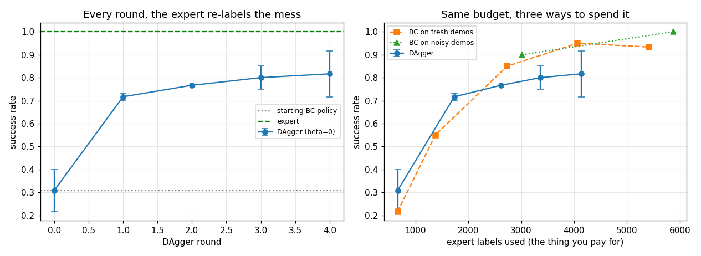
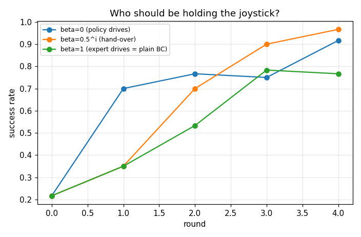
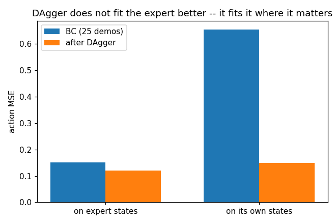

# DAgger

## Key Insight

[DAgger (Dataset Aggregation)](/shared/glossary/#dagger) addresses the [covariate-shift](/shared/glossary/#covariate-shift) problem of [behavior cloning](/shared/glossary/#bc) by turning offline [imitation learning](/shared/glossary/#imitation-learning) into an active, online process. By running the trained policy in the environment to generate [rollouts](/shared/glossary/#rollout), querying an expert to provide the correct actions for those newly visited states, and aggregating this data back into the training set, DAgger dynamically bridges the gap between training and testing distributions. This iterative feedback loop teaches the policy not just how to perform the task perfectly, but how to recover and steer back when it inevitably drifts off the expert trajectory.

**This is project 55.** It uses [project 54](../54-behavior-cloning-on-a-sim-arm/README.md)'s arm, task and demonstrator unchanged. It closes the distribution gap exactly as advertised -- the error ratio between "the expert's states" and "my own states" falls from **4.3x to 1.2x** -- and it still *loses* to plain behaviour cloning at an equal number of expert labels. Understanding why is the most useful thing in the project.

---

## Files

| file | what it is |
|---|---|
| `dagger.py` | the DAgger loop, the beta schedule, and the shift-gap measurement |
| `run.py` | the six experiments, run in parallel processes |
| `outputs/` | figures and `results.csv` |

```bash
python3 run.py     # about 2 minutes on 12 cores; needs numpy, torch, matplotlib
```

---

## How the loop works

```
   round 0:  25 demonstrations  ->  train  ->  policy (weak)
                                              |
   round i:  DRIVE the policy for 20 episodes |
             at every state it visits, ask the expert
                    "what would YOU have done here?"
             record (state, expert action)   <- the label is ALWAYS the expert's
             add to the pile, retrain from scratch
```

Two details decide whether this is DAgger or something else.

**The action that gets *executed* and the action that gets *recorded* are
different.** The policy drives -- that is the whole point, since the states it
reaches are the ones with no labels -- but the label written into the dataset is
what the expert would have done there. Recording the policy's own action would
only teach it to repeat itself.

**Beta is the probability that the expert drives instead.** The original method
starts at beta = 1 (pure demonstration) and decays it, so the policy takes over
gradually. Experiment 3 measures whether that matters.

---

## 1. The DAgger curve



Starting from 25 demonstrations (663 transitions), four rounds of 20 episodes
each, two seeds:

| round | expert labels | success |
|---|---|---|
| 0 (plain BC) | 663 | 0.308 ± 0.092 |
| 1 | 1 735 | 0.717 ± 0.017 |
| 2 | 2 617 | 0.767 ± 0.000 |
| 3 | 3 364 | 0.800 ± 0.050 |
| 4 | 4 132 | **0.817 ± 0.100** |

A 2.7x improvement over the policy it started from, and most of it arrives in
the **first** round: the biggest single gap is between "trained on the expert's
states" and "trained on any of my own states at all".

One number that is easy to skip past and matters enormously on real hardware:
**success during data collection was 0.20 in round 1 and 0.80 in the last
round.** DAgger data is collected by a policy that is still bad at the task. In
simulation that costs nothing. On a real robot every one of those failures is a
dropped object, a collision, or a human resetting the scene -- which is why
DAgger is usually run with a person holding a stop button, and why the beta
schedule below is more than a tuning knob.

---

## 2. The control that changes the conclusion

The DAgger curve on its own is not evidence for DAgger. Every round adds
labels, and more labels help *any* method. The honest comparison holds the
number of expert labels fixed:

| method | expert labels | success |
|---|---|---|
| BC, 25 demos | 663 | 0.217 |
| BC, 50 demos | 1 377 | 0.550 |
| BC, 100 demos | 2 734 | 0.850 |
| BC, 150 demos | 4 067 | 0.950 |
| BC, 200 demos | 5 418 | 0.933 |
| **BC interpolated at 4 132 labels** | 4 132 | **0.949** |
| **DAgger at 4 132 labels** | 4 132 | **0.817** |

**DAgger loses by 0.13.** That is not a bug and not a weak implementation; it is
what this task's economics say, and the reason is worth stating plainly:

> A fresh demonstration brings a **new puck position, a new goal and a whole new
> trajectory**. A DAgger round brings twenty more trajectories through
> situations that mostly resemble each other and the ones already collected.
> Per label, novelty beats correction -- *when demonstrations are cheap*.

That condition is the whole point. Here the "expert" is a script, so a fresh
demonstration costs exactly what a re-label costs. When the expert is a human in
a [teleoperation](/shared/glossary/#teleoperation) rig the two are not remotely
equal: a fresh demonstration means resetting the scene and driving the entire
task, while a DAgger label is one joystick nudge at a state the robot has
already reached by itself. **DAgger's advantage is denominated in expert
effort; this experiment is denominated in expert labels.** Do not carry
"DAgger was not worth it" into a setting where those two differ.

The third curve on the figure is [project
54](../54-behavior-cloning-on-a-sim-arm/README.md)'s noise-injected
demonstrations, which need no online expert at all: **0.90 at 3 016 labels and
1.00 at 5 872**. On this task the cheapest trick wins outright.

---

## 3. Who holds the joystick?



| beta schedule | final success | expert labels used |
|---|---|---|
| beta = 0 (policy drives from round 1) | 0.917 | 4 132 |
| beta = 0.5^i (expert hands over gradually) | **0.967** | **2 717** |
| beta = 1 (expert always drives) | 0.767 | 2 769 |

The decaying schedule wins on both axes, and the label count explains part of
it: **episodes end early when they succeed**. With the expert driving, an
episode lasts about 28 steps instead of the full 60, so a round of 20 episodes
costs fewer labels. Early on, when the policy is hopeless, letting the expert
drive buys good states cheaply; later, when the policy is decent, its own
states are the informative ones.

beta = 1 deserves a second look. With the expert always driving, DAgger
degenerates into "collect more demonstrations" -- and it scores 0.767, the worst
of the three. That is experiment 2 again at a smaller budget, and here the
ordering **flips**: at ~2 700 labels the policy-visited states beat fresh
demonstrations. The break-even is a budget question, not a principle.

---

## 4. The gap it was designed to close



Project 54's measurement, repeated before and after:

| | action MSE on expert states | on its own states | ratio |
|---|---|---|---|
| BC (25 demos) | 0.152 | 0.655 | **4.3x** |
| after DAgger | 0.121 | 0.150 | **1.2x** |

This is the cleanest result in the project, and *how* the gap closed matters:
the error on expert states barely moved (0.152 to 0.121) while the error on the
policy's own states fell by 4.4x. **DAgger did not learn to imitate better. It
learned to imitate in the places that were previously blank.**

That distinction also explains experiment 2. If the failure is "the policy is
wrong everywhere", more labels of any kind help. If the failure is "the policy
is fine on the demonstrated path and lost one centimetre off it", only off-path
labels help -- and DAgger is the machine for producing exactly those.

---

## 5. Is the "aggregation" part load-bearing?

| | final success | labels in the final training set |
|---|---|---|
| keep every round (DAgger) | **0.917** | 4 132 |
| train on the newest round only | **0.250** | 1 158 |

Throwing away the old rounds collapses the policy back to its starting level.
The round-4-only policy is good at recovering from round-3 mistakes and has
forgotten how to do the task -- ordinary [catastrophic
forgetting](/shared/glossary/#catastrophic-forgetting), and the reason the
method is named after its dataset rather than its policy.

---

## 6. What it costs

| | expert labels per 1 point of success |
|---|---|
| DAgger | 50.6 |
| plain BC | 58.0 |

Per label the two land within 15% of each other. Every real decision here is
about which kind of label your expert can produce cheaply.

---

## What to remember

- **DAgger does exactly what it claims**: the train/test error ratio went from
  4.3x to 1.2x, and the improvement came entirely from off-path states.
- **Always run the equal-label control.** A rising curve across DAgger rounds
  proves nothing by itself; here it hides plain BC scoring higher on the same
  budget.
- **The right currency is expert effort, not expert labels.** A scripted expert
  makes corrections and demonstrations equally cheap. A human does not.
- **The beta schedule is not decoration.** Handing over gradually was both
  better and cheaper -- and it is what keeps a real robot from spending its
  first round crashing.
- **Aggregate.** Newest round only: 0.917 to 0.250.

Next: [project 56](../56-diffusion-policy/README.md) attacks the same gap from
the other end -- not better data, but a model that can represent more than one
right answer.
