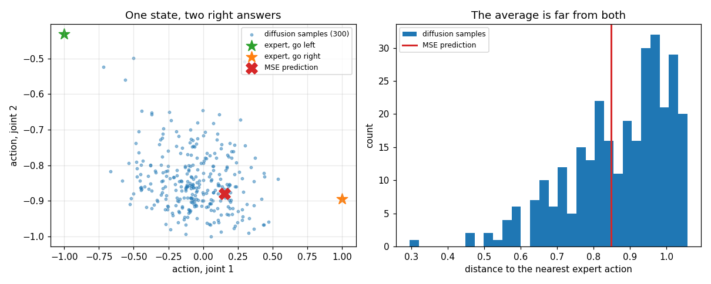
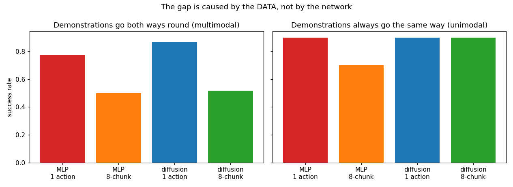
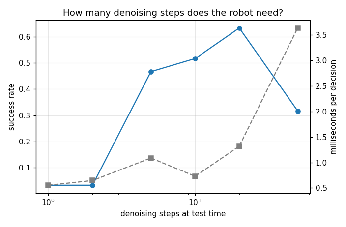
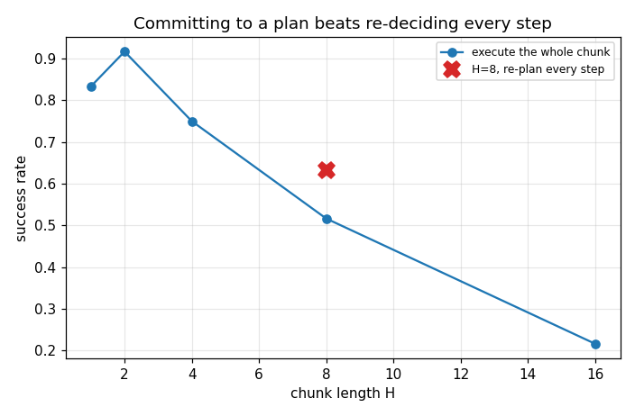

# Diffusion Policy

## Key Insight

[Diffusion policy](/shared/glossary/#diffusion-policy) represents the action distribution of a robot as a [denoising diffusion model](/shared/glossary/#diffusion-model) conditioned on current observations, allowing it to excel at complex, multi-step manipulation tasks. Unlike standard [behavior cloning](/shared/glossary/#bc) which uses deterministic networks that fail when demonstrations show multiple valid paths, diffusion policies handle [multimodal distributions](/shared/glossary/#multimodal-distribution) naturally by gradually refining random noise into smooth action trajectories. This iterative generation process ensures that the robot makes a clear, decisive choice (such as passing an obstacle on the left or the right) instead of outputting a hazardous average of all demonstrations.

**This is project 56.** It puts that claim to a controlled test on [project 54](../54-behavior-cloning-on-a-sim-arm/README.md)'s push task, where the demonstrator circles the puck clockwise or anticlockwise at random. The diffusion policy beats the MLP by **+0.092 on multimodal demonstrations and by exactly 0.000 on unimodal ones** -- the advantage is real, it is entirely attributable to multimodality, and it is smaller than the effect of a knob nobody argues about: how long an [action chunk](/shared/glossary/#action-chunking) you execute open-loop.

---

## Files

| file | what it is |
|---|---|
| `dp.py` | the denoiser, the noise schedule, DDIM sampling, the MLP baselines, chunk execution |
| `run.py` | the six experiments, run in parallel processes |
| `outputs/` | figures and `results.csv` |

```bash
python3 run.py     # about 5 minutes on 12 cores; needs numpy, torch, matplotlib
```

---

## The vocabulary, decoded

* **diffusion** -- borrowed from physics. Adding noise step by step spreads a
  sharp distribution out the way a drop of ink spreads in water; training learns
  to run that process backwards.
* **DDPM** -- Denoising Diffusion Probabilistic Model, the standard recipe:
  train the network to predict the noise that was added.
* **epsilon prediction** -- the network outputs the *noise* (written as the Greek
  letter epsilon in the papers), not the clean action. Subtracting a predicted
  noise is easier to learn than producing a clean sample in one shot.
* **[DDIM](/shared/glossary/#ddim)** -- Denoising Diffusion *Implicit* Model: the
  same trained network sampled along a shorter path. It is what lets a model
  trained with 50 noise levels run with 5 at test time, which on a robot is
  milliseconds of control latency.
* **[action chunk](/shared/glossary/#action-chunking)** -- the policy predicts
  the next H actions in one go. The name is literal: a chunk of the future.

Why a diffusion model helps at all is worth stating plainly. Squared error asks
for the *average* correct action. When two opposite actions are both correct --
go round the puck clockwise, or anticlockwise -- their average is a third action
that is wrong: drive straight into the puck. A diffusion policy never predicts an
action directly; it denoises, and which of the two basins it falls into is
decided by the random noise it started from. So it produces one mode or the
other rather than the midpoint.

---

## 1. The multimodality, at one state



Pick a state where both ways round the puck are still open, and ask each model
what to do:

| | |
|---|---|
| distance between the two expert actions | **2.053** |
| MSE prediction's distance to the nearer of them | **0.848** |
| diffusion samples landing near one of the two modes | **0.903** |
| fraction of those on the "+" side | 0.56 |

The MLP's answer sits almost exactly between two correct answers and is close to
neither. 90% of the diffusion samples land on a mode, split roughly evenly
between them. **This is the mechanism the Key Insight describes, measured
directly** -- and the rest of the project is about how much it is worth once the
policy has to actually drive the arm.

(Finding this state took a search. Most states are *not* ambiguous: once the tip
is already behind the puck, both "sides" give the same push. A scatter plot taken
at an arbitrary state shows one blob and proves nothing.)

---

## 2. Head to head, and the control that interprets it



Same 100 demonstrations, two seeds, 900 training epochs each:

| policy | multimodal demos (random side) | unimodal demos (always same side) |
|---|---|---|
| MLP, single action | 0.775 ± 0.042 | 0.900 |
| MLP, 8-action chunk (executed open-loop) | 0.500 ± 0.033 | 0.700 |
| **diffusion, single action** | **0.867 ± 0.033** | **0.900** |
| diffusion, 8-action chunk (open-loop) | 0.517 ± 0.000 | 0.900 |

Read the two columns together:

| comparison | difference |
|---|---|
| diffusion − MLP, single action, **multimodal** data | **+0.092** |
| diffusion − MLP, single action, **unimodal** data | **0.000** |

That is as clean a result as this phase produced. **The diffusion policy's
advantage appears exactly when the demonstrations contain two valid answers, and
vanishes completely when they do not.** The unimodal column is the control that
makes the multimodal column mean something: without it, +0.092 could equally be
"the fancier model is just better".

Note also what multimodality costs the MLP: 0.900 on one-sided demonstrations,
0.775 on two-sided ones. **The mode-averaging tax is 0.125, and diffusion
recovers three quarters of it.**

> A warning about this experiment, because the first version of it got the
> opposite answer. At 300 epochs the diffusion policy scored 0.30 and looked
> hopeless; at 900 it scores 0.867. The denoiser has a harder objective than a
> regressor -- it must fit a whole conditional distribution across 50 noise
> levels -- and it needs more optimisation to get there. **Comparing a
> distribution model against a point estimator at equal epochs is not a fair
> fight**, and an undertrained challenger produces a confident, wrong conclusion.

---

## 3. How few denoising steps can the robot afford?



The model is trained with 50 noise levels; DDIM lets it be *sampled* with fewer.
On a robot each step is control latency.

| denoising steps | success | ms per decision |
|---|---|---|
| 1 | 0.033 | 0.55 |
| 2 | 0.033 | 0.65 |
| 5 | 0.467 | 1.09 |
| 10 | 0.517 | 0.73 |
| **20** | **0.633** | 1.32 |
| 50 | 0.317 | 3.64 |

One or two steps do not work at all -- with so few steps the sampler cannot
resolve which mode it is in, and the result is the average again, the very thing
the model was chosen to avoid. The useful range starts around 5 and peaks at 20. (The millisecond column is
measured under a 12-way parallel run, so the small numbers are noisy; only the
trend from 20 to 50 steps is meaningful.)

The drop at 50 is not a typo: sampling with *every* training step is worse than
sampling with 20. Longer sampling chains accumulate the model's own small errors
at each level, which is the same compounding-error story as project 60's
multi-step predictions.

---

## 4. Chunk length, and how much of it to execute



| chunk length H (executed open-loop) | success |
|---|---|
| 1 | 0.833 |
| **2** | **0.917** |
| 4 | 0.750 |
| 8 | 0.517 |
| 16 | 0.217 |

| H = 8, executing only the first... | success |
|---|---|
| 1 action, then re-plan | 0.633 |
| **2 actions** | **0.750** |
| 4 actions | 0.633 |
| all 8 | 0.517 |

**This knob moves the score by 0.70 -- eight times the size of the
diffusion-vs-MLP effect.** Committing to a short chunk is worth a little
(0.833 to 0.917); committing to a long one is a disaster (0.217).

The trade is reactivity against consistency. A policy that re-decides every step
can flip between "go left" and "go right" mid-manoeuvre and dither in the middle;
a chunk carries the decision forward. But a chunk executed open-loop cannot react
to where the puck actually went -- and in a pushing task the puck moves *because*
of the actions in the chunk, so by action six the plan is being executed against
a world it no longer describes. Two actions (0.1 s) is where those meet here.

That the receding-horizon version (predict 8, execute 2, re-plan) beats the
open-loop one is the general lesson, and the reason real diffusion-policy
implementations always re-plan rather than running a chunk to its end.

---

## 5. What it costs

| | |
|---|---|
| MLP, single action | 0.46 ms per decision |
| diffusion, 10 steps, chunk of 8 | 0.73 ms per decision |
| diffusion, 10 steps, re-planning every step | 2.31 ms per decision |
| training time, MLP / diffusion | 51 s / 81 s |

Diffusion costs 1.6x per decision when the chunk amortises the sampling over
eight steps, and 5x when it re-plans every step. Both are far inside a 50 ms
control period here, but the ratio is what matters at scale: a real diffusion
policy runs a UNet over images, and that same 5x is the difference between 20 Hz
and 4 Hz.

---

## What to remember

- **The mechanism is real and directly visible.** At an ambiguous state the MLP
  predicts the midpoint of two correct actions; 90% of diffusion samples land on
  one or the other.
- **Its value is entirely conditional on your data being multimodal.** +0.092
  when it is, 0.000 when it is not, in the same task with the same code.
- **Train the distribution model longer than the point estimator.** 300 epochs:
  0.30 and "diffusion does not work". 900 epochs: 0.867.
- **The chunk knob dominates.** 0.917 at H=2, 0.217 at H=16 -- eight times the
  effect of the model class. Re-plan; do not run chunks to their end.
- **Denoising steps have an interior optimum too** (20 here), and one or two
  steps collapse back to the average.

Next: [project 57](../57-ppo-for-cart-pole/README.md) leaves imitation behind and
learns from reward instead, graded against a controller that cannot be beaten.
