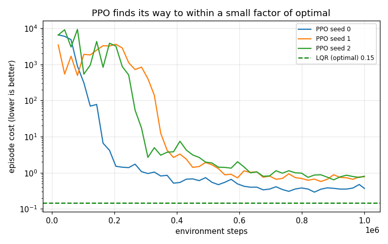
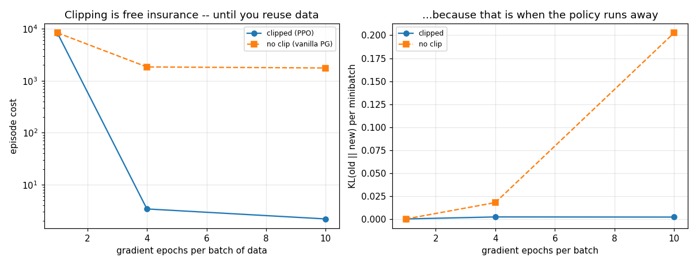
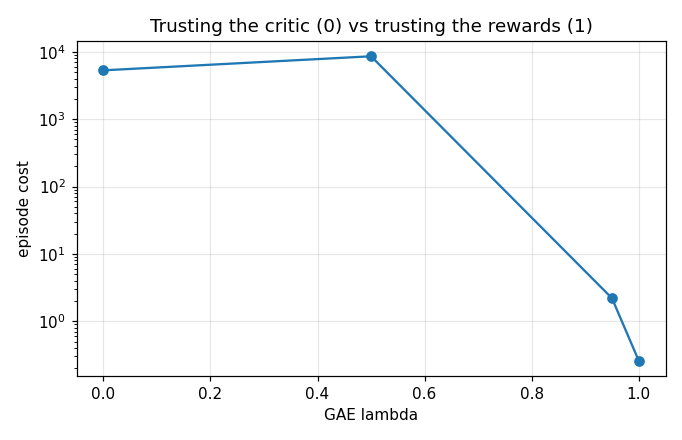
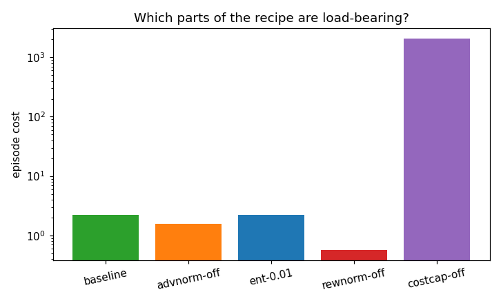
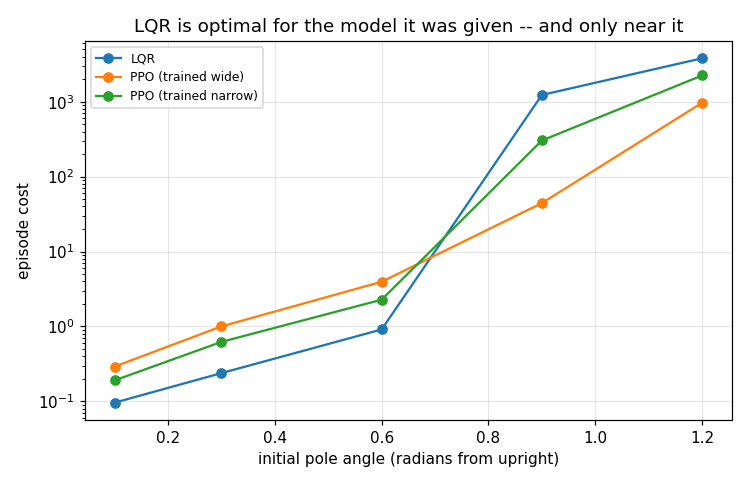

# PPO for Cart-Pole

## Key Insight

[Proximal Policy Optimization (PPO)](/shared/glossary/#ppo) is the standard [on-policy](/shared/glossary/#on-policy) [reinforcement learning](/shared/glossary/#reinforcement-learning) algorithm, balancing stable training with ease of implementation through a constrained [policy gradient](/shared/glossary/#policy-gradient-theorem) update. By implementing a [clipping loss](/shared/glossary/#clipping-loss) that limits the size of the policy update step, PPO prevents the policy from drifting into regions of parameter space that degrade performance. Solving the classic [cart-pole](/shared/glossary/#cartpole) task with PPO demonstrates how tracking the policy ratio and using an [actor-critic](/shared/glossary/#actor-critic) [baseline](/shared/glossary/#baseline) keeps updates stable without requiring complex second-order optimization.

**This is project 57.** It runs PPO on [project 09](../09-cart-pole-lqr/README.md)'s cart-pole, graded against project 09's [LQR](/shared/glossary/#lqr) controller -- which is *provably optimal* for the linearised plant, so "did it learn well?" has an exact answer instead of a vibe. PPO gets within **4.5x of optimal after a million interactions**; LQR gets there with none. The interesting part is where that ordering reverses.

---

## Files

| file | what it is |
|---|---|
| `cp_env.py` | project 09's cart-pole, vectorised over 32 copies, plus the LQR reference |
| `ppo.py` | PPO with every component switchable: clipping, GAE, normalisers |
| `run.py` | the six experiments, run in parallel processes |
| `outputs/` | figures and `results.csv` |

```bash
python3 cp_env.py   # sanity check: batched physics vs project 09, and the LQR cost
python3 run.py      # about 5 minutes on 12 cores; needs numpy, torch, matplotlib
```

---

## The setup, and why it is graded this way

```
max |batched - project 09 scalar| : 0.0
LQR gain: [-8.366  -9.813  -63.145  -12.98]
LQR cost:        0.146     (200 episodes, 4 s each)
zero-force cost: 1025.3
```

The physics is project 09's, applied to arrays so PPO can collect thousands of
transitions a second; the check above says the two are bit-identical.

Two decisions make the comparison fair rather than flattering:

**The reward is the negative of the LQR cost.** The usual cart-pole reward is
"+1 for every step the pole stays up", which is a different objective from the
one LQR optimises -- and an easier one. Here both controllers are graded by the
same quadratic cost, `x'Qx + Ru^2` integrated over the episode, so the numbers
are directly comparable.

**There is no early termination.** In most cart-pole implementations the
episode ends when the pole falls. That quietly adds a second objective --
survive -- and produces the classic result where an agent learns to end the
episode rather than do the task. Here a fallen pole simply keeps accruing cost.

That choice creates a real problem, which is experiment 4.

---

## 1. Does it learn?



| | |
|---|---|
| PPO final cost, 3 seeds | **0.649 ± 0.198** |
| LQR cost | **0.146** |
| ratio | **4.5x** |
| environment steps | 1 000 000 |
| steps until the pole stops falling | 287 000 |
| wall clock per run | 88 s |

PPO learns to balance -- no seed drops the pole in the final evaluation -- and
settles about four and a half times worse than the optimal controller on the
optimal controller's own objective. That is a respectable result and a useful
calibration: **a million interactions of model-free RL buys you an approximation
of something a 5-line matrix equation gives exactly**, provided you have the
model the matrix equation needs.

---

## 2. The clipped objective, switched off



This is the experiment the guide asks for -- "verify your understanding of the
loss". PPO's clip exists because each batch of data is reused for several
gradient epochs, and after the first epoch the data no longer comes from the
current policy. So the natural question: if you only take **one** epoch per
batch, is the clip doing anything at all?

| gradient epochs per batch | clipped (PPO) | unclipped (vanilla policy gradient) |
|---|---|---|
| 1 | 8 180 | 8 333 |
| 4 | **3.42** | 1 844 |
| 10 | **2.20** | 1 759 |

and the diagnostic that explains it, the average KL divergence between the old
and new policy per minibatch:

| epochs | clipped | unclipped |
|---|---|---|
| 1 | 0.0002 | 0.0002 |
| 4 | 0.0024 | 0.0180 |
| 10 | 0.0022 | **0.2026** |

Read the two tables together and the theory falls out of the data:

- **At one epoch the clip is worthless** -- the two columns are the same number,
  and the KL is identical to four decimal places. With a single gradient step
  per batch the probability ratio is ~1 by construction, so the clipping region
  is never reached. (Both also *fail*, at 8 000+ cost: one epoch per batch is
  simply too few updates for this budget.)
- **At ten epochs the clip is worth 800x.** Unclipped, the KL grows by 1 000x
  and the policy walks away from the data that justified the update.
- Clipped runs hold KL essentially flat as epochs increase (0.0024 to 0.0022)
  while getting *more* out of each batch. That is precisely what "proximal"
  means -- the update stays near the policy that collected the data -- and it is
  why PPO can afford to reuse a batch ten times when vanilla policy gradients
  cannot.

---

## 3. GAE lambda, and a critic that is not helping



[Generalised Advantage Estimation](/shared/glossary/#gae) interpolates between
trusting the critic (lambda = 0, one-step temporal-difference: low variance,
biased by however wrong the critic is) and ignoring it (lambda = 1: sum the
real rewards, unbiased, high variance).

| lambda | cost after 400k steps |
|---|---|
| 0.0 | 5 312 |
| 0.5 | 8 587 |
| 0.95 | 2.20 |
| **1.0** | **0.26** |

The usual default (0.95) works; the *best* setting is lambda = 1, which throws
the critic out of the advantage estimate entirely and beats the default by 8x.

That is worth sitting with. The critic is still trained and still used as a
baseline through the value loss, but the moment its predictions enter the
advantage they make things worse. The reason is the same unbounded cost that
experiment 4 is about: the value targets here span four orders of magnitude, so
the critic's own error is larger than the advantage signal it is supposed to
sharpen. **The knob labelled "bias-variance trade-off" is really a question
about how good your critic is**, and on a short episode with a hard-to-fit
value function, the unbiased end wins.

---

## 4. Which parts of the recipe are load-bearing?



All at 400k steps, two seeds, everything else held fixed:

| variant | cost |
|---|---|
| baseline | 2.20 |
| advantage normalisation off | **1.58** |
| entropy bonus 0.01 | 2.19 |
| reward normalisation off | **0.57** |
| **capped cost off** | **2 056** |

Three of the four famous "PPO implementation details" do nothing measurable
here, and one thing that is not usually on the list decides whether the project
works at all.

**The cost cap is the whole ball game.** The true cost of a fallen pole is
unbounded -- the cart keeps accelerating away, and the position term keeps
growing -- so returns range from 0.15 to several thousand. The critic cannot fit
that, its squared-error gradient dwarfs the policy gradient, and because both
share one optimiser and one global gradient-norm clip, **the policy gradient is
scaled down to nothing while the loss curve looks busy**. Capping the per-step
cost at 2.0 says "all disasters are equally bad", which is true enough for a
controller, and the run trains. Evaluation still uses the uncapped cost, so the
score is not softened -- only the training signal is.

Reward normalisation (dividing by a running standard deviation of returns) is a
second, independent fix for the same disease. Once the cap is in, it is
redundant -- and, at this budget, mildly harmful. That is the honest shape of
most "essential trick" lists: several of the tricks are treating the same
underlying problem, and you need one of them, not all.

---

## 5. Outside the linearisation



LQR is optimal for the *linearised* plant. The real cart-pole is not linear, and
`sin(theta) ~ theta` stops being a reasonable approximation somewhere. This
sweeps the initial pole angle, with PPO trained on a wide initial distribution
(up to 1.0 rad) and on the narrow one (0.2 rad):

| start angle | LQR | PPO (trained wide) | PPO (trained narrow) |
|---|---|---|---|
| 0.1 rad | **0.096** | 0.291 | 0.191 |
| 0.3 rad | **0.239** | 1.00 | 0.623 |
| 0.6 rad | **0.912** | 3.95 | 2.28 |
| 0.9 rad | 1 231 | **44.3** | 304 |
| 1.2 rad | 3 800 | **968** | 2 241 |

There is the crossover. Up to 0.6 rad (34 degrees) LQR wins by 3-4x. At 0.9 rad
LQR's guarantee expires -- it applies a gain computed for a plant that no longer
resembles the real one, and the cost jumps by three orders of magnitude, while
the wide-trained PPO policy is **28x better**.

That is the honest case for RL in this project: not "it beats classical
control", but "it is not restricted to the region where your model was
linearised". Note also that the *wide-trained* policy is the one that wins
there, and it is worse than the narrow-trained one at small angles. A policy is
good where you trained it, and the training distribution is a design decision
as consequential as the reward.

---

## 6. When the model is wrong

LQR needs a model. What does a wrong one cost?

| LQR designed on... | cost on the real plant | pole fell |
|---|---|---|
| the correct model | 0.146 | never |
| a pole 4x heavier | **0.146** | never |
| a pole half as long | 0.220 | never |
| a cart 3x heavier | 0.194 | never |
| **PPO (no model at all)** | 0.649 | never |

This is the project's cleanest inversion of expectations. A model that is wrong
by 400% in the pole mass costs LQR **nothing measurable**, and the worst
mis-specification tested costs it 50%. Meanwhile the model-free policy, which
needed a million interactions and no model, costs 4.5x.

The reason is that a stabilising feedback gain is a fairly blunt object: the
cart-pole's cost surface is flat near its optimum, so a gain computed for a
neighbouring plant still lands in the flat part. **"Model-based methods are
brittle to model error" is a real phenomenon and it is not automatic** -- for
this plant, the model would have to be wrong in *structure*, not in parameters,
before the data-driven method wins on cost. (Project 59 studies the other side
of that coin: what happens when the mismatch is between simulated and real
dynamics for a *learned* policy.)

---

## What to remember

- **Grade RL against something that cannot be beaten** when you can. "The
  return went up" tells you nothing; "4.5x off optimal" tells you a lot.
- **The clip does nothing at one epoch per batch and is worth 800x at ten.**
  That single table is the clearest statement of what "proximal" buys.
- **Check the scale of your returns before blaming the algorithm.** An
  unbounded cost silently starved the policy gradient through a shared gradient
  clip; capping it was the difference between 2 056 and 2.2.
- **lambda = 1 beat the default by 8x here.** The bias-variance knob is really
  a question about how much your critic deserves to be trusted.
- **Classical control wins on its home turf, by a lot, even with a badly wrong
  model.** RL earns its keep outside the region the model describes.

Next: [project 58](../58-sac-for-a-sim-arm-reach/README.md) swaps on-policy for
off-policy and finds that the parameter everyone tells you to tune carefully
barely matters, while the reward function matters enormously.
