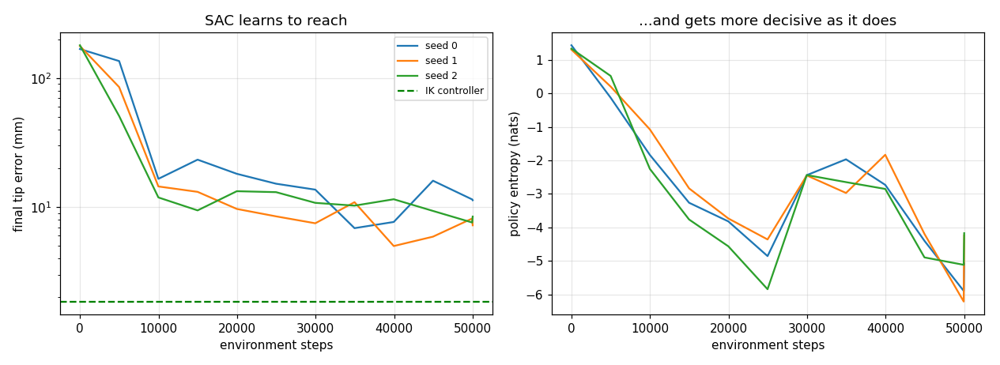
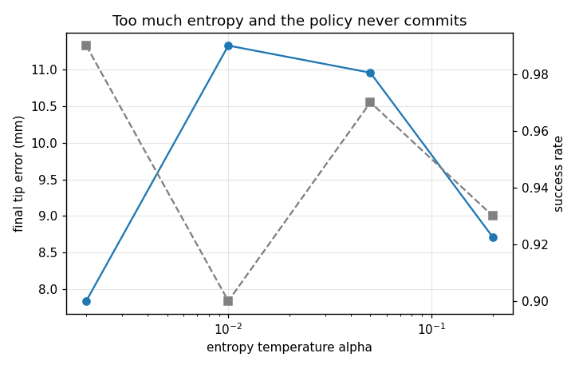
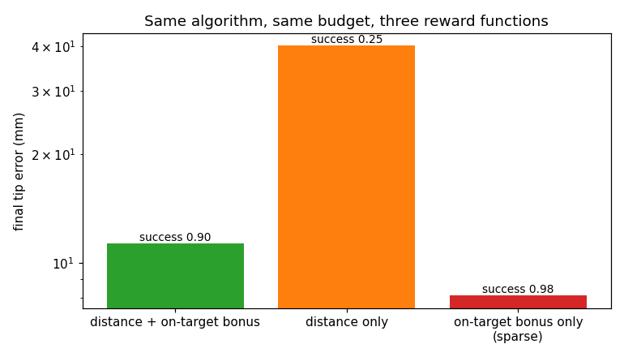
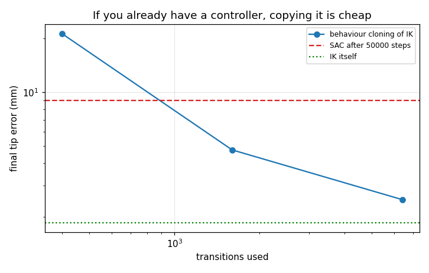

# SAC for a Sim Arm Reach

## Key Insight

[Soft Actor-Critic (SAC)](/shared/glossary/#sac) is a sample-efficient, [off-policy](/shared/glossary/#off-policy) [actor-critic](/shared/glossary/#actor-critic) [reinforcement learning](/shared/glossary/#reinforcement-learning) algorithm that incorporates [entropy regularization](/shared/glossary/#entropy-regularization) to encourage exploration and robustness. By optimizing the policy to maximize both expected long-term reward and policy entropy, SAC prevents premature convergence to suboptimal deterministic behaviors. A critical implementation detail is tuning the temperature parameter `α` (the [temperature](/shared/glossary/#temperature) parameter) that balances the trade-off between exploitation and exploration, ensuring the robot arm discovers stable trajectories to reach the target location in simulation.

**This is project 58.** It trains SAC to reach a target with [project 54](../54-behavior-cloning-on-a-sim-arm/README.md)'s arm and tunes alpha carefully, as the guide asks. Alpha changes the final result by **less than the spread between random seeds**, while the reward function -- which nobody calls a hyper-parameter -- changes it by **5x**. And a policy cloned from the classical controller beats SAC using **31x fewer interactions**.

---

## Files

| file | what it is |
|---|---|
| `reach.py` | project 54's arm vectorised over many copies, the reach task, the IK reference |
| `sac.py` | SAC: twin critics, target networks, tanh-squashed actor, automatic alpha |
| `run.py` | the six experiments, run in parallel processes |
| `outputs/` | figures and `results.csv` |

```bash
python3 reach.py   # sanity check: vectorised arm vs project 54's, and the IK reference
python3 run.py     # about 8 minutes on 12 cores; needs numpy, torch, matplotlib
```

---

## The task and the yardstick

The arm must put its tip on a target point and hold it there; success means
finishing within 2 cm. The task is deliberately easier than project 54's push,
because what is under study here is the *algorithm*, and a hard task would hide
alpha's effect behind its own difficulty.

```
max |batched - project 54 arm| over an episode : 4.44e-16
damped-least-squares IK : 1.86 mm mean final error, 0.98 success
do nothing              : 198.1 mm
random actions          : 190.1 mm
```

The physics is project 54's applied to arrays of robots, so SAC can collect tens
of thousands of transitions; the first line says the two are identical.

The yardstick is [damped least squares](/shared/glossary/#damped-least-squares)
inverse kinematics from project 05: no data at all, 1.86 mm. Keep that number in
view for the rest of the project.

---

## 1. Does it learn?



| | |
|---|---|
| SAC final tip error, 3 seeds | **9.01 ± 1.71 mm** |
| SAC success | **0.963 ± 0.045** |
| IK controller | 1.86 mm |
| ratio | **4.8x** |
| environment steps | 50 000 |
| gradient updates | 24 000 |
| wall clock | 145 s |

SAC solves the task -- 96% of episodes end within 2 cm -- at about five times
the classical controller's error, from 50 000 interactions. Compare project 57,
where PPO needed **1 000 000** interactions to land 4.5x off its own optimal
reference. That 20x difference is the [off-policy](/shared/glossary/#off-policy)
advantage the taxonomy promises: SAC re-uses every transition it has ever
collected out of a [replay buffer](/shared/glossary/#replay-buffer), while PPO
discards each batch after a few epochs.

The right-hand panel shows policy entropy falling as training proceeds -- the
policy starts deliberately random and sharpens into a decision. That is the
"soft" in Soft Actor-Critic working as designed.

---

## 2. Alpha, swept carefully



Alpha is the exchange rate between reward and entropy in SAC's objective:
maximise `reward + alpha * H(policy)`. Small alpha means "commit early", large
means "stay undecided".

| alpha | final error | success | final policy entropy |
|---|---|---|---|
| 0.002 | **7.84 mm** | 0.99 | -10.83 |
| 0.01 | 11.32 mm | 0.90 | -5.07 |
| 0.05 | 10.95 mm | 0.97 | -2.31 |
| 0.2 | 8.71 mm | 0.93 | -0.38 |

Alpha is doing exactly what it claims -- the entropy column moves by more than
ten nats -- and the task result **does not care**. Best and worst final errors
differ by 3.5 mm, while three seeds of a *single* setting differ by 1.7 mm. That
is a null result at this sample size, and it is worth stating plainly rather
than mining for a trend.

Why does the parameter everyone warns about not matter here? Because alpha buys
**exploration**, and this task barely needs any. The target disc is a sizeable
fraction of the reachable area, so even flailing lands on it sometimes --
experiment 4 shows that a pure hit-or-nothing reward trains fine. On a task with
a genuinely sparse or deceptive objective -- a maze, a peg insertion, a contact
that has to be discovered -- the same sweep would separate.

> The general point outlives the specific number: **a hyper-parameter's
> importance is a property of the task, not of the algorithm.** Tuning guides
> describe the tasks their authors ran.

---

## 3. Automatic alpha

Instead of choosing alpha you can choose a *target entropy* and let alpha chase
it, which is the version most implementations ship.

| target entropy | final error | success | alpha ended at |
|---|---|---|---|
| -1 | 12.48 mm | 0.93 | 0.102 |
| -2 (the usual default, minus the action dimension) | 8.84 mm | 0.99 | 0.055 |
| -4 | 13.45 mm | 0.95 | 0.012 |
| best fixed alpha | **7.84 mm** | -- | -- |
| best automatic | 8.84 mm | -- | -- |

Automatic tuning does not beat the best fixed value; it lands close to it
without needing to know it in advance. That is the same shape as project 49's
result for adaptive particle counts -- **the adaptive version's value is that it
removes a decision, not that it makes a better one.** And it moves the decision
rather than deleting it: you now choose a target entropy, and that choice is
worth 4.6 mm across the range tested.

---

## 4. The thing that actually mattered



Three reward functions, same algorithm, same 50 000 steps:

| reward | final error | success |
|---|---|---|
| distance to target, plus a bonus for being inside 2 cm | 11.32 mm | 0.90 |
| **distance to target only** | **40.15 mm** | **0.25** |
| **bonus only (sparse)** | **8.10 mm** | **0.98** |

A 5x spread -- an order of magnitude more than alpha moved anything -- and the
ordering is the reverse of the folklore.

**The dense distance reward is the worst.** It is dense everywhere and nearly
*flat* where it matters. Over the twenty steps left at the end of an episode,
the difference between hovering 3 cm out and landing 3 mm out is worth about
0.36 of return, which is inside the noise of the value estimate. So the policy
learns to get close and hover -- which is exactly what that reward pays for.

**The sparse reward is the best.** "Sparse rewards fail" is the standard
warning, and the standard warning assumes the agent cannot stumble onto the
reward at all. Here it can: the target disc is large enough that 16 parallel
arms exploring for 50 000 steps hit it often, and once there is any signal, a
reward that pays *only* for success cannot be farmed by loitering nearby.

The practical rule is not "use sparse rewards". It is: **check whether your
dense reward still has gradient where you need the policy to improve, and check
whether random exploration can find your sparse one.** Those two questions
decide it, not a preference.

---

## 5. Replay ratio

| updates per environment step | final error | gradient updates | wall clock |
|---|---|---|---|
| 0.25 | **7.85 mm** | 12 000 | 92 s |
| 0.5 | 11.32 mm | 24 000 | 139 s |
| 1.0 | 8.64 mm | 48 000 | 200 s |

Four times the gradient work for no measurable gain, at 2.2x the wall clock. The
[replay ratio](/shared/glossary/#replay-ratio) is the standard knob for trading
compute against environment interaction, and on a task this small compute was
never the binding constraint. Worth measuring before assuming: the default in
most implementations (1.0) is the most expensive setting here.

---

## 6. The control nobody runs



SAC learned to reach from scratch. But a controller for this task already
exists -- the IK reference. What does simply *cloning* it cost?

| method | interactions | final error | success |
|---|---|---|---|
| BC on 400 IK transitions (10 episodes) | 400 | 21.27 mm | 0.65 |
| **BC on 1 600 IK transitions (40 episodes)** | **1 600** | **4.75 mm** | **0.97** |
| BC on 6 400 IK transitions (160 episodes) | 6 400 | **2.50 mm** | 0.98 |
| **SAC** | **50 000** | 9.01 mm | 0.96 |
| the IK controller itself | 0 | 1.86 mm | 0.98 |

**Forty episodes of imitation beat 50 000 steps of reinforcement learning**, at
1/31 of the interactions and half the error.

That is not an argument against RL; it is a statement of when RL is the right
tool. RL earns its keep when no controller exists -- contact-rich manipulation,
locomotion over rough terrain, anything where *writing* the controller is the
hard part. The moment a good classical controller exists, the cheap path to a
neural policy is to clone it and the expensive path is to rediscover it from
reward. (Projects 54 and 55 are what cloning looks like when the task is hard
enough that cloning alone is not enough.)

---

## What to remember

- **SAC was 20x more interaction-efficient than PPO** on comparable problems
  here (50 k vs 1 M). That is the off-policy promise, delivered.
- **The famous hyper-parameter did nothing; the reward did everything.** Alpha:
  a 3.5 mm spread, inside seed noise. Reward function: 5x.
- **"Sparse rewards fail" is a claim about exploration, not about sparsity.**
  When random actions can find the goal, the sparse reward was the *best* of the
  three, because it cannot be farmed by hovering nearby.
- **Automatic alpha removes a decision rather than improving on it** -- and
  replaces it with a target-entropy choice worth 4.6 mm.
- **Run the imitation control.** If a controller already exists, cloning it took
  1/31 of the interactions and won.

Next: [project 59](../59-domain-randomization-study/README.md) asks what happens
when the robot you deploy on is not the robot you trained on.
