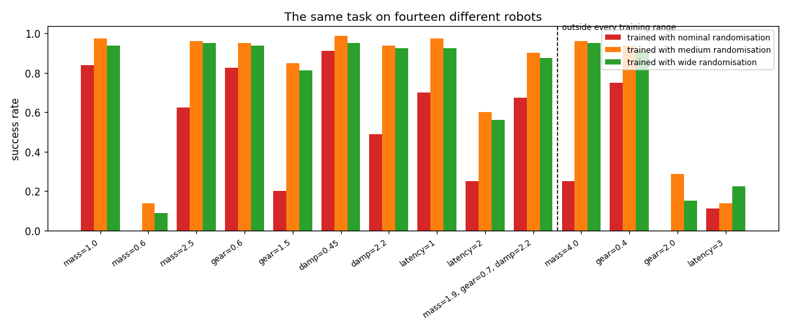
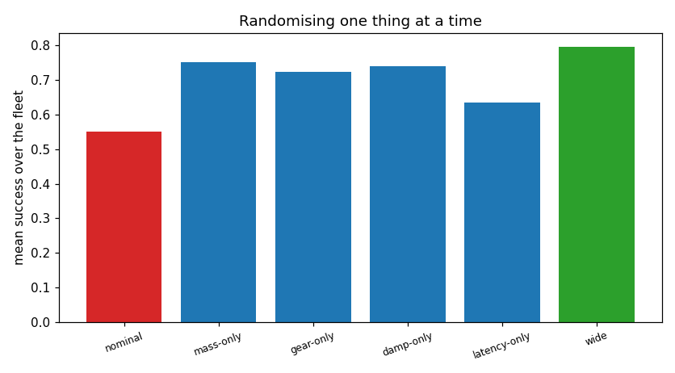
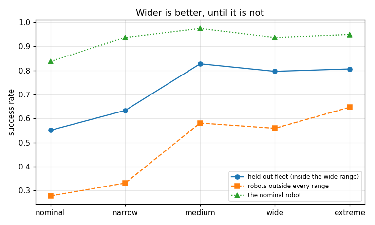

# Domain Randomization Study

## Key Insight

[Domain randomization](/shared/glossary/#domain-randomization) is the primary technique for bridging the [sim-to-real](/shared/glossary/#sim-to-real) transfer gap, training policies in a simulator whose physical parameters are dynamically varied to prevent overfitting to simulated physics. By measuring the policy's success rates in a held-out test simulation with extreme physics values, this study quantifies the performance drop caused by the [reality gap](/shared/glossary/#reality-gap) and how randomization cures it. The key is that by exposing the policy to a wide distribution of masses, frictions, and latencies during training, the robot learns a robust control strategy that generalizes to physical hardware without requiring system identification.

**This is project 59.** It runs that experiment on [project 54](../54-behavior-cloning-on-a-sim-arm/README.md)'s push task with fourteen different robots, and gets three results that contradict the paragraph above: randomisation cost **nothing** on the home robot (it *helped*), the widest range was **not** the best one, and measuring the robot first and randomising narrowly around it -- the [system identification](/shared/glossary/#system-identification) route -- **lost** to randomising blindly, on the very robot it was tuned for.

---

## Files

| file | what it is |
|---|---|
| `run.py` | the randomisation ranges, the test fleet, and the six experiments |
| `outputs/` | figures and `results.csv` |

The simulator, task, demonstrator and policy are all [project
54](../54-behavior-cloning-on-a-sim-arm/README.md)'s, imported unchanged. The
only new thing is that the physics is redrawn at every reset.

```bash
python3 run.py     # about 2 minutes on 12 cores; needs numpy, torch, matplotlib
```

---

## What is randomised, and what "a robot" means here

Four parameters, redrawn at every episode, with the policy never told which
robot it is on:

| parameter | what it stands for |
|---|---|
| `mass_scale` | link masses -- an unmodelled payload, or a wrong CAD density |
| `damp_scale` | viscous joint friction -- gearbox wear, temperature, lubricant |
| `gear` | motor strength -- a torque constant that is not what the datasheet says |
| `latency` | control delay in decisions -- USB, network, and driver round-trip |

Every robot in the study is one the simulator can actually integrate. That
sounds obvious and is a real constraint: the servo gains stay fixed while the
physics changes, so a very light link with very high damping produces a decay
rate faster than the 200 Hz time step can represent, and the arm diverges. That
is not a hard robot, it is a broken simulation. The ranges below keep the
worst-case rate (an eigenvalue of `M^-1 B`) under about 2 / dt, and the
environment now detects divergence and fails the episode rather than letting
`NaN` values into the training data.

### The demonstrator's ceiling

The policy is cloned from the scripted demonstrator, so the demonstrator's own
score on a robot is the **ceiling** for any policy trained from it:

| robot | expert success |
|---|---|
| nominal, 2.5x mass, 4x mass, gear 0.4-2.0, damping 0.45-2.2 | 1.00 |
| 0.6x mass | 0.73 |
| latency 2 | 0.60 |
| latency 3 | 0.27 |

Two robots are genuinely hard for a *feedback* controller: a very light arm
overshoots under fixed gains, and a delayed one chases its own past. A low
policy score on those two is not evidence about randomisation, so the ceilings
are printed alongside every result.

---

## 1. How badly does one robot's policy transfer?

100 demonstrations on the nominal robot, cloned, then run on the fleet:

| test robot | success | (expert ceiling) |
|---|---|---|
| nominal | **0.838** | 1.00 |
| 0.6x mass | **0.000** | 0.73 |
| 2.5x mass | 0.625 | 1.00 |
| gear 0.6 | 0.825 | 1.00 |
| gear 1.5 | **0.200** | 1.00 |
| damping 0.45 | 0.913 | 1.00 |
| damping 2.2 | 0.488 | 1.00 |
| latency 1 | 0.700 | 1.00 |
| latency 2 | 0.250 | 0.60 |
| the "real" robot (1.9x mass, 0.7 gear, 2.2 damping) | 0.675 | 1.00 |
| **mean over the fleet** | **0.551** | -- |

A policy that scores 0.838 at home scores 0.55 across the fleet and **zero** on
a robot whose links are 40% lighter. Nothing about the task changed; only the
robot did. This is the reality gap in miniature, and the striking part is which
direction hurts: a *lighter, faster* arm is far worse than a heavier one,
because the same commanded step now overshoots.

---

## 2. Randomised vs nominal



| training | mean over the fleet | on the nominal robot |
|---|---|---|
| nominal only | 0.551 | 0.838 |
| medium randomisation | **0.828** | **0.975** |
| wide randomisation | 0.796 | 0.938 |

Randomisation is worth **+0.245 across the fleet** -- and the "premium" it is
supposed to charge at home is **negative 0.10**: the randomised policies are
better on the nominal robot *too*.

That contradicts project 52, which measured a 1.9x premium for randomisation on
a quadruped, and the difference is instructive. There the policy was optimised
by [reinforcement learning](/shared/glossary/#reinforcement-learning) against a
reward, so spending capacity on robustness came directly out of performance.
Here the policy is *cloned* from a demonstrator that is already robust, so
randomisation acts as [data augmentation](/shared/glossary/#data-augmentation):
same 100 demonstrations, more varied states, less overfitting. **Whether
randomisation costs you anything at home depends on whether your policy was
straining against a performance ceiling or against a data limit.**

---

## 3. Which knob is worth randomising?



Randomising one parameter at a time, scored over the whole fleet:

| randomised | fleet mean | on the robots it was aimed at | nominal-trained, same robots |
|---|---|---|---|
| nothing | 0.551 | -- | -- |
| mass only | 0.752 | 0.562 | 0.312 |
| gear only | 0.725 | 0.894 | 0.512 |
| damping only | 0.740 | 0.913 | 0.700 |
| latency only | 0.636 | 0.719 | 0.475 |
| all four (wide) | **0.796** | -- | -- |

Two things worth pulling out.

**Every single axis helps on robots it has nothing to do with.** Randomising
only the motor strength lifts the fleet mean from 0.551 to 0.725, and the fleet
includes mass, damping and latency variations that gear randomisation never
touched. The policy is not learning "how to handle a weak motor"; it is
learning to stop relying on the tip going exactly where it was told -- a
robustness that transfers across causes. That is the mechanism by which
randomising *visual* parameters helps with *physical* mismatch in real
sim-to-real work, and it is nice to see it in a system small enough to measure.

**Latency is the weakest axis and the hardest robot.** It is the one
perturbation that no amount of feedback fixes: a delayed controller acts on
stale information, and the demonstrator itself drops to 0.60 and 0.27. Delay is
worth engineering away rather than randomising over.

---

## 4. How wide should the ranges be?



| range | fleet mean | robots outside every range | demonstrations that succeeded |
|---|---|---|---|
| nominal (no randomisation) | 0.551 | 0.278 | 1.00 |
| narrow (±10%) | 0.634 | 0.331 | 1.00 |
| **medium** | **0.828** | 0.581 | 0.99 |
| wide | 0.796 | 0.559 | 0.88 |
| extreme | 0.806 | **0.647** | **0.57** |

There is an interior optimum, and the last column explains it. Demonstrations
that fail are discarded, so **at the extreme range 43% of the collected
episodes are thrown away** -- the demonstrator itself cannot drive those robots.
The surviving data is a biased, easier sample of the range that was asked for.
The policy is therefore trained on a distribution narrower than the one on the
label, while paying the full price in data collection.

The practical rule this suggests: widen the ranges until your *data source*
starts failing, and treat that failure rate as the real signal, not the range
you typed in. (Extreme randomisation does buy the best extrapolation, 0.647
outside every range -- so if the mismatch you fear is severe, the trade may be
worth it.)

---

## 5. Measure the robot, or randomise over it?

The fleet contains a "real" robot: 1.9x mass, 0.7 gear, 2.2 damping. Suppose
you [identify](/shared/glossary/#system-identification) those parameters and
randomise narrowly around the measured values instead of over everything.

| training | on the real robot | on the whole fleet |
|---|---|---|
| nominal | 0.675 | 0.551 |
| system-ID (narrow, around the truth) | 0.825 | **0.406** |
| **wide randomisation** | **0.875** | **0.796** |

**System identification loses on the robot it was measured on.** The
identification is not wrong -- the range brackets the true parameters -- and it
still trails blind randomisation by 0.05, while being far worse everywhere
else (0.406 fleet mean, below even the nominal policy, because it is now
specialised for a robot the fleet does not contain).

The reason is the same as experiment 3: what randomisation buys is not
"knowledge of the right parameters", it is a policy that does not depend on any
particular ones. A narrow range around the truth gives back that independence.
The two are not alternatives in practice -- the standard recipe is to identify
the parameters *and then randomise widely around them*, which is exactly the
combination of the last two rows, not either one alone.

---

## 6. Outside the range

| test robot | nominal | wide | extreme |
|---|---|---|---|
| 4x mass | 0.250 | **0.950** | 0.963 |
| gear 0.4 | 0.750 | **0.913** | 0.887 |
| gear 2.0 | 0.000 | 0.150 | **0.350** |
| latency 3 (ceiling 0.27) | 0.113 | 0.225 | **0.387** |

Extrapolation is real but one-sided. A robot 33% heavier than anything in the
training range is handled fine (0.95); a motor 25% stronger than anything seen
is not (0.15). The asymmetry is the same one from experiment 1 -- **being too
slow is recoverable, being too fast is not** -- and it is worth knowing which
side of your uncertainty is the dangerous one before choosing where to spend
range.

---

## What to remember

- **The gap is real and large**: 0.838 at home, 0.551 on the fleet, 0.000 on a
  robot 40% lighter.
- **Randomisation cost nothing here and helped at home.** The "insurance
  premium" is not a law; it appears when the policy is optimising against a
  ceiling, not when it is short of data.
- **Any axis helps every axis.** Randomising motor strength improved robots
  whose motors were nominal, because the policy stops trusting its own
  commands.
- **Widen until your data source starts failing.** At the extreme range 43% of
  demonstrations were unusable, and the effective training distribution was
  quietly narrower than the one requested.
- **System ID plus randomisation, not either alone.** Identifying the robot and
  then randomising *narrowly* was worse than not identifying it at all.

Next: [project 60](../60-world-model-planning/README.md) stops learning a policy
altogether and learns the dynamics instead.
