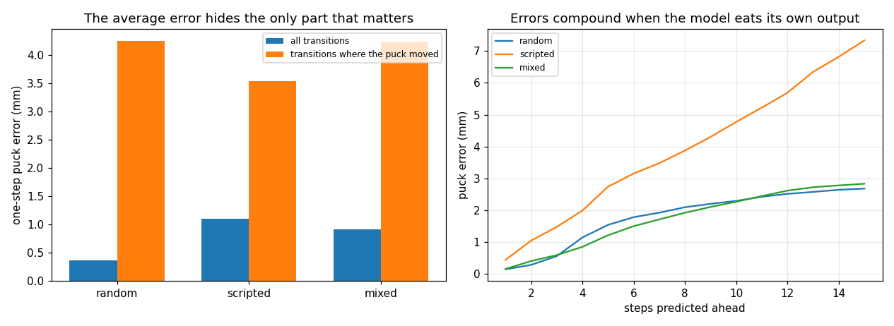
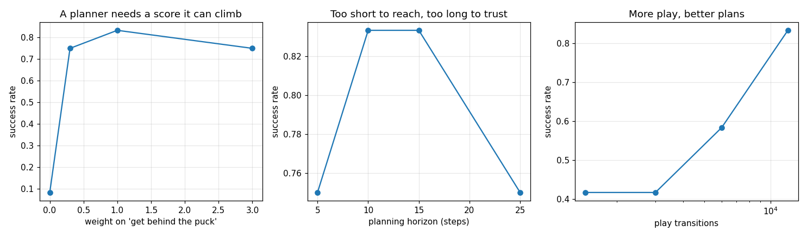

# World-Model Planning

## Key Insight

[World models](/shared/glossary/#world-model) enable model-based [reinforcement learning](/shared/glossary/#reinforcement-learning) by training a neural network to predict the next observations and rewards of the environment given the current state and action. Using this learned model, an agent can perform [planning](/shared/glossary/#planning) entirely in a [latent space](/shared/glossary/#latent-space) without taking real-world or simulator actions, which is highly sample-efficient. Optimizing action trajectories with the [Cross-Entropy Method (CEM)](/shared/glossary/#cem) over this world model allows the robot to simulate hundreds of possible action sequences, select the top-performing paths, and execute only the first action of the best-planned sequence.

**This is project 60.** It learns [project 54](../54-behavior-cloning-on-a-sim-arm/README.md)'s push dynamics from *goal-free random play* -- data that behaviour cloning cannot use at all, because there is no behaviour in it to clone -- and plans with it to **0.833 success**, against 1.000 for planning inside the true simulator at 26x the compute. It also runs the latent-space version the Key Insight describes, which scores **0.083**, and the reason is the most useful thing here.

---

## Files

| file | what it is |
|---|---|
| `world.py` | play-data collection, the state model, the latent model, CEM, the MPC loop |
| `run.py` | the six experiments, run in parallel processes |
| `outputs/` | figures and `results.csv` |

```bash
python3 run.py     # about 2 minutes on 12 cores; needs numpy, torch, matplotlib
```

---

## What is different about this project

Everything from 54 to 59 learns a **policy**: a direct map from observation to
action. This one learns a **model** -- what the world will look like one step
from now -- and computes the policy fresh at every step by searching inside that
model.

The point is not run-time speed (a policy is far faster). It is what the data
has to contain:

| approach | needs | what this project used |
|---|---|---|
| behaviour cloning | someone who can already do the task | -- |
| reinforcement learning | a reward, and millions of trials | -- |
| model learning | the robot **moving**, at all | random flailing |

The data here is called **play data** for a literal reason: goal-free
interaction, like a child mashing buttons. It cannot train a cloned policy --
there is no expert behaviour in it -- and it is enough to train a model that
then serves *any* goal, because the goal never enters the physics.

### The planner

[CEM](/shared/glossary/#cem) -- the Cross-Entropy Method -- takes its name from
rare-event simulation, where it minimises the cross-entropy (a distance between
probability distributions) between a sampling distribution and one concentrated
on good outcomes. What it does is simpler than the name: sample 100 random
action sequences, score each by rolling it out in the model, keep the best 10
("elites"), refit a Gaussian to those, repeat four times. Then execute the first
few actions and re-plan -- [model-predictive
control](/shared/glossary/#mpc), exactly as in projects 13
and 48, with a learned model in place of the equations.

---

## 1. The model looks excellent and is not



Three kinds of play data, 12 000 transitions each, same network:

| play data | steps that touch the puck | 1-step puck error, **all** steps | 1-step puck error, **contact** steps | ratio |
|---|---|---|---|---|
| random actions | 0.033 | 0.36 mm | 4.25 mm | **12.0x** |
| noisy scripted explorer | 0.137 | 1.10 mm | 3.54 mm | 3.2x |
| half and half | 0.094 | 0.91 mm | 4.24 mm | 4.6x |

A one-step error under a millimetre sounds like a solved problem. It is
meaningless. In 97% of random-play transitions the puck **does not move**, so a
model that has learned "the puck never moves" already scores 0.36 mm -- while
being useless for a task that is entirely about moving the puck.

**Score your model on the transitions that carry the task, not on the average
transition.** On contact steps the error is 12x higher, and those are the only
ones the planner cares about. This is project 54's "the loss is a loose proxy"
one level further down: here even the model's own error metric is the loose
proxy.

The right-hand panel shows the other half of the problem: feeding the model its
own output compounds error, roughly 4x from 1 step to 15. Planning needs
predictions 10-25 steps out, so that curve is the real budget.

---

## 2. Planning with it

| model used for planning | success | ms per decision |
|---|---|---|
| learned from random play | 0.583 | 35 |
| learned from scripted play | 0.583 | 42 |
| **learned from mixed play** | **0.833** | 44 |
| **the true simulator** | **1.000** | **1 142** |

Two things worth separating.

**The planner works.** Planning inside the true simulator solves the task
outright, which is the control that proves any failure of the learned version is
a *model* failure and not a planner failure. Without that row a 0.833 would be
uninterpretable.

**The learned model is 26x cheaper.** That is the real argument for world models
in robotics: not accuracy (the simulator wins) but that a neural network
evaluating 100 candidate futures as one batch costs 44 ms, while re-simulating
100 candidate futures costs more than a second -- and on a real robot,
"just simulate it" is not an option at all.

Mixed play wins because it carries both kinds of information: random actions
cover the space, the scripted explorer produces the contacts. Neither alone is
enough, which is a good argument for *deliberately mixing* exploration policies
rather than picking one.

---

## 3. The planner needs a score it can climb



The obvious score is "how close is the puck to the goal, summed over the
horizon". Used alone, it fails:

| weight on the "get behind the puck" term | success |
|---|---|
| 0.0 (distance to goal only) | **0.083** |
| 0.3 | 0.750 |
| 1.0 | **0.833** |
| 3.0 | 0.750 |

With the pure distance score the planner is blind for the whole approach: until
something touches the puck, **every candidate action sequence scores exactly the
same**, so CEM's elite selection is choosing among identical numbers and the
refitted Gaussian is noise. Adding a term for the tip's distance to the spot it
would have to push *from* gives the search something to climb during the
approach, and success goes from 0.083 to 0.833.

This is [reward shaping](/shared/glossary/#reward-shaping) inside a planner, and
it is the same disease project 58 finds in SAC's reward: a signal that is
technically dense and flat exactly where you need gradient. Note that this term
is *computed*, not learned -- kinematics are geometry you already have, so
telling the planner where the contact point is costs nothing and assumes nothing
about the dynamics it is trying to learn.

---

## 4. How far ahead to plan

| horizon | success | ms per decision |
|---|---|---|
| 5 | 0.750 | 12 |
| 10 | **0.833** | 22 |
| 15 | **0.833** | 44 |
| 25 | 0.750 | 49 |

An interior optimum, squeezed from both sides: too short and the plan cannot
reach the puck before the horizon ends; too long and the model's compounding
error (experiment 1) makes the far end of the prediction fiction. Half a second
is where those meet here, and the compute doubles for nothing beyond it.

---

## 5. How much play is enough

| play episodes | transitions | success | contact error |
|---|---|---|---|
| 25 | 1 440 | 0.417 | 5.46 mm |
| 50 | 3 000 | 0.417 | 5.08 mm |
| 100 | 6 000 | 0.583 | 5.03 mm |
| 200 | 12 000 | **0.833** | 4.23 mm |

Eight times the data doubles the success rate, and the *contact* error moves
with it while the overall error barely does -- experiment 1's metric earning its
keep. Play data needs no expert and no reward, so this is the pleasant end of a
scaling curve.

---

## 6. The latent model, and why it loses

| | success | ms per decision |
|---|---|---|
| plain state-space model | **0.833** | 44 |
| latent-dynamics model (Dreamer / TD-MPC style) | **0.083** | 20 |

The Key Insight describes planning "entirely in a latent space", and that
version fails almost completely here -- with 2.5x the training epochs, so it is
not simply undertrained.

This is not evidence against latent world models. It is evidence about **what
they are for**. A latent model exists to avoid predicting the observation: in
Dreamer and TD-MPC the observation is an *image*, so predicting the next
observation means predicting every pixel, most of which is wallpaper.
Compressing to a small code and rolling *that* forward is an enormous saving.

Here the state is six numbers -- two joint angles, two joint velocities, two
puck coordinates -- and there is nothing to compress. What the latent version
adds is only cost: an encoder that can drift, a learned reward head that can be
wrong, and no direct supervision on the quantity the planner actually scores.
The state model predicts the puck position and the planner computes the reward
exactly; the latent model predicts a code and *guesses* the reward from it.

**Use a latent model when your observation is much bigger than your task's
state. When you already have the state, predicting it is both simpler and
better.**

---

## What to remember

- **Play data is a different currency.** No expert, no reward -- and it trains a
  model that serves every goal. That is the sample-efficiency argument for
  model-based methods, made concrete.
- **Average model error is the wrong metric.** 0.36 mm overall, 4.25 mm on the
  3% of steps that matter, and only the second number predicts planning success.
- **Plan with the true model once.** It separates "my model is bad" from "my
  planner is bad"; here it proved the planner was fine (1.000).
- **A flat score is a broken score.** Distance to goal alone: 0.083. With one
  computed shaping term: 0.833.
- **Latent dynamics are for high-dimensional observations.** On a six-number
  state they turned 0.833 into 0.083.

Next: [project 61](../61-cross-embodiment-fine-tune/README.md) asks what
transfers when the *robot* changes rather than the task.
