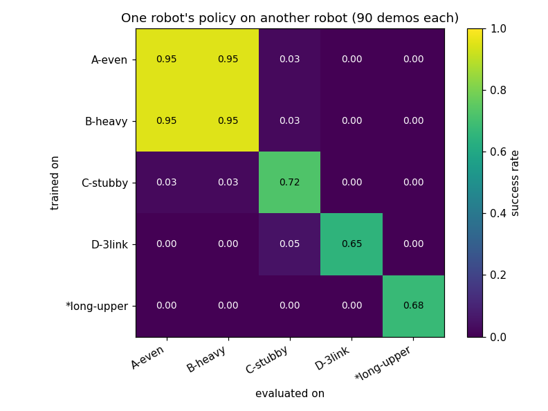
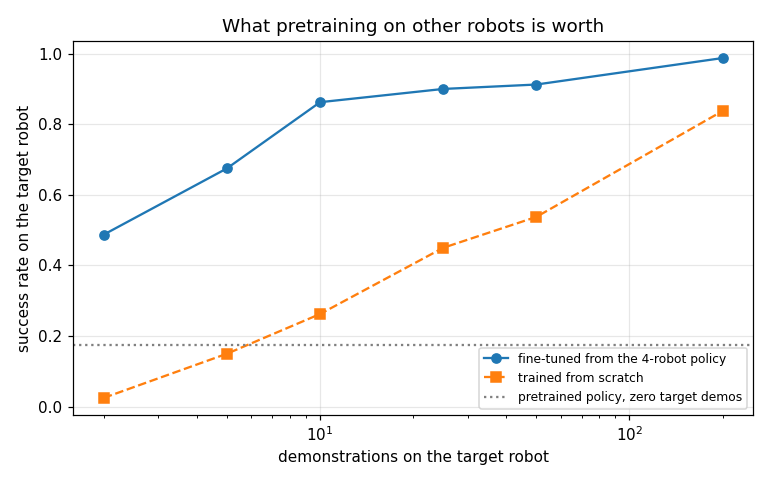
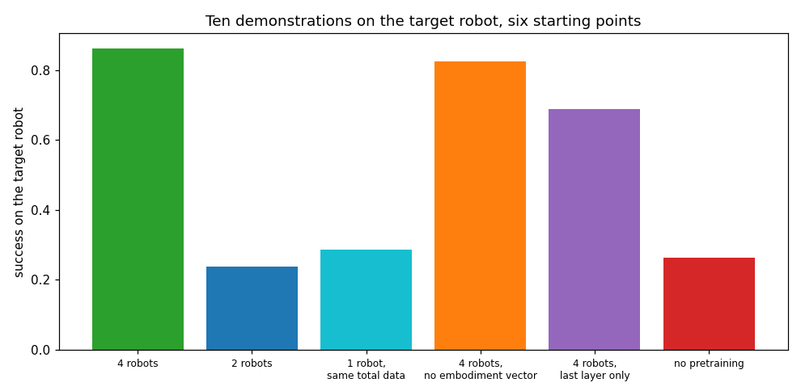

# Cross-Embodiment Fine-Tune

## Key Insight

[Cross-embodiment](/shared/glossary/#cross-embodiment) learning allows a robotic [policy](/shared/glossary/#policy) to generalize across different robot geometries, actuators, and platforms by pretraining on massive, heterogeneous datasets like [Open X-Embodiment](/shared/glossary/#open-x-embodiment). Fine-tuning these large-scale models on a specific target robot requires far fewer demonstrations than training from scratch, because the model's vision encoder and spatial representations are already optimized. By learning a shared action-representation mapping, the robot leverages general physical concepts learned from other platforms to solve its specific task with high sample efficiency.

**This is project 61.** It builds a zoo of five arms -- different link lengths, different masses, one with three joints instead of two -- and measures the promise directly. Ten demonstrations on a new robot after pretraining beat **two hundred** demonstrations from scratch. The *diversity* of the source robots is what buys that: four robots score **0.863**, one robot with the same total amount of data scores **0.287**.

---

## Files

| file | what it is |
|---|---|
| `embodiment.py` | the robot zoo, the padded observation/action format, per-robot data collection |
| `ft.py` | masked behaviour cloning, pretraining, and fine-tuning |
| `run.py` | the six experiments, run in parallel processes |
| `outputs/` | figures and `results.csv` |

```bash
python3 embodiment.py   # the zoo, its stability margins, and the expert's score on each robot
python3 run.py          # about 5 minutes on 12 cores; needs numpy, torch, matplotlib
```

---

## The zoo

Five arms doing [project 54](../54-behavior-cloning-on-a-sim-arm/README.md)'s
push task. Reach is kept similar so that every robot *can* do the task; what
differs is how it has to move.

| robot | links (m) | note |
|---|---|---|
| source A, even | 0.20, 0.18 | project 54's arm |
| source B, heavy | 0.20, 0.18 | 2.5x the link masses |
| source C, stubby | 0.16, 0.15 | shorter reach |
| source D, three joints | 0.14, 0.13, 0.11 | **redundant**: an extra degree of freedom |
| **target**, long upper arm | 0.24, 0.14 | held out; never seen during pretraining |

The scripted demonstrator drives all five at 1.00 success, because it is a
feedback controller working from kinematics rather than a replayed trajectory.

### Three pieces of plumbing, and why each is needed

**Padding.** Every robot's joint vector is padded to three entries, zeros where
a robot has no joint, so one network shape fits all. Obvious -- and not
sufficient on its own.

**Action masking.** The loss ignores the padded slots. Without the mask those
zeros are a training signal: the network learns to output zero for joint three,
including on the robot that *has* one.

**An embodiment vector.** Four extra inputs -- the three link lengths and the
joint count. This looks redundant, since the observation already carries the tip
position, the joint angles and the puck; surely a network can work out which
robot it is on? Not in general: two arms in the same pose facing the same puck
need *different* joint deltas to move the tip the same way, and nothing else in
the observation distinguishes them. The embodiment vector is what lets one set
of weights be correct for both. Experiment 4 measures what it is actually worth,
and the answer is more interesting than "a lot".

> **A trap worth stating**, because it cost real debugging time: you cannot copy
> one robot's servo gains onto another robot. A gain sized for a shoulder link,
> applied to a wrist link a hundred times lighter, makes the closed loop faster
> than the 200 Hz simulator can represent, and the arm explodes on step one. The
> rule is that every rate in the loop -- the eigenvalues of `M^-1 K` for the
> servo and of `M^-1 B` for damping -- must stay below about 2 / dt. `make_arm`
> sizes both from each robot's own mass matrix, which is the inertia-shaping
> idea from computed-torque control in project 11. Diagonal gains are not
> enough: the three-link arm's mass matrix has an eigenvalue a hundred times
> smaller than its smallest diagonal entry, and that coupled mode is the one
> that blows up.

---

## 1. How much does a policy transfer on its own?



Ninety demonstrations on one robot, cloned, then run on all five:

| trained on | own robot | other robots (mean) |
|---|---|---|
| source A | 0.95 | 0.244 |
| source B (heavy) | 0.95 | 0.244 |
| source C (stubby) | 0.725 | 0.013 |
| source D (3 joints) | 0.65 | 0.013 |
| the target | 0.675 | 0.000 |
| **mean** | **0.790** | **0.102** |

A policy is worth 0.79 on the robot it was trained on and 0.10 anywhere else.
The task never changed; only the machine did. That gap is why cross-embodiment
is a research problem and not a data-loading detail.

---

## 2. Pretraining on the zoo

| pretraining set | transitions | zero-shot on the target | on its own source robots |
|---|---|---|---|
| all 4 sources | 9 483 | 0.175 | 0.963 |
| 1 source, 4x the demos | 8 639 | 0.000 | 1.000 |
| 2 sources | 8 725 | 0.000 | 1.000 |
| all 4, **without** the embodiment vector | 9 483 | **0.850** | 0.975 |

The last row is a genuine surprise. **A policy that is not told which robot it
is driving transfers to an unseen robot far better** -- 0.85 against 0.175 --
than one that is.

The mechanism is clear once seen. Given the embodiment vector, the network can
specialise, and does: it learns four behaviours indexed by that vector, and a
fifth robot's vector is a code it has never encountered, so what comes out is
undefined. Denied the vector, it is forced to find a single behaviour that works
for all four -- a compromise that happens to also work on a fifth. **Conditioning
buys specialisation; withholding it buys generalisation.** Which you want depends
on whether the robot you deploy on is in your training set.

---

## 3. Sample efficiency: the headline



Fine-tuning the 4-robot policy on the target robot, against training from
scratch on the same demonstrations, two seeds each:

| target demos | fine-tuned | from scratch |
|---|---|---|
| 2 | **0.488 ± 0.063** | 0.025 ± 0.025 |
| 5 | **0.675 ± 0.025** | 0.150 ± 0.050 |
| 10 | **0.863 ± 0.062** | 0.262 ± 0.087 |
| 25 | 0.900 ± 0.050 | 0.450 ± 0.075 |
| 50 | 0.912 ± 0.037 | 0.537 ± 0.037 |
| 200 | 0.988 ± 0.013 | 0.837 ± 0.013 |

**Ten fine-tuning demonstrations (0.863) beat two hundred from scratch
(0.837)** -- more than a 20x multiplier, and the sweep never finds the crossover
because scratch training tops out below the fine-tuned ten-demo score.

Two demonstrations already reach 0.488, which is the number that matters on real
hardware: two demonstrations is about five minutes of a person's time.

The advantage *shrinks* with data (+0.53 at 5 demos, +0.15 at 200) and never
goes negative -- no [negative transfer](/shared/glossary/#negative-transfer)
here. That is a property of this setup (same task, same observation format,
similar robots), and it is exactly what stops holding when a pretraining corpus
contains tasks unlike yours.

---

## 4. Diversity or volume?



Everything below gets **the same ten target demonstrations**; only the starting
point differs:

| starting point | success on the target |
|---|---|
| **pretrained on 4 robots** | **0.863 ± 0.062** |
| pretrained on 4 robots, no embodiment vector | 0.825 ± 0.075 |
| pretrained on 4 robots, only the last layer fine-tuned | 0.688 ± 0.213 |
| pretrained on **1 robot, same total data** | 0.287 ± 0.212 |
| pretrained on 2 robots | 0.238 ± 0.038 |
| no pretraining | 0.262 ± 0.087 |

**It is the diversity, not the volume.** One robot with 8 639 transitions is
worth 0.287 -- indistinguishable from no pretraining at all (0.262) -- while four
robots with 9 483 transitions are worth 0.863. Two robots buy nothing either.
Something happens between two robots and four that does not happen between one
and two.

That is the thesis of Open X-Embodiment compressed into one table: a pretraining
corpus is not measured in hours of data but in **how many different things it
contains**. A policy trained on one robot learns that robot. A policy trained on
four is forced to learn what is common to pushing a puck, and the common part is
what transfers.

**Fine-tuning only the last layer keeps most of the benefit** (0.688) while
updating a fraction of the parameters -- with much higher seed-to-seed variance
(±0.213). The full fine-tune is better and steadier here; freezing the trunk is
the option for when the target data is so small that updating everything would
overfit.

**The embodiment vector barely matters for fine-tuning** (0.863 vs 0.825), which
sits interestingly against experiment 2 where it decided zero-shot behaviour
completely. Ten demonstrations are enough for the network to work out which
robot it is on, so the explicit label stops carrying information. **Conditioning
matters most exactly when you have no target data** -- and that is also where its
sign flips.

---

## 5. When the target robot has plenty of data

| | fine-tuned | from scratch | advantage |
|---|---|---|---|
| 5 demos | 0.675 | 0.150 | **+0.525** |
| 200 demos | 0.988 | 0.837 | +0.150 |

The advantage decays by 3.5x as the target dataset grows 40x, and stays
positive. Pretraining is a substitute for target data, and like most substitutes
it is worth most when the thing it replaces is scarce.

---

## What to remember

- **Policies do not transfer between robots on their own**: 0.79 at home, 0.10
  elsewhere.
- **Ten demonstrations after pretraining beat two hundred without it.** That is
  the promise of cross-embodiment pretraining, and it held.
- **Diversity is the active ingredient.** Four robots: 0.863. One robot with the
  same total data: 0.287, indistinguishable from no pretraining.
- **Telling the policy which robot it is on cuts both ways.** It *hurt*
  zero-shot transfer badly (0.85 down to 0.175) and made almost no difference
  once ten target demonstrations existed.
- **Gains do not port between robots.** Size every servo from its own mass
  matrix, or watch the simulation diverge on step one.

This is the last project of Phase 8. The through-line across all eight: every
headline number here came from a **control** -- the equal-label control in 55,
the unimodal control in 56, the LQR reference in 57, the imitation control in
58, the expert ceiling in 59, the true-simulator control in 60, and the
same-total-data control above. Without them each project is a rising curve and
no finding.
