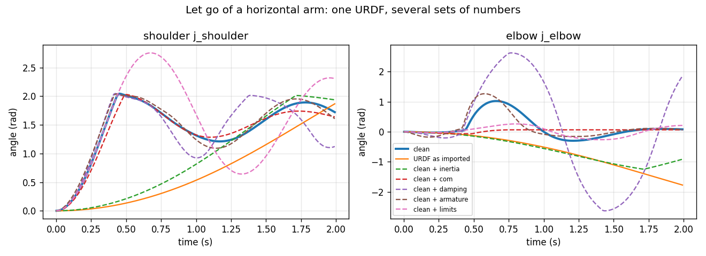
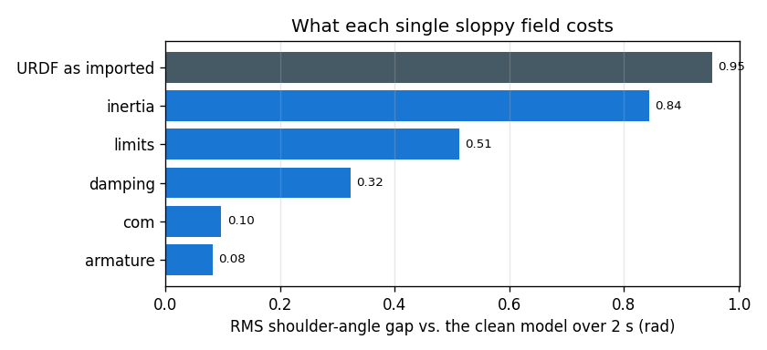
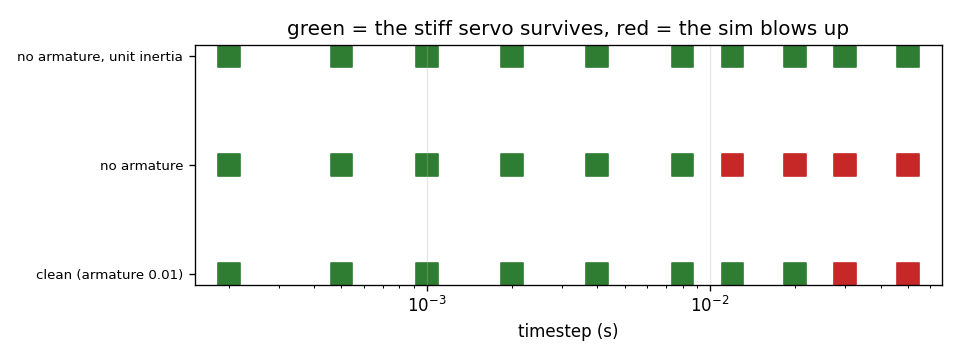

# URDF to MJCF Migration

## Key Insight

A robot's [URDF](/shared/glossary/#urdf--mjcf--usd) defines its visual and kinematic structure but often lacks the precise [inertia](/shared/glossary/#inertia) properties, contact parameters, and clean [collision meshes](/shared/glossary/#collision-mesh) needed for dynamic simulation. Migrating to [MJCF](/shared/glossary/#urdf--mjcf--usd) allows [MuJoCo](/shared/glossary/#mujoco)'s physics solver to accurately compute contact forces, joint limits, and friction. Converting and auditing these files ensures that simulation behaviors match reality, preventing simulator instabilities or phantom forces.

**This is project 62.** It writes a 3-joint arm the way a hobbyist really exports it, audits it, and then puts a price on every sloppy field. The headline: the imported robot's forearm has **1106x** the true rotational inertia, and it takes **0.97 s** to fall half a radian where the real arm takes **0.20 s**. And yet the *static* pose it settles into is almost right — which is exactly why nobody catches this by looking at it.

---

## Files

| file | what it is |
|---|---|
| `hobby_arm.urdf` | the deliberately sloppy source file, with all 8 defects labelled |
| `migrate.py` | the auditor, the mesh generator, and the MJCF builder (one defect flag per fix) |
| `run.py` | the five experiments |
| `arm_clean.mjcf` | the migrated model, written by `migrate.py` |
| `meshes/` | generated collision meshes (`.obj`) |
| `outputs/` | figures and `results.csv` |

```bash
python3 migrate.py   # writes the meshes, prints the audit, writes arm_clean.mjcf
python3 run.py       # about 4 seconds; needs numpy, mujoco, matplotlib
```

---

## What the two file formats are, and why there are two

**URDF** stands for *Unified Robot Description Format*. It is ROS's robot file:
an XML tree of `<link>` (a rigid piece of metal) and `<joint>` (how one piece
connects to the next). It was designed to answer *"where is everything?"* —
[forward kinematics](/shared/glossary/#forward-kinematics), visualisation,
[TF](/shared/glossary/#tf-transform-tree) frames.

**MJCF** is MuJoCo's own XML dialect. It answers a harder question: *"how does
everything move when I push it?"* So it has fields URDF simply does not have —
rotor inertia, solver friction, contact softness, per-joint armature.

> **"Isn't this just a file conversion?"** No, and that is the whole project.
> MuJoCo will load `hobby_arm.urdf` directly, without complaint. You get a robot
> — it is just the wrong robot. A converter can only copy numbers across; it
> cannot invent the numbers that were never there. **Migration is a modelling
> job that happens to end in a file.**

---

## The eight defects

Every one of these is in `hobby_arm.urdf`, labelled `D1`–`D8`. None is a
strawman; all of them appear in URDFs that thousands of people have downloaded.

| # | defect | why it happens |
|---|---|---|
| D1 | every `<inertia>` is the identity matrix (`ixx=iyy=izz=1`) | the CAD exporter's placeholder when you forget to assign a material |
| D2 | `<inertial>` has no `<origin>` | so the [centre of mass](#d2-the-centre-of-mass-sits-on-the-joint) defaults to the joint, not the middle of the link |
| D3 | `<collision>` reuses the decorative visual mesh | copy-paste from the `<visual>` block |
| D4 | no `<dynamics>` on any joint | zero damping, zero friction — a frictionless robot |
| D5 | the elbow is `type="continuous"` | nobody bothered to measure the limits |
| D6 | no rotor inertia anywhere | **URDF has no field for it** |
| D7 | a `fixed` joint to a tool frame | the natural way to name your gripper tip |
| D8 | a zero-mass sensor link | a camera bracket you did not weigh |

The *geometry* in this file is correct — link lengths and radii came from CAD.
That is the usual state of a hobby URDF: **the shapes are true and the physics
is invented.** It looks perfect in RViz.

### The audit

`migrate.py` walks the XML and flags all of it (abridged):

```
FATAL  link2          inertia is the identity matrix -- CAD placeholder
FATAL  link2          <inertial> has no <origin>: COM sits on the joint
WARN   link2          collision uses a mesh, not a primitive
WARN   camera_link    mass = 0 (fatal if a joint moves it)
WARN   j_elbow        no <dynamics>: zero damping/friction
WARN   j_elbow        type=continuous: no joint limits
INFO   j_elbow        URDF cannot express rotor inertia (armature)
INFO   j_tool         fixed joint: MuJoCo will weld the child away
```

One check is worth singling out. A real rigid body must satisfy the **triangle
inequality on its principal inertias**: `A + B >= C` for the three sorted
values. This is not a convention — it falls out of the definition. `Ixx` is
built from `y² + z²`, `Iyy` from `x² + z²`, `Izz` from `x² + y²`; add the first
two and you get the third plus `2z²`, which cannot be negative. So a tensor
that fails this test describes an object that **cannot exist**, and any solver
handed one will produce nonsense. Two lines of Python catch a class of bug that
otherwise shows up as "the simulation is weird".

---

## 1. What the importer actually handed us

MuJoCo imports the URDF faithfully. That is the problem.

|  | URDF as imported | clean MJCF |
|---|---|---|
| bodies | 4 | 6 |
| frames lost | `base_link`, `tool_link` | — |

| link | mass | URDF's largest inertia | true value | ratio | COM off by |
|---|---|---|---|---|---|
| link1 | 0.50 kg | 1.0 | 0.000567 | **1765x** | 50 mm |
| link2 | 0.60 kg | 1.0 | 0.00318 | **314x** | 125 mm |
| link3 | 0.45 kg | 2.0 | 0.00181 | **1106x** | 89 mm |

An `Izz` of 1.0 kg·m² on a 0.6 kg aluminium tube is the rotational inertia of a
cast-iron flywheel. To feel how absurd this is: 1.0 kg·m² is what you would get
by putting that 0.6 kg of metal on the end of a **1.3-metre** arm. The tube is
25 cm long.

### The fix: compute the inertia from the shape you already drew

The `<visual>` block already says link2 is a cylinder of radius 20 mm and
length 250 mm. That is enough. For a solid cylinder of mass *m*:

```
about its own long axis :  m r² / 2
about the two axes across it :  m (3r² + L²) / 12
```

`migrate.py` does exactly this for every link (`principal_inertia`). **You do
not need a CAD package to fix a URDF** — you need the two formulas for a box
and a cylinder, and the honesty to admit your link is approximately one of
them. A 5 % error from approximating a machined bracket as a box is nothing
next to a 1765x error from a placeholder.

### D2: the centre of mass sits on the joint

`<inertial>` with no `<origin>` means "the centre of mass is at the link's own
frame origin", and a link's origin is where its **joint** is. So the URDF
claims all 0.6 kg of the forearm is concentrated at the shoulder bearing.

### D7: the weld, and why it destroys a frame

A `fixed` joint means two links can never move relative to each other. MuJoCo
notices this and **merges them into a single body**, adding their masses and
inertias — which is right and fast. But the child's *name* disappears with it:
after import there is no body called `tool_link`, so any code that asked "where
is the tool?" now asks about a frame that does not exist.

The migration keeps the frame by putting a `<site>` there:

```xml
<body name="tool_link" pos="0.20 0 0">
  <site name="tcp" size="0.008"/>
</body>
```

A **site** is MuJoCo's word for a massless, collisionless marker — a named
point that rides along with a body. It costs nothing to simulate and it is what
[IK](/shared/glossary/#inverse-kinematics) targets and grasp poses attach to.
Same weld, same speed, frame preserved.

### D8: when a zero-mass link is fatal

`camera_link` has `mass=0`. Behind a `fixed` joint that is harmless — it gets
welded into its parent and the parent has mass. Put that same link behind a
*moving* joint and the [mass matrix](/shared/glossary/#mass-matrix) becomes
singular: the solver is asked "what acceleration does this torque produce on a
massless object?" and the answer is infinity. Give every movable link a small
but nonzero mass and a small but nonzero inertia. Some importers do this
silently for you, which is worse, because now your model has numbers you never
chose.

---

## 2. Statics: the arm sags before it has done anything

Hold the arm still at a fixed pose and ask each motor how hard it must pull.
This is the [gravity-compensation](/shared/glossary/#gravity-compensation)
term of every [computed-torque](/shared/glossary/#computed-torque-control)
controller (project 11), so getting it wrong means the arm droops the moment
you turn it on.

| model | shoulder torque | elbow torque | shoulder error |
|---|---|---|---|
| clean | −1.999 N·m | −0.481 N·m | — |
| URDF as imported | −1.007 N·m | −0.096 N·m | **49.6 %** |
| clean + COM defect only | −0.911 N·m | 0.000 N·m | 54.4 % |
| clean + inertia defect only | −1.999 N·m | −0.481 N·m | **0.0 %** |

Two things fall out.

**The whole static error is the COM defect.** Move the mass to the joint and
gravity gets a shorter lever arm to pull on; the elbow's load drops to exactly
zero, because a mass sitting *on* the elbow axis exerts no moment about it.

**The inertia defect scores exactly 0.0 %.** Statics do not involve inertia at
all — inertia is the resistance to *acceleration*, and nothing here is
accelerating. So the defect that is wrong by a factor of a thousand is
completely invisible to a static check. This is the mechanism behind the whole
project: **the checks that are easy to run are blind to the errors that are
worst.**

---

## 3. Dynamics: now let go



Start the arm horizontal, cut the motors, let gravity do the work. "Falls 0.5
rad in" is how long the shoulder takes to drop half a radian — a plain measure
of how heavy the robot *feels*.

| model | falls 0.5 rad in | settles at | RMS gap vs clean |
|---|---|---|---|
| clean | 0.202 s | +1.721 rad | — |
| **URDF as imported** | **0.972 s** | +1.867 rad | **0.954 rad** |
| clean + inertia | 0.782 s | +1.936 rad | 0.844 rad |
| clean + no limits | 0.202 s | +2.307 rad | 0.512 rad |
| clean + no damping | 0.192 s | +1.122 rad | 0.323 rad |
| clean + COM | 0.212 s | +1.638 rad | 0.097 rad |
| clean + no armature | 0.182 s | +1.607 rad | 0.082 rad |



**The imported robot falls 4.8x slower than the real one.** It is not slightly
off; it is a different machine. A [policy](/shared/glossary/#policy) trained
here, or gains tuned here, will meet a robot that moves five times more eagerly
than the one it practised on.

Compare against experiment 2 and the ordering **flips**. In statics the inertia
defect was worth 0 % and the COM defect was worth everything. Here the inertia
defect is worth 0.844 rad and the COM defect only 0.097. Same file, same two
defects, opposite verdicts — because the two experiments ask different
questions. **One test is never enough; you need one test per kind of physics
you rely on.**

"Settles at" is the quietly damning column. Every model ends up within a few
tenths of a radian of the same place, because the resting pose is a static
question and mass alone decides it. If your acceptance test is a screenshot of
the arm hanging down, all seven of these robots pass.

---

## 4. Armature, and the biggest timestep you can get away with



**Armature** is the inertia of the motor's *rotor* — the spinning part inside
the housing — as felt at the joint. The name is borrowed straight from
electrical machines, where the armature is the rotating winding.

> **"The link already has inertia. Why add another one?"** Because they are two
> different objects. A gearbox with ratio *N* makes the rotor spin *N* times
> faster than the joint, and kinetic energy goes with the square of speed, so
> the rotor's own small inertia is felt at the joint multiplied by **N²**. A
> rotor of 1e-6 kg·m² behind a 100:1 gearbox contributes 0.01 kg·m² at the
> joint — comparable to the entire aluminium link. Leave it out and you have
> deleted about half of what the motor actually has to accelerate. **URDF has
> no field for this at all**, which is why every URDF is missing it and why
> this is a migration step rather than a copy step.

Run a stiff position servo and sweep the physics timestep:

| model | largest stable timestep | equivalent rate |
|---|---|---|
| clean (armature 0.01) | **0.020 s** | 50 Hz |
| no armature | 0.008 s | 125 Hz |
| no armature + unit inertia | **0.050 s** | 20 Hz |

Armature buys a **2.5x** bigger timestep, i.e. 2.5x faster simulation, for
free. The reason is the same one from project 61: a stiff servo's fastest mode
goes like the square root of gain-over-inertia, and an explicit
[integrator](/shared/glossary/#symplectic-integrator) is stable only while that
mode is slower than the timestep. Add inertia and the mode slows down.

And then the perverse row. **The most broken model is the most stable one.**
Unit inertias make everything sluggish, so it survives a 50 ms timestep — 2.5x
better than the correct robot. If you ever pick a model because "it runs
smoothly", you have just selected for being wrong. Stability is not accuracy.

---

## 5. Collision meshes: what the copy-paste costs

The `<collision>` blocks point at the same `.obj` files as the `<visual>`
blocks: 384–486 vertices per link. Drop the arm on the floor and count steps
per second.

| collision geometry | throughput | contacts per step |
|---|---|---|
| capsules + box | 86 200 steps/s | 2.0 |
| the visual mesh | 14 000 steps/s | 7.0 |

**6.2x slower.** And the second column shows the cost is not only per contact:
the mesh produces **3.5x as many contact points**, because a faceted hull
touches the floor at many nearly-coplanar corners while a capsule touches it at
one clean point. A mesh is more expensive per contact *and* makes more
contacts.

> **"The mesh is more accurate, though — isn't that worth 6x?"** Almost never,
> and often it is not even more accurate. MuJoCo collides meshes via their
> **convex hull** (the smallest convex shape wrapping all the vertices — think
> shrink-wrap), so your carefully modelled cooling fins and cable channels are
> filled in before the first contact test anyway. You paid for 384 vertices and
> got a lumpy cylinder. A **capsule** — a cylinder with a hemisphere on each
> end, named for its pill shape — *is* the shrink-wrap of a round link, exactly,
> in one primitive.
>
> The two blocks exist for two different consumers. `<visual>` is read by the
> renderer, which wants to look good and runs 30 times a second. `<collision>`
> is read by the contact solver, which wants to be fast and runs 500 times a
> second. **Making one file serve both is how you pay rendering prices in your
> physics loop.**

The 6x here is on a 3-link arm with a flat floor. On a humanoid in clutter it
is the difference between a nightly [eval harness](../69-eval-harness/README.md)
that finishes and one that does not.

---

## What to remember

- **A converter cannot invent numbers that were never in the file.** MuJoCo
  imported this URDF without a single warning and produced a forearm with 1106x
  the correct inertia.
- **Compute inertia from the shape you already drew.** Two formulas — box and
  cylinder — fix a defect that no static test will ever catch.
- **Statics and dynamics disagree about which defect matters.** COM error: 54 %
  of the static torque, 0.097 rad of the swing. Inertia error: 0 % of the
  static torque, 0.844 rad of the swing. Test both.
- **Armature is not optional and URDF cannot express it.** A rotor behind a
  100:1 gearbox contributes as much inertia as the link. Adding it also bought
  a 2.5x larger timestep.
- **The most broken model was the most stable.** Never choose a model because
  the simulation looks smooth.
- **`<collision>` is not `<visual>`.** Reusing the pretty mesh cost 6.2x
  throughput and 3.5x the contact points, for a shape the solver convex-hulls
  into a lumpy cylinder anyway.
- **Keep your welded frames as sites.** MuJoCo merges fixed joints away; a
  massless `<site>` gives the frame back at zero cost.

The clean model this project produces is the *nominal* robot. Project 63 asks
the next question: the real machine does not match it either — so measure the
real one.
