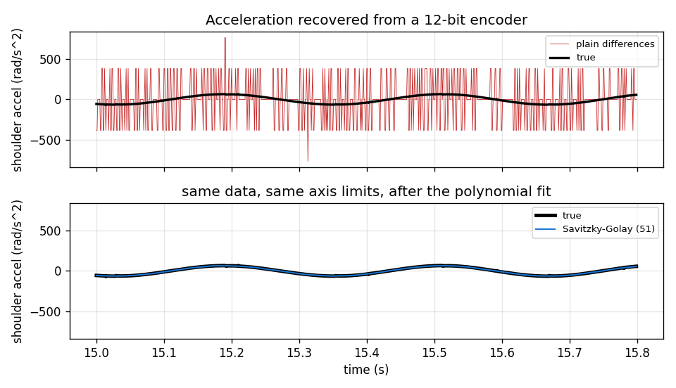
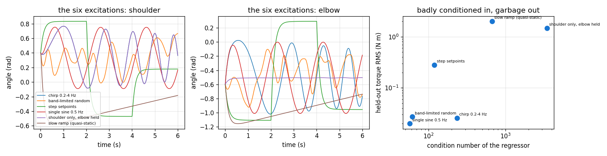
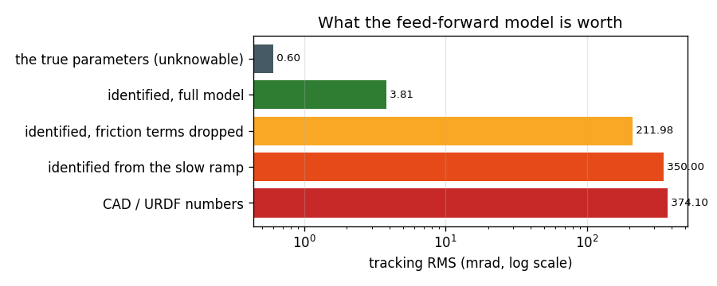

# System ID on a Real Arm

## Key Insight

[System identification](/shared/glossary/#system-identification) bridges the gap between theoretical models and real hardware by fitting physical parameter values—such as joint friction, [link masses](/shared/glossary/#link-mass), and motor torque constants—from experimental trajectories. By exciting the arm's joints with custom trajectories like [chirp signals](/shared/glossary/#chirp), we gather input-output data to optimize these parameter estimates. This prevents control issues like [overshoot](/shared/glossary/#step-response) or [steady-state error](/shared/glossary/#step-response) that occur when running [impedance control](/shared/glossary/#impedance-control) on inaccurate default values.

**This is project 63.** Project 62 cleaned up the file; the real machine still does not match it. Here we drive a 2-link arm, measure it through a 12-bit encoder, and fit its dynamics. The payoff is blunt: [computed-torque](/shared/glossary/#computed-torque-control) tracking goes from **374 mrad** with CAD numbers to **3.81 mrad** with measured ones — **98x**. The warning is just as blunt: the two most sensible-looking excitations, "move slowly and safely" and "one joint at a time", both produce parameter errors **above 85 %**.

---

## Files

| file | what it is |
|---|---|
| `dyn.py` | the arm, its true (secret) parameters, the simulator, and the regressor |
| `verify_mujoco.py` | checks the hand-written dynamics and regressor against MuJoCo |
| `run.py` | the five experiments |
| `outputs/` | figures and `results.csv` |

```bash
python3 verify_mujoco.py   # max torque disagreement 3.6e-15 N m
python3 run.py             # about 25 seconds; needs numpy, matplotlib
```

---

## The setup, and two design choices

A 2-link arm standing in a **vertical** plane. Link lengths are known exactly
(a ruler works). Everything else — masses, where the mass sits, inertias, rotor
inertia, damping, friction — is unknown and must be measured.

**Why vertical, when Phase 8's arm lay flat?** Project 54 put its arm flat on a
table specifically so gravity would not drown out inertia and damping. Here we
want the opposite. Gravity is the term that makes *mass* visible: hold the arm
out sideways and the torque you need is directly proportional to mass times
lever arm. Take gravity away and mass only reveals itself during hard
acceleration — so a slow, safe excitation would tell you nothing at all. Same
robot, opposite design choice, because the two projects are asking different
questions.

**Why a hand-written model when project 62 just built a MuJoCo model?** Because
system ID needs one specific thing MuJoCo does not hand you: the **regressor**.

---

## The one idea: torque is linear in the parameters

Robot dynamics look hopelessly nonlinear — sines, cosines, velocity-squared
terms. But look at where the *unknowns* sit:

```
tau  =  Y(q, qdot, qddot)  @  theta
        \_______________/     \___/
         all the messy         the ten unknown
         trigonometry,          numbers, appearing
         built from data        exactly once each
         you measured
```

Every nonlinearity involves quantities you **measured**; every unknown enters
**linearly**. So identification is not an optimisation problem at all — it is
`numpy.linalg.lstsq` on a tall skinny matrix. Each column of `Y` is "the torque
you would get if this one parameter were 1 and the others were 0".

The word **regressor** comes from statistics: in "regress y on x", the x's are
the regressors, the knowns you explain y with. Here the knowns are those
trigonometric combinations of measured motion.

### The ten numbers, and why they are not the twelve you can point at

You can point at twelve things on this robot: `m1, lc1, I1, m2, lc2, I2` (mass,
centre-of-mass distance, inertia, for each link), two rotor inertias `Ia1, Ia2`,
two damping coefficients, two friction coefficients.

Torque only ever depends on ten combinations of them:

| symbol | combination | plain meaning |
|---|---|---|
| θ1 | `I1 + m1·lc1² + m2·L1² + Ia1` | how hard the whole arm is to swing about the shoulder |
| θ2 | `m2·L1·lc2` | how much the elbow angle changes that |
| θ3 | `I2 + m2·lc2²` | how hard the forearm is to swing about the elbow |
| Ia2 | `Ia2` | the elbow rotor |
| θ4 | `m1·lc1 + m2·L1` | how hard gravity pulls on the shoulder |
| θ5 | `m2·lc2` | how hard gravity pulls on the elbow |
| d1, d2 | viscous damping | torque proportional to speed |
| f1, f2 | Coulomb friction | constant torque opposing motion |

These are the **base parameters**: "base" as in *basis*, the smallest set that
spans everything torque can express. Section 4 shows what happens when you
ignore the distinction.

`verify_mujoco.py` checks the regressor against MuJoCo's own inverse dynamics
at 300 random states: worst disagreement **3.6e-15 N·m**. That matters — every
number below is a fit, and a fit against a wrong model is confidently wrong.

---

## 1. What a real encoder does to you

The regressor needs `q`, `qdot` and `qddot`. A robot gives you `q` — quantised
by a 12-bit encoder (4096 counts per revolution, 1.53 mrad per count). The
other two you must manufacture by differentiating.



| measurement chain | acceleration noise | parameter error | held-out torque RMS |
|---|---|---|---|
| true qdot/qddot (impossible) | 0 | 0.0 % | 0.0000 N·m |
| encoder + plain differences | **273 rad/s²** | **56.6 %** | 1.5026 N·m |
| encoder + Savitzky-Golay | 1.5 rad/s² | 3.5 % | 0.0344 N·m |
| + low-pass both sides | 1.5 rad/s² | **1.2 %** | **0.0257 N·m** |

**Differentiation amplifies noise; doing it twice amplifies it twice.** One
encoder count of 1.53 mrad, divided by a millisecond twice, is
`0.00153 / 0.001²` ≈ **1500 rad/s²** of pure fiction. The true accelerations
here peak around 60 rad/s². The signal is buried a factor of 25 below the
noise, and least squares dutifully fits the noise: 56.6 % parameter error.

**Savitzky-Golay** fixes it. Instead of subtracting neighbouring samples, slide
a window of 51 points along the signal, fit a cubic polynomial to them by least
squares, and differentiate *the polynomial*. Polynomials are smooth by
construction, so their derivatives are quiet. (Named after Abraham Savitzky and
Marcel Golay, who published it in 1964 for smoothing chemistry spectrometer
traces — the same problem in a different field.) Noise drops 180x.

> **"You already smoothed the data — why low-pass it again afterwards?"** The
> two steps do different jobs. Savitzky-Golay makes the *derivative* usable; it
> cannot touch the noise on the torque measurement, which was never
> differentiated. The second filter runs the **same** moving average over both
> sides of `Y @ theta = tau`. That is legal precisely because the equation is
> linear: averaging both sides of a linear equation gives an equally true
> equation, with the noise on both sides averaged down. It is one extra line
> and it cuts the parameter error from 3.5 % to 1.2 %.

---

## 2. Excitation design: what you wiggle decides what you can learn



Six ways to move the arm for 20 seconds, each put through the full realistic
measurement chain above.

| excitation | condition number | parameter error | held-out RMS |
|---|---|---|---|
| chirp 0.2–4 Hz | 234 | **1.2 %** | 0.0257 |
| single sine 0.5 Hz | **57** | 2.1 % | **0.0200** |
| band-limited random | 61 | 3.6 % | 0.0272 |
| step setpoints | 118 | 27.7 % | 0.2812 |
| shoulder only, elbow held | 3482 | **87.5 %** | 1.4636 |
| slow ramp (quasi-static) | 670 | **106.0 %** | 1.9983 |

**The two safe-looking choices are the two disasters.**

*Slow ramp* is what everyone tries first: creep through the workspace so
nothing can go wrong. Nothing accelerates either — so the `qddot` columns of
the regressor are all near zero, and the inertia parameters are multiplied by
nothing. Least squares is then asked to determine a number whose contribution
to the data is invisible, and returns whatever makes the noise fit best. 106 %
error means the estimates are, on average, as wrong as simply guessing zero.

*One joint at a time* is the other instinct: isolate the variable, like a
school physics experiment. But the elbow's own inertia and its rotor never
accelerate, and the θ2 coupling term (`m2·L1·lc2`) only appears when **both**
joints move. Holding one joint still does not isolate a parameter; it deletes
one.

The condition number tells you this before you fit anything. The **condition
number** of a matrix is the ratio of its largest to its smallest singular
value: how much a small wobble in the data can be magnified in the answer. 3482
means a 0.1 % measurement error can become a 350 % parameter error. That is the
practical face of **persistent excitation** — the requirement that your motion
keep exciting every direction of the parameter space, not just some of them.

Two honest caveats the table also shows:

- **The condition number separates the disasters from the workable ones, but
  does not rank the workable ones.** Among the four usable excitations, the
  chirp has the *worst* conditioning (234) and the *best* parameters (1.2 %).
- **Parameter accuracy and prediction accuracy are not the same goal.** The
  single sine got the parameters slightly less right (2.1 % vs 1.2 %) yet
  predicted the held-out trajectory slightly better (0.0200 vs 0.0257). It saw
  0.5 Hz motion and the validation trajectory is mostly slow, so its errors sit
  where they do not matter. If you want a model that works everywhere, sweep.

---

## 3. Which terms are worth having

Fit the same chirp data with pieces of the model removed.

| model | parameters | training RMS | held-out RMS |
|---|---|---|---|
| full | 10 | 0.0776 | **0.0257** |
| no rotor inertia | 9 | 0.1026 | 0.0321 |
| no Coulomb friction | 8 | 0.1802 | 0.1963 |
| no friction at all | 6 | 0.8740 | 0.7378 |
| rigid-body only (no gravity) | 4 | 3.5568 | 3.4882 |
| gravity + friction only (no inertia) | 6 | 4.9688 | 1.5247 |

**Coulomb friction is worth 7.6x**, dropping the held-out error from 0.196 to
0.026 N·m for two extra numbers. *Coulomb* friction — named after
Charles-Augustin de Coulomb, who measured it in the 1780s, the same Coulomb as
the unit of charge — is the constant drag that opposes motion regardless of
speed: `f · sign(qdot)`. Gearboxes are full of it. It is the term textbooks
leave out because it is not smooth, and the term that dominates every real arm
at low speed, where the velocity-proportional term has almost nothing to
contribute.

**The rotor inertia is nearly invisible here** (0.0321 vs 0.0257). Project 62
argued armature matters, and it does — for [simulation stability](../62-urdf-mjcf-migration/README.md).
For *predicting torque* on this arm its effect is only 25 % above the
measurement noise floor. The rule this illustrates: **a term is worth adding
when its contribution exceeds your noise floor, and not before.** Adding
parameters below the noise floor buys a slightly better training fit and a
worse model.

Note the last row: dropping inertia gives a *higher* training error (4.97) than
dropping gravity (3.56), yet a *lower* held-out error (1.52 vs 3.49). The two
trajectories stress different terms. This is why the held-out column exists.

---

## 4. The fit is perfect and the masses are still wrong

This is the result that surprises people.

| parameterisation | columns | rank | condition number |
|---|---|---|---|
| 10 base parameters | 10 | **10** | 219 |
| 12 physical parameters | 12 | **9** | **1.7e19** |

Fit the ten base parameters on perfect data and every one is exact to five
decimal places. Fit the twelve physical parameters — the ones you can point at
on the robot — on **the same data**, and:

| parameter | true | fitted |
|---|---|---|
| m1 | 1.200 kg | **0.044 kg** |
| lc1 | 0.160 m | 0.330 m |
| I1 | 0.0120 | **−0.0034** |
| m2 | 0.800 kg | **0.098 kg** |
| Ia1 | 0.0150 | −0.0034 |
| d1, d2, f1, f2 | — | all exact |

`m1` is wrong by a factor of 27. `I1` is **negative**, which is physically
impossible. And the residuals:

```
base parameterisation      : 4.3e-15 N m
physical parameterisation  : 2.3e-12 N m
```

**Both models predict the torque perfectly.** The data does not disagree with
the nonsense answer, because the nonsense answer produces exactly the same
torques.

The mechanism is in the rank: 12 columns, rank 9. Three combinations of
physical parameters produce **zero torque at every state**, so the data can say
nothing about them at all. `I1`, `m1·lc1²` and `Ia1` only ever appear added
together, in θ1. Shifting mass from one to another and back leaves every
prediction untouched. This is **structural** unidentifiability: no experiment,
no amount of data, no better sensor will fix it, because the information was
never in the torque to begin with.

> **"So the identification failed?"** No — and this is the distinction worth
> keeping. It gave you everything the robot can tell you. **What is
> unidentifiable is also what does not matter**, at least for anything that
> depends on torque: control, simulation, planning. You cannot learn `m1`
> because nothing you do with the arm depends on `m1` alone. If you genuinely
> need `m1` — to check a payload limit, say — weigh the link.
>
> The practical rule: **fit the base parameters, and never let a solver hand
> you individual masses from torque data.** A solver that returns a negative
> inertia has not warned you; it has quietly answered a question you should not
> have asked. Enforcing "mass > 0" as a constraint would hide the symptom while
> leaving the answer just as arbitrary.

The condition number `1.7e19` is the same fact in one number. Double-precision
arithmetic carries about 16 digits, so a condition number of 1e19 means the
answer is entirely rounding error.

---

## 5. The payoff



Track a moving reference with a computed-torque controller: the model predicts
the torque the desired motion needs, and a deliberately weak PD mops up what is
left. Weak gains are the point — **the tracking error becomes a direct readout
of model quality** rather than a readout of how hard the feedback loop is
straining.

| feed-forward model | tracking RMS |
|---|---|
| CAD / URDF numbers | 374.10 mrad |
| identified from the slow ramp | 350.00 mrad |
| identified, friction terms dropped | 211.98 mrad |
| **identified, full model** | **3.81 mrad** |
| the true parameters (unknowable) | 0.60 mrad |

**98x better than the CAD numbers**, from 20 seconds of wiggling.

And two rows that keep it honest. **Identifying from the slow ramp bought
almost nothing** (350 vs 374): a badly excited identification is not a partial
success, it is a rounding error away from not having done it. **The full
identified model is still 6.4x worse than the truth** (3.81 vs 0.60) — that gap
is the 1.2 % parameter error left by the encoder, and no amount of cleverness
in the fit removes it. To close it you need a better sensor, not a better
algorithm.

---

## How to run this on hardware

The parts that change:

1. **Torque.** This project assumes you measure the applied torque. Most arms
   give you motor *current*; torque is current times a torque constant times
   the gear ratio, and the torque constant drifts with temperature. Either
   calibrate it separately (hang known weights) or add it as one more parameter
   — it multiplies the whole left-hand side, so it is identifiable only up to
   overall scale unless gravity pins it down. Gravity does pin it down here,
   which is one more reason the arm is vertical.
2. **Joint limits.** Clip every reference against the real limits, and ramp the
   chirp amplitude up from zero over the first two seconds. A chirp that starts
   at full amplitude is a step input.
3. **Temperature.** Run the arm for ten minutes first. Friction on a cold
   gearbox can be double its warm value, and you will identify the average of
   two different robots.
4. **Repeat it.** Fit two datasets collected an hour apart. If θ4 (the gravity
   term) moves by more than a percent, something mechanical changed and the
   number to chase is not in the solver.

---

## What to remember

- **Torque is linear in the parameters.** Identification is `lstsq`, not
  optimisation — once you write the regressor.
- **Differentiating a 12-bit encoder twice gives 273 rad/s² of noise** against a
  60 rad/s² signal. Savitzky-Golay cut it 180x; low-passing both sides of the
  equation took the parameter error from 3.5 % to 1.2 %.
- **The two most sensible-looking excitations were the two worst.** Slow and
  safe: 106 % error. One joint at a time: 87.5 %. Both look responsible and
  both delete the columns you need.
- **Check the condition number before you fit.** It separated the disasters
  from the workable designs — though it did not rank the workable ones, where
  the worst-conditioned excitation gave the best parameters.
- **Coulomb friction is worth 7.6x** on held-out prediction. Rotor inertia was
  within noise. Add a term when it beats your noise floor.
- **The fit can be perfect while the masses are nonsense.** Rank 9 out of 12
  columns, `m1` wrong by 27x, `I1` negative, residual 2e-12. Fit base
  parameters; weigh the link if you need the mass.
- **374 mrad → 3.81 mrad.** That is what twenty seconds of chirp is worth, and
  a badly chosen twenty seconds is worth 24 mrad of it.

Project 62 fixed the file; this project fixed the numbers. Project 64 asks a
question neither one can: by the time your beautiful model produces a command,
**how old is the measurement it was computed from?**
