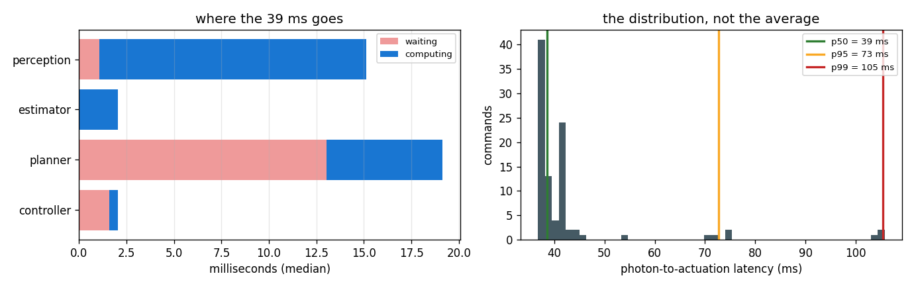
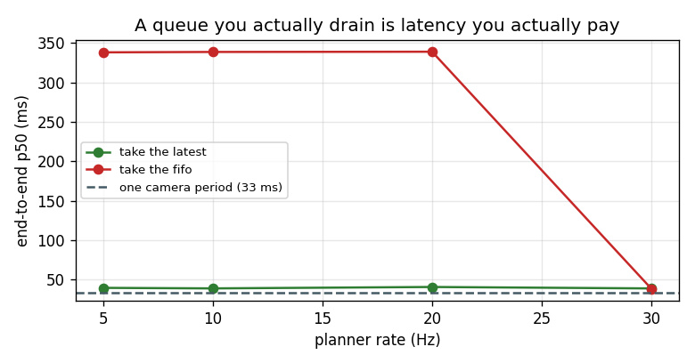
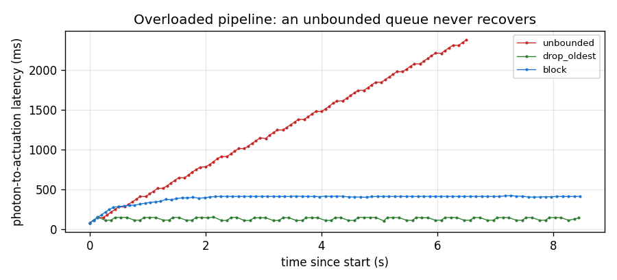
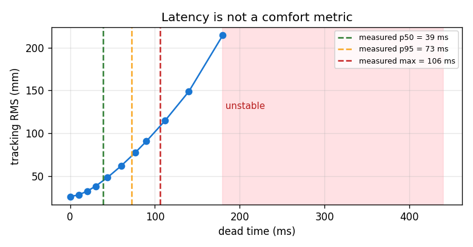

# Latency Budget Instrument

## Key Insight

Robot control loops are only as fast as their slowest link. A **latency budget** is an accounting of every millisecond between a photon hitting the camera sensor and the motor current changing because of it: exposure, transfer, perception, estimation, planning, control, and the bus write. Measuring that end to end — and reporting it as [percentiles](/shared/glossary/#percentile) rather than an average — is what turns "the robot feels laggy" into a number you can attack. The tail matters more than the middle: a loop that is fast 95 % of the time and 5x slower for the rest behaves like the slow one.

**This is project 64.** It builds a real five-thread pipeline with real queues and real CPU work, and instruments it end to end. The measured stack runs at **38.6 ms** photon-to-actuation — but if every node had reported its own processing time and you had added those up, you would have said **22.6 ms**. Nearly half the latency is data sitting still, and no amount of optimising your code removes it.

---

## Files

| file | what it is |
|---|---|
| `pipeline.py` | the five stages, the message, the three queue policies, calibrated CPU work |
| `run.py` | the five experiments |
| `outputs/` | figures and `results.csv` |

```bash
python3 run.py    # about 2 minutes, most of it spent deliberately waiting in real time
```

---

## The stack under test

```
camera 30 Hz ──▶ perception ──▶ estimator ──▶ planner 10 Hz ──▶ controller 200 Hz ──▶ motor
   1 ms            14 ms          2 ms          6 ms              0.4 ms
   |                                                                 |
   └────────────── t_capture travels inside the message ─────────────┘
```

Five threads, four queues. The work in each stage is real matrix
multiplication sized to hit its target, not `sleep`. That matters: `sleep`
gives the CPU back to everyone else, and a busy stage does not. numpy's matmul
releases Python's [global interpreter lock](/shared/glossary/#gil-global-interpreter-lock),
so two stages genuinely run at the same time on two cores — a pure-Python spin
loop would not, and every number here would be about the interpreter instead of
about the pipeline.

### The one instrumentation idea

**The capture timestamp rides inside the message.** The camera stamps
`t_capture` the instant the shutter closes; every stage copies it forward
untouched; the controller subtracts it from "now".

> **"Each node already logs how long it took. Why carry a timestamp too?"**
> Because those two quantities measure different things, and only one of them
> is what the robot experiences. A node's self-reported duration covers the
> time it was *running*. It cannot see the time the message spent sitting in a
> queue before that node picked it up, or waiting for the next tick of a
> periodic node's clock. Those gaps belong to no node, so no node reports them —
> and in this pipeline they are **41 %** of the total. A carried timestamp is
> the only thing that measures the gaps, because it is the only thing that was
> present during them.

One practical note: use a **monotonic** clock (`time.perf_counter`), not the
wall clock. Wall clocks are corrected by NTP and can jump backwards, which
produces negative latencies in your logs at 3 a.m. and a very confusing morning.

---

## 1. The budget



| stage | waiting (p50) | computing (p50) | computing (p95) | total |
|---|---|---|---|---|
| perception | 1.08 ms | 14.02 ms | 16.28 ms | 15.11 ms |
| estimator | 0.05 ms | 2.02 ms | 2.05 ms | 2.07 ms |
| planner | **13.04 ms** | 6.08 ms | 8.40 ms | 19.12 ms |
| controller | 1.62 ms | 0.43 ms | 0.46 ms | 2.05 ms |
| **total** | **15.79 ms** | **22.56 ms** | | **38.34 ms** |

End-to-end: **p5 37.2 / p50 38.6 / p95 72.7 / max 105.8 ms.**

- **58 % computing, 41 % waiting.** Halving *all* your compute would take
  38.6 ms to 27.3 ms, not to 19.3 ms. The waiting is a property of the
  architecture, not the code.
- **The planner is the worst stage and it is not the slowest one.** Perception
  computes for 14 ms and the planner for 6, yet the planner contributes 19 ms
  against perception's 15 — because it is *periodic*. A stage that wakes on its
  own 100 ms clock and takes whatever has arrived makes data wait, on average,
  half a producer period. That 13 ms is not slow code. It is a clock boundary.
- **This is why you profile the pipeline, not the functions.** A profiler
  pointed at perception says "14 ms, mostly convolution" and is completely
  right and completely useless: the 13 ms next door is invisible to it.

---

## 2. A slow planner: take the newest, or take the next?



Feed a 30 Hz camera into a planner that runs slower, with a queue that holds
10. Two ways to write the planner's read:

```python
m = q.get()                       # "fifo": take the next one in line
while q.has_more(): m = q.get()   # "latest": throw away everything but the newest
```

| planner rate | take the **newest** | take the **next in line** |
|---|---|---|
| 5 Hz | 39.4 ms | **338.1 ms** |
| 10 Hz | 38.7 ms | **338.6 ms** |
| 20 Hz | 40.5 ms | **338.9 ms** |
| 30 Hz | 38.7 ms | 38.0 ms |

**8.7x, from one line of code.** And notice the shape: the FIFO number does not
depend on the planner rate at all until 30 Hz, where it collapses to match. The
reason is that a full queue of 10 frames at 30 Hz *is* 333 ms of stored delay,
and the planner is always reading from the bottom of it. Running at 5 Hz or at
20 Hz, the queue is equally full and the data is equally old. At 30 Hz the
planner finally keeps up, the queue empties, and the two policies become the
same thing.

**The queue depth is the latency.** A ten-deep queue in front of a 30 Hz source
is a decision to be a third of a second late, whatever else you optimise.

> **"Then why not always take the newest?"** Because the two policies answer
> different requirements. Dropping frames is right when your data is a
> *measurement of now* — an image, a lidar scan, a joint position. Nobody wants
> a plan computed from where the object was a third of a second ago. It is wrong
> when each message is a *piece of work that must happen*: a command, a
> waypoint, a log entry, a transaction. Skipping one of those is not staleness,
> it is a lost instruction. The bug most teams ship is using the queue they
> reached for first (FIFO, the default everywhere) on data of the first kind.

---

## 3. What to do when a stage cannot keep up

Now overload it: perception needs 45 ms per frame and frames arrive every 33 ms.
The pipeline is structurally incapable of processing everything. Nine seconds:



| policy | p50 | p95 | latency growth | frames captured | delivered | dropped |
|---|---|---|---|---|---|---|
| unbounded queue | **1243.7 ms** | 2263.7 ms | **+353 ms/s** | 270 | 89 | 0 |
| drop oldest (depth 2) | **140.2 ms** | 145.5 ms | +0.5 ms/s | 270 | 86 | 88 |
| block the producer | 408.1 ms | 412.2 ms | +17 ms/s | **186** | 89 | 0 |

**The unbounded queue is the default in almost every framework and it is the
worst of the three.** It loses nothing and it is unusable: latency climbs by a
third of a second per second, without limit, forever. After nine seconds the
robot is acting on 2.3-second-old information. It never recovers, because there
is no mechanism by which it could — the arrival rate simply exceeds the service
rate and the difference accumulates. This is the same failure as **bufferbloat**
in networking, where oversized router buffers turn packet loss into unbounded
delay; the fix there was also to make the buffer small on purpose.

Notice what the "delivered" column says: **all three delivered about the same
number of commands (89, 86, 89).** The queue policy did not change how much work
got done — it was never going to, that is set by how fast perception runs. All
it changed was **how stale the delivered work was.** Nine times more stale, in
the default configuration, for free.

**Drop-oldest is the right answer for sensor data**: latency flat at 140 ms,
and the cost is stated honestly in a number you can look at (88 frames
dropped). A dropped frame you can count is infinitely better than a delay you
cannot see.

**Blocking is the interesting third option.** Nothing is dropped and latency
stays bounded — but look at the frames-captured column: **186 instead of 270**.
Back-pressure travelled all the way up the pipeline and stalled the camera. That
is sometimes exactly right (a logger that must not lose records) and sometimes a
disaster (a camera thread that also drives your exposure control). What it is
never is *free*, and the cost shows up in a place nobody thinks to look.

---

## 4. The tail

| configuration | p50 | p95 | p99 | max |
|---|---|---|---|---|
| as built (1 slow frame in 40) | 42.2 | 75.4 | **108.9** | 110.8 |
| no slow frames | 41.2 | 45.5 | **48.1** | 48.6 |
| no slow frames, 12 Hz camera | 77.0 | 110.3 | 110.6 | 114.8 |

Add a hiccup — one frame in forty takes 5x as long, which is what a garbage
collection pause, a page fault, or an unlucky cache miss looks like from
outside:

**The median moves by 1 ms. The p99 more than doubles.** If you report the mean
or the median, you will report that the hiccup does not exist. Your robot,
which meets that hiccup a few times a minute forever, disagrees.

A **percentile** is just "sort the samples, take the one *p* percent of the way
along". p99 = 108.9 ms means one command in a hundred was that late or later. At
30 frames per second that is about once every three seconds. And the third row
is the reminder that the tail is not always a hiccup: a slower camera moves
*everything*, p50 included, because the sampling period sets the floor.

**Report p50, p95, p99 and max. Alert on p99.** The mean is a number with no
physical meaning here — no individual command experienced it.

---

## 5. What the latency actually costs



Take the measured numbers to a controller: a second-order plant chasing a
moving target, seeing its measurements through a pure delay.

**Dead time** is the control engineer's name for that delay — an interval in
which nothing whatsoever can be done. The measurement exists, the actuator
exists, and the loop is simply blind. Feedback cannot correct an error it has
not heard about, so as dead time grows, the loop's usable gain falls: push the
gain up and the correction, arriving late, is now pushing in the wrong
direction.

| dead time | tracking RMS |
|---|---|
| 0 ms | 26.3 mm |
| **38.6 ms** (our p50) | **44.0 mm** |
| **72.7 ms** (our p95) | **73.0 mm** |
| **105.8 ms** (our max) | **107.0 mm** |
| 180 ms | 214.4 mm |
| 230 ms | **unstable** |

Two things a beginner should take from this shape.

**It is not linear and it does not saturate — it ends.** Somewhere between 180
and 230 ms this loop stops tracking badly and starts oscillating divergently.
There is no gentle degradation past that point; there is a cliff. "We are a bit
laggy" and "the robot is shaking itself apart" are the same axis.

**The tail is the number that matters.** Our p95 costs 73 mm against the p50's
44 mm — 1.7x. A robot that meets its p95 a few times a second is a robot whose
*typical worst* error is nearly double what your median-based budget promised.
This is why the first thing to do with a latency measurement is sort it.

---

## Doing this on a real stack

The instrumentation idea is the same; the plumbing changes.

- **ROS 2**: every message has a `header.stamp`. Fill it at capture — in the
  *driver*, from the camera's own hardware timestamp if it has one — and copy
  it into every derived message. The `message_filters` package exists to keep
  stamps aligned across topics.
- **The clock**: on Linux, `CLOCK_MONOTONIC`. If your camera timestamps come
  from its own crystal, you need to align that clock to the host's once
  (PTP, or a linear fit of the offset) or your "latency" will slowly drift.
- **What this project leaves out**: sensor exposure time (the photon arrives
  somewhere *inside* the exposure window, so there is an irreducible
  half-exposure of uncertainty), USB/Ethernet transfer, driver buffering, and
  the actuator's own current loop. All of these live *outside* your process and
  none of them appear in any profiler. Measure them by closing the loop
  physically: flash an LED, have the robot react, and film both with a
  high-speed camera. That number is always larger than your software says.

---

## What to remember

- **Carry the capture timestamp in the message.** It is the only way to see the
  time that belongs to no node — 41 % of the total here.
- **Summing self-reported node durations gave 22.6 ms for a 38.6 ms pipeline.**
  Profile the pipeline, not the functions.
- **Periodic stages cost half a producer period.** The planner computed for 6 ms
  and contributed 19; it was not slow, it was on its own clock.
- **`while q.has_more(): m = q.get()` was worth 8.7x** (338 ms to 39 ms). The
  queue depth *is* the latency for sensor data.
- **The default unbounded queue was the worst of three options**: +353 ms/s
  forever, while delivering the same amount of work as the bounded one. Bound
  every queue and choose what happens when it fills.
- **Back-pressure is not free** — blocking stalled the camera from 270 frames
  to 186, which shows up nowhere near the queue.
- **A 1-in-40 hiccup moved the median by 1 ms and doubled p99.** Alert on p99.
- **Latency ends in a cliff.** 180 ms tracked badly, 230 ms was unstable.

Projects 62 and 63 made the model right; this one measured what the *system*
does to it. Project 65 takes the next step: what happens when one of these
stages fails, and how a node makes its own failure something the rest of the
system can see and act on.
