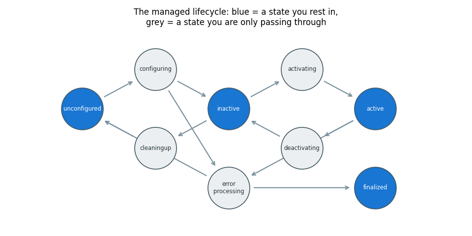
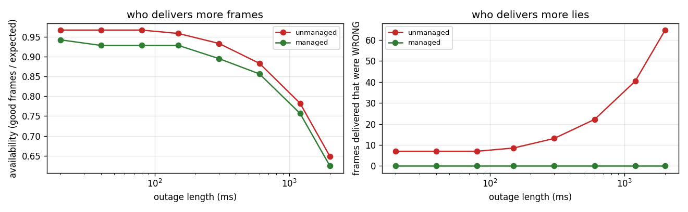
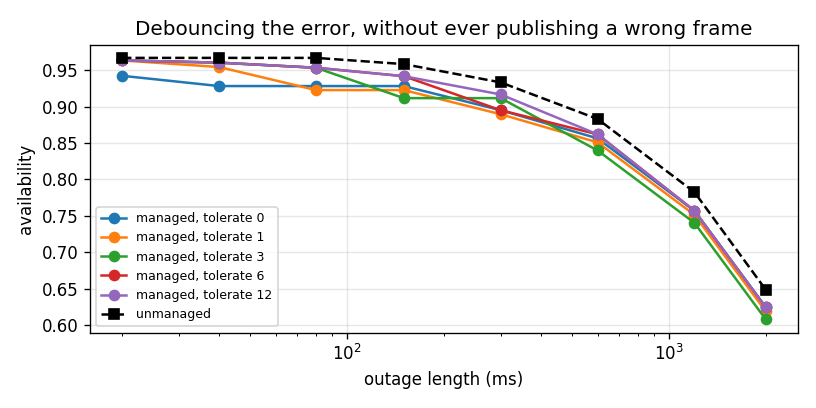

# ROS 2 Lifecycle Node

## Key Insight

A [lifecycle node](/shared/glossary/#lifecycle-node) in [ROS 2](/shared/glossary/#ros--ros-2) is a node whose startup and shutdown are *managed* by somebody else: it moves through `unconfigured → inactive → active → finalized` only when told to, and it publishes nothing until it is active. That single rule turns "the robot did something strange for two seconds after boot" into an impossible state, because a node that is not ready is a node that is silent. It also gives a supervisor somewhere to stand: it can bring a whole system up in a defined order, and it can put a failed sensor node back through `cleanup → configure → activate` without restarting the process.

**This is project 65.** It implements the state machine from scratch and puts it against the node everybody writes first. The managed node published **zero** wrong frames in every experiment; the unmanaged one delivered **24.7 %** of a four-sensor system's fused outputs silently wrong during bring-up, and took **179 ms** to be noticed when the camera was unplugged against the managed node's **13 ms**. The honest cost: on a 20 ms glitch, the managed node's strict error handling *lost* availability (0.942 vs 0.967) — and section 5 is about the knob that fixes it.

---

## Files

| file | what it is |
|---|---|
| `lifecycle.py` | the state machine, the camera, the two node implementations, the supervisor |
| `run.py` | the five experiments |
| `outputs/` | figures and `results.csv` |

```bash
python3 run.py    # about 5 seconds; needs numpy, matplotlib
```

`rclpy` is not installed here, so the state machine is written out rather than
imported. That is not a workaround — it is the point. The lifecycle is *a
protocol*, about thirty lines of it, and once you have written those thirty
lines the rclpy API stops being magic. The mapping is at the end.

---

## The problem, stated without ROS

You have a camera node. It must:

- load a calibration file that takes 200 ms;
- publish frames at 30 Hz;
- survive the camera being unplugged and plugged back in;
- and let a supervisor somewhere know whether it is healthy.

Here is the node everybody writes, and there is nothing stupid in it:

```python
class UnmanagedPerception:
    def __init__(self, cam):
        self.cam = cam
        self.cam.open()                    # open the device up front
        start_background_calibration_load()  # slow, so do it in the background

    def tick(self):
        try:
            frame = self.cam.read()
        except IOError:
            schedule_retry()
            frame = self.last_frame        # "better than nothing"
        publish(frame)
```

Every line is the obvious line. The publisher is created up front, because that
is where publishers go. The slow load happens in the background, because
blocking the constructor is rude. A read failure is retried, because retrying is
right. **The problems are all emergent**, and each one is invisible from inside
this file.

---

## The state machine



Four **primary states** (blue) — places the node rests — and six **transition
states** (grey) — places it is only passing through while a callback runs.

| state | what it means physically |
|---|---|
| `unconfigured` | the process exists; no device is open, no memory allocated |
| `inactive` | fully configured and ready — **and deliberately not publishing** |
| `active` | doing its job |
| `finalized` | shut down; the only exit is destroying the node |

The transitions you can request are `configure`, `cleanup`, `activate`,
`deactivate`, `shutdown`. Each runs one of your callbacks, which returns
`SUCCESS`, `FAILURE` or `ERROR`, and the return value decides where you land.
That three-way return is more useful than it looks:

- **`FAILURE`** — "I could not do it, and nothing is broken." A configure that
  cannot find the camera because it is not plugged in yet: back to
  `unconfigured`, try again later.
- **`ERROR`** — "something is wrong that I did not anticipate." Straight to
  `errorprocessing`, whose job is to get the node back to a clean
  `unconfigured` — and if even *that* fails, to `finalized`, which is the node
  admitting it cannot be trusted rather than limping on.

### Why `inactive` exists at all

> **"If the node is configured and ready, why is there a state where it
> deliberately does nothing?"** Because *ready* and *should be running* are two
> different facts, and only the node knows the first while only the system
> knows the second. Splitting them buys three things you cannot otherwise have:
>
> 1. **Two-phase bring-up.** Configure everybody, wait until *all* of them
>    report `inactive`, then activate everybody. Now no node is producing data
>    while another is still loading. Experiment 4 measures what that is worth.
> 2. **Pausing without destroying.** `deactivate` stops the output and keeps the
>    open device, the allocated buffers, the loaded model. Going back to
>    `active` is 30 ms; going back through `unconfigured` is 200 ms.
> 3. **A place to fail into.** A node that hits an error can drop to
>    `unconfigured` and be rebuilt by the supervisor, in-process, with no
>    restart and no lost subscriptions elsewhere.

---

## 1. Cold start

Both nodes are alive from t = 0. The calibration file takes 200 ms.

| node | good | uncalibrated | stale |
|---|---|---|---|
| unmanaged | 175 | **7** | 0 |
| managed | 175 | **0** | 0 |

Seven frames went out with the wrong calibration. They are not corrupt, not
empty, not flagged — they are *plausible images with wrong geometry*, and
whatever consumed them produced plausible wrong answers. The managed node
published nothing at all for those 200 ms, because it was in `configuring` and
a node that is not `active` cannot publish. There is no discipline to remember
and no flag to check: the protocol makes the bad state unreachable.

---

## 2. Unplug the camera



One disconnect, of varying length, averaged over every phase relative to the
33 ms frame clock.

| outage | unmanaged availability | its stale frames | managed availability | its wrong frames |
|---|---|---|---|---|
| 20 ms | **0.967** | 0 | 0.942 | **0** |
| 80 ms | **0.967** | 0 | 0.928 | **0** |
| 300 ms | 0.933 | 6.1 | 0.895 | **0** |
| 1200 ms | 0.783 | 33.4 | 0.757 | **0** |
| 2000 ms | 0.648 | 57.6 | 0.624 | **0** |

**The unmanaged node wins on availability at every single outage length.** That
is the honest headline and it should be uncomfortable. It wins because it keeps
publishing the last frame it saw, and 33 % of the frames it publishes during a
2-second outage are **lies** — a picture of where the object *was*, timestamped
now.

The managed node's availability is 2–4 points lower because it does the right
things in order: notice, tear down, reconfigure (200 ms), reactivate. It pays
for its correctness in latency, every time.

**These two columns are not the same units.** "Availability" counts messages;
"stale frames" counts wrong answers acted upon. A control loop fed 58 stale
frames does not experience 0.648 availability — it experiences a target that
appears frozen and then teleports. If you rank these two nodes by the
availability column you will pick the one that lies.

---

## 3. How long before anybody knows

| node | time to detect the failure | ms spent believing the wrong thing |
|---|---|---|
| unmanaged | **179 ms** | 65 |
| managed | **13 ms** | 3 |

The unmanaged node is **never silent**, so the only signal available to a
supervisor is a timeout: "I have not seen a *fresh* frame for 100 ms". But the
supervisor cannot tell fresh from stale — that is a property of the *content* —
so it must infer failure from the absence of something it cannot detect. In
practice teams add a sequence number or compare timestamps, which is a
hand-rolled, per-topic version of what the lifecycle gives every node for free.

The managed node emits a state transition the instant it fails. **13 ms is the
detection delay of a message; 179 ms is the detection delay of a guess.** And
you cannot simply shorten the timeout: every millisecond you shave costs false
alarms on a slow frame.

---

## 4. Bringing up four nodes at once

Four sensor nodes feed one fuser. The fuser needs all four to be correct and it
cannot tell whether they are. Each node gets ready after an unpredictable
60–900 ms — a calibration file on a slow SD card, a device that enumerates
late, a network mount. 60 random bring-ups:

| node | good fused outputs | silently **WRONG** | absent | % wrong |
|---|---|---|---|---|
| unmanaged | 4110 | **1350** | 0 | **24.7 %** |
| managed | 4051 | **0** | 1409 | 0.0 % |

**A quarter of everything the unmanaged system produced during bring-up was
wrong, and looked exactly like the other three quarters.** The managed system
produced nothing for the same 1409 slots.

> **"Doesn't `ros2 launch` already handle startup ordering?"** It handles
> *process* ordering — which binary starts after which. That is a different
> thing from readiness. A process that has started may still be loading a
> 40 MB neural network, waiting for a USB device to enumerate, or blocked on an
> NFS mount. **Only the node knows when it is ready**, and before lifecycle
> states there was no standard way for it to say so. Teams substitute
> `sleep 5` in the launch file, which is a guess that is simultaneously too
> long on a fast machine and too short on a cold boot.

**Silence is a message.** "No fused output yet" is information a downstream
consumer can act on: wait, use dead reckoning, keep the brakes on. "A fused
output computed from an uncalibrated camera" is information it cannot act on
correctly, because nothing distinguishes it from a good one.

---

## 5. The knob: how twitchy should the node be?

Section 2's bad news deserves a fix rather than an excuse. The managed node
declared an error on the *first* failed read. That is one line of policy, not
part of the protocol:

```python
self.misses += 1
if self.misses > self.tolerate:      # tolerate = 0 was too strict
    go_to_error_processing()
```



Availability, managed node, by how many consecutive failed reads it rides out:

| outage | tol 0 | tol 1 | tol 3 | tol 6 | tol 12 | unmanaged |
|---|---|---|---|---|---|---|
| 20 ms | 0.942 | **0.961** | 0.961 | 0.961 | 0.961 | 0.967 |
| 40 ms | 0.928 | **0.961** | 0.961 | 0.961 | 0.961 | 0.967 |
| 80 ms | 0.928 | 0.923 | **0.950** | 0.950 | 0.950 | 0.967 |
| 150 ms | 0.928 | 0.923 | 0.912 | **0.942** | 0.942 | 0.958 |
| 300 ms | 0.895 | 0.890 | 0.912 | 0.895 | **0.917** | 0.933 |
| 2000 ms | 0.624 | 0.619 | 0.608 | 0.624 | 0.624 | 0.648 |

**Tolerating one missed read closes most of the blip gap** — 0.928 to 0.961 on
a 40 ms outage — and the managed node still publishes zero wrong frames,
because tolerating a miss means *staying quiet*, not *repeating yourself*.

The tolerance that helps depends on the outage you expect, and there is no
setting that wins everywhere: a big tolerance rides out blips and delays
recovery from real failures, and the two effects cross over. Note also that
past about 300 ms the tolerance stops mattering at all — once the outage
dominates, all the policy decides is who noticed first.

**The distinction worth carrying away: the lifecycle is the protocol; the
tolerance is the policy.** The protocol's job is to make "publishing wrong
data" unrepresentable. What counts as a failure, how long to wait, how often to
retry — those stay yours, and they are exactly the knobs the unmanaged node had
no place to put.

---

## Mapping this to real ROS 2

Every piece of `lifecycle.py` has a name in `rclpy` / `rclcpp`:

| here | in ROS 2 |
|---|---|
| `ManagedPerception` | `rclpy.lifecycle.LifecycleNode` |
| `_on_configure`, `_on_activate`, … | `on_configure`, `on_activate`, `on_deactivate`, `on_cleanup`, `on_shutdown`, `on_error` |
| returning `SUCCESS` / `FAILURE` / `ERROR` | `TransitionCallbackReturn.SUCCESS` / `FAILURE` / `ERROR` |
| `node.request("activate", t)` | the `~/change_state` service, or `ros2 lifecycle set <node> activate` |
| `node.events` | the `~/transition_event` topic |
| `node.state` | the `~/get_state` service, or `ros2 lifecycle get <node>` |
| `Supervisor` | your own manager node, or `nav2_lifecycle_manager` |
| "cannot publish unless ACTIVE" | `create_lifecycle_publisher` — a publisher that drops messages while inactive |

Two practical notes for real hardware:

- **`create_lifecycle_publisher` is the load-bearing one.** A plain publisher on
  a lifecycle node will happily publish from `inactive`, and then the protocol
  is decoration. This is the single most common way a lifecycle node is
  implemented and gains nothing.
- **Do the expensive work in `on_configure`, not the constructor.** Allocating
  buffers, opening devices, loading models in `__init__` means the node is
  already holding hardware before anybody has said it should — and `cleanup`
  cannot give it back.

---

## What to remember

- **A node that is not ready must be silent.** Not "flagged", not "best effort"
  — silent. Every experiment here reduces to that one rule.
- **The unmanaged node won on availability and lost on truth.** It delivered
  more messages at every outage length, and 33 % of them during a long outage
  were stale frames stamped with the current time.
- **24.7 % of a four-node system's fused outputs were silently wrong during
  bring-up.** `launch` orders process starts; only the node knows readiness.
- **13 ms versus 179 ms to detect a failure.** One is a message, the other is a
  guess made by timing out on something you cannot measure.
- **`inactive` is the state that earns its keep**: two-phase bring-up, pause
  without teardown, and somewhere to fail into.
- **Strict error handling cost availability on short glitches** (0.942 vs
  0.967), and one line of debounce got most of it back without ever publishing
  a wrong frame. The protocol is not the policy.

The nodes now announce their state. Project 66 records everything they say, so
that a failure at 3 a.m. can be replayed at 10 a.m.
