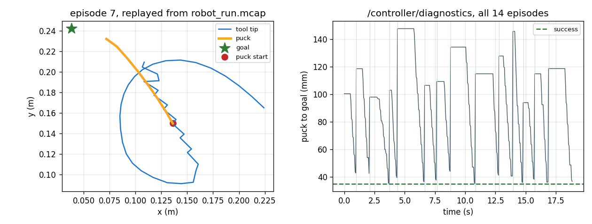

# MCAP Logging + Foxglove

## Key Insight

[MCAP](/shared/glossary/#mcap) is a self-describing, chunked, indexed container for robot logs: it stores the *schema* of every topic alongside the messages, so a file recorded today is still readable in five years by software that has never heard of your message types. Because it is indexed, a viewer can seek into the middle of a two-hour log without decoding the first hour. Recording everything and replaying it later is the single highest-return piece of infrastructure a robotics team builds — it turns "it did something weird once" into a file you can put a breakpoint in.

**This is project 66.** It writes MCAP from scratch to the published specification (the pip package is not installed here, and writing the format is how you find out what a log format is *for*), logs 19 seconds of a real push run, and reads it back. Then it prices the parts: the index read **5.8x fewer bytes** for the same messages, logging synchronously cost the 1 kHz control loop **0.093 ms** per iteration against a background writer's **0.009 ms** — and the experiment that matters most found that the *same format* gave **0 %, 29 % or 100 %** replayability depending only on what was put in it.

---

## Files

| file | what it is |
|---|---|
| `mcap_io.py` | an MCAP writer and reader, written to the spec |
| `run.py` | the five experiments |
| `outputs/robot_run.mcap` | a real 19-second, 6048-message log |
| `outputs/` | figures and `results.csv` |

```bash
python3 run.py    # about 15 seconds; needs numpy, matplotlib
```

---

## What the format actually is

The whole thing, minus the indexing machinery:

```
\x89MCAP0\r\n                       <- magic, so `file` can identify it
opcode (1 byte) | length (uint64) | content     <- repeat
...
\x89MCAP0\r\n                       <- magic again, at the end
```

Records you need: `Header`, `Schema`, `Channel`, `Message`, `Footer`. A
**Schema** says what a message type looks like (here, a JSON Schema document). A
**Channel** binds a topic name to a schema. A **Message** carries a channel id,
a sequence number, two timestamps, and opaque bytes.

Every field is **length-prefixed**, never null-terminated. That is what lets a
reader skip a field it does not understand without looking at its contents —
the property that makes a five-year-old log readable by software that has never
seen your message types.

### Why the schema goes in the file

> **"The message definition is already in my source tree. Why copy it into
> every log?"** Because the log outlives the source tree. Six months from now
> the field order will have changed, a unit will have moved from millimetres to
> metres, and the git commit that recorded this file will be one of four
> hundred. A log with the schema inside is **self-describing**: it carries its
> own definition, so decoding it needs nothing but the file. This is the same
> reason a Parquet file embeds its schema and a raw CSV does not — and the
> reason people can still read Parquet from 2015.
>
> MCAP goes further and repeats the schema and channel records **inside every
> chunk**. That looks like pure waste (it is 35 % of this file's size, together
> with the indexes). It is what makes a log survive being truncated: a robot
> whose battery dies mid-write leaves a file with no footer and no summary, and
> a reader that starts anywhere in the middle still learns what the messages
> mean. **The logs you most need to read are the ones that were not closed
> properly.**

---

## 1. The log

14 episodes of project 54's push task, logged live:

| topic | schema | rate | messages |
|---|---|---|---|
| `/joint_states` | `robot.JointState` | 200 Hz | 3780 |
| `/tf` | `foxglove.FrameTransform` | 2 × 20 Hz | 756 |
| `/tip`, `/puck`, `/goal` | `foxglove.PoseInFrame` | 20 Hz | 378 each |
| `/controller/diagnostics` | `robot.ControllerDiagnostic` | 20 Hz | 378 |

```
file       : robot_run.mcap (1242.0 kB)
duration   : 18.90 s   messages: 6048   chunks: 18
round trip : 6048 written, 6048 read back, all CRCs valid
```



**Both panels are drawn from the file, not from the arrays that produced it.**
That distinction is the whole point of a replay test: plotting the variables
you still have in memory proves nothing about the log.

`/tf` deserves a note. It logs each link as a transform *relative to its
parent* rather than an absolute position — the [TF tree](/shared/glossary/#tf-transform-tree)
idea from project 01. Storing relative transforms lets a viewer rebuild the
whole chain at any instant and attach anything it likes to any frame ("show me
the puck in the gripper's frame"), which absolute positions cannot do.

The schemas are Foxglove's well-known ones (`foxglove.PoseInFrame`,
`foxglove.FrameTransform`) where they exist, so the file opens in a 3D panel
with no configuration.

> **Honest scope note.** This writer was validated by round-tripping through
> its own reader and by CRC on every chunk. It has not been opened in Foxglove,
> because there is no network access in this environment — so treat "it will
> open in Foxglove" as a design intent that follows from the spec, not as a
> measurement this project made. The measurements below are all of the file
> itself.

---

## 2. Logging from inside a 1 kHz control loop

The guide's rule is "never log from the hot path synchronously". Here is the
number behind it. Each sample carries a 360-point laser scan, and we measure
**the time the logging statement itself took**, separately from the loop's
resulting period jitter — because the operating system's sleep is imperfect
too, and inferring the cost from the jitter would measure both at once.

| mode | in-loop p50 | in-loop p99 | in-loop max | period p99 |
|---|---|---|---|---|
| no logging | 0.0003 ms | 0.0010 ms | 0.016 ms | 1.977 ms |
| synchronous write | **0.0928 ms** | 0.1955 ms | **2.09 ms** | 3.295 ms |
| bounded queue + writer thread | **0.0086 ms** | 0.0451 ms | 2.87 ms | 2.875 ms |

**The background writer is 11x cheaper in the typical case** (0.009 vs 0.093 ms)
and it pulls the loop's period p99 back towards the no-logging baseline
(2.88 vs 1.98 ms, against 3.30 ms synchronous). At 1 kHz, 0.093 ms is
**9 % of your entire budget** spent on `json.dumps` and a `write`.

**And the worst case is no better: 2.87 ms versus 2.09 ms.** That
is worth understanding rather than hiding. In Python the writer thread and the
control thread contend for the
[global interpreter lock](/shared/glossary/#gil-global-interpreter-lock), so
occasionally the enqueue waits for the writer to release it. In C++ with a
lock-free queue the tail improves too; in Python you get the median and not the
tail. The general lesson survives the language: **moving work off the hot path
fixes the average immediately and the tail only if the hand-off is genuinely
non-blocking.**

The queue is **bounded** and drops when full. That is deliberate and it is the
same argument as project 64's queue policy: an unbounded log queue converts a
disk that is momentarily slow into unbounded memory growth, and a robot that
runs out of memory is worse than a robot with a gap in its log.

---

## 3. What the index buys

Reading a 10 % time window out of the 19-second log:

| method | messages | bytes read | time |
|---|---|---|---|
| chunk index | 600 | **202 914** | **8.65 ms** |
| full scan | 600 | 1 168 722 | 49.58 ms |

**5.8x fewer bytes, 5.7x faster, identical results.** The reader consults the
chunk index — a small table at the end of the file saying "chunk 7 covers
t=8.1 s to t=9.2 s and lives at byte 480 112" — and never touches chunks that
cannot contain the window.

The mechanism is worth spelling out because it explains where the file's
overhead goes. The **Footer** is the last record and it is a fixed size, so a
reader can `seek` to the end, read backwards a known number of bytes, and learn
where the **summary section** is. The summary holds every schema, every
channel, and one `ChunkIndex` per chunk. Loading it costs a few kilobytes and
after that the reader knows the shape of the entire file without having read
any of it.

This is why `chunk_bytes` is a real trade-off and not a default to ignore:
bigger chunks compress better and index more coarsely (you must read a whole
chunk to get one message inside it); smaller chunks seek finely and carry more
index overhead.

---

## 4. The bill

| topic | payload | share | per hour |
|---|---|---|---|
| `/joint_states` | 521.3 kB | **56.5 %** | **101.7 MB** |
| `/tf` | 152.6 kB | 16.5 % | 29.8 MB |
| `/puck` | 68.4 kB | 7.4 % | 13.3 MB |
| `/tip` | 68.3 kB | 7.4 % | 13.3 MB |
| `/goal` | 68.2 kB | 7.4 % | 13.3 MB |
| `/controller/diagnostics` | 44.3 kB | 4.8 % | 8.6 MB |

```
payload total 923 kB, file 1242 kB   -> 35 % overhead
compressing the whole file with zlib -> 7.5x smaller
```

**One topic is 56 % of the log**, and it is the fastest one, not the biggest
message. Rate beats size: `/joint_states` carries four short arrays and
`/goal` carries a full pose, but 200 Hz against 20 Hz settles it. When a log
budget is tight, the first question is always *what rate*, not *what fields*.

`/goal` is the other lesson: **13.3 MB per hour to repeat a number that never
changes.** A goal pose is set once per episode. Logging it at 20 Hz is 378
identical messages, and the honest fix is to publish on change — with a
heartbeat every second or two so that a reader who seeks into the middle of the
file still finds a recent value. That heartbeat is not redundancy; it is what
makes the topic seekable, which is the same argument as the repeated schema
preamble.

The **7.5x** figure is measured with `zlib` because neither `zstd` nor `lz4` is
installed here, and emitting a chunk labelled `zstd` that is not zstd would
produce a file no real reader could open. Treat it as an estimate of the right
order; real zstd on JSON logs lands in the same neighbourhood, and is much
faster.

---

## 5. Replayability is not a property of the format

This is the experiment that changes how you log.

Log one episode three ways, then try to **recompute the controller's decisions
from the log alone** — the question a log exists to answer.

| what was logged | bytes | decisions reproduced exactly |
|---|---|---|
| poses only (tip, puck) | 5113 | **0 / 17 (0 %)** |
| poses + joints, every 4th step | 2703 | 5 / 17 (29 %) |
| full state, every step | 6617 | **17 / 17 (100 %)** |

**The log format was identical in all three rows.** Same writer, same schemas,
same chunks, same CRCs, same index. MCAP did its job perfectly three times and
the log was useless twice.

Look at the byte column. The useless row (**poses only**) costs 77 % as much as
the complete one. It is not a cheap log — it is an expensive log that cannot
answer the question. And the sampled row is worse than its 29 % suggests: the
decisions it can reproduce are the ones on the sampling boundary, which is
exactly the subset that contains no surprises. **The 71 % you cannot check are
not a random 71 %.**

What "full state" means here is concrete: every input the controller read
(joint angles, joint velocities, puck pose, goal pose) at the rate it read
them, plus the action it produced. Replay then sets the state from the log,
calls the same controller, and compares — reproducing all 17 decisions to
better than 1e-9.

**The rule that falls out:** log the controller's *inputs* at the controller's
*own rate*, plus its outputs. Poses are for humans watching a video; inputs and
outputs are for you at 2 a.m. reproducing a bug. And a log that cannot
reproduce a decision cannot prove a fix, either — which is what makes
replayability the prerequisite for the [eval harness](../69-eval-harness/README.md)
in project 69.

---

## What to remember

- **A log format is a contract with the future.** Length-prefixed fields,
  embedded schemas, and a schema preamble repeated in every chunk — 35 %
  overhead, bought to make truncated logs readable.
- **Synchronous logging cost 9 % of a 1 kHz loop's budget** (0.093 ms). A
  background writer cut the median 11x and did not help the tail, because in
  Python the hand-off still takes the GIL.
- **Bound the log queue and drop.** An unbounded one turns a slow disk into
  unbounded memory growth.
- **The index read 5.8x fewer bytes for the same messages.** The footer points
  at the summary; the summary describes the file; you never read what you do
  not need.
- **Rate beats size in the bill.** One 200 Hz topic was 56 % of the log, and
  a constant goal pose cost 13.3 MB an hour to repeat itself.
- **Replayability is what you logged, not what you logged it with.** 0 %, 29 %
  and 100 % from the same writer. Log the controller's inputs at the
  controller's rate.

Projects 62–66 made the model right, the numbers right, the timing visible,
the failures announced and the run recorded. Project 67 goes after the last
assumption underneath all of them: that when your loop says 1 kHz, it runs at
1 kHz.
