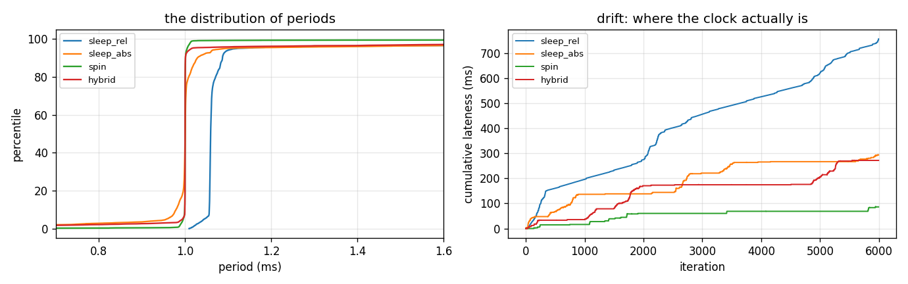
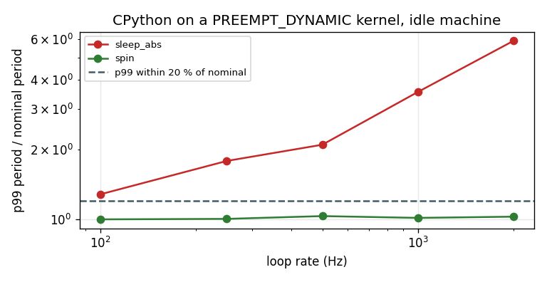
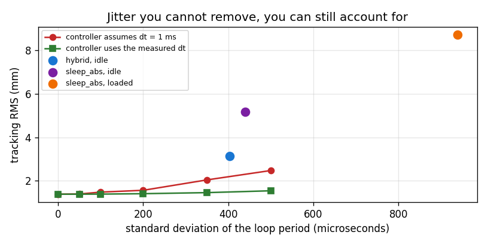

# Real-Time Loop Drill

## Key Insight

A control loop that says 1 kHz has to *be* 1 kHz — not on average, but on the worst iteration of the day, because the worst iteration is the one that breaks something. The gap between "usually 1 ms" and "always within 1 ms" is what [real-time](/shared/glossary/#preempt-rt) means, and on ordinary Linux you do not have it: the scheduler will happily preempt your control thread for a browser tab. [PREEMPT_RT](/shared/glossary/#preempt-rt) turns most of the kernel into preemptible code so a high-priority thread can take the CPU back within microseconds. Measuring [jitter](/shared/glossary/#jitter) — the spread of your loop period, not its mean — is how you find out which one you have.

**This is project 67.** It runs the drill honestly on the machine it has: a **PREEMPT_DYNAMIC** kernel, CPython, and no root. The headline is a number you can carry to any project: **this stack delivers about 2.5–3 ms of sleep jitter whatever the loop rate**, so 100 Hz is workable and 1 kHz is not — unless you burn a whole core spinning, which drops the excess to **0.015 ms**. And the honest surprises: pinning the loop to a core made it **2x worse**, allocating in the hot path was **invisible**, and jitter cost the tight controller **81 %** more error while the loose one did not notice at all.

---

## Files

| file | what it is |
|---|---|
| `rt.py` | the four waiting strategies, the load generator, the scheduling probes |
| `run.py` | the six drills |
| `outputs/` | figures and `results.csv` |

```bash
python3 run.py    # about 5 minutes, nearly all of it real elapsed time by construction
```

> **What this environment is, before any number below.** The kernel is
> `PREEMPT_DYNAMIC`, not `PREEMPT_RT`. `SCHED_FIFO` is denied (`Operation not
> permitted` — it needs `CAP_SYS_NICE`, i.e. root). The loop is CPython. **None
> of that is a real-time system**, and the project says so rather than
> pretending. What survives is the *shape*: which strategy drifts, which has a
> tail, what load does, what the fix is. On C plus PREEMPT_RT the microseconds
> shrink 10–100x and the ordering stays the same.

---

## 1. Four ways to wait until it is time again

Every control loop ends with "wait until it is time again". There are at least
four ways to write that, they differ by orders of magnitude, and three of them
look identical in a code review.

```python
#  A. relative sleep -- the obvious one
do_work(); time.sleep(period - elapsed)

#  B. absolute deadline
next_t += period; time.sleep(next_t - now())

#  C. busy spin
next_t += period; while now() < next_t: pass

#  D. hybrid: sleep for the bulk, spin for the last fraction
next_t += period
time.sleep(next_t - now() - slack); while now() < next_t: pass
```



At 1 kHz with 0.2 ms of work per iteration, over six seconds:

| strategy | p50 | p99 | p99.9 | worst | overruns | total drift |
|---|---|---|---|---|---|---|
| relative sleep | **1.0593** | 3.30 | 5.85 | 8.21 | 212 | **758.5 ms** |
| absolute deadline | 1.0000 | 3.10 | 4.75 | 9.19 | 220 | 293.7 ms |
| busy spin | 1.0000 | **1.0196** | 4.01 | 8.22 | **36** | **86.2 ms** |
| hybrid | 1.0000 | 3.14 | 4.52 | 6.95 | 192 | 271.6 ms |

**Relative sleep is wrong in a way the median shows immediately: 1.0593 ms.**
It waits one period *after* doing the work, so every iteration is late by the
work time and the lateness accumulates. Over six seconds the loop finishes
**758 ms** behind — three-quarters of a second of pure drift, from a line that
reads perfectly. A loop that logs "1000 iterations done" will be right; the
clock will not.

**Aiming at an absolute deadline fixes the median and does nothing for the
tail** (p99 3.10 vs 3.30). The two failures are separate: drift comes from your
arithmetic, jitter comes from the operating system, and fixing one leaves the
other exactly where it was.

**Spinning is 3x better at p99** (1.02 vs 3.10 ms) because it never asks the
kernel to wake it up. `sleep` returns *no earlier* than you asked and gives no
upper bound; on this kernel that overshoot is milliseconds. Spinning is also
100 % of a core, forever, doing nothing.

**The hybrid did not help here** (3.14 vs 3.10) and that is worth understanding
rather than glossing. It sleeps until 0.25 ms before the deadline and spins the
rest, so it can only absorb oversleeps *smaller than the slack*. This kernel's
oversleeps are 2–3 ms — ten times the slack — so the spin never gets a chance.
It would win with a slack of 3 ms, at 3 ms of core-burn per iteration, which at
1 kHz is the whole core again.

---

## 2. What rate can this stack actually hold?



This is the deliverable you can act on. **Absolute jitter is a property of the
operating system; the ratio to your period is what decides whether you can run
there.**

| strategy | rate | period | p99 excess | ratio | verdict |
|---|---|---|---|---|---|
| absolute sleep | 100 Hz | 10.0 ms | 2.83 ms | 1.28 | marginal |
| absolute sleep | 250 Hz | 4.0 ms | 3.15 ms | 1.79 | marginal |
| absolute sleep | 500 Hz | 2.0 ms | 2.20 ms | 2.10 | **no** |
| absolute sleep | 1000 Hz | 1.0 ms | 2.55 ms | 3.55 | **no** |
| absolute sleep | 2000 Hz | 0.5 ms | 2.45 ms | 5.89 | **no** |
| busy spin | 100 Hz | 10.0 ms | **0.008 ms** | 1.00 | usable |
| busy spin | 1000 Hz | 1.0 ms | **0.015 ms** | 1.02 | usable |
| busy spin | 2000 Hz | 0.5 ms | **0.014 ms** | 1.03 | usable |

**The excess is 2.2–3.1 ms at every rate.** It does not care what period you
asked for, because it is not about you: it is the kernel's timer granularity
plus whatever it was doing when your timer fired. So the *ratio* is entirely
decided by your period, and the verdict flips somewhere between 250 and 500 Hz.

**Spinning holds every rate to within 3 % — including 2 kHz.** Which tells you
the CPU was never the problem. The problem was asking to be woken up.

The practical reading: on a stack like this, **a sleeping loop is fine up to a
couple of hundred hertz, and above that you either spin a dedicated core or
move the loop somewhere else** — a real-time kernel, a microcontroller, or the
motor driver's own firmware. This is why production robots put the innermost
current loop on an MCU and leave the 100–500 Hz outer loops on Linux.

---

## 3. On a busy machine

Twelve background processes spinning on twelve cores:

| strategy | p99 idle → loaded | worst idle → loaded |
|---|---|---|
| absolute sleep | 3.10 → **5.95** ms | 9.19 → 10.94 ms |
| busy spin | **1.02 → 7.15** ms | 8.22 → 19.20 ms |
| hybrid | 3.14 → 5.00 ms | 6.95 → 19.99 ms |

**Spin's advantage evaporates completely — it degrades 7x, the worst of the
three.** That is the correct and slightly deflating result. Spinning avoids the
*wake-up* delay but not *preemption*: a `SCHED_OTHER` thread that has used its
share gets taken off the CPU whether it is spinning or sleeping. Spinning buys
you nothing against a scheduler that has already decided somebody else's turn
has come.

**Which is exactly what `SCHED_FIFO` is for**, and exactly why it is the next
section.

---

## 4. What this machine will actually give you

```
kernel preemption model : PREEMPT_DYNAMIC
SCHED_FIFO              : denied: [Errno 1] Operation not permitted
CPU pinning             : allowed
```

**`SCHED_FIFO`** is the POSIX real-time scheduling policy. Under it a thread
runs until it blocks or yields — the scheduler will not preempt it for a normal
task, whatever that task is doing. It is the single biggest lever on jitter,
and it needs `CAP_SYS_NICE`, which in practice means root. Combined with
section 3, that is the whole story of this environment: **the one control that
would fix the loaded case is the one we are not allowed to touch.**

`PREEMPT_DYNAMIC` is worth decoding too. Linux ships several preemption models:
`PREEMPT_NONE` (kernel code runs to completion), `PREEMPT_VOLUNTARY`,
`PREEMPT` (most kernel code is interruptible), and `PREEMPT_RT` (nearly all of
it, including interrupt handlers and spinlocks). `PREEMPT_DYNAMIC` means the
choice among the first three is made at boot rather than at compile time. It is
a normal desktop kernel with a switch, not a real-time one.

### Pinning, and the result that goes the wrong way

Pinning is allowed without privileges, so we can measure it. Hybrid loop, under
the same twelve-process load, three placements:

| placement | p50 | p99 | p99.9 | worst |
|---|---|---|---|---|
| free to migrate | 1.0002 | 5.64 | 9.00 | 13.96 |
| **pinned to a busy core** | 1.0002 | **10.01** | 17.25 | 22.99 |
| pinned, load kept off that core | 1.0003 | **5.00** | 9.00 | 11.21 |

**Pinning made it 1.8x worse.** Pinning does not reserve a core; it *removes an
option*. Free to migrate, the scheduler moves the loop to whichever core is
least busy at that instant. Pinned to a core that eleven other processes are
also allowed to use, it must queue there while an idle core sits next door.

Pinning is a lever only when combined with **isolation** — keeping everything
else off that core. Do both and it becomes the best of the three. On a real
robot that is `isolcpus=` or a `cpuset` at boot, plus `irqaffinity=` to move
interrupt handling away too. **Pinning without isolation is not half a fix; it
is a regression.**

---

## 5. Allocating inside the control thread

The classic rule is "never `malloc` in the control thread". Measured:

| loop body | p50 | p99 | p99.9 | worst |
|---|---|---|---|---|
| preallocated | 1.0000 | 3.275 | 5.877 | 7.28 |
| small objects with reference cycles | 1.0000 | 3.455 (1.05x) | 5.028 (0.86x) | 7.01 |
| the same, garbage collector disabled | 1.0000 | 3.274 (1.00x) | 5.032 (0.86x) | 7.02 |
| a 1.6 MB array per iteration | 1.0000 | 3.417 (1.04x) | 5.566 (0.95x) | 8.99 (1.23x) |

**A null result — and the interesting part is why.** Measure the operations
directly instead of concluding "no effect" from a table that cannot resolve
one:

| operation | cost | versus this machine's 2.28 ms jitter floor |
|---|---|---|
| a small object with a reference cycle | 0.0029 ms | **795x below** |
| a 1.6 MB numpy allocation | 0.0006 ms | 3856x below |
| **one full `gc.collect()`** | **18.19 ms** | **8x above** |

The allocations are three orders of magnitude smaller than the noise they are
hiding in. **You cannot measure an effect smaller than your noise floor** —
the same rule project 63 used to decide which dynamics terms were worth
fitting. On a PREEMPT_RT system whose floor is 50 µs, that 0.0029 ms would be
6 % of the budget and would matter.

But the last row is the rule's real content. Individual allocations are cheap;
the **collection they eventually trigger is 18 ms**, which is eight times
larger than everything else in this project put together and would destroy any
control loop it landed in. "Never allocate in the control thread" is shorthand
for **"never let a garbage collection happen in the control thread"** — and the
reason to avoid allocation is that allocation is what schedules one.

(Two honest caveats: the 1.6 MB allocation is suspiciously cheap because numpy
caches freed blocks and hands the same memory back, so it never reaches the
kernel. And `gc.collect()` here is a full collection of a deliberately
cycle-heavy heap; a routine generational pass is far shorter. The ordering is
what matters.)

---

## 6. What jitter costs, and the two-line fix



### It depends entirely on how good your controller is

The same synthetic jitter, four controllers, tracking RMS in millimetres:

| gains | 0 µs | 100 µs | 200 µs | 350 µs | 500 µs |
|---|---|---|---|---|---|
| kp=400 (loose) | 16.80 | 16.74 | 16.76 | 17.19 | 16.66 |
| kp=2500 (medium) | 2.60 | 2.60 | 2.98 | 3.18 | 3.48 |
| kp=6000 (tight) | 1.39 | 1.48 | 1.65 | 2.04 | **2.51** |
| kp=10000 (very tight) | 1.20 | 1.23 | 1.50 | 1.76 | **2.41** |

**The loose controller does not notice jitter at all** — 16.80 to 16.66, which
is nothing. **The tight one pays 81 %.** Its own tracking error is so small
that the clock's error becomes the dominant term.

This inverts the usual instinct. Jitter is not a problem you have; it is a
problem you *earn* by making everything else good. A team whose loop is sloppy
and whose gains are conservative can ignore this project entirely — and the
moment they tighten the loop, the clock becomes the limit.

### The mechanism

Almost no controller is handed velocity. It differences position, and that
division needs a `dt`:

```python
v_est = (x - x_prev) / dt        # which dt?
```

If the loop actually took 1.3 ms and the code divides by the 1.0 ms from the
config file, the velocity estimate is 30 % too small, so the damping term is
30 % too weak — **for that step only**, then a different amount the next step.
**Jitter is a gain error that changes every iteration**, which is why it shows
up as ringing rather than as a steady offset, and why more damping does not
fix it.

### The fix: divide by the `dt` that actually happened

| period spread | assumes dt = 1 ms | uses the measured dt |
|---|---|---|
| 0 µs | 1.387 mm | 1.387 mm |
| 200 µs | 1.567 mm | **1.411 mm** |
| 500 µs | 2.475 mm | **1.545 mm** |

And on the clocks this project actually measured:

| clock | period spread | assumes 1 ms | uses measured dt |
|---|---|---|---|
| hybrid, idle | 403 µs | 3.138 mm | **1.621 mm** |
| absolute sleep, idle | 440 µs | 5.162 mm | **1.661 mm** |
| absolute sleep, loaded | 938 µs | **8.708 mm** | **2.178 mm** |
| a perfect clock | 0 | 1.387 mm | — |

**4x on a loaded machine, for one line of code.** You already have the number —
you had to read the clock to know when to wake up. Using it costs nothing and
recovers most of what the jitter took. Note it does not recover *all* of it
(2.178 against the perfect clock's 1.387): a late sample is still a late
sample, and knowing exactly how late does not make the information any fresher.

**Measure your jitter before you try to remove it.** If it turns out you cannot
remove it — no root, no real-time kernel, a Python stack — accounting for it is
usually the larger part of the win anyway.

---

## Doing this properly on a robot

- **Get the kernel first.** `uname -a` should contain `PREEMPT_RT`. Ubuntu ships
  a real-time kernel; Debian has `linux-image-rt-*`.
- **Then the privileges.** `SCHED_FIFO` needs `CAP_SYS_NICE`; grant it per
  binary with `setcap cap_sys_nice+ep`, not by running the whole stack as root.
  Priority in the 50–80 band, below the kernel's own threads.
- **Then isolate.** `isolcpus=3` plus `irqaffinity=0-2` at boot, then pin to
  CPU 3. Section 4 is what happens if you pin without this.
- **Then lock memory.** `mlockall(MCL_CURRENT | MCL_FUTURE)` so no page of your
  process can be swapped out mid-loop, and preallocate everything before the
  loop starts. In C this is where "never malloc" becomes literal; in Python it
  means never letting a collection happen (`gc.freeze()` after setup,
  `gc.disable()` in the loop, and preallocated buffers so nothing accumulates).
- **Then measure again.** `cyclictest` is the standard tool and reports exactly
  the percentiles this project does. A tuned PREEMPT_RT box reports a maximum
  in the tens of microseconds; this one reported 9000.

---

## What to remember

- **Relative sleep drifts.** 758 ms behind in six seconds, from a line that
  reads correctly. Always aim at an absolute deadline.
- **Drift and jitter are separate faults.** Fixing the arithmetic moved the
  median to exactly 1.0000 and left p99 untouched.
- **The OS's jitter is roughly constant in absolute terms** (2.2–3.1 ms here),
  so the rate you can hold is decided by the ratio to your period: fine at
  100 Hz, hopeless at 1 kHz.
- **Spinning fixed it on an idle machine (0.015 ms) and lost badly on a busy
  one (7.15 ms).** Spinning avoids wake-up delay, not preemption.
- **Pinning without isolation made things 1.8x worse.** It removes the
  scheduler's option to find you an idle core.
- **Individual allocations were 795x below the noise floor; one collection was
  8x above it.** The rule is really "never trigger a collection".
- **A loose controller cannot see jitter; a tight one paid 81 %.** You earn
  this problem by fixing the others.
- **Dividing by the measured `dt` was worth 4x on a loaded machine.** One line,
  using a number you already had.

Projects 62 through 67 each fixed one layer. Project 68 asks the question they
were all building towards: when the whole thing still fails on the real robot,
**which layer was it?**
