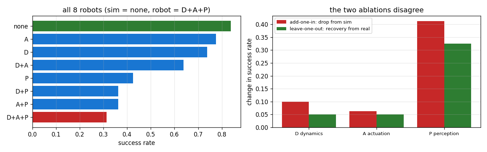
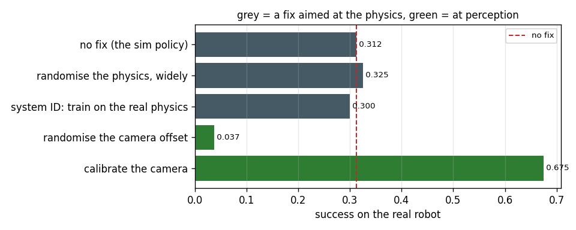

# Sim-to-Real Gap Forensics

## Key Insight

The [sim-to-real gap](/shared/glossary/#sim-to-real) represents the discrepancies in dynamics, sensing, and actuation between a simulated environment and the physical world. Sim-to-real forensics is the systematic process of diagnosing why a policy that succeeds in simulation fails on physical hardware. By isolating whether the failure stems from unmodeled friction, latency, sensor noise, or visual differences, developers can target their [domain randomization](/shared/glossary/#domain-randomization) or [system identification](/shared/glossary/#system-identification) efforts to close the gap.

**This is project 68.** It plants three defects in a "real" robot — one in the dynamics, one in the actuation, one in perception — trains a policy in the clean simulator, and watches it fall from **0.838** to **0.312**. Then it recovers the diagnosis using only evidence a real team could collect. The forensics correctly name perception (main effect **−0.381** against dynamics' −0.088), and the ending is the part worth reading: **three plausible fixes aimed at the physics bought nothing, one aimed at perception recovered 69 % of the gap, and one perfectly reasonable-sounding fix destroyed the policy entirely (0.037).**

---

## Files

| file | what it is |
|---|---|
| `gap.py` | the two robots, the three defects, the probes, the policy |
| `run.py` | the six investigations |
| `outputs/` | figures and `results.csv` |

```bash
python3 run.py    # about 2 minutes on 12 cores; needs numpy, torch, matplotlib
```

---

## The setup

Project 54's task: a 2-link planar arm pushes a puck onto a goal. Two robots.

| | SIM | REAL |
|---|---|---|
| **D** dynamics | nominal | link masses ×1.7, joint damping ×2.2 |
| **A** actuation | nominal | motor gain ×0.75, one decision of command delay |
| **P** perception | perfect | puck measured 15 mm too far in x, 10 mm too near in y, ±6 mm noise |

One from each of the three layers a transfer failure can live in, because the
entire skill being practised is turning *"the policy does not work on the
robot"* into *"which layer does not work"*.

> **We know the answer, and that is the point.** A forensic procedure you
> cannot check is a ritual. Planting the defects means every step below can be
> scored: did this probe find what was actually there?

---

## 1. The symptom

| | success | mean final error |
|---|---|---|
| in simulation | **0.838** | 43.6 mm |
| on the robot | **0.312** | 75.6 mm |

A gap of 0.525. This is all you get for free, and it is compatible with every
hypothesis. The rest of the project is about not guessing.

---

## 2. Add one defect to the simulator

The first instinct, and a good one: break the simulator one way at a time and
see which break reproduces the symptom.

| robot | success | drop from sim |
|---|---|---|
| sim + D dynamics | 0.738 | 0.100 |
| sim + A actuation | 0.775 | 0.062 |
| **sim + P perception** | **0.425** | **0.413** |

Perception alone reproduces most of the failure. Case closed?

---

## 3. Remove one defect from the robot

The mirror-image experiment, and the one people forget: fix the *robot* one way
at a time.

| robot | success | recovery from real |
|---|---|---|
| real − D dynamics | 0.362 | 0.050 |
| real − A actuation | 0.362 | 0.050 |
| **real − P perception** | **0.637** | **0.325** |

| defect | add-one-in drop | leave-one-out recovery |
|---|---|---|
| D dynamics | 0.100 | 0.050 |
| A actuation | 0.062 | 0.050 |
| P perception | 0.413 | 0.325 |

**The rankings agree — and the magnitudes do not.** Dynamics costs 0.100 when
added to a healthy robot and returns 0.050 when removed from a sick one; a
factor of two. Perception: 0.413 against 0.325.

> **"If they always give the same order, why run both?"** Because they answer
> different questions and you act on the second one. Add-one-in asks *"is this
> defect sufficient to cause the failure?"* — useful for reproducing a bug in
> simulation. Leave-one-out asks *"if I fix this, how much do I get back?"* —
> which is the question your sprint plan needs. They differ whenever defects
> **interact**, which is the normal case: a robot that is already blind cannot
> be hurt much further by being slow, so actuation looks cheap when measured on
> the broken robot and expensive on the healthy one. Ranking your work by
> add-one-in systematically over-promises.

---

## 4. The full factorial

Three defects means eight robots, and eight evaluations is cheap. Run them all
and stop guessing which comparison to make.



| defects present | success |
|---|---|
| none (sim) | 0.838 |
| A | 0.775 |
| D | 0.738 |
| D+A | 0.637 |
| P | 0.425 |
| D+P | 0.362 |
| A+P | 0.362 |
| **D+A+P (the robot)** | **0.312** |

A **factorial** design is one that tries every combination of the factors
rather than varying one at a time. Its payoff is the **main effect**: the
average change from turning a defect on, taken over every setting of the
others. That average is what you can trust when the factors interact, because
it does not depend on which particular robot you happened to test against.

| defect | main effect | with it | without it |
|---|---|---|---|
| D dynamics | −0.088 | 0.512 | 0.600 |
| A actuation | −0.069 | 0.522 | 0.591 |
| **P perception** | **−0.381** | 0.366 | 0.747 |

**Perception is worth 4.3x the other two combined.** With three factors this
costs eight runs instead of four; with five factors it is 32 instead of six,
which is when you start choosing a subset — but three factors is squarely in
"just run them all" territory, and it removes the add-one-in versus
leave-one-out argument entirely.

---

## 5. Two probes that never ask the policy

Everything above needed a trained policy and a success rate — 640 episodes.
Two cheaper probes give sharper answers, and neither involves the policy's
decisions at all.

### Open-loop replay

Record the actions the policy produced on one robot, then **replay that exact
sequence of numbers, with no feedback**, on each robot and compare where the
tip goes.

| robot | mean tip divergence | worst |
|---|---|---|
| sim (control) | 0.00 mm | 0.00 mm |
| **D dynamics** | **19.93 mm** | 45.63 mm |
| **A actuation** | **12.89 mm** | 26.20 mm |
| **P perception** | **0.00 mm** | **0.00 mm** |
| all three | 32.72 mm | 71.56 mm |

**Perception moves the tip by exactly zero, and that is what makes the probe
useful.** With no feedback, the observation is never read, so a wrong
observation cannot possibly change anything. The probe is *blind to perception
by construction*, which turns it into a clean separator: any divergence it
shows is the machine; anything it misses is the software's view of the machine.

Twelve episodes, no policy required, and it partitions the search space in half.
On real hardware this is the cheapest experiment in the whole toolkit —
literally replaying a recorded command file — and it is the first thing to run.

### The oracle sensor

The other half is already in the factorial: **real − P** is the real robot
driven with perfect puck measurements, and it scores 0.637 against 0.312. Give
the policy an oracle for one input at a time; whichever oracle restores
performance is the input that was lying.

**Together the two probes localise the fault without a single hypothesis about
what is wrong**: open-loop replay says the machine differs by ~20 mm (real, but
not enough), the oracle sensor says perception is worth 0.325 (the bulk). That
is the diagnosis, from two experiments that cost a few dozen episodes.

---

## 6. Acting on the diagnosis



Five fixes. Three of them are aimed at the physics — which is where a team
*without* the forensics would have started, because unmodelled dynamics is what
everybody expects sim-to-real failures to be.

| fix | layer | on the robot | back in sim |
|---|---|---|---|
| no fix (the sim policy) | — | 0.312 | 0.838 |
| randomise the physics, widely | physics | 0.325 | 0.750 |
| system ID: train on the real physics | physics | **0.300** | 0.875 |
| randomise the camera offset | perception | **0.037** | **0.025** |
| **calibrate the camera** | perception | **0.675** | 0.838 |

**The two physics fixes bought +0.013 and −0.012.** Nothing. And note the
second one: "system ID" here means we handed the policy *the real robot's exact
physics* to train on — the strongest possible version of that fix — and it
still did not help, because the physics was never the problem. A team that
spent a month identifying inertias would have had a beautiful model and the
same 0.31.

**Calibrating the camera recovered 0.363 of the 0.525 gap — 69 %** — and it is
one number, measured once, subtracted. The remaining shortfall (0.675 against
0.838) is the ±6 mm of noise, which calibration cannot remove and which the two
physics defects also contribute to.

### The fix that destroyed the policy

**"Randomise the camera offset" scored 0.037 on the robot and 0.025 in
simulation** — worse than doing nothing, and worse *everywhere*. This looks
like exactly the right move: project 59 showed domain randomisation over the
physics helping, so randomise over the perception too.

The reason it fails is worth carrying. Randomisation works when the policy can
*compensate* for the varying quantity from what it can see — a heavier arm
reveals itself in how the arm responds, so a policy can learn a behaviour that
works across masses. A camera offset reveals itself **nowhere**. The
observation is identical whether the puck is at *x* with no offset or at
*x − b* with offset *b*, so the same input now carries two different correct
actions. That is not augmentation; it is label noise in the one quantity the
task is defined by, and the policy converges to the average of contradictory
demonstrations, which pushes at nothing.

**Randomise over what the policy could in principle infer. Calibrate what it
cannot.** An unobservable constant offset is not a robustness problem, it is a
measurement problem, and the only fix is to measure it.

---

## The procedure, generalised

1. **Open-loop replay first.** Cheapest, needs no policy, and splits the space
   into "the machine differs" and "the machine does not".
2. **Oracle each input in turn.** Feed the policy ground truth for one channel
   at a time on the real robot. Whichever oracle helps is the channel lying.
3. **Then the factorial**, if you can simulate the candidates. Report main
   effects, not one-at-a-time drops.
4. **Aim the fix at the layer you found.** A fix aimed at the wrong layer is
   not partially effective; it is zero, and it costs a month.
5. **Check the fix on the healthy robot too.** The "randomise the camera"
   column would have been caught by anybody who looked at the sim score: 0.025
   is not a robustness trade-off, it is a broken policy.

---

## What to remember

- **0.838 to 0.312**, and the symptom alone tells you nothing about the cause.
- **Add-one-in and leave-one-out disagree in magnitude** even when they agree
  in rank — 0.100 versus 0.050 for dynamics. Plan work using leave-one-out.
- **Run the full factorial when the factors are few.** Eight runs gave main
  effects that do not depend on which robot you compared against: perception
  −0.381, dynamics −0.088, actuation −0.069.
- **Open-loop replay is blind to perception by construction** (0.00 mm exactly),
  which is precisely why it is a clean separator — and it needs no policy.
- **A fix aimed at the wrong layer is worth zero.** Two physics fixes: +0.013
  and −0.012. Even being handed the real physics for free changed nothing.
- **Calibration beat randomisation 18x** on a defect the policy cannot observe
  (0.675 vs 0.037). Randomise what the policy could infer; measure what it
  cannot.

Project 69 turns this from an investigation into a routine: a suite that would
have caught the regression before anybody had to investigate anything.
