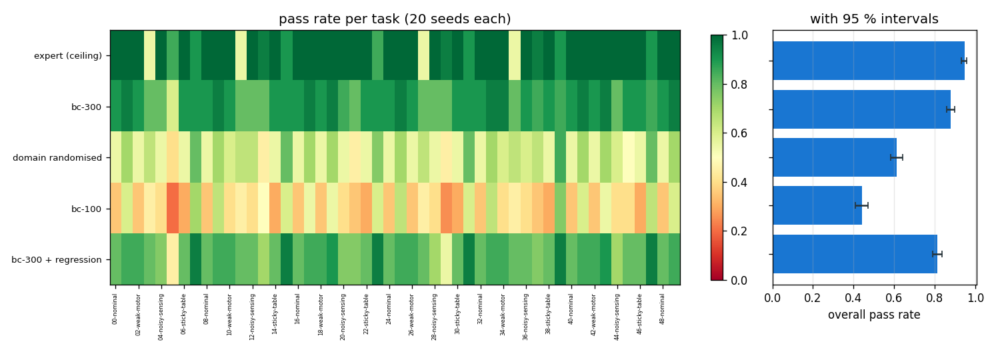
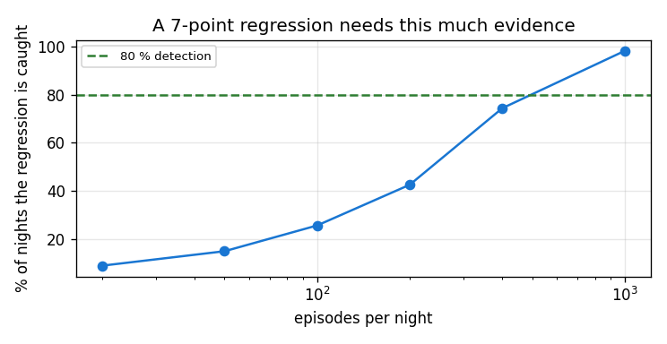
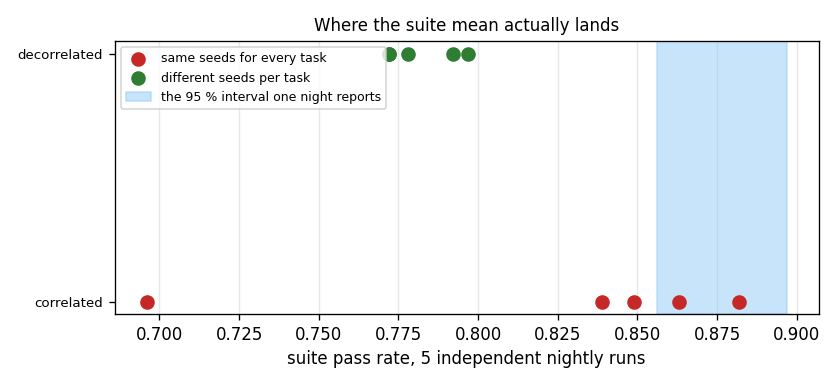
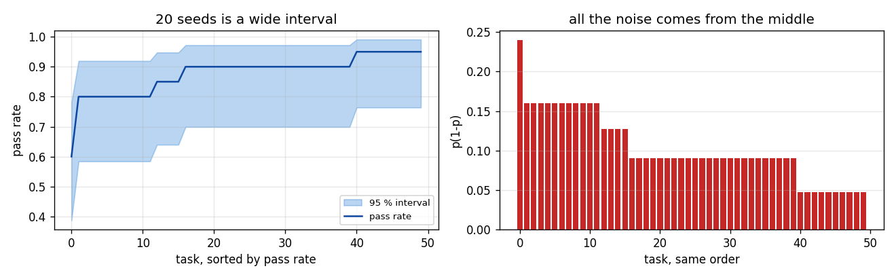

# Eval Harness

## Key Insight

A robust [evaluation harness](/shared/glossary/#evaluation-harness) automates [regression testing](/shared/glossary/#regression-testing) for robot controllers and planning policies by running hundreds of diverse simulation tasks nightly. By seeding variations in object placement, physics parameters, and initial states, the harness calculates a statistical pass-rate dashboard. This continuous evaluation catches subtle bugs or performance regressions before the code is deployed onto real physical hardware, ensuring high reliability across diverse operating conditions.

**This is project 69.** It builds a 50-task suite, runs five systems through it, injects a realistic regression, and then attacks its own numbers. The finding that matters is uncomfortable: **the harness's own 95 % confidence interval was 7.2x too narrow.** Five honest nightly runs of the same code produced suite scores of 0.882, 0.696, 0.849, 0.863 and 0.839, against a reported interval of ±0.020. One line of the runner — which seeds each task gets — was responsible, and fixing it shrank the run-to-run spread **6.4x**.

---

## Files

| file | what it is |
|---|---|
| `harness.py` | the 50-task suite, the runner, Wilson intervals, the systems under test |
| `run.py` | the five investigations |
| `outputs/` | figures and `results.csv` |

```bash
python3 run.py    # about 3 minutes on 12 cores; needs numpy, torch, matplotlib
```

---

## What a harness is made of

Three parts, and only the first is obvious:

- a **task suite** — a fixed, versioned list of situations, each of which is a
  specific thing you claim the robot can do;
- a **seeding scheme** — how the situation varies *within* a task, so that a
  task measures a capability rather than one lucky arrangement;
- an **error bar** — because a pass rate from twenty episodes is a random
  variable, and a dashboard without an interval invites the team to chase noise
  every morning.

The suite here is 50 tasks over project 54's push task, in eight families:
nominal, heavy links, weak motor, laggy commands, noisy sensing, an obstacle, a
sticky table, and everything at once. It varies **five axes**, not one. A suite
that only moves the object around measures only object placement, and a robot
can pass it while being unable to survive a 20 ms delay.

> **Why generate the suite from a seed and then freeze it?** A hand-written
> suite is biased towards what you already thought of — you write tests for the
> bugs you have met. A suite regenerated every night is not a suite at all,
> because yesterday's number and today's number would be measuring different
> things, and every comparison you make is between them. Generate once, commit
> the file, version it like code.

---

## 1. The dashboard



| system | pass rate | 95 % interval |
|---|---|---|
| expert (ceiling) | 0.945 | [0.929, 0.958] |
| bc-300 | 0.878 | [0.856, 0.897] |
| bc-300 + regression | 0.813 | [0.788, 0.836] |
| domain randomised | 0.613 | [0.582, 0.643] |
| bc-100 | 0.440 | [0.410, 0.471] |

The **expert ceiling** is the scripted demonstrator, and it earns its row
immediately. Per family:

| family | expert | bc-300 |
|---|---|---|
| nominal | 1.000 | 0.900 |
| heavy | 1.000 | 0.950 |
| sticky table | 1.000 | 0.900 |
| **laggy** | **0.700** | **0.850** |

**On laggy tasks the "ceiling" is below the system it is supposed to bound.**
The scripted expert is a feedback controller that assumes its commands take
effect immediately; add a delay and it over-corrects. Without this row, a team
seeing bc-300 at 0.85 on laggy tasks would open a ticket to close a 0.15 gap
that does not exist. **A ceiling tells you whether a low score means "hard
task" or "broken system"** — and sometimes it tells you the ceiling is the
broken thing.

### Why Wilson intervals

The interval everyone writes first is `p ± 1.96·sqrt(p(1−p)/n)`. On 20 out of
20 it gives **1.00 ± 0.00** — certainty, from twenty samples. Edwin Wilson's
1927 interval fixes this by inverting the question: instead of "given this
estimate, how far might the truth be?", it asks *"which true rates would
plausibly have produced this count?"*. That version stays inside [0, 1] and
gives a sensible width when the count is 0 or n. It is twenty lines of
arithmetic in `harness.py` and it is the difference between a dashboard that
can say "we do not know yet" and one that cannot.

---

## 2. How many episodes to catch a regression

The regression is realistic: a commit that quietly scales the action by 0.80.
Not a crash, not an exception — slightly smaller numbers out of a function
somebody refactored. No unit test catches it. It costs **0.065** on the suite.



| episodes per night | nights the regression is caught | median z |
|---|---|---|
| 20 | 9.0 % | 0.79 |
| 50 | 15.0 % | 1.04 |
| 100 | 25.7 % | 1.33 |
| 200 | 42.6 % | 1.76 |
| 400 | 74.4 % | 2.56 |
| 1000 | **98.2 %** | 4.04 |

**A 6.5-point regression needs about 400 episodes a night to be caught three
times in four.** At 100 episodes you catch it one night in four — which in
practice means it lands, four nights pass, and by the time the trend is
undeniable there are thirty commits to bisect.

This is **statistical power**: the probability of noticing an effect that is
really there. It is the number to compute *before* choosing a suite size, and
the way to compute it is backwards — decide the smallest regression you care
about, then find the episode count that catches it. "We run 100 episodes" is
not a plan; "we can catch a 5-point regression 80 % of the time" is.

The test is the standard two-proportion z: compare two pass rates, pool them,
divide by the standard error. |z| above 1.96 is the usual 5 % line — a
difference that big would appear by chance less than one night in twenty if
nothing had changed. **These numbers are the optimistic bound**, for a reason
section 4 makes clear.

---

## 3. What a single number hides

| comparison | aggregate gap | tasks differing by more than 0.25 |
|---|---|---|
| bc-100 vs bc-300 + regression | 0.373 | **40 of 50** |
| bc-300 vs domain randomised | 0.265 | **25 of 50** |

And where the injected regression actually landed:

| family | before | after | drop |
|---|---|---|---|
| obstacle | 0.792 | 0.667 | **0.125** |
| sticky table | 0.900 | 0.800 | 0.100 |
| nominal | 0.900 | 0.800 | 0.100 |
| heavy | 0.950 | 0.850 | 0.100 |
| noisy sensing | 0.825 | 0.750 | 0.075 |
| weak motor | 0.908 | 0.850 | 0.058 |
| laggy | 0.850 | 0.833 | 0.017 |
| **combined** | 0.883 | 0.950 | **−0.067** |
| overall | 0.878 | 0.813 | 0.065 |

**The regression is 7x larger on obstacle tasks than on laggy ones, and on the
"combined" family it looks like an improvement.** That last row is not a
mistake — with 20 seeds a family's rate has a standard error near 0.09, so a
0.067 move is well inside noise. Which is exactly why per-family numbers need
per-family error bars, and why "the obstacle family dropped!" is a hypothesis,
not a finding, until you re-run that family with more seeds.

The aggregate is the right thing to *alert* on and the wrong thing to
*diagnose* with. Keep both: one number to trip the alarm, fifty to say where to
look.

---

## 4. The error bar is wrong, and here is by how much

This is the experiment that changes how you build the harness.

Run the whole suite five more times, each with a different set of 20 episode
seeds. Nothing else changes — same code, same policy, same tasks.



**Same seeds for every task** (what almost every harness does):

```
the five suite means : 0.882  0.696  0.849  0.863  0.839
spread across runs   : 0.0743
the Wilson interval  : +-0.0203
the interval is too narrow by 7.2x
```

One night reports 0.696 and another reports 0.882, and each of them prints a
95 % interval of about ±0.02. **A team watching this dashboard would open a
severity-1 incident on the 0.696 night, find nothing, and lose two days.**

### The cause is one line of the runner

The suite is 50 tasks × 20 seeds = 1000 episodes, and the naive runner gives
**every task the same 20 seeds**. So those 1000 episodes contain only **20
distinct object placements**, each seen 50 times under different physics. If
one of those 20 placements happens to be awkward, it is awkward in all 50 tasks
at once, and the whole suite moves together.

The Wilson interval assumes the 1000 episodes are 1000 independent facts. They
are closer to 20. Independence is not a statistical detail here — it is the
entire content of the error bar, and the harness quietly destroyed it while
looking tidy.

### The fix, measured

Give each task its own seed offset:

```
the five suite means : 0.778  0.797  0.772  0.772  0.792
spread across runs   : 0.0116
the interval is too narrow by 1.1x
```

**6.4x less run-to-run spread, and the reported interval becomes honest** (1.1x
instead of 7.2x). Same episode count, same compute, one line.

Look also at *where* the decorrelated runs land: tightly around **0.78**, not
around the 0.878 this dashboard has been reporting since section 1. The
headline number in the correlated setup was not merely uncertain — it was
**high**, because those particular 20 placements happened to be easy and every
one of the 50 tasks inherited the same luck. Every table above is a slightly
flattering picture of the same systems. Their *ranking* survives, which is what
makes the earlier sections still worth reading; the absolute numbers do not.

Two things follow. **Section 2's power analysis is the optimistic bound**,
because it resampled episodes as if independent; with correlated seeds the real
episode counts are larger. And **whenever a metric moves, ask what is shared
between the samples** before you ask what changed in the code — correlated
seeds, a shared random object, a shared scene file, a shared start pose.

---

## 5. Per-task claims need far more seeds than you think



| | width of the 95 % interval |
|---|---|
| one task, 20 seeds | **0.283** average (worst 0.395) |
| the whole suite | **0.041** |

**The suite mean is 7x sharper than any task in it.** A task at 0.80 over 20
seeds has an interval of roughly [0.58, 0.92]. You cannot tell it from a task
that truly sits at 0.60, and you certainly cannot tell whether it regressed
from 0.90.

How many episodes a per-task claim actually needs (at p = 0.8):

| interval you want | episodes on that one task |
|---|---|
| ±0.20 | 15 |
| ±0.10 | 64 |
| ±0.05 | **268** |
| ±0.03 | **1095** |

The 4x growth for each halving is the `1/sqrt(n)` law, and it is why per-task
precision is expensive and aggregate precision is cheap. **Run the suite for
the aggregate; re-run individual tasks with many seeds only when you need to
make a claim about one.** The nightly job answers "did anything change?"; a
targeted re-run answers "what changed?".

### One null result worth keeping

Spending the same total episodes unevenly — more on the tasks with the most
variance — was worth **1.02x**. Nothing.

The reason is that a binomial's variance is `p(1−p)`, which is 0.25 at p = 0.5,
0.24 at 0.6, 0.21 at 0.7 and 0.16 at 0.8 — nearly flat across the whole range
where real tasks sit. Variance-proportional allocation pays off when some
strata are genuinely quiet, and pass rates between 0.5 and 0.95 are not quiet.
**Do not build the clever allocator.** Spend the effort on decorrelating the
seeds, which was worth 6.4x.

---

## Running this for real

- **Version the suite like code.** A task added mid-quarter breaks every
  historical comparison. Add tasks in a new suite version and keep reporting
  both for a while.
- **Store per-episode results, not the summary.** Every question in sections
  2–5 was answered by re-analysing the 0/1 matrix. A dashboard that stores only
  the mean cannot answer any of them.
- **Record the seed with the result.** A failure you cannot re-run is an
  anecdote — this is the same requirement project 66 measured as
  replayability.
- **Alert on the aggregate with a correct interval; investigate per task.**
- **Put the expert ceiling on the dashboard.** It is what tells you a 0.70 is a
  hard task rather than a broken one, and occasionally that the ceiling itself
  is broken.

---

## What to remember

- **The harness's own confidence interval was 7.2x too narrow**, because 1000
  episodes contained 20 distinct placements. Decorrelating the seeds cost one
  line and shrank the run-to-run spread 6.4x.
- **Ask what is shared between your samples before you ask what changed in the
  code.**
- **A 6.5-point regression needed ~400 episodes a night** to be caught three
  nights in four. Choose the suite size from the regression you care about, not
  from a round number.
- **The regression was 7x larger on one family than another**, and looked like
  an improvement on a third. Alert on the aggregate; diagnose per task.
- **Per-task intervals at 20 seeds are ±0.14.** Getting to ±0.05 costs 268
  episodes on that one task.
- **Variance-proportional allocation was worth 1.02x** — a null. `p(1−p)` is
  flat where real tasks live.
- **Put the ceiling in the suite.** Here it revealed that the scripted expert
  is *worse* than the learned policy on laggy tasks, which would otherwise have
  looked like a bug in the policy.

---

This closes Phase 9. The through-line across projects 62–69 is that every one
of them found the same failure mode in a different costume: **a measurement
that looked fine and was not.**

- 62 — a URDF that passes every static check and is 1106x wrong in inertia.
- 63 — a parameter fit with a perfect residual and a mass wrong by 27x.
- 64 — a per-node latency profile that misses 41 % of the latency.
- 65 — a node publishing confidently while it is uncalibrated.
- 66 — a log that records everything except what you need to reproduce anything.
- 67 — a loop that reports 1000 iterations and finishes 758 ms late.
- 68 — a fix aimed at the wrong layer, worth exactly zero.
- 69 — an error bar that is off by 7x.

None of these are algorithm problems, and none of them show up in the paper.
They show up at 3 a.m., and the only defence is the instrument you built before
you needed it.
