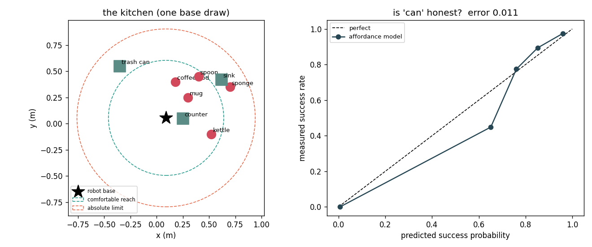
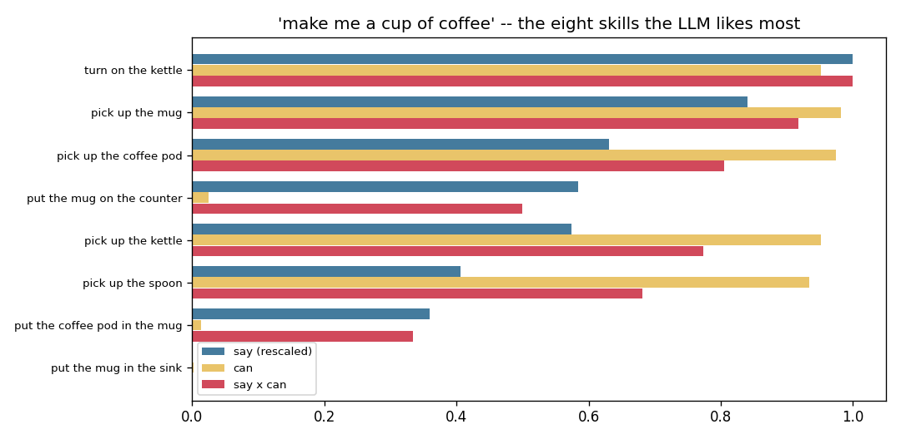
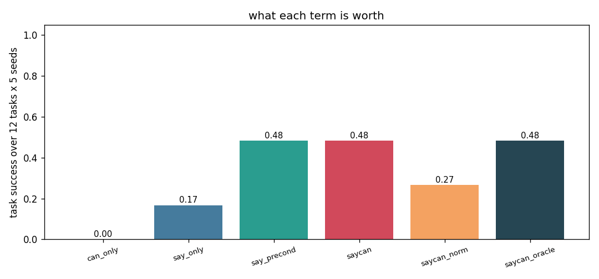

# Talk-to-Robot Demo

## Key Insight

Integrating [large language models (LLMs)](/shared/glossary/#llm) with robotic control enables natural language task [planning](/shared/glossary/#planning) by decomposing high-level user commands into a sequence of executable [primitives](/shared/glossary/#primitives). In frameworks like [SayCan](/shared/glossary/#saycan), the LLM proposes actions ("say") while a learned [policy](/shared/glossary/#policy) evaluates the feasibility of each action in the current environment ("can"). This combined approach ensures the robot plans actions that are both semantically correct and physically executable in simulation or real-world kitchens.

**This is project 70.** It builds the smallest honest SayCan: a sim kitchen with real geometry, 26 hand-written skills, a real frozen language model (SmolLM2-360M-Instruct) supplying "say", and an [affordance](/shared/glossary/#affordance) model trained on 3000 robot trials supplying "can". Multiplying them takes task success from **0.167 to 0.483**. Then the control that should always be run: **a five-line symbolic precondition check reproduces that gain exactly — 0.483 — so the learned affordance model was worth 0.000.**

---

## Files

| file | what it is |
|---|---|
| `kitchen.py` | the sim kitchen, the skill library, the 12 tasks |
| `llm.py` | the language model scorer, with a prefix cache |
| `run.py` | the five experiments |
| `outputs/` | figures and `results.csv` |

```bash
python3 run.py    # about 9 minutes on 12 cores; needs numpy, torch,
                  # transformers, matplotlib, and SmolLM2-360M in the HF cache
```

---

## The two halves, and why a language model is only one of them

The instruction is "make me a cup of coffee". Somewhere between that sentence
and a motor command, two completely different kinds of knowledge are needed:

- **that coffee involves a kettle, a mug and a pod, in roughly that order.**
  This is world knowledge. It is written down in millions of documents, and a
  language model has read them. Nothing on the robot knows it.
- **that this robot, standing here, can reach the sponge on the far counter
  today.** This is not in any document. It depends on the arm's reach, on what
  the gripper is already holding, on how crowded the shelf is. Only the robot
  knows it, and only by having tried.

SayCan's name is the whole idea: what the model would **say**, times what the
robot **can** do. Both are numbers between 0 and 1 and you multiply them, so a
skill needs to be *both* sensible and possible to win.



The kitchen has real coordinates. The robot's base is jittered every episode,
so the same skill is easy in one episode and marginal in the next, and objects
sitting close together are harder to pick than isolated ones. This matters: a
purely symbolic kitchen where every action always works turns the project into
a language exercise and teaches nothing about robots.

---

## 1. "Can": an affordance model trained on trials

The affordance model is a logistic regression on four numbers — distance to the
target, distance squared, how many other objects are within 12 cm of it, and
whether the gripper is already full — plus one flag for whether the skill's
preconditions are met at all. It is trained on 3000 trials in which the robot
picks a random skill in a random state and the world says yes or no.

```
trials collected              3000
base rate of success          0.221      <- most random skills fail
accuracy at 0.5               0.972
calibration error             0.0114     <- predicted p vs measured p
```

It is well **calibrated**, which is the property that matters here and is not
the same as being accurate: calibrated means that among the skills it scores
0.7, about 70 % really do work. Accuracy only asks whether the 0.5 threshold
lands on the right side. SayCan multiplies "can" into a score, so the *value*
has to be meaningful, not just its sign.

> **Why is the affordance model trained on trials rather than derived from the
> geometry we already wrote down?** Because on a real robot the geometry is
> exactly what you do *not* have. `true_success_prob` in `kitchen.py` is the
> ground truth and the planner never sees it — it sees samples, the same way a
> real robot sees only its own logs. Section 4 measures how much it costs to
> learn the function instead of knowing it, and the answer is: nothing.

---

## 2. Why not just let the model write the plan?

The obvious thing to try first is to ask the model for a plan in words and
execute what it says. Here is what the model actually writes:

```
'make me a cup of coffee'    -> ['Put coffee pod in the mug',
                                 'Put kettle on the stove',
                                 'Put coffee pod in the mug']
'put a coffee pod in the mug'-> ['Put a coffee pod in the mug',
                                 'A snail is at the bottom of a 20-foot well.
                                  Each day, it climbs up 3 feet, but at night']
'boil some water'            -> ['Turn on the kettle',
                                 'Fill the kettle with water',
                                 'Turn on the stove']
```

**Of the 11 lines generated, 1 was a skill the robot can actually run — 9 %.**
Three separate failure modes, all visible above:

- **an object that does not exist.** There is no stove in this kitchen. The
  model has read a million kitchens that have one.
- **repetition.** "Put coffee pod in the mug" three times; greedy decoding on a
  small model loops.
- **falling out of the task entirely.** The snail is a puzzle from the training
  data that the prompt happened to resemble.

Scoring a fixed skill list makes all three impossible **by construction**. The
model never emits text; it only ranks 26 sentences the robot already has code
for. It cannot name a stove because "use the stove" is not on the list, cannot
repeat itself because the world state changes between steps, and cannot wander
off because there is nowhere to wander to.

That is the actual argument for the scoring formulation, and it is an
engineering argument rather than a scientific one: **you are trading the model's
freedom for a guarantee that its output is executable.**

---

## 3. What the "say" score looks like — and one trap

`say` is `log P(skill sentence | prompt)`: how unsurprised the model is to read
that sentence next. It is *not* a probability that the skill is a good idea.

For "make me a cup of coffee" with an empty gripper:

| say | can | say + log can | skill |
|---|---|---|---|
| −6.38 | 0.95 | **−6.43** | turn on the kettle |
| −7.49 | 0.98 | −7.50 | pick up the mug |
| −8.93 | 0.97 | −8.95 | pick up the coffee pod |
| −9.25 | **0.03** | **−12.92** | put the mug on the counter |
| −9.32 | 0.95 | −9.37 | pick up the kettle |

Row four is the whole mechanism in one line. "Put the mug on the counter" reads
like a perfectly sensible kitchen sentence, and the model ranks it fourth. The
robot is holding nothing, so it cannot put anything anywhere: `can = 0.03`, and
the combined score drops it to last place. **No amount of language modelling
recovers that fact, because it is not a fact about language.**

### The length trap, and the fix that makes things worse

A sum of log-probabilities gets more negative with every extra token, so long
sentences are penalised just for being long. Measured here:

```
corr(say score, number of tokens) = -0.436
```

The standard remedy is to divide by the token count — the same per-token
normalisation that turns a total log-likelihood into
[perplexity](/shared/glossary/#perplexity). Watch what it does:

| ranking | top skill |
|---|---|
| raw sum | **turn on the kettle** |
| per token | **put the mug on the counter** |

Normalising promotes the *illegal* skill. And end to end (section 4) it costs
**0.483 → 0.267, a 45 % relative drop.**

The reason is worth understanding, because "normalise by length" is usually good
advice. Per-token score answers "how fluent is this sentence?" Total score
answers "how likely is this exact continuation?" A planner wants the second.
Long skills like "put the coffee pod in the mug" *should* be less likely than
short ones a priori — there are more ways to be wrong in a longer sentence —
and flattening that away hands the ranking to whichever phrasing happens to read
most smoothly. **Fix the length bias by keeping the skill names a similar
length, not by dividing it out.**

---

## 4. What each term is worth



12 tasks × 5 kitchens, 8 steps allowed per episode, scored only by a checker
that looks at the world state — never at how the plan reads.



| planner | task success | steps used | illegal proposals per episode |
|---|---|---|---|
| can only (no language) | **0.000** | 8.0 | 0.00 |
| say only (no affordance) | 0.167 | 6.9 | **5.28** |
| say ÷ tokens (length-normalised) | — | — | — |
| **SayCan** | **0.483** | 5.2 | 1.17 |
| SayCan, length-normalised | 0.267 | 6.4 | 0.00 |
| SayCan with a *perfect* affordance model | 0.483 | 5.2 | 0.00 |

Three things to read off this table.

**"Can" alone scores exactly zero.** It always picks whichever legal skill is
easiest to reach and never does anything useful, because nothing in it knows
what the human asked for. Feasibility is not a plan.

**"Say" alone proposes 5.28 impossible skills per 8-step episode** — it spends
two thirds of its budget asking for things the world refuses. It still scores
0.167 rather than 0, because sometimes the impossible proposal is a no-op and
the next step happens to be right.

**A perfect affordance oracle scores the same as the learned one, 0.483.** The
learned model has already extracted everything the planner can use. So the
remaining 0.517 is not an affordance problem — it is the 360M model failing to
sequence the task, and no better "can" fixes that.

---

## 5. The control that deflates the result

SayCan beat say-only by **+0.317**. Now replace the learned affordance model
with five lines of Python — a hard-coded check of whether the skill's symbolic
preconditions hold (are you holding the thing? is the kettle already on?) — and
otherwise change nothing:

```
say only                          0.167
say + learned affordance (SayCan) 0.483    (+0.317)
say + a precondition check        0.483    (+0.317)
--------------------------------------------------
what the LEARNED part bought      0.000
```

**Exactly zero.** Both give the same success, in the same 5.2 average steps.

The reason is legible in the feature list: the strongest input the affordance
model has is `preconditions_met`, and the reach-and-clutter geometry it also
learned turns out never to be the deciding factor in this kitchen. What the
model learned is the check, plus decoration.

This is not an argument against learned affordances — SayCan's original setting
had skills that fail for reasons no one can write down, like "this grasp slips".
It is an argument for **always running the dumb version as a control.** Without
this row, "our learned value function improved task success by 0.32" is a true
sentence and a misleading one. The honest version is: *"a feasibility check
improved task success by 0.32, and learning it bought nothing over writing it."*

The question that decides which one you need is: **do your skills fail for
reasons you can enumerate?** If yes, enumerate them; it is cheaper, debuggable,
and exactly as good. If no — contact, slip, clutter, deformable objects — then
you need the trials, and this project's kitchen is too tidy to show it.

---

## Making it fast: one trick worth knowing

SayCan scores *all* 26 skills at *every* step. The obvious implementation runs
the ~90-token prompt through the network 26 times, computing the identical thing
26 times. Instead `llm.py` runs the prompt once, keeps the network's internal
summary of it (the **KV cache** — the keys and values every attention layer
computed for those tokens), copies that summary 26 times, and pushes only the
~6 tokens of each skill through. Same numbers to the last decimal, about 3×
less work.

On top of that, `run.py` caches the scores by prompt. The measured payoff is
larger than the model trick:

```
distinct prompts actually scored     40
scorings served from the cache     1763    <- 44x
seconds per LLM scoring call        6.99
```

**1803 planning steps needed only 40 forward passes**, because the prompt
depends on the task and the *symbolic* state, and there are not many of those.
Six planners over 60 episodes each cost 269 seconds in total.

The remaining cost is section 2: **238 of the 524 seconds went on generating
free-form plans**, three tasks at 40 tokens each. Scoring 26 candidates is
cheaper than writing 40 tokens, because scoring is one parallel forward pass and
generation is 40 sequential ones. That is a useful thing to know before
designing a robot's language stack: **ranking is cheap, writing is expensive.**

---

## What to remember

- **SayCan = say × can**, and the two halves come from different places:
  language from a corpus, feasibility from the robot's own trials.
- **Free-form generation produced 9 % runnable steps**, and invented a stove.
  Scoring a fixed skill list makes that impossible by construction.
- **`say` alone proposed 5.28 impossible skills per episode**; `can` alone
  scored 0.000 because it does not know what was asked.
- **Length-normalising the score cost 45 % relative** and promoted an illegal
  skill to first place. Keep skill names a similar length instead.
- **A perfect affordance oracle scored the same as the learned one** — the
  remaining failures are the language model's sequencing, not feasibility.
- **The learned affordance model was worth 0.000 over a five-line precondition
  check.** Always run the dumb control. The learned version earns its keep only
  when failures cannot be enumerated.

---

Next: [project 71](../71-vla-fine-tune/README.md) stops using language to pick
between hand-written skills and starts using it inside the policy itself.
