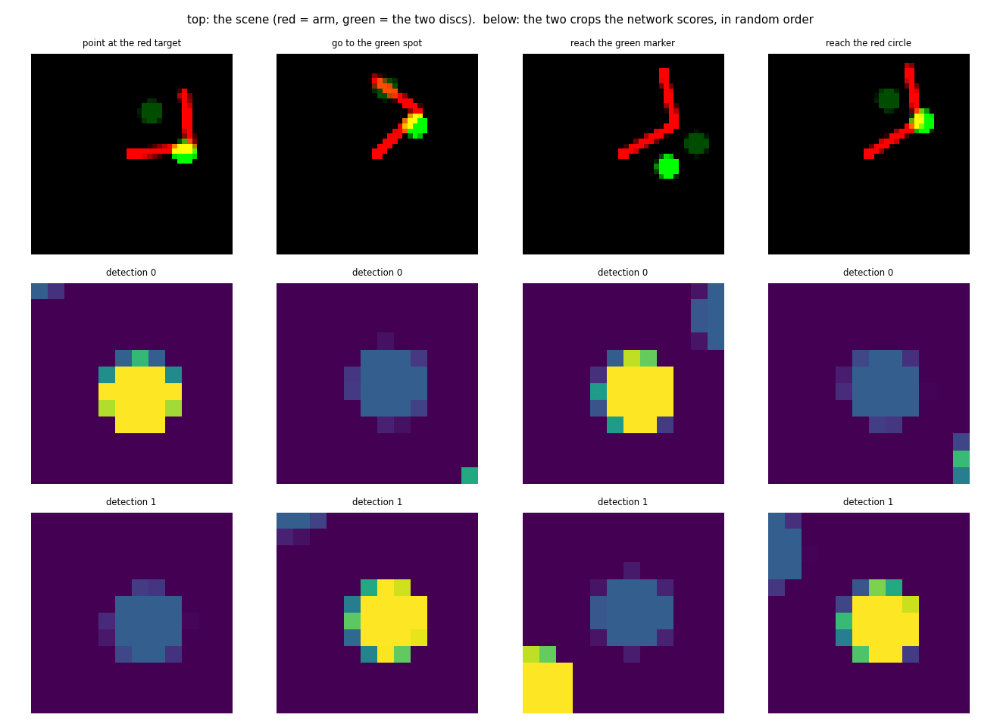
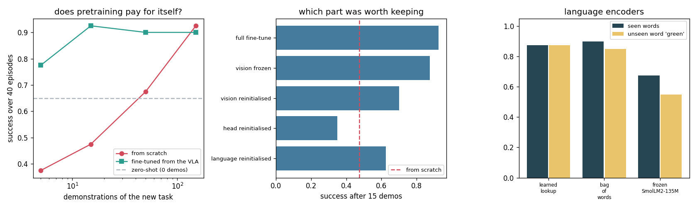

# VLA Fine-Tune

## Key Insight

Fine-tuning a pretrained [Vision-Language-Action (VLA) model](/shared/glossary/#vla) adapts its broad generalist capabilities to a specific robotic platform with a fraction of the demonstrations required for from-scratch [Behavior Cloning (BC)](/shared/glossary/#bc). Because the base model already possesses rich visual features and language understanding, the [fine-tuning](/shared/glossary/#fine-tuning) process only needs to align its tokenized action vocabulary with the joint spaces and kinematic limits of the target robot. This makes VLA adaptation highly sample-efficient and robust to visual clutter compared to training a task-specific policy from scratch.

**This is project 71.** It builds a 50 000-parameter VLA, pretrains it on tasks that name a **red** or a **blue** disc, and then fine-tunes it on a task naming a **green** one it has never seen. The sample-efficiency claim holds and is large: at 15 demonstrations, **fine-tuning scores 0.925 against 0.475 from scratch**. Two other results are less comfortable. **The advantage is gone by 150 demonstrations** (−0.025), so pretraining buys time, not a ceiling. And a **real frozen language model lost to a 48-row lookup table** — 0.675 against 0.875 — including on the very word it was supposed to know.

---

## Files

| file | what it is |
|---|---|
| `vla.py` | the task, the model, the three language encoders |
| `run.py` | the five experiments |
| `outputs/` | figures and `results.csv` |

```bash
python3 run.py    # about 8 minutes on an idle 12-core machine
                  # (733 s measured while sharing it with another job)
                  # needs numpy, torch, transformers, matplotlib, SmolLM2-135M
```

---

## The task has to have language in it

[Project 54](../54-behavior-cloning-on-a-sim-arm/README.md)'s push task cannot
test a VLA. One puck, one goal, no ambiguity — a policy that ignores the
instruction scores exactly as well as one that reads it, so "does the language
help?" has no measurable answer.

So the scene here has **two coloured discs**, and the instruction names one:

```
"touch the blue marker"
```



Which disc is scored is decided independently of where the discs are, so
"always go to the brighter one" and "always go to the left one" are each worth a
coin flip. The vocabulary is 4 verbs × 3 colours × 4 nouns = 48 sentences.

Three design decisions are worth their paragraphs, because each was forced by a
measurement that went wrong first.

> **Why a reach rather than a push?** Pushing was tried and it is the wrong
> instrument. The score came out at 0.32 against a 0.97 scripted ceiling, and
> the reason was resolution: a 32 × 32 camera over a 0.42 m half-width is 26 mm
> per pixel, and the task asked the policy to stop within 35 mm — one and a
> third pixels. That measures the camera, not the grounding. Reaching keeps the
> control trivial and leaves all the difficulty where the project wants it.

> **Why hand the policy the two disc positions?** The observation contains both
> disc positions, in random order, the way an object detector reports them —
> but **nothing in it says which disc is which colour.** That is only in the
> picture, and which colour is wanted is only in the sentence. So the policy
> still cannot act without reading both, and what it has to read from the image
> is a coarse judgement ("which of these two blobs is the bright one") rather
> than a sub-pixel position. Real VLA stacks are built this way, on detected
> object poses plus an image plus a sentence.

> **Why does the sentence steer *attention* rather than the arm?** Because the
> question the language answers is a choice between two things, and a flat
> network has to discover that comparison from data. Making it explicit costs
> three lines: a small shared CNN looks at a crop around each disc, the sentence
> modulates those features, a score per disc comes out, a softmax turns the two
> scores into weights, and the weighted average of the two disc positions is
> the goal handed to the action head. **This one change took the model from
> ungrounded — identical score with and without the sentence — to 0.925 with
> and 0.525 without.** The concatenate-everything version never learned to use
> the words at all.

The modulation is **FiLM**, Feature-wise Linear Modulation: the sentence
produces a scale and a shift for every visual feature, `f · (1 + g) + b`.
It multiplies rather than concatenates for the same reason — a multiplier can
switch a visual feature *off*, which is exactly what "not that one, the blue
one" has to do.

---

## 1. Pretraining, and what it is worth zero-shot

| | success |
|---|---|
| scripted expert (the ceiling) | 0.967 |
| **pretrained VLA on its own red/blue tasks** | **0.92** |
| pretrained VLA, zero-shot on the green task | **0.56** |

The pretrained model reaches the ceiling on the tasks it saw. On the green task
it scores 0.56 — a coin flip, with 18 % of episodes ending at the decoy. The
word "green" has a random, never-trained vector; the model can drive an arm
perfectly and has no idea which disc is meant.

**That is the realistic version of "fine-tune an open VLA on your task": your
objects are not in its training set, and its competence at *acting* transfers
long before its competence at *understanding* does.**

---

## 2. The sample-efficiency curve, and the control



| demonstrations of the green task | from scratch | fine-tuned from the VLA | advantage |
|---|---|---|---|
| 5 | 0.375 | **0.775** | **+0.400** |
| 15 | 0.475 | **0.925** | **+0.450** |
| 50 | 0.675 | 0.900 | +0.225 |
| 150 | **0.925** | 0.900 | **−0.025** |

The headline claim is true and worth having: **15 demonstrations after
pretraining beat 150 demonstrations from scratch.** On a real robot that is the
difference between an afternoon and a fortnight.

And the shape of the curve is the part people leave out. The advantage
**peaks and then vanishes**. By 150 demonstrations the from-scratch model has
caught up and passed it by 0.025 — inside noise, but certainly not behind.
Pretraining did not raise the ceiling; it moved the point at which you reach it.
So "we used a pretrained VLA" is a statement about your *data budget*, not about
your final performance, and the honest way to report it is the whole curve.

### The control: can the policy read?

Take the best policy in the table and blank the sentence — feed a zero vector
where the language embedding goes:

| | success | ended at the decoy |
|---|---|---|
| reads the instruction | **0.925** | **0.000** |
| instruction blanked | **0.525** | 0.050 |

0.525 is a coin flip, which is exactly right: without the sentence the policy
still drives beautifully to *a* disc, and picks the wrong one half the time.
**Run this control on any language-conditioned policy before believing any
number it produces.** An earlier architecture in this project scored 0.56 with
the sentence and 0.54 without, and it would have been reported as a working VLA.

---

## 3. Which half of the VLA carried the transfer

Fifteen demonstrations of the green task, with one part of the pretrained model
damaged each time:

| what was done to the pretrained model | success at 15 demos |
|---|---|
| nothing (full fine-tune) | **0.925** |
| vision encoder frozen | 0.875 |
| **language embeddings re-initialised** | 0.625 |
| vision encoder re-initialised | 0.700 |
| **action head re-initialised** | **0.350** |
| (no pretraining at all, for reference) | 0.475 |

Read from the bottom. **Throwing away the action head is worse than having no
pretraining at all** — 0.350 against 0.475. The pretrained vision and language
are still there, and they are actively unhelpful without a head that knows what
to do with them, because fifteen demonstrations cannot retrain a head to match
features it did not grow up with.

**Freezing the vision encoder costs almost nothing** (0.875 vs 0.925), which is
the practical recommendation: freeze it, fine-tune the rest, and you keep most
of the benefit at a fraction of the memory. Re-initialising it costs 0.225 — so
the visual features are worth having, but they are the *cheapest* part to
relearn, because "find the bright blob in a 12 × 12 crop" is not a hard problem.

**The ordering — head ≫ language > vision — is the opposite of the usual
intuition**, which imagines a VLA as a big perception stack with a small head
bolted on. Here the transferable thing is the *sensorimotor mapping*: how a
desired position becomes a joint command on this robot. That is what a new task
does not change, and it is what pretraining is really giving you.

---

## 4. Three ways to turn a sentence into a vector

| encoder | on seen words (red/blue) | on the unseen word "green" |
|---|---|---|
| learned lookup (one vector per sentence) | **0.875** | **0.875** |
| bag of words (one vector per word, averaged) | **0.900** | 0.850 |
| **frozen SmolLM2-135M** (a real language model) | **0.675** | 0.550 |

**The real language model came last, on both columns.** This is the honest
inversion of the phase, and it needs unpacking rather than celebrating.

**Why a frozen LLM is supposed to help.** A lookup table only knows sentences it
was trained on. A real model has read "green" a million times, so in principle
it can place an unfamiliar word correctly and generalise to phrasings nobody
enumerated. That is the entire argument for putting one in a robot.

**Why it does not help here.** The vocabulary is *closed* — 48 sentences, all
known at build time. A frozen encoder is then a lookup table with extra steps,
and worse ones: its 576-dimensional vectors carry a great deal of information
about English that has nothing to do with this task, and the projection that
turns them into 32 useful numbers has to be learned from 3000 frames. The lookup
table starts with 48 free parameters aimed at exactly the right question.

**Why the lookup table survives an unseen word.** Look again at the middle
column: the lookup scores 0.875 on green sentences whose vectors were never
trained. With **two** discs, "this sentence is not the red one" is enough to
pick correctly — a random vector that merely fails to look like "red" already
does the job. That is a property of the task having two options, not of the
encoder being clever, and it would collapse the moment a third distractor
appeared.

The rule this supports: **a frozen language model earns its place when the
instruction space is open, and costs you when it is closed.** Count your
distinct sentences before you reach for one. Fifty means a table; fifty
thousand, or an open microphone, means an encoder.

---

## 5. What fine-tuning costs elsewhere

| | success on the original red/blue tasks |
|---|---|
| before fine-tuning | 0.925 |
| after 50 green demonstrations | **0.775** |

**−0.150 on tasks it used to be able to do**, and nothing in the green
fine-tuning run would have shown it. This is catastrophic forgetting in
miniature: the gradient has no reason to preserve behaviour it is not being
asked about.

The practical consequence for a robot fleet is that "fine-tuned on the customer's
task" and "still able to do everything it shipped with" are two separate claims
requiring two separate evaluations. **Keep the old task suite and re-run it after
every fine-tune** — which is exactly what project 69's harness is for, and why a
suite is versioned rather than replaced.

---

## What to remember

- **Making the language steer *attention over detections* rather than the action
  directly is what made this a VLA at all**: 0.925 with the sentence vs 0.525
  without, where the flat architecture scored the same either way.
- **15 fine-tuned demonstrations beat 150 from scratch** (0.925 vs 0.475 at 15) —
  and by 150 demonstrations the advantage is **−0.025**. Pretraining buys data,
  not a ceiling. Report the curve, not the point.
- **Zero-shot on an unseen word is a coin flip.** Acting transfers before
  understanding does.
- **The action head was the most valuable part** (re-initialising it scored
  worse than no pretraining), and **freezing the vision encoder cost almost
  nothing.** The transferable thing is the sensorimotor mapping.
- **A frozen real language model lost to a 48-row lookup table**, 0.675 vs
  0.875. Closed instruction sets do not need one.
- **Fine-tuning cost 0.150 on the tasks the model already knew.** Re-run the old
  suite.
- **The first working version of any of this was the wrong measurement**: at
  32 × 32 pixels the task tolerance was 1.3 pixels, and the score measured
  camera resolution. Check that your instrument can resolve your success
  criterion before you tune anything.

---

Next: [project 72](../72-world-model-rollout/README.md) keeps the pictures and
throws away the demonstrations, planning by imagining video instead.
