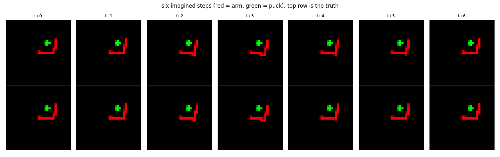
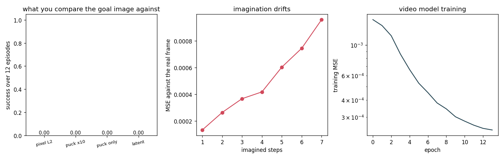

# World-Model Rollout

## Key Insight

Planning actions using a learned [world model](/shared/glossary/#world-model) allows a robot to evaluate action sequences in imagination before executing them in the physical world. By performing a [world-model rollout](/shared/glossary/#world-model-rollout) over a sequence of candidate actions, the system generates predicted future video frames or states. A planning agent can then score these trajectories based on their visual similarity to a goal image and select the action sequence that is predicted to yield the most successful outcome.

**This is project 72.** It trains an action-conditioned video model on play data, checks that its imagination is good — **4.7× better than copying the input, and still recognisable after seven imagined steps** — and then plans with it against a goal *picture* rather than a goal *number*. The result is a clean null: **all four ways of comparing an imagined frame to a goal image score 0.000**, on a task that [project 60](../60-world-model-planning/README.md)'s planner solves at **0.833** using the same search over a state-space model. The model is fine. The **goal image** is what does not work, and the reason is worth more than a success would have been.

---

## Files

| file | what it is |
|---|---|
| `video.py` | the renderer, the video model, the four planning costs, CEM |
| `run.py` | the six experiments |
| `outputs/` | figures and `results.csv` |

```bash
python3 run.py    # about 8 minutes on an idle 12-core machine
                  # (775 s measured while sharing it); needs numpy, torch,
                  # matplotlib
```

---

## What is different from project 60

Project 60 already planned with a learned model, so it is worth being exact
about the change. There, the model predicted the **six numbers** that describe
the world (joint angles, joint speeds, puck position) and the planner scored a
plan by computing the distance from the puck to the goal. Both of those require
somebody to have already decided what the state variables are and what the goal
means as a number.

Here the model sees **pictures** and the goal is **a picture**. Nothing tells it
that there is a puck, or that pucks have positions.

That is the world-model bet in one sentence: **video is a format every task can
be written in**, so a model that predicts video could in principle be planned
with for any task, with no hand-written state and no hand-written reward. This
project is the smallest test of whether the second half of that sentence
survives contact with a robot.

The robot sees a 32 × 32 two-channel image — channel 0 the arm, channel 1 the
puck. Splitting them is deliberately generous: a real camera tangles them
together and separating them is a perception problem of its own. Handing the
planner the already-solved version means that when it fails, it cannot be blamed
on segmentation.

The goal image is the same render with the puck at the goal. **There is no goal
marker in the picture: the goal *is* the picture.**

---

## 1. The model is good

Trained on 9600 transitions of play — random flailing mixed with a noisy
scripted controller. **No demonstrations.** That is the other half of the
world-model bet: a policy needs somebody who already knows how to do the task,
while a model only needs the robot to move.

The model predicts the **change** to the frame rather than the frame itself.
Two consecutive frames are nearly identical — a decision moves the arm a few
pixels — so a model asked for the absolute frame spends its capacity redrawing
what it was handed, and a copy of the input already scores well. Predicting the
residual makes the thing being learned the thing we care about.

```
one-step MSE                        0.00033
copy-the-input baseline             0.00157      <- 4.7x worse
```



| imagined steps | MSE against the real frame |
|---|---|
| 1 | 0.00013 |
| 3 | 0.00037 |
| 5 | 0.00060 |
| 7 | 0.00096 |

**Error grows about 7× over seven steps, sub-linearly**, and the pictures stay
legible: the arm is in roughly the right place and the puck is still a puck.
This is a working world model, and the planning horizon used below (five steps)
sits comfortably inside the range where it is trustworthy.

---

## 2. Planning on the picture

The planner is **CEM**, the Cross-Entropy Method. The name comes from its
origins in rare-event simulation, where the algorithm minimises the
*cross-entropy* — a distance between probability distributions — between a
sampling distribution and the ideal one concentrated on the best outcomes. What
it does is much simpler than the name: sample a batch of random action
sequences, keep the best few ("elites"), refit a Gaussian to those, sample
again.



| what the imagined frame is compared against | success | final puck error |
|---|---|---|
| raw pixel L2 to the goal image | **0.000** | 113 mm |
| puck channel weighted 10× | **0.000** | 110 mm |
| puck channel only | **0.000** | 114 mm |
| distance in the model's own encoder features | **0.000** | 113 mm |

**Every one of them scores zero**, and the final puck error is essentially the
starting distance — the puck barely moves. For contrast, project 60's CEM over a
*state* model, on this same task, scores **0.833**.

Four different cost functions, one working model, one working search, and total
failure. That is a strong hint that the problem is neither the model nor the
search.

---

## 3. Why: the picture has no gradient

The first suspicion is that the arm drowns out the puck — it is a bigger object:

```
arm pixels    19.1
puck pixels    5.9
arm : puck     3.25
```

That is real, and it is not the explanation, because weighting the puck channel
10× and using the puck channel *alone* both change nothing. The measurement that
does explain it is this one:

```
share of the pixel error that lives in the puck channel    1.00
```

At the start of an episode the goal image and the current image differ **only**
in the puck channel — the goal image is rendered with the arm exactly where it
is. So the cost is already a pure puck-distance measure, and it still fails.

The reason is that **the cost is flat**. Every pixel of the puck's five is
either fully on or fully off; moving the arm to *within a centimetre* of the
puck changes the puck's pixels not at all, so every candidate action sequence
that does not already touch the puck scores identically. CEM cannot climb a
plateau. Its elites are a random subset, its Gaussian never narrows onto
anything, and the arm wanders.

Project 60 measured exactly this and named it: a pure distance-to-goal cost gave
**0.083**, "flat until contact — no gradient to climb". It fixed it by adding one
hand-computed term rewarding the arm for getting *behind* the puck, which took it
to 0.833.

And that is the uncomfortable conclusion. **The hand-written term project 60
added is precisely the thing goal-image planning promises to make unnecessary.**
The promise is "you need no reward function, just show it a picture of what you
want". The measurement is that without a reward function shaped by someone who
understands the task, nothing moves at all.

> **Does this mean goal images never work?** No — and the condition is legible
> from the failure. A goal-image cost works when the *thing being scored moves
> continuously with the action*: a reaching task, a camera pose, a drawer that
> slides. It fails on tasks where progress is discontinuous — contact,
> insertion, anything where the first 90 % of the effort changes zero pixels.
> **Before choosing a goal image, ask whether a small good action changes the
> picture at all.** For pushing, it does not.

---

## 4. The planner believes its own model, slightly too much

For each cost, what the planner *predicted* its chosen plan would achieve
against what the plan actually achieved:

| cost | imagined | realised | ratio |
|---|---|---|---|
| pixel L2 | 0.00503 | 0.00543 | **1.08×** |
| puck × 10 | 0.04388 | 0.05057 | 1.15× |
| puck only | 0.00589 | 0.00985 | **1.67×** |
| latent | 0.00015 | 0.00025 | 1.62× |

The outcome is always worse than imagined, never better — the planner is
systematically optimistic. This is **model exploitation**: the search is
explicitly looking for the action sequence the model likes best, so it finds
wherever the model is wrong in a flattering direction. It is the planning
analogue of overfitting, and it is why a model-based planner needs its plans
scored against reality on a schedule, not just against itself.

The size of the optimism is informative too. The sharper the cost (puck only,
latent), the larger the gap — 1.6× against 1.1× for the blunt one. **A cost that
discriminates more finely between imagined futures also discriminates more finely
between the model's errors.**

---

## 5. The price

```
seconds per episode of pixel planning     1.11
model calls per replan                    24 x 5 x 2
model parameters                          528002
```

A little over a second per episode of *simulated* time, versus a policy network
that answers in under a millisecond. Planning in pixels costs roughly a thousand
times more compute per decision than a cloned policy, and here it bought a
success rate of zero.

> **One performance note that cost forty minutes.** The first version set
> `torch.set_num_threads(12)` for the whole script. Training likes that; CEM
> does not. A planning iteration is a batch of 24 tiny 32 × 32 convolutions, and
> splitting that across twelve cores spends more time at the thread barrier than
> on the arithmetic — the same effect [project 64](../64-latency-budget-instrument/README.md)
> measured on a 64 × 64 matmul, and the same one [project 73](../73-cbf-safety-filter/README.md)
> measured as a 55× slowdown. Dropping to two threads for the planning sections
> is the whole fix. **Thread counts are not a global setting; they are a
> per-workload setting.**

---

## What to remember

- **The world model worked** — 4.7× better than copying the input, and legible
  after seven imagined steps. The failure below is not the model's.
- **All four goal-image costs scored 0.000**, on a task the same search solves at
  0.833 from state. Four different costs failing identically points at the
  objective, not the optimiser.
- **The pixel cost is flat**, not noisy: until the arm touches the puck, no
  candidate plan changes a single puck pixel, and CEM cannot climb a plateau.
- **The hand-written shaping term that fixes it is exactly what goal images were
  supposed to eliminate.** That is the honest state of the idea, not an argument
  against it.
- **Ask whether a small good action changes the picture.** If it does not, a
  goal image is the wrong objective — reaching yes, pushing no.
- **The planner was optimistic by 1.08–1.67×**, more so for sharper costs. Score
  plans against reality, not against the model that proposed them.
- **Thread count is per-workload.** Twelve threads for training, two for
  planning; the wrong choice cost 40 minutes per run.

---

Next: [project 73](../73-cbf-safety-filter/README.md) stops trying to make a
policy choose good actions and starts refusing the dangerous ones.
