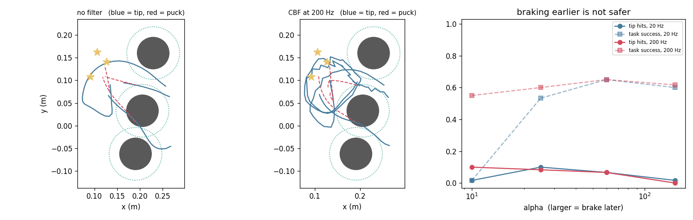
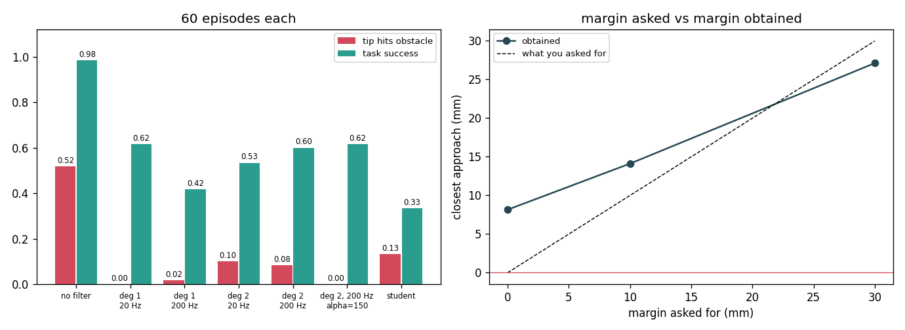

# CBF Safety Filter

## Key Insight

Wrapping a learned [policy](/shared/glossary/#policy) with a [Control Barrier Function (CBF)](/shared/glossary/#cbf) safety filter guarantees physical safety without requiring the policy itself to learn complex constraint boundaries. The safety filter monitors the robot's state and projects the policy's raw control inputs onto a mathematically safe set of actions. If the learned policy proposes a command that would lead to a collision or joint limit violation, the filter minimally modifies the command to ensure safety while preserving the original policy's intent as much as possible.

**This is project 73.** It drops a round obstacle into [project 54](../54-behavior-cloning-on-a-sim-arm/README.md)'s push task, where a cloned policy that has never seen an obstacle hits it in **52 %** of episodes, and wraps that policy — unchanged, unretrained — in a barrier function. Collisions go to **0.000**. Three things come out of it that the word "guarantee" does not prepare you for: the price is **37 points of task success**, **braking earlier made it less safe, not more**, and the puck the robot is pushing goes on hitting the obstacle at the same rate, because **the barrier protects exactly the thing you wrote it about and nothing else.**

---

## Files

| file | what it is |
|---|---|
| `cbf.py` | the barrier, the QP, the two enforcement rates, the scene generator |
| `run.py` | the seven experiments |
| `outputs/` | figures and `results.csv` |

```bash
python3 run.py    # about 4 minutes; needs numpy, torch, matplotlib
```

---

## The barrier

Define one number that is positive exactly when the robot is safe:

```
h(q) = || tip(q) − c ||  −  r_safe
```

`c` is the obstacle centre; `r_safe` is its radius plus the fingertip radius
plus a margin. `h > 0` means outside, `h = 0` is the surface, `h < 0` means
already inside.

The word **barrier** comes from optimisation, where a term is added to a cost so
that it blows up at the edge of the feasible region and pushes the optimiser
away. Nothing blows up here. Instead we add a single inequality:

```
ḣ  ≥  −α · h
```

In plain language: **you may move towards the obstacle, but the closer you get,
the slower you have to approach.** Far away (`h` large) the constraint is loose.
At the surface (`h = 0`) it says `ḣ ≥ 0` — do not get any closer. `α` sets how
late you are allowed to brake: large `α` is a late, aggressive brake; small `α`
is a cautious one, braking from far away.

The **control** in *control barrier function* is the operative word: the
inequality is written in terms of the control input, so it can be *enforced by
choosing the control*, which is what makes it a filter rather than a warning.

### Relative degree: why the textbook condition is unenforceable here

The action is a joint-*position* command, and the arm follows it through a PD
servo and its own inertia. So the action does not set the tip's velocity; it
sets the tip's **acceleration**. Differentiate `h` once and the action is not in
the formula. Its [relative degree](/shared/glossary/#relative-degree) is 2 —
"degree" counting differentiations, the way a polynomial's degree counts
multiplications — and a constraint on `ḣ` is a constraint on a quantity the
action cannot change this instant.

The fix is a **high-order CBF**. Build an intermediate barrier
`ψ = ḣ + α₁h` and require `ψ̇ ≥ −α₂ψ`. Now `ψ̇` contains `q̈`, which *is* affine
in the action. Keeping `ψ ≥ 0` keeps `ḣ ≥ −α₁h`, which keeps `h ≥ 0`: two nested
brakes, an outer one on distance and an inner one on closing speed.

### The QP

Both versions end up in the same shape — one linear inequality `g·a ≥ b` on the
two-number action:

```
minimise  ||a − a_policy||²    subject to   g · a ≥ b
```

That is a **quadratic program** (quadratic cost, linear constraints). With a
single constraint the solution is one line: if the policy's action already
satisfies it, pass it through untouched; otherwise project it onto the
half-plane. No solver needed.

Note what "changes the command as little as possible" is doing here. It means
*least-squares distance in action space*, which is a choice, not a fact. A
filter that minimised the change in tip velocity, or in torque, would produce a
different action from the same constraint.

---

## 0. Building a scene the experiment can survive

Two scene bugs cost real time and are worth stating, because both would have
silently turned the project into a measurement of the bug.

**Dead centre is not a hard scene, it is an impossible one.** The first version
put the obstacle on the straight line from the tip to the puck. Every method
scored near zero, including the good ones, and nothing was measurable. The
obstacle now sits on the *arc* the tip has to sweep to get behind the puck,
offset to one side, so a detour exists.

**A CBF cannot rescue an episode that starts inside the barrier.** It promises
to keep you in the safe set, not to get you back into it. The second version
generated scenes where the obstacle was already within `r_safe` of the tip at
`t = 0`; the filter dutifully did nothing useful and the collision rate looked
like a failure of the mathematics. `obstacle_between()` now rejects those, and
`run_episode` reports the starting clearance so the rejection can be checked
rather than trusted:

```
clearance at the start of an episode    81 mm     (r_safe is 58 mm)
```

---

## 1. The policy, and the obstacle it has never seen

| | success | tip hits obstacle | closest approach |
|---|---|---|---|
| clean task, no obstacle | 0.983 | — | — |
| **same policy, obstacle present** | **0.983** | **0.517** | −0.6 mm |

The policy is *unaffected by the obstacle* — it scores the same, because
nothing in its training data ever punished a collision. It walks straight
through it half the time and completes the task anyway. **A policy that has
never been penalised for a hazard is not cautious about it; it is blind to it.**

---

## 2. Checking the constraint against the simulator, not against itself

Before trusting any of the numbers below, the analytic `ḧ` has to be right. The
tempting check — differentiate the formula numerically and compare with the
formula — proves only that the arithmetic is self-consistent. Instead: hold the
command fixed, integrate the **real arm** two tiny steps, take a second
difference of `h`, and compare.

```
median relative error   3.27e-03
worst of 60 states      1.46e-02
```

That is the whole chain verified at once — mass matrix, Coriolis terms, joint
damping, servo gains, the Jacobian's own time derivative. A wrong mass matrix
would not survive this check, and would survive the self-consistent one.

> An earlier version of this check reported **75 % error** and sent the
> investigation looking for a bug in the constraint. There was none: the check
> walked a single episode forward for sixty samples and ended up in postures no
> policy ever visits, including near-singular ones where both the analytic and
> the numeric second derivative are large and ill-conditioned. **A verification
> that fails tells you something is wrong with the verification or the thing
> verified, and it is worth deciding which before rewriting the maths.**

---

## 3. Order and rate



Two knobs that get conflated: *which* condition you enforce (relative degree 1
or 2) and *how often* you enforce it (once per policy decision at 20 Hz, or once
per physics tick at 200 Hz). At α = 25:

| | success | tip hits | filter active |
|---|---|---|---|
| degree 1, 20 Hz | **0.617** | **0.000** | 0.43 |
| degree 1, 200 Hz | 0.417 | 0.017 | 0.47 |
| degree 2, 20 Hz | 0.533 | 0.100 | 0.63 |
| degree 2, 200 Hz | 0.600 | 0.083 | 0.36 |

**The theoretically wrong filter is the best row in the table.** The first-order
condition is unenforceable here — section "relative degree" says so — and it
nevertheless reaches zero collisions at the highest task success.

This is not a refutation of the relative-degree argument; it is a lesson about
*which direction* an approximation errs in. The first-order filter treats the
position command as if it were an instantaneous velocity, `DQ_MAX·a / dt`. That
overstates how fast the arm can move toward the obstacle, so the filter brakes
earlier than the physics requires. **Being wrong in the conservative direction
is a real engineering strategy**, and on a system with a fast inner servo it is
often good enough. What it does not give you is the *guarantee*; it gives you a
margin whose size you did not compute.

The rate matters more than the order, and not in the direction the theory
suggests — enforcing the first-order condition ten times as often made it
*worse* (0.617 → 0.417). Which leads to the next section.

---

## 4. Braking earlier made it less safe

The α sweep, at both rates, degree 2:

| α | 20 Hz: success / hits | 200 Hz: success / hits | filter active (200 Hz) |
|---|---|---|---|
| 10 | **0.017** / 0.017 | 0.550 / 0.100 | 0.54 |
| 25 | 0.533 / 0.100 | 0.600 / 0.083 | 0.36 |
| 60 | **0.650** / 0.067 | **0.650** / 0.067 | 0.25 |
| 150 | 0.600 / 0.017 | 0.617 / **0.000** | 0.23 |

Small α means "brake from far away", which sounds like the safe setting. It is
the *least* safe setting in this table: at 200 Hz, α = 10 collides in 10 % of
episodes and α = 150 in none.

The "filter active" column explains it. At α = 10 the filter overrides the
policy on **54 %** of ticks; at α = 150, on 23 %. A filter that is always active
is no longer filtering a policy — it *is* the policy, and it is a policy whose
only objective is to not approach the obstacle. The arm ends up loitering next
to the barrier, at nearly zero clearance, for a long time. It spends far more
*time* near the obstacle than a robot that goes past quickly, so every remaining
source of error — the 20 ms between enforcement instants, the action box, model
mismatch — gets many more chances to bite.

And at 20 Hz with α = 10, task success collapses to **0.017**: the classic CBF
deadlock. The robot is safe and does nothing. **A safety filter always has a
setting at which it is perfectly safe and perfectly useless**, and the useless
end of the range is closer than it looks.

The practical reading: **tune α by watching the intervention rate, not the
collision rate.** A filter intervening on more than a third of steps is a design
error, whatever it scores.

---

## 5. The margin you ask for and the margin you get



| margin asked | closest approach obtained | success | tip hits |
|---|---|---|---|
| 0 mm | **+8.2 mm** | 0.650 | 0.350 |
| 10 mm | +14.1 mm | 0.650 | 0.067 |
| 30 mm | +27.1 mm | 0.283 | 0.000 |

Two things at once. The *average* closest approach always exceeds what was
asked — the filter is conservative on a typical episode. And yet at 0 mm the
robot still touches the obstacle in 35 % of episodes. **A mean margin of +8 mm
and a 35 % contact rate are the same experiment.** Averages of a safety quantity
are close to meaningless; what matters is the worst episode, and the tail is
where the filter's assumptions break.

Asking for 30 mm buys zero collisions and costs more than half the task
(0.650 → 0.283). The margin is not a free safety knob either; it is the same
trade in different units.

---

## 6. The barrier protects exactly what you wrote it about

The best configuration found (degree 2, 200 Hz, α = 150):

| | no filter | filtered |
|---|---|---|
| task success | 0.983 | **0.617** |
| **tip** hits obstacle | 0.517 | **0.000** |
| **puck** hits obstacle | 0.200 | **0.267** |

**The tip stops hitting the obstacle. The puck does not.** If anything it hits
slightly more often, because the detour the filter forces sometimes shoves the
puck along a different line.

This is not a bug and it is not a limitation of CBFs. It is the definition
working correctly. `h` was written about `tip(q)`. The puck is not a function of
`q` at all — it moves only when it is touched — so it cannot appear in a barrier
of this form, and no amount of tuning brings it under protection. Protecting the
puck needs a second barrier, on a quantity whose dynamics you can write down, and
that quantity's relative degree with respect to the action would have to be
worked out from scratch.

**Whenever you are handed a safety guarantee, the first question is not "is the
proof correct?" but "what is the proof about?"** Here it is about a single point
on the robot. The links between that point and the base are unprotected. So is
everything the robot is carrying.

### The box constraint is a hole in the guarantee

The QP has no constraint saying the action must stay in [−1, 1], so its answer
sometimes does not, and clipping it afterwards voids the inequality that was
just enforced:

```
steps where the QP answer left [-1, 1]     2.7 %
tip hits with the box ignored              0.000
tip hits with the box respected            0.067
```

Two point seven per cent of steps, and it is the entire difference between
0.067 and 0.000 collisions at α = 60. A guarantee derived from an unbounded
input is not a guarantee for a robot with actuator limits. The correct treatment
adds the box to the QP, discovers the problem is sometimes **infeasible**, and
forces you to answer what the robot should do when no safe action exists —
which is the honest question, and one that "wrap it in a CBF" quietly skips.

---

## 7. Can a student just learn to be safe?

Run the filtered policy for 300 episodes, record 12 229 (observation, filtered
action) pairs — with the obstacle's position added to the observation, since the
student has to see what it is avoiding — and clone it.

| | success | tip hits | closest approach |
|---|---|---|---|
| teacher (policy + filter) | 0.617 | **0.000** | +14.8 mm |
| student (cloned from filtered data) | 0.333 | **0.133** | +13.4 mm |

**A student trained entirely on safe data is not safe.** It collides in 13 % of
episodes, and it also loses half the task performance, because it is now trying
to imitate a teacher whose behaviour switches discontinuously between "follow
the policy" and "brake hard" — a much harder function to fit than either piece.

This is the sharpest statement of what a filter is for. Behaviour cloning
matches the teacher *on average over the training distribution*; safety is a
property of the **worst** state, and the worst states are precisely the rare
ones. The filter is not a better teacher; it is a different kind of object — a
runtime check, evaluated on the state you are actually in, including states no
training set contained.

So: **distil for performance, filter for safety, and never confuse the two.**
Keeping the filter costs a few hundred microseconds per tick and is the only
part of the stack that is checkable.

---

## What to remember

- **A policy that has never been punished for a hazard is blind to it**: 0.517
  collisions, and its task score was unchanged by the obstacle's presence.
- **Relative degree 2** means the action only appears in `ḧ`, so the textbook
  first-order condition is unenforceable — but its error is *conservative*, and
  it matched the correct version here (0.000 hits, 0.617 success).
- **Safety cost 37 points of task success** (0.983 → 0.617). There is no setting
  where it was free.
- **Braking earlier made it less safe.** α = 10 collided in 10 % of episodes and
  α = 150 in none, because a filter active on 54 % of ticks parks the arm next to
  the obstacle. Tune α by the intervention rate.
- **A mean margin of +8 mm and a 35 % contact rate are the same experiment.**
  Report the worst episode, never the average.
- **The barrier guarded the tip; the puck went on hitting the obstacle** (0.200
  → 0.267). Ask what a guarantee is *about*, not just whether it is valid.
- **2.7 % of QP answers left the action box**, and that 2.7 % was the whole
  difference between zero collisions and 6.7 %.
- **A student cloned from perfectly safe data collided 13 % of the time.**
  Distil for performance, filter for safety.

---

Next: [project 74](../74-long-horizon-eval/README.md) stops asking whether a
single decision is safe and asks what happens when fifty of them have to work in
a row.
