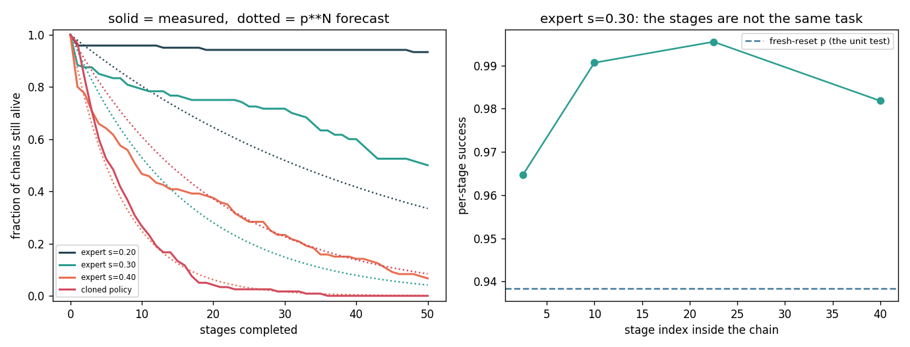
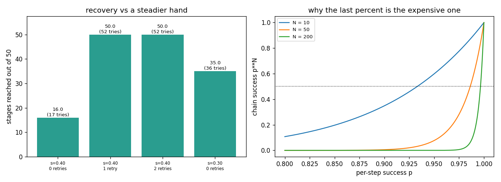

# Long-Horizon Eval

## Key Insight

Evaluating robot policies on short tasks can lead to a false sense of security because small execution errors compound exponentially over extended sequences. In [long-horizon autonomy](/shared/glossary/#long-horizon-autonomy), a single failure in a multi-step sequence (such as a 50-step assembly task) invalidates the entire run, making recovery behaviors critical for success. Developing a rigorous [evaluation harness](/shared/glossary/#evaluation-harness) that specifically measures how error rates compound across sequential phases allows engineers to identify and resolve fragile points in the control pipeline.

**This is project 74.** It builds a fifty-stage task on [project 54](../54-behavior-cloning-on-a-sim-arm/README.md)'s push, measures the per-stage success rate the way a unit test would, and then compares the forecast `p⁵⁰` with what fifty stages actually do. The forecast is wrong by **two orders of magnitude, in both directions**: for one system it predicted 0.0009 and the truth was 0.067, and for another it predicted 0.084 and the truth was 0.000. And the cheapest fix in the whole project — **letting a failed stage be retried once** — took a system from 6.7 % to **100 %** for a 4 % increase in effort.

---

## Files

| file | what it is |
|---|---|
| `chain.py` | the fifty-stage task, the two systems under test, the process pool |
| `run.py` | the six experiments |
| `outputs/` | figures and `results.csv` |

```bash
python3 run.py    # about 8 minutes on 12 cores (915 s measured with six
                  # workers on a busy machine); needs numpy, torch, matplotlib
```

---

## The task

One puck. Fifty goal discs in a row, each 9–13 cm from wherever the puck
currently is. Reach a goal and the next one appears. **Nothing is reset between
stages** — the arm stays where the last push left it, the puck stays where it
came to rest, and any small error is inherited by the next stage. A stage gets
45 decisions; if the puck is not on the goal by then, the stage failed and
(unless recovery is switched on) the whole run is over.

Two systems drive it:

- a **noisy scripted controller** — the demonstrator from project 54 with
  Gaussian noise of standard deviation σ added to every action. σ is a clean
  dial for per-stage reliability that is not tangled up with how well some
  network happened to train.
- a **cloned policy** — behaviour cloning on 400 demonstrations, the realistic
  system.

> **Why measure per-stage success two different ways?** Because they are two
> different numbers and the gap between them is the subject of this project.
> **Fresh**: reset the world, sample a puck and a goal from the same
> distribution, run one stage. That is what a unit test does and what project
> 69's harness reports. **In-chain**: the success rate of stage *k* inside a
> real fifty-stage run. If the stages were independent and identical, these
> would agree. They do not.

---

## 1. The forecast, and how wrong it is



| system | fresh per-stage `p` | forecast `p⁵⁰` | **observed 50-stage success** | mean stages reached |
|---|---|---|---|---|
| scripted, σ = 0.20 | 0.9783 | 0.334 | **0.933** | 47.3 / 50 |
| scripted, σ = 0.30 | 0.9383 | 0.042 | **0.500** | 35.0 / 50 |
| scripted, σ = 0.40 | 0.8700 | 0.0009 | **0.067** | 16.0 / 50 |
| cloned policy | 0.9517 | 0.084 | **0.000** | 7.0 / 50 |

Read the last two columns together. For the scripted controllers the forecast
is **far too pessimistic** — `p⁵⁰` said one run in a thousand would finish and
one in fifteen did, a **74× error**. For the cloned policy it is **far too
optimistic** — `p⁵⁰` said one run in twelve and the true answer was *none, ever*.

The same formula, the same task, and it is wrong in opposite directions
depending on which system you point it at. That is worth stating plainly:
**`p⁵⁰` is not a conservative estimate, a rough estimate, or a lower bound. It
is an estimate whose sign of error you cannot predict without doing the
experiment it was supposed to replace.**

`p ** N` is only valid if the stages are **independent** and **identically
distributed** — i.i.d., the assumption behind almost every "×" in probability.
A chain breaks both, and the next two sections take them one at a time.

---

## 2. The stages are not identical

For the σ = 0.30 controller, per-stage success as a function of *where in the
chain the stage is*:

| stages | per-stage success | attempts measured |
|---|---|---|
| 0–5 | **0.9647** | 538 |
| 5–15 | 0.9907 | 963 |
| 15–30 | **0.9955** | 1334 |
| 30–50 | 0.9818 | 1431 |

**The chain gets easier, not harder.** The first few stages are the hardest,
because every episode begins with the arm folded back and away from the puck —
the first stage has to include a long approach that later stages do not, since
the arm is already next to the puck when the previous stage ends.

This is exactly what makes `p⁵⁰` too pessimistic here: the fresh measurement
draws *every* stage from the "cold start" distribution, which is the worst one,
and then raises that number to the fiftieth power. It is measuring stage 1 fifty
times.

The moral is not "chains are easier than they look". It is that **the
distribution a unit test samples from is a choice, and it is usually the
convenient one rather than the representative one.**

---

## 3. The chains are not independent of one another

Same system, looking at how far the 120 chains got:

```
mean stages reached          35.05
standard deviation           19.21
std a coin-flip model says    0.12     <- 160x too small
chains dead within 5 stages   15.8 %
chains that finished all 50   50.0 %
```

If every stage really were an independent coin flip with the same `p`, the
number of stages a chain survives would follow a **geometric distribution** —
the "how many heads before the first tail" distribution — and its spread would
be fixed once you know `p`. At `p = 0.986` that spread is 0.12 stages. The
measured spread is **19.21 stages, 160× larger.**

The shape says why: the outcome is close to **bimodal**. Either the chain dies
almost immediately (16 % of runs) or it sails all the way to the end (50 % of
runs). Very little lands in between. What actually varies is not luck within a
run but **which run you got**: some initial arm-and-puck placements are simply
awkward for this controller, and those chains die at stage 1 or 2 no matter how
many coins you flip.

**Practical consequence:** a fifty-stage success rate of 0.50 does not mean "each
stage is a bit shaky". Here it means "half of your scenes are fine and half are
broken from the first move" — a completely different engineering problem, and
one that the aggregate number hides. Look at the histogram of *where* chains
died before you tune anything.

This is also why the error bar on a long-horizon number is worse than it looks.
Project 69 found a harness whose interval was 7.2× too narrow because 1000
episodes contained 20 distinct placements; here the same disease appears from
the other side — the chains are so strongly determined by their opening scene
that 120 chains carry much less information than 120 independent trials would.

---

## 4. Recovery beats reliability, by a lot

Let a failed stage be attempted again from wherever the failure left the world,
rather than ending the run.



| system | 50-stage success | stages reached | stage attempts used |
|---|---|---|---|
| σ = 0.40, no retry | 0.067 | 16.0 | 16.9 |
| **σ = 0.40, one retry** | **1.000** | **50.0** | **52.3** |
| σ = 0.40, two retries | 1.000 | 50.0 | 52.3 |
| σ = 0.30, no retry | 0.500 | 35.0 | 35.5 |

**One retry took the worst system in the study from 6.7 % to 100 %, and it cost
2.3 extra stage attempts out of 52** — about 4 % more work. A second retry
bought nothing, because after one retry almost nothing fails twice.

Compare that with the alternative: making the controller steadier. Going from
σ = 0.40 to σ = 0.30 — a 25 % reduction in action noise, which on a real robot
means better hardware, more data, or more tuning — bought 0.067 → 0.500. One
retry bought 0.067 → 1.000, for free.

**Why is retrying so cheap here, when the failure rate is 13 % per stage?**
Because failures in this task are *recoverable*: the stage budget ran out with
the puck near but not on the goal, and starting the stage again from that state
is an easier problem than the original stage was. The retry does not repeat the
work; it continues it.

That is the general condition, and it is worth naming because it does not always
hold. Recovery is enormously valuable when a failure leaves the world in a state
you can still act from, and worth nothing when a failure is terminal — a dropped
egg, a stripped screw, a robot on its side. **The first question to ask about a
long-horizon system is not "what is my per-step success rate?" but "what fraction
of my failures are recoverable?"** Detecting the failure at all is the
prerequisite, which is why "did this stage succeed?" deserves as much
engineering as the controller does.

---

## 5. The arithmetic you should have in your head

| per-step `p` | `p⁵⁰` | stages before you are at 50 % |
|---|---|---|
| 0.999 | 0.951 | 692 |
| 0.99 | 0.605 | 68 |
| 0.98 | 0.364 | 34 |
| 0.95 | 0.077 | 13 |
| 0.90 | 0.005 | 6 |
| 0.80 | 0.000 | 3 |

Turned around, which is the useful direction:

- to finish 50 steps **half** the time you need `p = 0.98623`;
- to finish 50 steps **99 %** of the time you need `p = 0.999799`.

**Three nines per step buys you one coin flip over fifty steps.** This is why
demos are easy and deployments are hard: the same policy that looks like a
success at 95 % per step is a 13-step robot, and no amount of enthusiasm moves
it to 50. The curve is `p^N`, it is brutally steep near 1, and the last fraction
of a percent per step is where all the engineering goes.

It is also why section 4 matters so much. Recovery does not raise `p`; it
changes what a failure *costs*, which moves you off this curve entirely.

---

## 6. A long chain is the most sensitive regression test you own

Take the σ = 0.20 controller and quietly make its hand shakier (σ = 0.20 → 0.26)
— the sort of change a refactor causes without anyone noticing.

| | base | regressed | change |
|---|---|---|---|
| per-stage `p` | 0.9783 | 0.9567 | −0.0217 |
| stages reached out of 50 | 46.5 | 41.9 | **−9.8 %** |

**Amplification: 4.5×.** A 2.2-point drop in per-stage success shows up as a
9.8 % drop in how far the robot gets. And because the chain-level number is a
count rather than a coin flip, it is much cheaper to measure:

| test | trials needed to see the change at 95 % confidence |
|---|---|
| per-stage success | **513 stage trials** |
| stages-reached in a chain | **74 chains** (= 3441 stage attempts) |

Read that carefully, because it cuts both ways. In *chains* the long test is 7×
cheaper to run — 74 nightly episodes instead of 513. In *total stage attempts*
it is 6.7× more expensive, because each chain contains ~47 stages. So:

- if your budget is **wall-clock time on a robot**, the per-stage test wins;
- if your budget is **episodes you have to set up, watch and reset**, which on
  real hardware is usually the binding constraint, the long chain wins;
- and only the long chain measures the thing you actually shipped.

**The chain is a magnifier.** That is the argument for keeping one long task in
a nightly suite that is otherwise made of short ones — not because long tasks
are more realistic, though they are, but because they turn small per-step
regressions into large, obvious numbers.

---

## What to remember

- **`p⁵⁰` was wrong by 74× in one direction and infinitely in the other**, on the
  same task, depending on the system. It is not a bound.
- **The stages were not identical** — the first five were the hardest (0.965 vs
  0.996), so a fresh-reset unit test measures stage 1 fifty times.
- **The chains were not independent** — spread 160× wider than a coin-flip model
  allows, because the outcome is decided by the opening scene: 16 % died in five
  stages, 50 % finished all fifty.
- **One retry: 0.067 → 1.000, for 4 % more effort.** Reducing action noise by
  25 % bought 0.067 → 0.500. Recovery beat reliability by a mile — *because these
  failures were recoverable*. Ask that question first.
- **Fifty steps at 99 % needs `p = 0.9998` per step.** Three nines per step is a
  coin flip over fifty.
- **A long chain amplified a 2.2-point per-step regression into a 9.8 % drop**
  and needed 74 episodes instead of 513 to detect it.

---

Next: [project 75](../75-cross-embodiment-study/README.md) takes a policy that
works on one robot and puts it on a different one, and takes the resulting gap
apart the same way this project took `p⁵⁰` apart.
