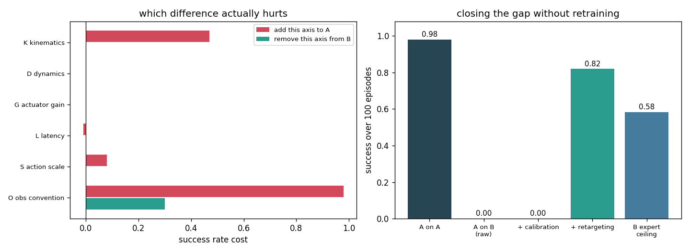
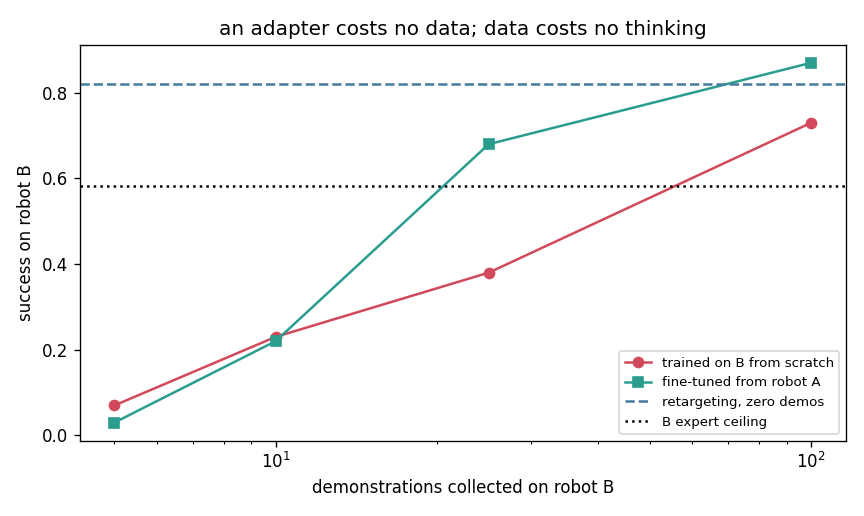

# Cross-Embodiment Study

## Key Insight

Deploying a policy trained on one robot physical form directly onto a different robot platform reveals a transfer gap driven by differences in kinematics, dynamics, and sensor configurations. Conducting a structured [cross-embodiment](/shared/glossary/#cross-embodiment) study characterizes how these physical discrepancies degrade performance and identifies which features generalize across platforms. By quantifying this gap, researchers can design better action-mapping layers and domain randomization techniques to facilitate zero-shot transfer similar to [sim-to-real](/shared/glossary/#sim-to-real) techniques.

**This is project 75.** It takes a policy that scores 0.98 on robot A, runs it on robot B, and gets **0.00**. Then it takes the gap apart, one difference at a time. The largest single cause is not the kinematics, the mass, or the motors — it is that **robot B's second encoder counts the other way**, which is worth the entire 0.98 on its own. And the fix that closes most of the gap needs **no demonstrations at all**: a [retargeting](/shared/glossary/#retargeting) layer that translates through the tool tip recovers 0.00 → **0.82**, where 100 demonstrations collected on robot B reach 0.73.

---

## Files

| file | what it is |
|---|---|
| `embody.py` | the two robots, the six axes, the retargeting layer |
| `run.py` | the six experiments |
| `outputs/` | figures and `results.csv` |

```bash
python3 run.py    # about 9 minutes; needs numpy, torch, matplotlib
```

---

## How this differs from project 61

[Project 61](../61-cross-embodiment-fine-tune/README.md) asked the
[Open X-Embodiment](/shared/glossary/#open-x-embodiment) question: *does pooling
many robots' data help a new robot?* (Answer: yes, and it is diversity that
helps, not volume.) This project asks the engineer's question instead:

> **You have a policy that works on robot A and you have to run it on robot B
> tonight. What is going to break, and which fix is worth doing first?**

So robot B is built from robot A by changing one thing at a time, and every
change can be switched on and off independently:

| axis | what changes |
|---|---|
| **K** kinematics | link lengths 0.20/0.18 m → 0.25/0.13 m, same total reach |
| **D** dynamics | link masses ×2.3, joint damping ×2.2 |
| **G** actuator gain | B's motors deliver 0.75× the commanded torque |
| **L** latency | B's command takes one extra control period to arrive |
| **S** action scale | B calls "action = 1.0" 0.70× as many radians |
| **O** obs convention | B's second encoder is reversed and offset by 0.35 rad |

The last two are not physics. They are wiring. They are in the study because in
practice they are what actually happens when a policy moves between robots, and
because the experiment is only honest if the boring failure modes are allowed to
compete with the interesting ones.

> **Why report an expert ceiling next to every number?** Because a low score on
> robot B could mean "the policy does not transfer" or "robot B is a harder
> robot". Those need different work. The scripted controller from project 54 is
> run on every configuration, and it separates them: if the ceiling stays at
> 1.000 and the policy drops, the policy is wrong; if both drop, the task got
> harder.

---

## 1. The gap



| | success | expert ceiling |
|---|---|---|
| policy on robot A (home) | **0.98** | 1.000 |
| policy on robot B (zero shot) | **0.00** | 0.583 |

Total failure. Not degradation — the policy never completes the task once in
100 episodes.

The ceiling says that 0.417 of that is robot B being a harder robot (almost
entirely the latency axis, whose ceiling alone is 0.750). The rest — the drop
from 0.583 to 0.00 — is the policy.

---

## 2. One axis at a time, measured two ways

Two ways to attribute a gap, both obvious, and they disagree:

- **add-one-in**: start from robot A and switch on one axis. "What does this
  difference cost by itself?"
- **leave-one-out**: start from robot B and switch one axis back off. "What
  would I gain by fixing this one?"

| axis | add-one-in cost | leave-one-out gain | expert ceiling for this axis |
|---|---|---|---|
| **O obs convention** | **0.98** | **0.30** | 1.000 |
| **K kinematics** | **0.47** | 0.00 | 0.967 |
| S action scale | 0.08 | 0.00 | 0.983 |
| D dynamics | 0.00 | 0.00 | 1.000 |
| G actuator gain | 0.00 | 0.00 | 1.000 |
| L latency | −0.01 | 0.00 | 0.750 |
| **sum** | **1.52** | — | (whole gap = 0.98) |

Four things fall out of this table.

**The reversed encoder alone destroys the policy.** Add nothing but the flipped
second joint reading and success goes 0.98 → 0.00, while the scripted controller
— which reads the joint angles directly from the simulator rather than from the
observation vector — stays at 1.000. This is not a robotics problem. It is a
units-and-conventions problem, of exactly the kind that a sign error in a driver
produces, and it is bigger than every physical difference put together.

**Dynamics and motor strength cost nothing.** Doubling the link masses and
weakening the motors by 25 % moved the score by 0.00. The [servo](/shared/glossary/#pid)
underneath absorbs both, because the policy commands *positions* and the servo's
job is to hit them whatever the arm weighs. This is the same reason project 52
found a position-space action easier to learn than a torque-space one — you
inherit the low-level loop's robustness for free.

**Latency was slightly *negative* (−0.01) for the policy and cost the expert
0.25.** A delay hurts a fast, reactive feedback controller far more than a
cloned policy that was never that reactive to begin with. Without the ceiling
column, a delay that hurts only the reference implementation would read as
"latency is fine".

**Add-one-in sums to 1.52 for a gap of 0.98, and leave-one-out is 0.00 almost
everywhere.** This is not an inconsistency in the data; it is what a **floor**
does. Once the observation convention has already driven the score to 0.00,
turning off any *other* axis changes nothing — you are still reading the encoder
backwards. And each axis measured alone gets to spend the full budget of an
otherwise perfect robot.

The practical rule is the one project 68 arrived at from the sim-to-real side:
**plan work from leave-one-out, because it answers "what do I gain by fixing
this?", and read add-one-in as a hazard list, because it answers "what would
this cost me on a robot where nothing else is wrong?"** Here leave-one-out is
unambiguous: fix the encoder first, and nothing else is worth touching until you
have.

---

## 3. Calibration: one measured number

The cheapest possible adapter. Wiggle robot B two hundred times, measure how far
its tool moves per unit of commanded action, compare with robot A, and rescale
the policy's output by the ratio.

```
measured tool-motion ratio A/B      1.961
the action-scale factor alone       1.429
```

The measured ratio is larger than the action-scale factor because it also
absorbs the kinematics and the weaker motors — which is the point of measuring
rather than reading it off a datasheet.

On the full robot B it is worth nothing (0.00 → 0.00): you cannot rescale your
way out of an observation that means the wrong thing. On robot B **without** the
encoder flip, where it is the right fix for the right problem:

```
plain        0.300
calibrated   0.500
```

> **A trap this project fell into and left in the code.** The first version of
> the calibration measured motion over the *first* step after a reset. With the
> latency axis on, that step executes a queued zero and the arm does not move at
> all — so the measured gain came out as 7 × 10⁷ and every number downstream was
> garbage. `calibrate()` now discards three warm-up steps. **A black-box
> calibration has to let the black box settle**, and a gain of 7 × 10⁷ is the
> friendly version of that bug; a gain of 1.4 would have shipped.

---

## 4. Retargeting through the tool tip

The real adapter. At every decision:

1. work out what joint angles **robot A** would be in if its tip were where
   robot B's tip is (closed-form 2-link [inverse kinematics](/shared/glossary/#inverse-kinematics));
2. build the observation robot A would report in that pose — **including A's own
   encoder convention**;
3. ask the policy for an action, which is a joint delta *for robot A*;
4. convert it to a tip displacement with A's [Jacobian](/shared/glossary/#jacobian);
5. convert that displacement into joint deltas for robot B ([damped least squares](/shared/glossary/#damped-least-squares)).

> **Why is any of this necessary, when the policy already outputs joint deltas
> that robot B can execute?** Because "joint 1 turns 0.05 rad" is a different
> tool motion on every robot. The quantity the *task* cares about is where the
> tip goes, and the only way to preserve it across two different geometries is
> to convert out of joint space and back in. Nothing about the policy is
> touched — no retraining, no reloading — which is why this is the fix to try
> before you collect a single demonstration.

> **And why step 2, when robot B already produces an observation?** Because
> B's observation encodes B's joint angles, and the policy's first layer learned
> what A's joint angles mean. Handing it B's numbers is like reading a French
> sentence with an English dictionary — the words are there, the meanings are
> not. This step is what fixes the reversed encoder: it never reaches the
> policy, because the policy is shown a synthetic robot-A reading instead.

| | success |
|---|---|
| policy on B, raw | 0.00 |
| **policy on B, retargeted** | **0.82** |

And per axis, so you can see *which* gap it closes:

| axis | plain → retargeted | change |
|---|---|---|
| **O obs convention** | 0.000 → **1.000** | **+1.00** |
| **K kinematics** | 0.510 → **0.970** | **+0.46** |
| S action scale | 0.900 → 0.970 | +0.07 |
| G actuator gain | 0.980 → 1.000 | +0.02 |
| D dynamics | 0.980 → 0.990 | +0.01 |
| L latency | 0.990 → 0.950 | **−0.04** |

**Retargeting fixes geometry and conventions completely, and dynamics not at
all.** That is exactly what it is: a change of coordinates. It cannot change how
the arm responds once the command has been sent, so mass, damping, motor
strength and delay pass straight through — and latency gets marginally *worse*,
because the adapter's extra inverse-kinematics step adds its own lag to a loop
that already had too much.

Note that 0.82 is **above robot B's 0.583 expert ceiling.** That is not an
error; it is the ceiling being the broken thing, which project 69 met from the
other direction. The scripted controller assumes its commands take effect
immediately and over-corrects when they are delayed, while the cloned policy is
sluggish enough not to care. **A ceiling is a reference implementation, not a
law of nature**, and the moment it goes below the system it is meant to bound is
the moment to check the reference rather than the system.

---

## 5. The alternative: collect data on robot B



| demos on B | trained from scratch | fine-tuned from A's policy |
|---|---|---|
| 5 | 0.07 | 0.03 |
| 10 | 0.23 | 0.22 |
| 25 | 0.38 | **0.68** |
| 100 | 0.73 | **0.87** |

Fine-tuning is worth about 0.14–0.30 once there are 25 demonstrations, and
**nothing at all below 10** — with 5 demonstrations it is slightly *worse* than
starting fresh, because the pretrained weights are confidently wrong about a
robot with a reversed encoder and five examples cannot argue them out of it.
(Project 61 saw fine-tuning win from the very first demo; the difference is that
there the robots shared an observation convention.)

Set that against the adapter, which costs zero demonstrations and scores 0.82.
**The zero-demo adapter beats 100 demonstrations collected on the new robot.**

The order of operations that follows is not subtle:

1. **check your conventions** — signs, offsets, units, frame directions;
2. **calibrate** — one number, two hundred wiggles;
3. **retarget** — convert through the tool, it needs no data;
4. **then collect demonstrations**, and fine-tune rather than start over.

Doing (4) first is the expensive way to discover (1). A team that collected 100
demonstrations on robot B here would have got 0.73 and concluded that
cross-embodiment transfer is hard.

---

## 6. The same study, backwards

Everything above could be an artefact of robot B being the awkward one. So train
on B and deploy on A:

| | success |
|---|---|
| policy on B (home) | 0.92 |
| policy on A, zero shot | **0.00** |
| policy on A, retargeted | **0.91** |

The gap is symmetric (0.92 vs 0.98 the other way), and the adapter recovers
essentially all of it in both directions.

That symmetry is itself a finding, and it took a bug to see. The reverse
retargeting scored **0.00** until the adapter was told to synthesise
observations in *robot B's* convention — the reversed encoder — because that is
the convention the policy was trained on. **A retargeting layer must reproduce
the source robot's observation format, quirks included.** A policy trained on a
robot whose encoder reads backwards has learned that convention; handing it a
tidy textbook observation is exactly as wrong as handing it the target robot's
raw one.

---

## What to remember

- **0.98 → 0.00 zero-shot**, and the single largest cause was a reversed
  encoder, worth the entire gap on its own. Check conventions before physics.
- **Dynamics and motor gain cost 0.00.** A position-space action inherits the
  servo's robustness; what does not survive is anything that changes what the
  *numbers mean*.
- **Add-one-in summed to 1.52 for a 0.98 gap and leave-one-out was 0.00 almost
  everywhere** — a floor effect. Plan from leave-one-out.
- **Retargeting through the tool tip: 0.00 → 0.82, with no demonstrations.**
  It fixes geometry and conventions completely and dynamics not at all, because
  it is a change of coordinates and nothing more.
- **The adapter beat 100 demonstrations collected on the new robot** (0.82 vs
  0.73), and fine-tuning was *worse* than from scratch below 10 demos.
- **A calibration that samples the first step after a reset measures a delayed
  robot's zero** — the gain came out as 7 × 10⁷. Let the black box settle.
- **The expert ceiling went below the policy it was meant to bound** on the
  latency axis. Check the reference before the system.

---

This closes Phase 10 and the robotics guide. The through-line across projects
70–75 is that every frontier idea in this phase — language planning, VLAs, world
models, safety filters, long-horizon evaluation, cross-embodiment transfer —
turned out to rest on something unglamorous underneath it:

- **70** — the learned affordance model was worth 0.000 over a precondition check.
- **71** — the language grounding came from the robot data, not the language model.
- **72** — the goal *image*, not the world model, was what made planning fail.
- **73** — the barrier held for exactly the thing it was written about.
- **74** — one retry beat every improvement to the controller.
- **75** — the biggest cross-robot gap was a sign error in an encoder.

None of that argues the frontier ideas are wrong. It argues that they are worth
measuring against the dumbest thing that could work, every single time, because
the dumb thing wins more often than the papers suggest — and when it loses, you
have finally learned something.
