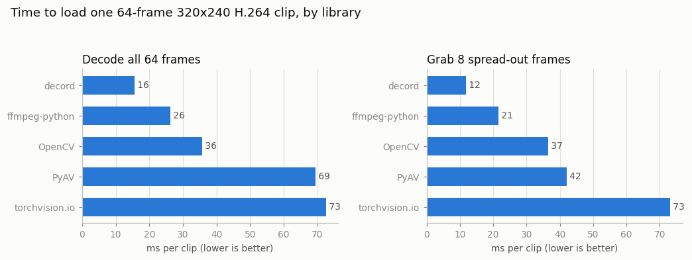

# Video Loader Benchmark

## Key Insight

Most video-training pipelines are bottlenecked on *decoding* the video — turning a compressed file back into frames — not on the GPU doing math, so the library you pick to read frames off disk quietly sets your training speed. This project times four common readers — [decord](/shared/glossary/#decord), `torchvision.io`, PyAV, and `ffmpeg-python` — on the same folder of `.mp4`s and reports decode time per clip. They differ by large factors because each makes different trade-offs around the underlying [video codec](/shared/glossary/#video-codec), CPU threading, and how directly it hands you a [tensor](/shared/glossary/#tensor) instead of a generic image. Finding the winner for *your* data turns a slow pipeline into a fast one without touching the model at all.

## What's in this directory

| File | What it does |
|------|--------------|
| `vid_lib.py` | Shared helpers for all of Phase 1: downloads three small real videos, decodes files into numpy arrays, encodes arrays back into compressed video (H.264, AV1, even variable-frame-rate files). Projects 02–05 import it. |
| `benchmark.py` | Builds a folder of 16 identical-format clips, then times five loading libraries on two access patterns. |
| `plot_style.py` | Shared matplotlib styling used by every Phase-1 figure. |
| `outputs/` | The committed figure and CSV shown below. |

## Why decoding is slow in the first place

A video file does not contain frames. A [video codec](/shared/glossary/#video-codec) like [H.264](/shared/glossary/#h264) stores one full picture every so often — an [I-frame](/shared/glossary/#i-frame) — and stores every other frame as a small *diff*: "like the previous frame, but this block moved 3 pixels left." That exploits [temporal redundancy](/shared/glossary/#temporal-redundancy) (adjacent frames are nearly identical) and is why a 3 MB raw clip can fit in a 4 KB file. The price is paid at read time: to reconstruct frame 50, the decoder may have to start at the last I-frame and re-apply every diff since. "Decoding" *is* that reconstruction work, and it is pure CPU number-crunching — which is why a data pipeline can starve a fast GPU.

The word **codec** itself is a contraction of **co**der/**dec**oder — the same standard defines both the program that squeezes frames down (used once, when the file is made) and the program that reconstructs them (used every single time you read the file back).

## The two access patterns — and why we time both

```
sequential:  decode frames 0..63 in order        (preprocessing, caching)
random:      grab frames 0, 9, 18, ..., 63 only  (a training dataloader)
```

Training almost never wants every frame — a typical dataloader samples 8–16 frames spread across a clip. That *random-access* pattern is where libraries differ most, because of the I-frame structure above: a smart reader seeks to the nearest I-frame before each target and decodes only the short stretch in between, while a naive reader decodes the entire clip and throws most of it away.

Each (library, pattern) pair runs over all 16 clips three times and we keep the best run, so a one-off OS hiccup can't pollute a number. Every loader is forced to return the same thing — uint8 RGB frames — so no library gets to "win" by skipping the color conversion the others perform.

## How to run

```bash
python3 benchmark.py     # ~1 minute; downloads two small videos on first run
```

## Results



| Library | Decode all 64 frames | Grab 8 spread-out frames |
|---------|---------------------:|-------------------------:|
| decord | 15.6 ms | 11.8 ms |
| ffmpeg-python | 26.2 ms | 21.5 ms |
| OpenCV | 35.8 ms | 36.6 ms |
| PyAV | 69.5 ms | 42.1 ms |
| torchvision.io | 72.6 ms | 73.2 ms |

(Measured on a 12-core CPU; your absolute numbers will differ — the *ratios* are the lesson.)

**The spread is 4.7× — for the same files and the same H.264 decoder underneath.** All five libraries ultimately call the same FFmpeg C code. The factor-of-five difference lives entirely in the *wrapping*:

- **decord** (the winner) was built for exactly this job — ML dataloading. You hand it a list of frame indices and get back one [batched](/shared/glossary/#batch) array (`vr.get_batch(indices)`), so the per-frame work stays in C. It can also hand you a [PyTorch](/shared/glossary/#pytorch) tensor directly with no extra copy. Note the random column: decord is a library where grabbing 8 frames costs *less* than decoding 64, because it really does implement the seek-to-nearest-I-frame trick.
- **ffmpeg-python** spawns a whole separate `ffmpeg` process per clip and pipes raw bytes back. That sounds absurd — and yet it comes second, because the `ffmpeg` binary itself is extremely well multithreaded. The fixed process-launch cost (~5–10 ms) is amortized over a 64-frame clip here, but it would dominate for tiny reads. And piping cannot skip work: even its "random" mode decodes every frame internally (via a `select` filter) and just discards the unwanted ones.
- **OpenCV** is respectable, but its random access (`cap.set(POS_FRAMES)`) gains nothing — at this clip length the seek machinery costs about what the skipped decoding saves.
- **PyAV** gives the most *control* — projects 02–05 use it for encoding, timestamps, and variable-frame-rate tricks precisely because of that control — but crossing the Python↔C boundary once per frame makes it a slow way to bulk-read. Its seek-based random access does recover a real speedup (69→42 ms).
- **torchvision.io** decodes everything even when you want 8 frames, and its video API is deprecated (PyTorch is moving video decoding into the separate `torchcodec` package) — a reminder that in this field the *tooling* churns as fast as the models.

## Why time per-clip instead of per-frame?

A training run reads *clips*: open file → seek → decode a few frames → close. Per-frame numbers hide the fixed costs (opening the [container](/shared/glossary/#media-container), spawning a process, seeking), and those fixed costs are exactly where the libraries differ. A benchmark should copy the access pattern of the real workload — here, that's "one dataloader `__getitem__` call."

## What to take away

1. **Measure, don't assume.** All five wrappers share the same decoder; the 4.7× spread comes from threading, batching, seeking, and memory copies. You can't reliably predict the winner from first principles — you run this benchmark on your own files.
2. **Random access is a feature, not a given.** Only decord and PyAV truly exploit I-frame seeking. If your dataloader samples sparse frames (it does), the right-hand panel is the one that matters.
3. This is why the guide's [Key Advice](../../README.md#key-advice) says *profile decoding*: at ~12 ms per 8-frame sample, one CPU core feeds ~80 samples/s — check whether that outruns your GPU's training step before you blame the model.
